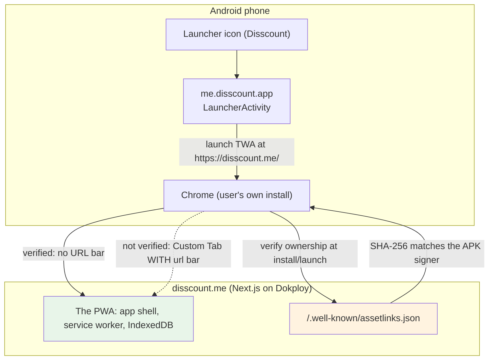
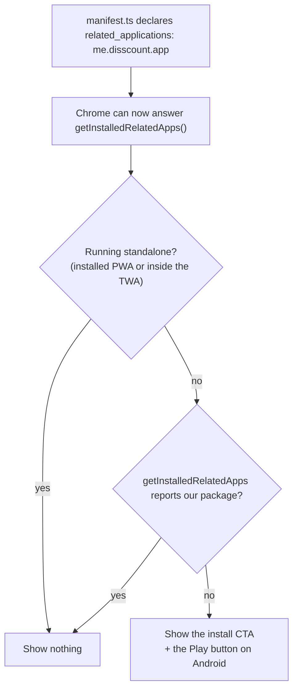

# Disscount: Android & Google Play Release Guide

A complete reference for how Disscount ships to Google Play as a **Trusted Web Activity (TWA)**: what the Android app actually is, how to build and sign it, how Digital Asset Links make it run without browser chrome, and how to release an update. Written to be understandable even if you have never touched Android before. Keep it up to date as the setup changes.

_Last verified on branch `feat/android-twa`, 2026-07-25: `bubblewrap doctor` passing, signed APK and AAB built and inspected, package `me.disscount.app` at versionName 1.0.0 / versionCode 1, targetSdk 36 confirmed from the built binary._

> **Mental model in one sentence:** the Android app contains **no app code of its own**, it is a thin native shell that opens `https://disscount.me` full screen in the user's own Chrome, and a file served from our domain is what proves to Android that we own the site so the URL bar can be hidden.

---

## Table of contents

1. [Quick reference](#1-quick-reference)
2. [Architecture: PWA plus Trusted Web Activity](#2-architecture-pwa-plus-trusted-web-activity)
3. [Required local tools](#3-required-local-tools)
4. [Installing Bubblewrap and running doctor](#4-installing-bubblewrap-and-running-doctor)
5. [The generated Android project](#5-the-generated-android-project)
6. [Signing](#6-signing)
7. [Digital Asset Links](#7-digital-asset-links)
8. [Building the APK and the AAB](#8-building-the-apk-and-the-aab)
9. [Versioning](#9-versioning)
10. [Updating the wrapper](#10-updating-the-wrapper)
11. [Installing and testing](#11-installing-and-testing)
12. [What is automatic vs manual](#12-what-is-automatic-vs-manual)
13. [Release checklist](#13-release-checklist)
14. [Manual QA checklist](#14-manual-qa-checklist)
15. [Troubleshooting](#15-troubleshooting)
16. [Rollback and recovery](#16-rollback-and-recovery)
17. [Libraries and versions](#17-libraries-and-versions)
18. [Gotchas and lessons learned](#18-gotchas-and-lessons-learned)
19. [Future improvements and TODOs](#19-future-improvements-and-todos)

---

## 1. Quick reference

| Thing                      | Value                                                                                  |
| -------------------------- | -------------------------------------------------------------------------------------- |
| Distribution model         | **Trusted Web Activity** (Bubblewrap), not a native or React Native app                |
| Android package id         | `me.disscount.app` (**never change this**, it is the app's identity on Play)           |
| Origin wrapped             | `https://disscount.me`                                                                 |
| Android project            | `android/` (generated, but committed)                                                  |
| Single source of config    | `android/twa-manifest.json`                                                            |
| Current version            | versionName `1.0.0`, versionCode `1`                                                   |
| min / target / compile SDK | 23 / 36 / 36                                                                           |
| Orientation / display      | portrait / standalone (mirrors the web manifest)                                       |
| Upload keystore            | `~/.local/share/disscount-android-signing/disscount-upload.jks`, **outside the repo**  |
| Key alias                  | `disscount-upload`                                                                     |
| Digital Asset Links        | `frontend/public/.well-known/assetlinks.json` served at `/.well-known/assetlinks.json` |
| Build command              | `cd android && bubblewrap build`                                                       |
| Play upload artifact       | `android/app-release-bundle.aab`                                                       |
| Sideload artifact          | `android/app-release-signed.apk`                                                       |

**The one rule that explains most decisions:** the Android app is a shell. Almost every "Android bug" is really a web bug, a Digital Asset Links problem, or a stale build. Fix the website first.

---

## 2. Architecture: PWA plus Trusted Web Activity

### What a TWA actually is

A Trusted Web Activity is an Android activity that displays a website **using the user's installed Chrome**, with no browser UI at all: no URL bar, no tabs, no menu. It is not a WebView. It is the real Chrome engine, with the real Chrome profile, so the user's cookies, passwords, and our service worker and IndexedDB caches are shared with the browser.

Android will only hide the browser UI if it can **prove the app and the website belong to the same owner**. That proof is a two-way handshake:

- the **app** declares "I represent `https://disscount.me`" (baked into the APK)
- the **website** declares "the app `me.disscount.app`, signed with certificate X, may act for me" (served at `/.well-known/assetlinks.json`)

If either half is missing or mismatched, the app still works but falls back to a Custom Tab **with a visible URL bar**. That is the single most common failure and it is always an asset-links problem.



### What this buys us, and what it does not

| Aspect               | Consequence                                                                                                                     |
| -------------------- | ------------------------------------------------------------------------------------------------------------------------------- |
| Shipping a web fix   | Deploying the website updates the Android app instantly. No Play review, no new release.                                        |
| Shipping a shell fix | Anything in `twa-manifest.json` (icons, name, shortcuts, colours, SDK levels) needs a rebuild and a new Play release.           |
| Offline              | Handled entirely by the existing Serwist service worker and the persisted React Query cache. See [`PWA.md`](PWA.md).            |
| Camera, share, etc.  | Standard web APIs through Chrome. No native permission plumbing on our side.                                                    |
| App size             | Around 1.2 MB, because there is nothing in it but the shell.                                                                    |
| Play requirements    | Still a real Play listing: data safety form, privacy policy, account deletion URL, content rating, target API level compliance. |

### Why the install banner had to change

Once the app exists on Play, someone who installed it there would still get "Dodaj Disscount na početni zaslon" every time they opened `disscount.me` in a browser tab. Inside the TWA this was already handled, because a TWA reports `display-mode: standalone` and `use-install-prompt.ts` already checked that. The browser-tab case was not.

The fix is the standards-based one, not user-agent sniffing:



`getInstalledRelatedApps()` is Chromium-on-Android only and is feature-detected, so iOS, desktop, and Firefox behaviour is unchanged. `ready` is held until the lookup resolves so the banner never flashes before hiding itself.

---

## 3. Required local tools

| Tool              | Version used                      | Notes                                                                                                                           |
| ----------------- | --------------------------------- | ------------------------------------------------------------------------------------------------------------------------------- |
| Node.js           | 22.19.0                           | Bubblewrap needs 14.15+. Any modern LTS is fine.                                                                                |
| npm               | 11.17.0                           | Only used to install Bubblewrap globally.                                                                                       |
| `@bubblewrap/cli` | 1.24.1                            | The generator and build driver.                                                                                                 |
| JDK               | **17** (Temurin 17.0.11)          | Bubblewrap installs its own into `~/.bubblewrap/jdk`. JDK 17 exactly: older cannot compile, newer breaks the Android CLI tools. |
| Android SDK       | cmdline-tools + build-tools 34/35 | Bubblewrap installs its own into `~/.bubblewrap/android_sdk`.                                                                   |
| `adb`             | any                               | Only needed to sideload onto a phone. On Debian/Ubuntu/Mint: `sudo apt install adb`.                                            |
| `bundletool`      | 1.18.1                            | Optional, for validating the `.aab` locally. A standalone jar from the bundletool GitHub releases.                              |

**Android Studio is not required and should not be installed for this.** Bubblewrap downloads everything it needs into `~/.bubblewrap/`, which keeps the toolchain self-contained and disposable.

**Disk space.** Expect roughly 4 to 5 GB for the JDK, Android SDK, and Gradle caches combined. If the machine is tight, `npm cache clean --force` is usually the cheapest win.

---

## 4. Installing Bubblewrap and running doctor

Install it against a **user-local npm prefix so no `sudo` is needed**. If `npm config get prefix` points inside your home directory (for example an `nvm` install), this just works:

```bash
npm install -g @bubblewrap/cli@1.24.1
```

Then let it set itself up. The first run asks two questions and downloads about 2 GB:

```bash
bubblewrap doctor
```

- `Do you want Bubblewrap to install the JDK (recommended)?` yes
- `Do you want Bubblewrap to install the Android SDK (recommended)?` yes

A healthy result is exactly this line:

```
doctor Your jdkpath and androidSdkPath are valid.
```

The paths it chose are recorded in `~/.bubblewrap/config.json`. That file is machine-local and is not in the repo.

### A note on `bubblewrap validate`

`bubblewrap validate --url=https://disscount.me/` **does not currently work** and this is not a problem with our site. The command proxies through the PageSpeed Insights API asking for `category=pwa`, which Lighthouse 12 removed, and the unauthenticated quota returns HTTP 429. Verify the TWA criteria directly instead (see the [release checklist](#13-release-checklist)).

---

## 5. The generated Android project

Everything under `android/` is generated by Bubblewrap, but it is **committed** so builds are reproducible and the diff is reviewable.

| Path                                                                | Role                                                                                         |
| ------------------------------------------------------------------- | -------------------------------------------------------------------------------------------- |
| `android/twa-manifest.json`                                         | **The single source of truth.** Every setting lives here; the rest is generated from it.     |
| `android/app/build.gradle`                                          | Module build config: SDK levels, version, the `twaManifest` map, the shortcut generator task |
| `android/build.gradle`                                              | Top-level build config, Android Gradle Plugin version                                        |
| `android/app/src/main/AndroidManifest.xml`                          | Activities, the `asset_statements` link, permissions                                         |
| `android/app/src/main/java/me/disscount/app/LauncherActivity.java`  | Subclass of the browser-helper launcher, this is the whole "app"                             |
| `android/app/src/main/java/me/disscount/app/DelegationService.java` | Lets the website's Web Push notifications appear as Android notifications                    |
| `android/app/src/main/java/me/disscount/app/Application.java`       | Application entry point                                                                      |
| `android/app/src/main/res/values/strings.xml`                       | App name, launcher name, the launch URL, shortcut labels                                     |
| `android/app/src/main/res/values/colors.xml`                        | Theme, background, and navigation-bar colours                                                |
| `android/app/src/main/res/xml/shortcuts.xml`                        | Launcher long-press shortcuts, **written by Gradle during the build**                        |
| `android/app/src/main/res/mipmap-*/`                                | Launcher icons at every density, downloaded from `iconUrl`                                   |
| `android/app/src/main/res/drawable-*/`                              | Splash screen and shortcut icons                                                             |
| `android/store_icon.png`                                            | 512x512 icon for the Play listing itself                                                     |
| `android/manifest-checksum.txt`                                     | Lets Bubblewrap detect that `twa-manifest.json` changed since the last generate              |
| `frontend/scripts/add-play-fingerprint.mjs`                         | Appends a fingerprint to `assetlinks.json` without dropping the existing one                 |

### The settings that matter in `twa-manifest.json`

| Field                                    | Value                     | Why                                                                                                                                                      |
| ---------------------------------------- | ------------------------- | -------------------------------------------------------------------------------------------------------------------------------------------------------- |
| `packageId`                              | `me.disscount.app`        | The app's permanent identity on Play. Changing it creates a **different app** and orphans all installs.                                                  |
| `host` / `startUrl`                      | `disscount.me` / `/`      | What the shell opens.                                                                                                                                    |
| `name` / `launcherName`                  | full name / `Disscount`   | `name` shows in Settings and Play, `launcherName` is what fits under the home-screen icon.                                                               |
| `display` / `orientation`                | `standalone` / `portrait` | Mirrors the web manifest. Shopping is a phone-in-hand, portrait activity.                                                                                |
| `fallbackType`                           | `customtabs`              | If TWA verification fails, fall back to a Custom Tab rather than a WebView. A WebView would not share the user's session or our service worker.          |
| `themeColor` / `backgroundColor`         | `#FFFFFF`                 | Matches the web manifest, so the splash matches the app shell.                                                                                           |
| `themeColorDark` / `navigationColorDark` | `#121212`                 | Matches `viewport.themeColor`'s dark entry in `layout.tsx`.                                                                                              |
| `minSdkVersion`                          | `23`                      | See below.                                                                                                                                               |
| `enableNotifications`                    | `true`                    | Adds `POST_NOTIFICATIONS` and the delegation service, so Web Push can surface as Android notifications when we build push.                               |
| `features`                               | `{}`                      | Play Billing, location delegation, and AppsFlyer are all **off**. Nothing in Disscount needs them, and each one adds permissions Play makes you justify. |
| `shortcuts`                              | 3 entries                 | Generated from the web manifest's `shortcuts`. Android shows 3, because Chrome reserves a 4th slot for "Site settings".                                  |
| `fingerprints`                           | upload certificate        | Only read by `bubblewrap fingerprint`, it does not affect the built app.                                                                                 |

### Why `minSdkVersion` is 23

Bubblewrap defaults to 19 (Android 4.4, 2013). We raised it to **23 (Android 6.0, Marshmallow, 2015)** because:

- API 23 is where **runtime permissions** landed, which is what the barcode scanner's camera prompt relies on. Below it, permissions are granted at install time and the permission-denied UX cannot behave sensibly.
- It avoids legacy multidex configuration.
- It still covers well over 99% of active Android devices, so the reach cost is effectively zero.

Going lower only adds devices that cannot run the app well. Going higher (24 or 26) starts excluding real users for no benefit.

### The `targetSdkVersion` patch (important)

Google Play requires apps to target a recent API level. We target **36**.

**Bubblewrap 1.24.1 hardcodes `targetSdkVersion 35` in its Gradle template, and `twa-manifest.json` has no field to override it.** So `android/app/build.gradle` carries a hand-applied edit:

```gradle
        applicationId "me.disscount.app"
        minSdkVersion 23
        // Bubblewrap's template hardcodes 35 and twa-manifest.json cannot override
        // it. Re-apply after every `bubblewrap update`.
        targetSdkVersion 36
```

This is the smallest change that works, and it is annotated in place so nobody silently reverts it. **It is overwritten by `bubblewrap update`.** See [Updating the wrapper](#10-updating-the-wrapper).

---

## 6. Signing

### What the upload key is, and why losing it is serious

Every Android app is signed. Play uses two different certificates and it is essential to keep them straight:

| Certificate                      | Who holds it | What it does                                                                                    |
| -------------------------------- | ------------ | ----------------------------------------------------------------------------------------------- |
| **Upload certificate**           | us           | Proves to Play that an upload really came from us. Also signs the APKs we sideload for testing. |
| **Play App Signing certificate** | Google       | What Play re-signs the app with before shipping it to real devices.                             |

Because Play re-signs, **the app users install is signed with a certificate we never see**, which is exactly why `assetlinks.json` needs both fingerprints. More on that below.

> ⚠️ **Losing the upload keystore file, or its password, means you cannot publish updates.** Recovery requires a manual Google Play support request to reset the upload key, which is neither guaranteed nor fast. Treat it like a production database credential.

### Where it lives

|             |                                                                                     |
| ----------- | ----------------------------------------------------------------------------------- |
| Keystore    | `~/.local/share/disscount-android-signing/disscount-upload.jks`                     |
| Alias       | `disscount-upload`                                                                  |
| Format      | PKCS12 (JDK 17 writes PKCS12 even for a `.jks` extension, which is fine everywhere) |
| Permissions | file `600`, directory `700`                                                         |

It is deliberately **outside the repository**. `.gitignore` also blocks `*.jks`, `*.keystore`, `*.p12`, `keystore.properties`, `signing.properties`, and `play-service-account*.json` repo-wide, so an accidental copy inside the tree still will not be committed.

### Creating it (already done, kept for reference)

```bash
~/.bubblewrap/jdk/jdk-17.0.11+9/bin/keytool -genkeypair -v \
  -keystore ~/.local/share/disscount-android-signing/disscount-upload.jks \
  -alias disscount-upload \
  -keyalg RSA -keysize 2048 -validity 10000 \
  -dname "CN=Disscount, O=Disscount, L=Zagreb, C=HR"
chmod 700 ~/.local/share/disscount-android-signing
chmod 600 ~/.local/share/disscount-android-signing/disscount-upload.jks
```

`-validity 10000` is about 27 years. Play requires the certificate to stay valid well past 2033, so do not shorten it.

### Passwords

**Passwords are never stored in the repository, in `twa-manifest.json`, in Gradle files, in scripts, or in any env example file.** `bubblewrap build` prompts for them interactively every time.

If you want to avoid retyping, Bubblewrap also reads `BUBBLEWRAP_KEYSTORE_PASSWORD` and `BUBBLEWRAP_KEY_PASSWORD`. Only ever set those in your own shell for a single session, and **prefix the command with a space** so it stays out of shell history.

### Backing it up

Keep at least two copies, in different places, neither of which is the repo:

1. **Password manager**: the store password and key password, in the same entry, labelled with the alias and the file path.
2. **Encrypted offline copy**: the `.jks` file on external media or in an encrypted archive (for example `age` or `gpg --symmetric`) in private cloud storage.

Verify the backup opens before you rely on it. A keystore you cannot decrypt is the same as no keystore.

### Reading the upload fingerprint

```bash
~/.bubblewrap/jdk/jdk-17.0.11+9/bin/keytool -list -v \
  -keystore ~/.local/share/disscount-android-signing/disscount-upload.jks \
  -alias disscount-upload | grep "SHA256:"
```

The current value, which is public information because it is served in `assetlinks.json`:

```
00:CD:B5:40:81:70:A9:31:7C:28:5C:2E:17:D5:79:25:15:8D:53:90:9F:5A:D2:49:53:55:C8:7C:61:72:5B:DD
```

You can also read it back from a built APK, which is the better check because it proves what actually signed the artifact:

```bash
~/.bubblewrap/android_sdk/build-tools/35.0.0/apksigner verify --print-certs \
  android/app-release-signed.apk
```

---

## 7. Digital Asset Links

### The file

`frontend/public/.well-known/assetlinks.json`, served by Next.js straight out of `public/` at `https://disscount.me/.well-known/assetlinks.json`.

```json
[
  {
    "relation": ["delegate_permission/common.handle_all_urls"],
    "target": {
      "namespace": "android_app",
      "package_name": "me.disscount.app",
      "sha256_cert_fingerprints": ["<upload certificate SHA-256>"]
    }
  }
]
```

Non-negotiable requirements. Android is strict and gives no useful error when any of these is wrong:

| Requirement                                 | Why                                                             |
| ------------------------------------------- | --------------------------------------------------------------- |
| Path exactly `/.well-known/assetlinks.json` | Android will not follow a rewrite to a different path.          |
| HTTP 200                                    | A 301/302 to another **origin** fails verification.             |
| JSON content type                           | Served automatically because it is a `.json` file in `public/`. |
| No authentication                           | Chrome fetches it anonymously.                                  |
| Valid JSON, no comments                     | JSON has no comments. A trailing comma breaks it silently.      |
| Fingerprints uppercase hex, colon-separated | 32 bytes, `AA:BB:CC:...`.                                       |

### Both fingerprints are required

The file currently lists **only the upload certificate**, which is enough to verify a **sideloaded APK** we built ourselves.

Once the first bundle is uploaded, Play generates its **own** App Signing certificate and re-signs the app. Builds installed from Play are signed with that certificate, so **until its fingerprint is added too, the Play-installed app will show a URL bar** even though the sideloaded one worked perfectly.

Get it from the Play Console: **Release → Setup → App signing → App signing key certificate → SHA-256 certificate fingerprint**.

Then append it, from the `frontend/` directory:

```bash
node scripts/add-play-fingerprint.mjs AA:BB:CC:...
```

The script is deliberately append-only:

- it validates the format and exits non-zero on anything that is not 32 colon-separated hex bytes
- it is idempotent, so re-running with a fingerprint already present is a no-op
- it **never removes** an existing fingerprint, so the upload one always survives
- it writes through the project's own Prettier so the file still passes the CI format check

Then commit and deploy. The final file should contain **two** fingerprints.

### Verifying it

```bash
# 1. Is it served correctly?
curl -sSI https://disscount.me/.well-known/assetlinks.json
# expect: HTTP/2 200, content-type: application/json, no cross-origin redirect

# 2. Does Google agree the statement is valid?
curl -sS "https://digitalassetlinks.googleapis.com/v1/statements:list?source.web.site=https://disscount.me&relation=delegate_permission/common.handle_all_urls"

# 3. Does the APK's signer actually match what we published?
~/.bubblewrap/android_sdk/build-tools/35.0.0/apksigner verify --print-certs \
  android/app-release-signed.apk | grep "SHA-256 digest"
# compare against assetlinks.json, ignoring colons and case
```

---

## 8. Building the APK and the AAB

```bash
cd android
bubblewrap build
```

It prompts for the keystore password and the key password. On the very first run it also asks you to accept the Android SDK licence.

> ⚠️ If it asks **"There are changes in twa-manifest.json. Would you like to apply them to the project before building?"** read [Updating the wrapper](#10-updating-the-wrapper) before answering. Answering `Y` regenerates the Gradle files and **silently reverts the `targetSdkVersion 36` patch back to 35**.

### Artifacts

| File                                       | Purpose                                                                       |
| ------------------------------------------ | ----------------------------------------------------------------------------- |
| `android/app-release-bundle.aab`           | **Upload this to Google Play.** Play requires the App Bundle format.          |
| `android/app-release-signed.apk`           | **Sideload this for local testing** with `adb install`.                       |
| `android/app-release-signed.apk.idsig`     | v4 signature sidecar, used for fast incremental installs. Not needed by Play. |
| `android/app-release-unsigned-aligned.apk` | Intermediate. Ignore it.                                                      |

All four are gitignored. Never commit build output.

### Verifying the build (do not trust the config, read the binary)

```bash
SDK=~/.bubblewrap/android_sdk
AAPT2=$SDK/build-tools/35.0.0/aapt2
APKSIGNER=$SDK/build-tools/35.0.0/apksigner

# package id, versionCode, versionName, target/min SDK, app label
$AAPT2 dump badging android/app-release-signed.apk | grep -E "^package|sdkVersion|application-label|launchable-activity"

# permissions: nothing dangerous should appear
$AAPT2 dump permissions android/app-release-signed.apk

# who signed it
$APKSIGNER verify --print-certs android/app-release-signed.apk

# is the bundle well-formed
java -jar bundletool.jar validate --bundle=android/app-release-bundle.aab
```

A correct 1.0.0 build reports:

```
package: name='me.disscount.app' versionCode='1' versionName='1.0.0' compileSdkVersion='36'
targetSdkVersion:'36'
minSdkVersion:'23'
launchable-activity: name='me.disscount.app.LauncherActivity'  label='Disscount'
uses-permission: name='android.permission.POST_NOTIFICATIONS'
uses-permission: name='me.disscount.app.DYNAMIC_RECEIVER_NOT_EXPORTED_PERMISSION'
```

`DYNAMIC_RECEIVER_NOT_EXPORTED_PERMISSION` is an internal AndroidX signature-level permission, not something we requested. There should be **no** camera, location, contacts, storage, microphone, or SMS permission. The camera used by the barcode scanner is granted to **Chrome**, not to our app, which is one of the quieter benefits of a TWA.

---

## 9. Versioning

Two numbers, and they do different jobs.

| Field            | Example | Who reads it | Rule                                                                                                                               |
| ---------------- | ------- | ------------ | ---------------------------------------------------------------------------------------------------------------------------------- |
| `appVersionCode` | `1`     | Google Play  | **Must strictly increase with every single upload.** Integer. Play permanently rejects a reused value, even for a deleted release. |
| `appVersionName` | `1.0.0` | Humans       | Shown in the store listing and in Settings. Any string. Semver by convention.                                                      |

Bump both in `android/twa-manifest.json`, then regenerate:

```bash
cd android
# edit twa-manifest.json: appVersionCode 1 -> 2, appVersionName/appVersion "1.0.0" -> "1.0.1"
bubblewrap update
# re-apply the targetSdkVersion 36 patch, see section 10
bubblewrap build
```

`bubblewrap update` also accepts `--appVersionName=1.0.1` and auto-increments the code, but editing `twa-manifest.json` by hand keeps the committed file honest and reviewable.

**Remember:** you only need a new release at all if something in the **shell** changed. Website changes ship by deploying the website.

---

## 10. Updating the wrapper

`bubblewrap update` regenerates the Android project from `twa-manifest.json`. Run it after changing any wrapper setting, and after upgrading Bubblewrap itself.

### Files Bubblewrap will overwrite

Treat everything in this list as **generated**. Do not hand-edit it expecting the edit to survive.

| Path                                                           | Overwritten?                                        |
| -------------------------------------------------------------- | --------------------------------------------------- |
| `android/app/build.gradle`                                     | ✅ yes, **this is where the targetSdk patch lives** |
| `android/build.gradle`, `settings.gradle`, `gradle.properties` | ✅ yes                                              |
| `android/app/src/main/AndroidManifest.xml`                     | ✅ yes                                              |
| `android/app/src/main/java/**/*.java`                          | ✅ yes                                              |
| `android/app/src/main/res/values/*.xml`                        | ✅ yes                                              |
| `android/app/src/main/res/mipmap-*`, `drawable-*`              | ✅ yes, re-downloaded from the icon URLs            |
| `android/app/src/main/res/xml/shortcuts.xml`                   | ✅ yes, emptied by `update` and refilled by `build` |
| `android/store_icon.png`, `manifest-checksum.txt`              | ✅ yes                                              |
| `android/twa-manifest.json`                                    | ❌ no, this is your input                           |

### The one edit you must re-apply, every time

```bash
cd android
bubblewrap update
```

Then check and fix the target API level:

```bash
grep -n "targetSdkVersion" app/build.gradle
# if it says 35, put it back to 36:
sed -i 's/targetSdkVersion 35/targetSdkVersion 36/' app/build.gradle
grep -n "targetSdkVersion" app/build.gradle   # confirm it now says 36
```

Then rebuild and **confirm from the built APK**, not from the Gradle file:

```bash
~/.bubblewrap/android_sdk/build-tools/35.0.0/aapt2 dump badging app-release-signed.apk | grep targetSdkVersion
```

If a future Bubblewrap release starts emitting 36 (or a `targetSdkVersion` field in `twa-manifest.json`), delete the patch and this whole subsection.

### Pulling in web manifest changes

If the **web** manifest changed (new shortcut, new icons, different colours), refresh `twa-manifest.json` from it:

```bash
cd android
bubblewrap merge   # reads webManifestUrl from twa-manifest.json
```

Review the diff carefully. `merge` overwrites fields we deliberately customised, notably `packageId`, `minSdkVersion`, `signingKey`, and the version numbers. Re-check all of them before building.

---

## 11. Installing and testing

### Sideloading the APK

```bash
adb devices                                     # phone should be listed as "device"
adb install -r android/app-release-signed.apk   # -r replaces an existing install
```

If `adb devices` shows nothing:

- enable **Developer options** (tap Build number 7 times in Settings → About phone)
- enable **USB debugging**
- accept the "Allow USB debugging?" prompt on the phone
- if it shows `unauthorized`, run `adb kill-server && adb start-server` and re-accept

Bubblewrap can also do it: `bubblewrap install`.

You can also use `bubblewrap install --apkFile=<path>`. No emulator is needed at any point.

### Testing the Play-installed build

Sideloading only proves the **upload** certificate works. To prove the **Play App Signing** certificate works, you must install from Play:

1. Play Console → **Testing → Internal testing → Create new release**.
2. Upload `android/app-release-bundle.aab`.
3. Add yourself to the **Testers** list (an email list of Google accounts).
4. Copy the **opt-in URL**, open it on the phone with that Google account, accept, then install from Play.
5. Internal testing is available within minutes and skips full review, which makes it the right track for verifying asset links.

**Uninstall the sideloaded APK first.** Android will refuse to install the Play build over an app signed with a different certificate, with a `INSTALL_FAILED_UPDATE_INCOMPATIBLE` error.

---

## 12. What is automatic vs manual

| Task                                          | Automatic? | Notes                                                                                 |
| --------------------------------------------- | ---------- | ------------------------------------------------------------------------------------- |
| Website changes reaching the Android app      | ✅ auto    | Deploy the site; the TWA loads the live origin. No release needed.                    |
| Offline, caching, install prompts             | ✅ auto    | Handled by the existing service worker and React Query cache, see [`PWA.md`](PWA.md). |
| Suppressing the PWA prompt for Play users     | ✅ auto    | `getInstalledRelatedApps()` in `use-install-prompt.ts`.                               |
| `shortcuts.xml` contents                      | ✅ auto    | Written by a Gradle task from `twa-manifest.json` during the build.                   |
| Icon and splash generation for every density  | ✅ auto    | Downloaded and resized by `bubblewrap update` from `iconUrl` / `maskableIconUrl`.     |
| Re-signing for real users                     | ✅ auto    | Play App Signing does this on upload.                                                 |
| **`targetSdkVersion` staying at 36**          | ❌ manual  | Re-apply after every `bubblewrap update`.                                             |
| **Bumping versionCode / versionName**         | ❌ manual  | Edit `twa-manifest.json` before each release.                                         |
| **Adding the Play App Signing fingerprint**   | ❌ manual  | One-off after the first upload, via `scripts/add-play-fingerprint.mjs`.               |
| **Deploying `assetlinks.json`**               | ❌ manual  | It ships with a normal website deploy, so it needs to reach `main`.                   |
| **Uploading the AAB**                         | ❌ manual  | No CI publishing is configured. Deliberate for now.                                   |
| **Play listing, data safety, content rating** | ❌ manual  | Play Console only.                                                                    |
| **Flipping `PLAY_STORE_COMING_SOON`**         | ❌ manual  | In `frontend/src/constants/android.ts`, once the listing is public.                   |

---

## 13. Release checklist

**Before building**

- [ ] `bubblewrap doctor` passes.
- [ ] `appVersionCode` incremented and `appVersionName` / `appVersion` updated in `android/twa-manifest.json`.
- [ ] Icon URLs in `twa-manifest.json` point at **production**, not staging.
- [ ] The website is deployed and healthy: `curl -sSI https://disscount.me/` returns 200.
- [ ] `curl -sS https://disscount.me/manifest.webmanifest` looks right.

**Build**

- [ ] `cd android && bubblewrap build`, answering `N` to "apply changes?" unless you intend a regeneration.
- [ ] `aapt2 dump badging` shows package `me.disscount.app`, the expected versionCode/versionName, `targetSdkVersion:'36'`.
- [ ] `aapt2 dump permissions` shows no camera, location, contacts, storage, microphone, or SMS permission.
- [ ] `apksigner verify --print-certs` SHA-256 matches the fingerprint in `assetlinks.json`.
- [ ] `bundletool validate` exits 0.

**Digital Asset Links**

- [ ] `https://disscount.me/.well-known/assetlinks.json` returns 200, JSON, no cross-origin redirect.
- [ ] It contains the **upload** fingerprint.
- [ ] After the first upload, it also contains the **Play App Signing** fingerprint.

**Web side**

- [ ] `pnpm exec prettier --check` clean.
- [ ] `tsc --noEmit` clean.
- [ ] `eslint` clean.
- [ ] `next build --webpack` succeeds and emits `public/sw.js`.

**Play Console**

- [ ] Privacy policy URL set to `https://disscount.me/privacy-policy`.
- [ ] Account deletion URL set to `https://disscount.me/data-deletion`.
- [ ] Data safety form matches reality, **including notifications** since `POST_NOTIFICATIONS` ships.
- [ ] Content rating questionnaire completed.
- [ ] Upload `app-release-bundle.aab` to **Internal testing** first, never straight to production.
- [ ] Run the [manual QA checklist](#14-manual-qa-checklist) against the Play-installed build.

---

## 14. Manual QA checklist

Run this against a **Play-installed internal-test build** on a real phone, not just a sideloaded APK, because only that exercises the Play App Signing certificate.

**Shell and verification**

- [ ] App starts **full screen with no browser controls**. A visible URL bar means asset-links verification failed, stop and fix that first.
- [ ] Launcher icon and name (`Disscount`) look correct on the home screen and in the app drawer.
- [ ] Splash screen shows the brand mark on white, with no white flash into a different colour.
- [ ] Long-pressing the icon offers the three shortcuts: Skeniraj barkod, Popisi za kupnju, Praćeni proizvodi. Each opens the right screen.

**Core browsing, signed out**

- [ ] Anonymous product search returns results.
- [ ] Price comparison across chains renders.
- [ ] Product detail opens and the price-history chart draws.

**Authentication**

- [ ] Email login works.
- [ ] Google login completes and **returns into the app**, not into a separate browser window that strands the user.
- [ ] Session persists after force-quitting and reopening the app.
- [ ] Logout works and clears the offline cache.

**Features**

- [ ] Create, rename, and edit a shopping list.
- [ ] Add and remove a watchlist item.
- [ ] Barcode scanner asks for camera permission the first time.
- [ ] A real barcode scans and resolves to a product.
- [ ] Denying camera permission shows the Croatian explanatory message, not a crash or a blank sheet.

**Offline**

- [ ] Enable airplane mode, cold-start the app: it opens rather than showing a network error.
- [ ] A previously viewed product still loads from cache.
- [ ] Check off a shopping-list item offline: the UI updates and the queued-writes count appears.
- [ ] Re-enable the network: the queued change syncs.

**Navigation**

- [ ] External links (for example the Google image search on a product) open in a browser, clearly outside the app.
- [ ] Android **back** navigates back through app history and does not exit unexpectedly from mid-flow.
- [ ] Back closes an open modal rather than leaving the app.
- [ ] Deep links into `disscount.me` paths open **in the app**, not in Chrome.
- [ ] The system share sheet lists Disscount, and sharing text into it lands on a product search.

**Compliance and polish**

- [ ] Account deletion is reachable and completes.
- [ ] Privacy policy page opens.
- [ ] **No PWA install prompt appears anywhere inside the app.**
- [ ] Opening `disscount.me` in Chrome on the same device shows no install banner either.
- [ ] Layout holds up on a small screen (around 5 inch) and a large one (tablet or foldable).

---

## 15. Troubleshooting

| Symptom                                                 | Cause and fix                                                                                                                                                                                                                                                                                                                                    |
| ------------------------------------------------------- | ------------------------------------------------------------------------------------------------------------------------------------------------------------------------------------------------------------------------------------------------------------------------------------------------------------------------------------------------ |
| **URL bar visible at the top of the app**               | **The classic failure: Digital Asset Links verification failed.** Check the file is live and 200, that the fingerprint matches the certificate that actually signed the installed build, and that `package_name` is exactly `me.disscount.app`. For a Play build, the **Play App Signing** fingerprint must be present, not just the upload one. |
| App opens in a normal Chrome tab instead of full screen | Same root cause. Chrome caches the verification result, so after fixing `assetlinks.json` clear Chrome's storage or reinstall the app.                                                                                                                                                                                                           |
| Verification worked when sideloaded, fails from Play    | You only listed the upload fingerprint. Add the Play App Signing fingerprint and deploy.                                                                                                                                                                                                                                                         |
| `INSTALL_FAILED_UPDATE_INCOMPATIBLE`                    | A build signed with a different certificate is already installed. `adb uninstall me.disscount.app` first.                                                                                                                                                                                                                                        |
| Play rejects the upload: "version code already used"    | `appVersionCode` must strictly increase. Bump it, regenerate, rebuild.                                                                                                                                                                                                                                                                           |
| Play rejects: target API level too low                  | The `targetSdkVersion` patch was reverted by `bubblewrap update`. Re-apply and confirm from the APK.                                                                                                                                                                                                                                             |
| Play rejects: wrong signing key                         | You built with a different keystore. Check `signingKey.path` in `twa-manifest.json`.                                                                                                                                                                                                                                                             |
| Icons or shortcuts look stale after an update           | They are baked in at generate time. Run `bubblewrap update` to re-download, then rebuild.                                                                                                                                                                                                                                                        |
| Shortcuts missing from the launcher                     | The web manifest's shortcuts need `icons`. Bubblewrap silently drops shortcuts without one.                                                                                                                                                                                                                                                      |
| `bubblewrap validate` fails with HTTP 429               | Expected, see [section 4](#4-installing-bubblewrap-and-running-doctor). Not a problem with the site.                                                                                                                                                                                                                                             |
| Build fails on a JDK error                              | Bubblewrap needs JDK **17** exactly. Check `~/.bubblewrap/config.json` points at its own JDK, not a system JDK 21+.                                                                                                                                                                                                                              |
| Website change not showing in the app                   | The service worker served a cached shell. Force-close the app, or see the service-worker update gotcha in [`DEPLOYMENT.md`](DEPLOYMENT.md).                                                                                                                                                                                                      |

---

## 16. Rollback and recovery

### Rolling back a bad release

There is **no un-publish** on Google Play, and you cannot re-upload a lower version code. Rolling back means rolling **forward**:

1. In the Play Console, **halt the rollout** of the bad release (possible while it is a staged rollout).
2. Fix the problem.
3. Bump `appVersionCode` **upward** again, rebuild, and upload as a new release.
4. If the previous release is still available, you can also use **"Resume rollout"** on the older release in some tracks, but treat that as a bonus, not the plan.

**If the bad behaviour is on the website, you do not need a Play release at all.** Redeploy the site or revert the offending commit and the installed app picks it up immediately. That covers the large majority of possible regressions, which is a genuine advantage of the TWA model.

### If asset links break in production

Users see a URL bar but the app keeps working, so this is degraded, not down. Fix `frontend/public/.well-known/assetlinks.json` and deploy the website. No Play release needed.

### If the upload keystore is lost

1. Do not panic-create a new app. A new `packageId` orphans every existing install and every review.
2. Generate a new upload key.
3. Request an upload key reset in the Play Console (**Setup → App signing → Request upload key reset**) and send Google the new certificate.
4. Once approved, sign future uploads with the new key.
5. Add the new upload certificate's fingerprint to `assetlinks.json` (keep the Play App Signing one, which does not change).

This works **only** because Play App Signing holds the distribution key. It is the reason Play App Signing should stay enabled.

---

## 17. Libraries and versions

Read from `android/build.gradle`, `android/app/build.gradle`, and the local toolchain.

| Component                                              | Version             | Role                                                                              |
| ------------------------------------------------------ | ------------------- | --------------------------------------------------------------------------------- |
| `@bubblewrap/cli`                                      | `1.24.1`            | Generates the Android project, drives Gradle, signs the output                    |
| `com.google.androidbrowserhelper:androidbrowserhelper` | `2.6.2`             | The actual TWA implementation: launcher activity, splash, notification delegation |
| Android Gradle Plugin                                  | `8.9.1`             | Builds the project                                                                |
| Gradle                                                 | `8.11.1`            | Pinned by `android/gradle/wrapper/gradle-wrapper.properties`                      |
| JDK                                                    | `17.0.11` (Temurin) | Required by Bubblewrap, installed into `~/.bubblewrap/jdk`                        |
| Android build-tools                                    | `34.0.0`, `35.0.0`  | `aapt2`, `apksigner`, `zipalign`                                                  |
| compile / target / min SDK                             | `36` / `36` / `23`  | API 36 is Android 16                                                              |
| `bundletool`                                           | `1.18.1`            | Optional local `.aab` validation                                                  |

Web-side pieces this depends on, versions in `frontend/package.json`: `next`, `@serwist/next` and `serwist` (the service worker that makes the shell work offline), and `@tanstack/react-query` with its persist packages (the offline data layer). See [`PWA.md`](PWA.md).

### Related frontend files

| Path                                                        | Role                                                                          |
| ----------------------------------------------------------- | ----------------------------------------------------------------------------- |
| `frontend/src/constants/android.ts`                         | `PLAY_PACKAGE_ID`, `PLAY_STORE_URL`, `PLAY_STORE_COMING_SOON`                 |
| `frontend/src/app/manifest.ts`                              | Declares `related_applications` so the browser can detect the Play app        |
| `frontend/src/components/custom/pwa/use-install-prompt.ts`  | `getInstalledRelatedApps()` lookup, `canShowInstallUI` and `canShowPlayStore` |
| `frontend/src/components/custom/pwa/google-play-button.tsx` | The "Preuzmi s Google Playa" CTA                                              |
| `frontend/public/.well-known/assetlinks.json`               | Digital Asset Links statement                                                 |
| `frontend/scripts/add-play-fingerprint.mjs`                 | Append-only fingerprint adder                                                 |

---

## 18. Gotchas and lessons learned

| Gotcha                                           | What happened / fix                                                                                                                                                                                                         |
| ------------------------------------------------ | --------------------------------------------------------------------------------------------------------------------------------------------------------------------------------------------------------------------------- |
| **`bubblewrap update` reverts the target SDK**   | Bubblewrap 1.24.1 hardcodes `targetSdkVersion 35` and offers no override. The patch in `app/build.gradle` must be re-applied after every regenerate, and the result checked from the built APK rather than the Gradle file. |
| **"Apply changes before building?" is a trap**   | Answering `Y` silently regenerates Gradle and reverts the target SDK. Answer `N` unless you actually intend a regeneration, then re-apply the patch.                                                                        |
| **Play re-signs the app**                        | The certificate users get is Google's, not ours. `assetlinks.json` needs **both** fingerprints, or the sideloaded app verifies and the Play one does not. This is the most confusing failure in the whole flow.             |
| **`bubblewrap init` wants to create a keystore** | It prompts for certificate details and passwords inline. Create the keystore separately with `keytool` first, so the passwords never pass through tooling, then point `signingKey.path` at it.                              |
| **`bubblewrap validate` is broken**              | It asks PageSpeed Insights for `category=pwa`, which Lighthouse 12 removed, and gets 429 on the unauthenticated quota. Verify the criteria by hand.                                                                         |
| **Shortcuts without icons are dropped**          | The first generate produced `shortcuts: []` because the web manifest's shortcuts had no `icons`. Adding per-shortcut icons on the web side fixed it. Bubblewrap gives no warning.                                           |
| **Icons are baked in, not fetched**              | The APK's icons come from `iconUrl` **at generate time**. Changing the website's icons does nothing to an installed app until you regenerate and ship a new release.                                                        |
| **JDK 17 exactly**                               | Older cannot compile; newer breaks the Android command-line tools. Let Bubblewrap manage its own JDK rather than pointing it at a system one.                                                                               |
| **JDK 17 writes PKCS12 for a `.jks` name**       | Harmless, everything accepts it, but it means `keytool -list` always needs the password, unlike an old-style JKS.                                                                                                           |
| **`versionCode` is permanent**                   | Play remembers every code you have ever uploaded, including from deleted drafts. It must strictly increase, forever.                                                                                                        |
| **`packageId` is permanent**                     | Changing it creates a brand new app with zero installs, zero reviews, and zero ranking. There is no rename.                                                                                                                 |
| **The camera permission is Chrome's, not ours**  | The scanner works with no `CAMERA` permission in our manifest, because Chrome holds it. Do not add one "to be safe": Play will ask you to justify it.                                                                       |
| **`display-mode: standalone` is true in a TWA**  | Useful, because the existing install-banner check already covered the in-app case. It is also why the standalone check alone is not enough for the browser-tab case.                                                        |

---

## 19. Future improvements and TODOs

**Before the first public release**

- [ ] Add the **Play App Signing** SHA-256 to `assetlinks.json` after the first upload. Until then, Play-installed builds show a URL bar.
- [ ] Point `iconUrl`, `maskableIconUrl`, and the three shortcut icon URLs in `twa-manifest.json` back at `disscount.me`. They currently reference the staging origin, which was the only place serving the new artwork at generate time.
- [ ] Flip `PLAY_STORE_COMING_SOON` to `false` in `frontend/src/constants/android.ts` once the listing is public, which turns on the "Preuzmi s Google Playa" button.
- [ ] Replace the placeholder manifest screenshots with real captures; the Play listing needs proper screenshots anyway.

**Release process**

- [ ] Automate the release with `bubblewrap play publish` or a GitHub Action, using a Play service account. The key would live in repository secrets and **never** in the repo. Deliberately deferred until the manual flow has been done a few times.
- [ ] Add a CI check that fails if `targetSdkVersion` in `app/build.gradle` is not 36, so a regenerate cannot silently ship a rejected build.
- [ ] Track whether a newer Bubblewrap exposes `targetSdkVersion` in `twa-manifest.json`, and delete the patch when it does.

**Product**

- [ ] Build **Web Push** on the web side. `enableNotifications` is already on and the delegation service is in place, so the Android half is ready and waiting. This is the highest-value gap, see [`PWA.md`](PWA.md).
- [ ] Consider the **iOS App Store**. It cannot use a TWA, so it needs a different wrapper and a much stronger native-value story to pass review.
- [ ] Look at Play's **In-App Review** and **In-App Update** APIs, both of which android-browser-helper can delegate.
- [ ] Evaluate whether a **fourth shortcut** is worth it. Android shows three plus Chrome's "Site settings", so a fourth would be invisible on most devices.
