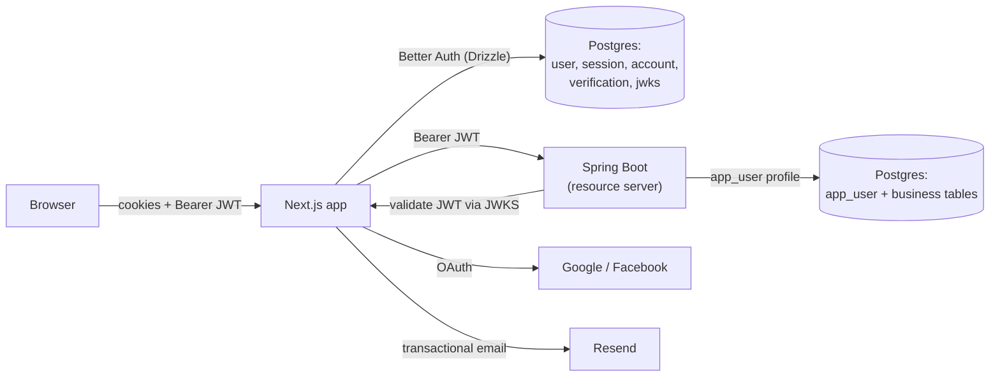
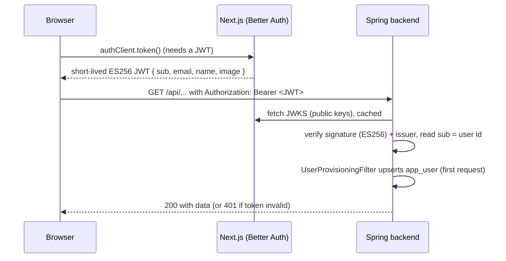
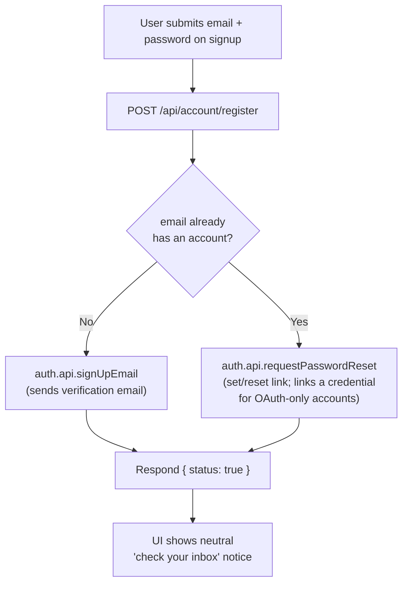
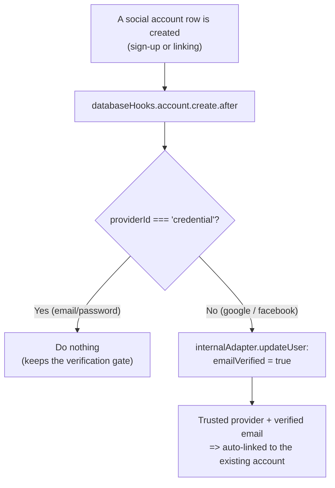

# Authentication

This document describes how login, sessions, and account security work in Disscount, end to end. It is meant to be readable if you are still learning the concepts, so it explains the ideas as it goes and leans on tables and diagrams.

The one sentence to remember: **Better Auth runs inside the Next.js app and is the identity provider; the Spring backend never logs anyone in, it only trusts a signed token.** Email is the unique key that ties a person to exactly one account, and all sign-in methods (Google, Facebook, email and password) converge on that one account.

## 1. The big picture

Authentication is split across two services that share one PostgreSQL database but own different tables.

- **Identity lives in the frontend.** Better Auth (a TypeScript auth library) runs inside Next.js. It owns the `user`, `session`, `account`, `verification`, and `jwks` tables (via Drizzle ORM). It handles passwords, OAuth, email verification, and it mints signed JWT access tokens.
- **Business profile lives in the backend.** Spring Boot keeps a slim `app_user` row (same UUID primary key as the Better Auth `user`) with the username, avatar, notification preferences, and account type. Spring is a pure "resource server": it validates the JWT and reads the user id from it, but it has no login logic of its own.

The two halves are bridged by a signed token, not a shared session. The frontend asks Better Auth for a short JWT and sends it as a `Bearer` token on backend calls. The backend verifies the token's signature against Better Auth's public keys (JWKS) and trusts the `sub` claim as the user id.



**Why this split?** Better Auth is TypeScript only, so it has to live with the frontend. Keeping Spring as a resource server let the existing Java business entities (which foreign-key to `app_user`) stay untouched. See the identity-vs-profile split in more detail in [Section 7](#7-the-spring-side-resource-server--profile-provisioning).

## 2. How a backend request gets authenticated

Better Auth issues an **ES256 JWT** (an elliptic-curve signed token). The signing keys live in the `jwks` table and are published at `GET /api/auth/jwks`. Spring fetches those public keys and verifies every incoming token.



Key facts:

- The token payload is deliberately small: `definePayload` returns only `{ email, name, image }`, and Better Auth adds the standard `sub` (the user UUID) and `iss` (issuer) claims. `sub` is what the backend uses everywhere via `SecurityUtils.getCurrentUserId()`.
- The frontend fetches and caches the JWT in `api-base.ts` (an Axios client). `authClient.token()` returns `{ data: { token }, error }`; the token is cached in memory and refreshed shortly before it expires.
- The backend only exposes Next.js to the public internet. Browsers talk to Next.js, which reverse-proxies data calls inward to Spring (see `next.config.ts` rewrites). This is why cross-origin auth is a non-issue.

## 3. Sign-in methods

| Method               | Status                 | Notes                                                                                                                                                                       |
| -------------------- | ---------------------- | --------------------------------------------------------------------------------------------------------------------------------------------------------------------------- |
| **Google**           | Live                   | Email arrives already verified from Google.                                                                                                                                 |
| **Facebook**         | Wired but **disabled** | Fully implemented, but hidden as "uskoro" behind the `FACEBOOK_COMING_SOON` flag pending Meta Business Verification. See [Section 9](#9-config-env-vars-and-feature-flags). |
| **Email + password** | Live                   | Minimum 12 characters (`passwordSchema`); login blocked until the email is verified.                                                                                        |

**Email is a hard invariant.** Better Auth requires an email to create a user, and the whole model keys off a unique verified email. A Facebook login that returns no email is rejected and surfaced to the user as a toast (`?error=email_not_found`). No-email or profile-less users are intentionally not supported.

The login and registration UI is a single modal, `auth-modal.tsx`, with three modes: `login`, `signup`, and `forgot`. The social buttons sit below the email form so one GDPR consent notice and one set of provider buttons cover every path.

## 4. Email and password: signup and verification

Registration does not call Better Auth's sign-up directly. It POSTs to a custom endpoint, `POST /api/account/register`, that is written to never reveal whether an email already has an account (anti-enumeration).



- **New email:** a normal Better Auth sign-up runs, which (because `sendOnSignUp` is on) sends a verification email. No session is created yet.
- **Existing email:** instead of a "user already exists" error (which would leak existence), the endpoint sends a password-reset link. Better Auth's reset flow creates a `credential` account for a password-less OAuth user, so this doubles as "add a password to your Google/Facebook account".
- Both branches return the exact same `{ status: true }`, and the UI always shows the same neutral `InboxNotice`. This is why we cannot detect existence on the client.

**Verification is a hard gate.** `emailAndPassword.requireEmailVerification: true` blocks email/password login until the address is verified. An unverified login attempt returns `403`, and the login form shows a "we re-sent the link" message. Once the user clicks the verification link, `autoSignInAfterVerification` logs them in automatically. OAuth logins are not affected by this gate (their email is marked verified on creation, see next section).

The register endpoint passes `callbackURL: "/?modal=email-verified"` to `signUpEmail`, so after verifying the user lands on the homepage with a small "Email potvrđen" success modal (they are already signed in by then). See [Section 8](#8-password-reset-set-password-and-change-email) for how the whole reset/verify/change flow lives in the URL-modal system.

## 5. Account linking (one email, one account)

If someone signs in with Google, then later with Facebook (or registers a password) using the same email, they must land on the **same** account rather than a duplicate.

Better Auth links automatically when the provider is in `trustedProviders` **and** the existing local account's email is already verified. Facebook returns no "email verified" claim, so without help it would fail to link (the classic `account_not_linked` error). We solve this with a positive signal rather than the deprecated `requireLocalEmailVerified` flag:



Why this shape:

- It marks OAuth emails verified because the provider owns and vouches for the email.
- It **skips** credential accounts, so an email/password sign-up still has to verify via the emailed link. A cruder path-based check (for example "is this the sign-up route") could accidentally verify a credential signup and bypass the gate; this positive per-account signal cannot.

Linking failures are surfaced to the user by a global toast (see [Section 6](#6-the-oauth-error-toast)).

## 6. The OAuth error toast

OAuth and linking failures come back as a full-page redirect with a `?error=<code>` query parameter. `OAuthErrorToast` reads that code and shows a localized message.

Two non-obvious design choices, both learned the hard way:

- It is mounted **app-wide** in `app/layout.tsx` (inside a `Suspense`), not in the auth modal. Account-linking happens while logged in, and a logged-in user does not render the login modal, so a toast living there would never fire.
- It reads the code with **`useSearchParams()`** (Next's router snapshot), not `window.location`. During session load something rewrites the URL, and reading `window.location` loses that race; the router snapshot survives it.

Mapped codes: `email_not_found`, `email_doesn't_match`, `account_already_linked_to_different_user`, `account_not_linked`, `please_restart_the_process`, plus a generic fallback.

## 7. The Spring side: resource server and profile provisioning

`SecurityConfig.java` makes the backend a stateless OAuth2 resource server:

- A `NimbusJwtDecoder` is built with the JWKS URI and pinned to `ES256`, and it validates the token issuer (`better.auth.issuer`).
- The session policy is `STATELESS` (no server session; the JWT is the whole story) and CSRF is disabled (there is no cookie-based auth to protect).
- Public endpoints: `/actuator/health`, Swagger, and the OpenAPI docs. Everything else requires a valid token.
- A `UserProvisioningFilter` runs after the bearer-token filter. On the first authenticated request it lazily upserts the `app_user` profile row (same UUID as the Better Auth user) via `UserService.ensureActiveProfile`, seeding the username from the provider name (falling back to the email local-part). `app_user.username` is deliberately **not unique**; only email is.

## 8. Password reset, set password, and change email

All three reuse Better Auth's token machinery but are worded and gated for their case.

| Flow                              | Trigger                                    | Endpoint / hook                                                                                         | Notes                                                                                                                                                                                                        |
| --------------------------------- | ------------------------------------------ | ------------------------------------------------------------------------------------------------------- | ------------------------------------------------------------------------------------------------------------------------------------------------------------------------------------------------------------ |
| Forgot password                   | "Zaboravljena lozinka?" in the login modal | `authClient.requestPasswordReset` then `emailAndPassword.sendResetPassword`                             | `redirectTo` is `/reset-password` (no query, so Better Auth can append `?token=` cleanly). Same neutral notice whether or not the account exists. Token lives 30 minutes; all sessions are revoked on reset. |
| Set vs reset wording              | Any reset email                            | `dispatchResetPasswordEmail` in `auth.ts`                                                               | Checks for an existing `credential` account: none means "set your password" (OAuth-only user), otherwise "reset your password".                                                                              |
| Reset / set password (from email) | Clicking the email link                    | `/reset-password` page redirects to `?modal=reset-password&token=...`, rendered by `ResetPasswordModal` | Modal over the homepage. Sets the password and sends the user to log in. **No auto-login and no email in the URL** (PII avoidance).                                                                          |
| Set password (logged in)          | Security settings, OAuth-only account      | `POST /api/account/set-password` then `auth.api.setPassword`                                            | Adds a `credential` to an account that only had social login.                                                                                                                                                |
| Change email                      | Security settings                          | `POST /api/account/change-email` then `user.changeEmail.sendChangeEmailConfirmation`                    | `callbackURL: "/?modal=email-changed"`. Confirmation is sent to the **current** address; the change applies only after it is clicked.                                                                        |

**The single-email invariant.** You cannot change your account email while any social provider is linked, because a provider login would then carry an email different from the account. This is enforced three ways: the Security tab disables the email field when a social account is linked, `POST /api/account/change-email` returns `409 social_linked` if one exists, and `databaseHooks.user.update.before` re-checks at confirmation time to close the race where a provider is linked between the request and the click.

### 8.1 The whole auth flow lives in URL modals

Every auth surface is a modal addressed by a `?modal=` query param over the homepage, not a dedicated page. A single `ModalRouter` (mounted once in `app/layout.tsx` under `Suspense`) reads the param and renders the matching modal. Login, signup, and forgot-password were already modals; reset-password and the two email-confirmation screens now join them.

| `?modal=` value                      | Modal                                     | Who can open it                                                              |
| ------------------------------------ | ----------------------------------------- | ---------------------------------------------------------------------------- |
| `login`, `signup`, `forgot-password` | `auth-modal.tsx` (one modal, three modes) | Anyone; also shown as a gate when a logged-out user opens a protected modal. |
| `reset-password&token=...`           | `reset-password-modal.tsx`                | Anyone (public). Reached from the reset/set-password email link.             |
| `email-verified`                     | `auth-status-modal.tsx`                   | Anyone (public). Reached from the verification link.                         |
| `email-changed`                      | `auth-status-modal.tsx`                   | Anyone (public). Reached from the change-email confirmation link.            |

Two implementation points that matter for safety and correctness:

- **The reset token is stripped from the URL on arrival.** Email links land on `/reset-password?token=...`; the page server-redirects to `/?modal=reset-password&token=...`, and `ResetPasswordModal` captures the token into component state on the first open, then `history.replaceState`s it out of the address bar. This keeps the token from lingering in history or leaking via the Referer header once the page has other content on it. The email link URL itself is unchanged, so no Better Auth email construction had to move.
- **Public modals are never auth-gated.** `PUBLIC_MODAL_NAMES` (in `modal-registry.ts`) lists `reset-password`, `email-verified`, and `email-changed`; `ModalRouter` renders these regardless of session and excludes them from the "log in first" gate. A logged-out user resetting a password must not be bounced to the login modal.

## 9. Config, env vars, and feature flags

### Feature flag

`frontend/src/constants/auth.ts`:

```ts
export const FACEBOOK_COMING_SOON = true;
```

While `true`, Facebook is shown as "uskoro" and disabled in the login modal and the linked-accounts list. Flip it to `false` (one place) once Meta Business Verification is complete and the Meta app is Live to enable Facebook everywhere at once. Google and email cover login until then.

### Environment variables

Frontend (`frontend/.env.local`, mirrored in `.env.local.example`). The app calls `requireEnv` at module load, so a missing value fails the boot rather than a request:

| Variable                                                | Purpose                                                                                       |
| ------------------------------------------------------- | --------------------------------------------------------------------------------------------- |
| `BETTER_AUTH_URL`                                       | Base URL Better Auth builds links and callbacks from.                                         |
| `BETTER_AUTH_SECRET`                                    | Signs Better Auth internals. Keep secret; 32+ chars.                                          |
| `NEXT_PUBLIC_APP_URL`                                   | Public app origin, used for email links and trusted origins.                                  |
| `DATABASE_URL`                                          | Shared Postgres, used by Better Auth via Drizzle.                                             |
| `NEXT_PUBLIC_GOOGLE_CLIENT_ID` / `GOOGLE_CLIENT_SECRET` | Google OAuth app.                                                                             |
| `FACEBOOK_CLIENT_ID` / `FACEBOOK_CLIENT_SECRET`         | Meta app (server only, no `NEXT_PUBLIC_`).                                                    |
| `RESEND_API_KEY`                                        | Resend API key for sending email.                                                             |
| `EMAIL_FROM`                                            | Sender, must exactly match a verified Resend domain, e.g. `Disscount <noreply@disscount.me>`. |

Backend (`backend/.env`, referenced in `application.properties`):

| Variable                                                                              | Purpose                                                                                                                   |
| ------------------------------------------------------------------------------------- | ------------------------------------------------------------------------------------------------------------------------- |
| `BETTER_AUTH_JWKS_URI`                                                                | Where Spring fetches Better Auth's public keys, e.g. `http://localhost:3000/api/auth/jwks` (internal Docker URL in prod). |
| `BETTER_AUTH_ISSUER`                                                                  | Expected `iss` claim the decoder validates.                                                                               |
| `SPRING_DATASOURCE_URL` / `SPRING_DATASOURCE_USERNAME` / `SPRING_DATASOURCE_PASSWORD` | The shared Postgres.                                                                                                      |

## 10. Automatic vs manual

| Concern                                                            | Automatic                                            | Needs manual work                                                                               |
| ------------------------------------------------------------------ | ---------------------------------------------------- | ----------------------------------------------------------------------------------------------- |
| Auth schema (`user`, `session`, `account`, `verification`, `jwks`) | Managed by Drizzle                                   | Regenerate/migrate when Better Auth config that changes tables is added                         |
| JWT signing keys                                                   | Better Auth generates and rotates into `jwks`        | None                                                                                            |
| OAuth email verified for linking                                   | `databaseHooks.account.create.after`                 | None                                                                                            |
| Email verification on signup                                       | Sent automatically (`sendOnSignUp`)                  | None                                                                                            |
| Sending real email                                                 | Resend, once `RESEND_API_KEY` + `EMAIL_FROM` are set | Verify the sending domain in Resend (done for `disscount.me`)                                   |
| Facebook availability                                              | Gated by a constant                                  | Flip `FACEBOOK_COMING_SOON` after Meta verification                                             |
| `app_user.username` uniqueness dropped                             | In the entity + local DB                             | **Apply the constraint drop on the prod DB manually** (Hibernate `ddl-auto=update` never drops) |
| New auth config taking effect                                      | Not automatic in dev                                 | **Restart the dev server after editing `auth.ts`** (see gotchas)                                |

## 11. Key files

| Path                                                                                | Role                                                                                                                                                                                                                         |
| ----------------------------------------------------------------------------------- | ---------------------------------------------------------------------------------------------------------------------------------------------------------------------------------------------------------------------------- |
| `frontend/src/lib/auth.ts`                                                          | The Better Auth server config: providers, verification gate, reset/change-email hooks, the two `databaseHooks`, JWT plugin. The heart of auth.                                                                               |
| `frontend/src/lib/auth-client.ts`                                                   | Browser client (`createAuthClient` + `jwtClient`); exports `signIn`, `signUp`, `signOut`, `useSession`.                                                                                                                      |
| `frontend/src/app/api/auth/[...all]/route.ts`                                       | Catch-all that mounts Better Auth's HTTP handlers (`toNextJsHandler`).                                                                                                                                                       |
| `frontend/src/db/auth-schema.ts`                                                    | Drizzle definitions of the five auth tables.                                                                                                                                                                                 |
| `frontend/src/constants/auth.ts`                                                    | The `FACEBOOK_COMING_SOON` flag.                                                                                                                                                                                             |
| `frontend/src/app/api/account/register/route.ts`                                    | Anti-enumeration registration (new vs existing branch, identical response).                                                                                                                                                  |
| `frontend/src/app/api/account/change-email/route.ts`                                | Change-email with the single-email `409 social_linked` guard.                                                                                                                                                                |
| `frontend/src/app/api/account/set-password/route.ts`                                | Adds a password to a logged-in OAuth-only account.                                                                                                                                                                           |
| `frontend/src/app/reset-password/page.tsx`                                          | Thin server redirect from the email link to `/?modal=reset-password&token=...`.                                                                                                                                              |
| `frontend/src/lib/modal/{modal-registry.ts, modal-navigation.ts, use-modal-url.ts}` | The `?modal=` grammar, the open/close/swap helpers, and the reactive `target` hook. `PUBLIC_MODAL_NAMES` lives here.                                                                                                         |
| `frontend/src/components/custom/modal-router/modal-router.tsx`                      | Mounted once in `app/layout.tsx`; reads the param and renders the matching modal (auth, public, settings, entity).                                                                                                           |
| `frontend/src/components/custom/oauth-error-toast.tsx`                              | App-wide OAuth/linking error toast.                                                                                                                                                                                          |
| `frontend/src/components/custom/header/forms/*`                                     | The auth UI: `auth-modal`, `login-form`, `signup-form`, `forgot-password-form`, `inbox-notice`, `reset-password-modal`, `auth-status-modal` (email-verified / email-changed), `linked-accounts`, `account-credentials-form`. |
| `frontend/src/components/custom/settings/tabs/{sigurnost-tab, danger-zone}.tsx`     | The Sigurnost settings tab (credentials, linked accounts, danger zone), replacing the old standalone security modal.                                                                                                         |
| `frontend/src/lib/email/*`                                                          | The email layer: `provider.ts` (interface), `resend-provider.ts`, `email-service.ts` (typed sends), `index.ts` (the one Resend wiring point, `server-only`).                                                                 |
| `frontend/src/emails/*`                                                             | React Email templates plus `components/{email-layout, action-email}.tsx`.                                                                                                                                                    |
| `frontend/src/lib/env.ts`                                                           | Shared `requireEnv`.                                                                                                                                                                                                         |
| `backend/src/main/java/disscount/config/SecurityConfig.java`                        | Resource-server config (Nimbus ES256 decoder, JWKS, issuer, stateless).                                                                                                                                                      |
| `backend/src/main/java/disscount/config/UserProvisioningFilter.java`                | Lazily upserts the `app_user` profile from the JWT.                                                                                                                                                                          |
| `backend/src/main/java/disscount/user/service/UserService.java`                     | `ensureActiveProfile` + `seedUsername`.                                                                                                                                                                                      |
| `backend/src/main/resources/application.properties`                                 | `jwk-set-uri`, `jws-algorithms=ES256`, issuer.                                                                                                                                                                               |

## 12. Libraries

Frontend (versions from `frontend/package.json`):

| Library                       | Version               | Role                                                        |
| ----------------------------- | --------------------- | ----------------------------------------------------------- |
| `better-auth`                 | `1.6.14`              | Identity provider (auth logic, OAuth, JWT).                 |
| `drizzle-orm` / `drizzle-kit` | `0.45.2` / `^0.31.10` | Owns the auth tables.                                       |
| `pg`                          | `8.21.0`              | Postgres driver.                                            |
| `resend`                      | `^6.14.0`             | Transactional email API.                                    |
| `react-email`                 | `^6.6.3`              | Email templates (v6 imports everything from `react-email`). |
| `server-only`                 | `^0.0.1`              | Build-time guard so the Resend key cannot reach the client. |
| `zod`                         | `^4.1.13`             | Request/schema validation.                                  |

Backend: Spring Boot `3.1.0` on Java `21`, using `spring-boot-starter-oauth2-resource-server` (which brings in the Nimbus JOSE JWT library).

## 13. Gotchas and lessons

- **Better Auth is a module singleton; Next.js HMR does not recreate it.** After editing `auth.ts` you must restart the dev server, or the new config silently does not apply. This was the single biggest time sink during development ("verification email not sent", "linking not working" were all stale config).
- **`requireEnv` fails the boot, not the request.** If any auth env var is missing (including `RESEND_API_KEY`, `EMAIL_FROM`, and the `FACEBOOK_*` pair), the app throws at module load. Every environment that builds or runs the app needs all of them set or it will not start: Dokploy for `dev` and production, and Netlify for branch previews.
- **The correct change-email key is `sendChangeEmailConfirmation`, not `...Verification`.** Better Auth silently ignores unknown option keys, so a typo fails quietly; rely on `tsc` to catch it.
- **React Email 6 changed imports.** Import components, `render`, and `pixelBasedPreset` from the single `react-email` package, not `@react-email/components`.
- **The Resend SDK returns `{ data, error }` and does not throw for API errors, but it can still throw on transport failures.** `resend-provider.ts` normalizes both into an `EmailResult`, and `EmailService` then throws when `result.error` is set, so the fire-and-forget `.catch(logEmailFailure)` handlers actually log a failed send instead of it resolving as if it succeeded.
- **Delete the backend profile before the auth identity.** `security-actions.ts` deletes the Spring profile first, then the better-auth user. Deleting auth first would orphan the backend row and lock the user out if the profile delete failed; backend-first aborts before touching auth on failure, so the user keeps access and can retry.
- **The public app origin fails closed in production.** `appUrl()` in `lib/env` returns `NEXT_PUBLIC_APP_URL` and throws in production when it is unset, so a misconfigured deploy never leaks `localhost` into the auth trusted origins, canonical URLs, sitemaps, or JSON-LD. It falls back to localhost only in development. The value is also parsed as a URL and normalized to its origin, rejecting a non-http(s) scheme or embedded credentials before it reaches `trustedOrigins`. Because it is read while collecting page data, any build environment (CI, a preview host) must define it or the build fails.
- **A gated modal target survives authentication.** When a logged-out user opens a protected modal, the target stays in the URL while the login modal is shown over it. `AuthModal` reports success through its own `onSuccess` rather than by closing itself, and the social callback URL strips only auth-modal params, so the original action reopens after both credential login and the OAuth round-trip. Treating "modal closed" as "user dismissed" is what silently dropped the pending action before.
- **Resend only delivers from a verified domain.** The sandbox sender only reaches your own Resend account address; `disscount.me` is verified so real sends work. The `EMAIL_FROM` domain must match a verified domain exactly.
- **Read OAuth `?error=` via `useSearchParams`, and mount the toast globally.** See [Section 6](#6-the-oauth-error-toast) for why both matter.
- **Email hooks are fire-and-forget (`void`) on purpose.** Awaiting them would make the response time reveal whether an email exists (a timing oracle). Each has a non-PII `.catch` so a failed send is logged, not lost.
- **Keep the reset `redirectTo` query-free.** Better Auth appends `?token=...` to `redirectTo`, so it must not already contain a query. This is why the reset link points at `/reset-password` (which then forwards to `/?modal=reset-password&token=...`) rather than at `/?modal=reset-password` directly, which would produce a broken double-`?` URL. The verification and change-email `callbackURL`s are fine with a query because Better Auth passes them through its redirect handling, not naive string concatenation.
- **The reset modal strips its token from the URL.** `ResetPasswordModal` captures the token on first open and `replaceState`s it out of the address bar, so it does not sit in browser history or leak via Referer once the homepage loads its usual content.
- **`app_user.username` uniqueness was dropped in the entity and the local DB, but `ddl-auto=update` never drops constraints.** The production database still needs a manual `ALTER TABLE app_user DROP CONSTRAINT ...`.

## 14. Future improvements and TODOs

- **Enable Facebook (re-audit the linking hook first):** complete Meta Business Verification (needs a registered entity, for example a Croatian obrt), then set `FACEBOOK_COMING_SOON = false`. Before flipping it, revisit `databaseHooks.account.create.after`: it marks OAuth emails verified, which is how Facebook (no verified-email claim) links without the deprecated `requireLocalEmailVerified` flag. Facebook does not guarantee a verified email and phone-only users have none, so a verified-provider-email gate is not viable; the better-auth core auto-link CVE is already patched in `1.6.14`, and the flow stays gated behind `FACEBOOK_COMING_SOON` until then.
- **Apply the `app_user.username` constraint drop on the production database.**
- **Dedicated register/set-password email copy:** the "set your password" case currently reuses reset wording, which reads slightly oddly for a first-time set.
- **Deliverability hardening before any marketing mail:** SPF/DKIM/DMARC, a dedicated sending subdomain, and one-click unsubscribe. Templates are Croatian only today (no i18n).
- **Harden the logged-out change-email confirmation edge:** the `user.update.before` guard relies on an active session at confirmation time; a logged-out click skips that layer (the request-time POST guard and UI gate still cover the normal path).
- **USKORO email features need backend work:** newsletter (Resend Broadcasts/Topics), watchlist-discount alerts (a Spring scheduled price-check job, since discount detection is client-only today), and a feedback-contact flag. Keep the database as the source of truth for preferences.
