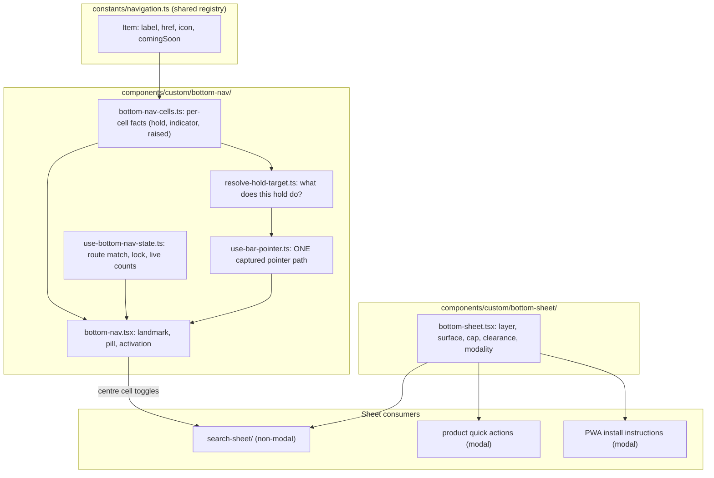
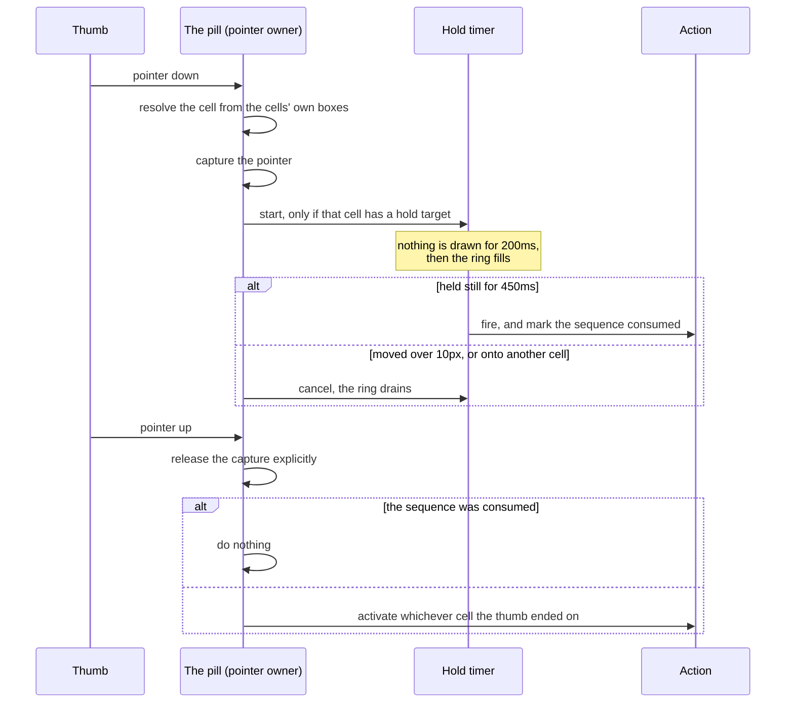

# Disscount: Mobile Bottom Navigation Guide

A complete reference for the primary navigation below `md`: the floating bar, the gestures it owns, the search sheet its centre cell opens, and the one bottom-sheet surface every sheet in the app now shares. Written to be understandable even if you're new to this. Keep it up to date as the feature changes.

_Built from [`MOBILE-NAV-SPEC.md`](MOBILE-NAV-SPEC.md), which is the authoritative build specification. This doc records what actually shipped and why the load-bearing parts are the way they are._

> **Mental model in one sentence:** a fixed pill at the bottom of the screen holds five buttons, and one pointer handler on the pill (not one per button) turns a press into a tap, a sideways scrub or a long press, while the middle button opens a non-modal sheet that carries search and the product filters.

---

## Table of contents

1. [Quick reference](#1-quick-reference)
2. [Why it exists](#2-why-it-exists)
3. [Architecture](#3-architecture)
4. [The five cells](#4-the-five-cells)
5. [Geometry, tokens & the spacing trap](#5-geometry-tokens--the-spacing-trap)
6. [The layer stack](#6-the-layer-stack)
7. [The interaction model](#7-the-interaction-model)
8. [Long press](#8-long-press)
9. [Bottom sheets](#9-bottom-sheets)
10. [The search sheet & filters](#10-the-search-sheet--filters)
11. [Accessibility](#11-accessibility)
12. [Key files](#12-key-files)
13. [Config, env vars & feature flags](#13-config-env-vars--feature-flags)
14. [Libraries](#14-libraries)
15. [What's automatic vs manual](#15-whats-automatic-vs-manual)
16. [Gotchas & lessons learned](#16-gotchas--lessons-learned)
17. [Future improvements & TODOs](#17-future-improvements--todos)

---

## 1. Quick reference

| Thing          | Value                                                                   |
| -------------- | ----------------------------------------------------------------------- |
| Visible at     | widths under `md` (768px), in a browser tab and the installed PWA alike |
| Hidden by      | `md:hidden` in CSS only, never a breakpoint hook                        |
| Cells          | exactly 5, equal width, order fixed forever                             |
| Content height | `--bottom-nav-h` = `4.5rem` (72px), plus the bottom safe-area inset     |
| Layer          | `--z-bottom-nav` = 45, above every sheet, below every dialog            |
| Landmark name  | `Glavna navigacija`                                                     |
| Hold timings   | 200ms silent gate, 450ms to fire, 10px to cancel                        |
| Component root | `frontend/src/components/custom/bottom-nav/`                            |
| Sheet surface  | `frontend/src/components/custom/bottom-sheet/bottom-sheet.tsx`          |
| Spec           | [`MOBILE-NAV-SPEC.md`](MOBILE-NAV-SPEC.md)                              |

**Daily mental note:** if you are adding anything fixed to the bottom of the screen, offset it from `--bottom-nav-total` and give it a layer from the `--z-*` block. Do not invent either value.

---

## 2. Why it exists

Below `md`, every primary destination used to live behind the hamburger sidebar, and nothing else.

Nielsen Norman Group measured this across 179 participants on 6 live sites. Hidden-only navigation was used by 57% of people against 86% for visible plus hidden, content discoverability was over 20% worse, and mobile task completion was 15% slower.

The winning condition in that research was **visible and hidden together**, not visible instead of hidden. So the bar carries the five destinations that matter most, and the sidebar stays exactly as it was and keeps carrying everything else. There is deliberately no "Više" (More) tab, because the sidebar is already the overflow, and hiding navigation is the exact cost this feature exists to remove.

Hoober's field observation of 1,333 real interactions found that 49% of people hold a phone one-handed and 75% of interactions are thumb-driven. That is why this is bottom chrome, and why the least useful cells sit on the outer edges where the thumb reaches worst.

---

## 3. Architecture

Three pieces, layered bottom to top.

The bar reads its five items from `constants/navigation.ts`, the same registry the desktop header and the sidebar read, so a label, an icon, a route or a coming-soon flag is never defined twice. `bottom-nav-cells.ts` adds only the facts the registry cannot carry: which cell is raised, which carries a live indicator, and what each one's long press does.

Everything is mounted once in `frontend/src/app/layout.tsx`, after the footer, so keyboard users reach the page content before the navigation.

---

## 4. The five cells

Left to right. **This order must never change once shipped.** A tab set whose shape shifts between sessions cannot build muscle memory, which is Apple's stability rule and the reason there is no adaptive per-section variant.

| #   | Label     | Route             | Notes                                        |
| --- | --------- | ----------------- | -------------------------------------------- |
| 1   | Karta     | `/map`            | coming soon, public route                    |
| 2   | Praćenje  | `/watchlist`      | carries the notification badge               |
| 3   | Proizvodi | `/products`       | raised centre cell, toggles the search sheet |
| 4   | Popisi    | `/shopping-lists` | carries the list completion ring             |
| 5   | Kartice   | `/digital-cards`  | coming soon                                  |

The two unshipped teasers sit on the **outer edges** on purpose: the arrangement stays symmetric with search dead centre, and the least useful cells take the hardest thumb positions.

### Cell states

| State         | What you see                                                                            |
| ------------- | --------------------------------------------------------------------------------------- |
| Idle          | muted icon and label                                                                    |
| Active        | the disc, plus a tinted icon, plus a **bold** label (three signals, never colour alone) |
| Scrubbed      | the icon swells while the thumb is over that cell                                       |
| Held          | a ring fills concentric with the disc                                                   |
| Locked teaser | disabled, further muted, keeps its USKORO chip, takes no tap, focus, scrub or hold      |

**Active means route match and nothing else.** It is a pure path-prefix test applied to all five cells, including the centre one, so the centre cell lights up on `/products`. Whether a cell navigates or opens a sheet is a completely separate question. Conflating the two is a real bug that already happened once: it left `/products` with no current-page state at all, and lit the centre cell merely because a sheet had opened, which is not a route change.

### Teaser cells and the admin bypass

A coming-soon cell is a dead end for everyone except an admin, which is the same rule the sidebar already applies (`isLocked = Boolean(item.comingSoon) && !isAdmin(user?.accountType)`). Admins pass through, so a working-but-unannounced page stays reachable from a phone.

Two things to know before changing this:

- It runs **against** Apple's Human Interface Guidelines, which are emphatic that a tab must never be disabled. Consistency with the app's other two navigations won: a bar that walks you into a teaser page the header refuses to open is the more confusing inconsistency.
- Locking is enforced on the pointer path **as well as** on the element, because a `disabled` button does not stop a bar-level pointer handler from resolving that cell.

### Signed out

Three destinations are auth protected, and those cells **still navigate**. The pages already explain the feature and offer sign-in, and explaining beats dead-ending wherever there is something to explain.

Do not lock them, do not open an auth modal directly (that would make four of five cells the same button), and do not render a smaller signed-out bar (its shape would change at login and shift on hydration).

---

## 5. Geometry, tokens & the spacing trap

> ⚠️ **The single most important thing on this page.** This project overrides Tailwind's spacing base to `0.2rem` in `globals.css` (`--spacing: 0.2rem`, against Tailwind's default `0.25rem`), so **every spacing utility renders 20% smaller than it reads**. A nominal `p-4` is 12.8px, not 16px. A nominal `size-16` is 51px, not 64px.

Because of that, the bar and the shared sheet express **none** of their dimensions through the spacing scale. Every dimension is an explicit length in a token, or an arbitrary value.

### The tokens (all in `frontend/src/app/globals.css`)

| Token                       | Value                              | What it is                                                   |
| --------------------------- | ---------------------------------- | ------------------------------------------------------------ |
| `--bottom-nav-h`            | `4.5rem`                           | the pill's content height (72px)                             |
| `--bottom-nav-gap`          | `0.75rem`                          | its inset from the screen edges                              |
| `--bottom-nav-safe`         | `env(safe-area-inset-bottom, 0px)` | the iOS home-indicator inset                                 |
| `--bottom-nav-total`        | the three above, added             | **the bar's full height**, what everything else offsets from |
| `--sheet-bottom-clearance`  | `--bottom-nav-total` + `0.5rem`    | where every bottom sheet ends                                |
| `--bottom-nav-pill-padding` | `0.5rem`                           | the pill's inner padding                                     |
| `--bottom-nav-radius`       | `1.625rem`                         | the pill's corner radius                                     |
| `--bottom-nav-disc-size`    | `3.6rem`                           | the active indicator disc                                    |
| `--bottom-nav-raised-size`  | `2.8125rem`                        | the centre cell's filled circle                              |
| `--bottom-nav-cell-width`   | computed on the pill               | one fifth of the pill's inner width, what the disc slides by |

From `md` up, `--sheet-bottom-clearance` collapses to a plain comfortable inset, because there is no bar there. **That media query is the only place a sheet's geometry branches on breakpoint**, which is exactly what lets the shared sheet surface hardcode one bottom padding and be correct at both sizes.

### Reserving the page's space

The bar's space is reserved on the **shell wrapper** in `app/layout.tsx`, not on `<main>`.

This matters: the footer renders after `<main>` and is pushed down, so `main`'s bottom padding would sit above the footer and the bar would cover the footer regardless. Measured before the fix, the footer's last 76px were unreachable.

### Viewport requirements

Set in the `viewport` export of `frontend/src/app/layout.tsx`.

| Setting                                | Why                                                                                                                    |
| -------------------------------------- | ---------------------------------------------------------------------------------------------------------------------- |
| `viewportFit: "cover"`                 | **Without it every `env(safe-area-inset-*)` silently resolves to zero** and the pill sits under the iOS home indicator |
| `interactiveWidget: "resizes-content"` | so fixed bottom elements reposition when the keyboard opens instead of hiding behind it                                |
| `min-h-svh` on the shell               | the static viewport unit is computed as if browser UI were hidden, making the shell taller than the visible area       |
| `scroll-padding-bottom` on `html`      | so anchor jumps and programmatic scrolls do not land under the bar                                                     |

### Compaction on scroll

Once the page is scrolled, the labels fade and collapse and the pill's background alpha tightens from 50% to 90%, over roughly 40px to 180px of scroll.

- **It compacts, it never hides.** Hiding navigation gives back the roughly 21% task-completion penalty this feature exists to remove.
- It is driven by `animation-timeline: scroll(root block)` with **no scroll listener**, so there is no jank and no hydration behaviour.
- The bar's **outer height never changes**. The pill's height comes from `--bottom-nav-h`, not from its content, so a collapsing label only redistributes space inside its own cell. That keeps the shell's reserved space and every offset derived from `--bottom-nav-total` stable.
- The three animated custom properties are `@property`-registered. **Without registration they animate discretely and snap at the halfway point** instead of fading.

Browser support for `animation-timeline: scroll()` is Chrome and Edge 115+, Safari 26+, Firefox 144+. Everything older, notably iOS Safari 18 and below, holds the full-size bar. That is the correct fallback, and it is the reason the compaction is CSS-only rather than a listener.

---

## 6. The layer stack

One documented stack, declared as tokens in `globals.css` so nothing has to guess. Descending, top to bottom.

| Token                    | Layer | Element                                                                        |
| ------------------------ | ----- | ------------------------------------------------------------------------------ |
| `--z-offline`            | 60    | offline indicator                                                              |
| `--z-overlay`            | 50    | dialogs, popovers, dropdowns, tooltips, selects, and the mobile sidebar drawer |
| `--z-bottom-nav`         | 45    | **the bottom nav**                                                             |
| `--z-bottom-sheet`       | 44    | bottom sheets                                                                  |
| `--z-bottom-sheet-scrim` | 43    | a modal sheet's scrim                                                          |
| `--z-install-banner`     | 41    | the PWA install banner                                                         |
| `--z-scroll-fade`        | 40    | the window scroll fade                                                         |
| `--z-back-to-top`        | 30    | the back-to-top button                                                         |
| `--z-header`             | 20    | the header                                                                     |
| `--z-sidebar`            | 10    | the desktop sidebar                                                            |

Two placements are deliberate and easy to "fix" by mistake:

- **A modal sheet's scrim sits below the bar.** That way all three sheets layer identically and the pill stays visible, dimming through its own translucency. Accepted consequence: while a modal sheet is open the bar is visible but inert. That was already true under every dialog in the app, so it is a newly visible behaviour, not a new one.
- **The mobile sidebar drawer stays at 50, above the bar.** It is a genuinely modal full-height side drawer whose scrim _should_ cover the pill. This is exactly why sheets must not be used for the sidebar.

Popovers opened inside a sheet are unaffected, because they portal **into** the sheet and their layer then resolves inside the sheet's own stacking context.

Three other bottom-anchored things are offset from `--bottom-nav-total` so they clear the bar: the PWA install banner, toast notifications, and (by being switched off) the dev overlays.

---

## 7. The interaction model

A tap, a horizontal scrub and a long press are **one pointer path owned by the bar**, not three handlers per cell. That is what makes them compose, because a tap is just a zero-distance scrub.

### Activation branches

| Case                       | Result                                                        |
| -------------------------- | ------------------------------------------------------------- |
| The centre cell            | opens the search sheet, or closes it if already open          |
| A locked teaser            | nothing, beyond dismissing the search sheet                   |
| The tab you are already on | scroll to the top, and a second tap returns to where you were |
| Any other cell             | navigate to that destination                                  |

**Every branch except the centre one dismisses the search sheet first.** That covers what a route-change rule cannot: re-tapping the tab you are already on does not change the route, so no effect on `pathname` would ever fire.

### Rules that are easy to break

- **Resolve the cell index from the cells' own bounding boxes.** Never divide the bar's width by five: the pill has inner padding, so width division skews every boundary.
- **Ignore any press starting within 16px of a screen edge**, so the bar never competes with the iOS back-swipe or the home-indicator gesture.
- **Release the pointer capture explicitly** on end, cancel and `lostpointercapture`. Relying on the spec's implicit release left captures outliving their gesture, which showed up as a tap on one tab activating a different one.
- **Suppress touch panning on the pill only** (`touch-none`), so a horizontal scrub is never read as a page pan. The bar is fixed chrome, so this is safe here and only here.
- **Cells respond only to keyboard clicks** (`event.detail === 0`). Because the pointer is captured on the pill, the browser's synthetic click targets the pill, not the pressed button, so a pointer click never reaches a cell.

### Re-tapping the active tab

Scroll to the top, then a second tap returns to the previous position. Expo's native tabs, Ionic, Instagram and Medium all do the first; X adds the return trip.

A small chevron shows on the active icon while a return position is held, and the position expires on any route change, since a position from one route means nothing on the next. The window has to be moved explicitly, because the router does not scroll when you navigate to the URL you are already on.

---

## 8. Long press

Long press is strictly an **accelerator**. Every target is also reachable by a visible, tappable control, which is what keeps it usable by keyboard and screen reader (WCAG 2.1.1, 2.5.1). Nothing is gesture-only.

### Timings

All of them live in `frontend/src/constants/gestures.ts`, so the bar's cells and the product cards can never drift apart.

| Constant                | Value | Rationale                                                                          |
| ----------------------- | ----- | ---------------------------------------------------------------------------------- |
| `HOLD_FIRE_MS`          | 450   | iOS uses 0.5s, Android roughly 400-500ms, react-aria defaults to 500ms             |
| `HOLD_GATE_MS`          | 200   | nothing at all is drawn or scheduled before this, so an ordinary tap shows nothing |
| `HOLD_RING_MS`          | 250   | whatever the gate leaves of the 450ms, so a full ring reads as "committed"         |
| `HOLD_CANCEL_PX`        | 10    | past this the press is a drag or a scroll                                          |
| `BAR_EDGE_EXCLUSION_PX` | 16    | keeps the bar clear of the system edge gestures                                    |
| `SHEET_DRAG_EXPAND_PX`  | 40    | far enough that a scroll or a wobble cannot expand a sheet                         |

**The gate is a real gate, not a clamp.** Before it elapses there is no animation frame loop and no progress written anywhere. This shipped at 120ms first, chosen to sit inside Nielsen's 0.1s "instant" window, and it was wrong: a deliberate tap on a nav cell commonly lasts 150-200ms, so **every** tap flashed a sliver of ring and the bar felt broken.

The general lesson worth keeping: a gesture's feedback threshold has to clear the gesture it distinguishes itself from, not an abstract perception budget.

The ring is also the discoverability mechanism, and the reason **no coachmark is built**. A press that outlives the gate shows the ring begin to fill, which teaches the gesture while you perform it. NN/g found users do not read coach marks and forget them within about 20 seconds.

### What each hold does

| Hold           | On `/products/<ean>`       | Everywhere else            | Enabled                          |
| -------------- | -------------------------- | -------------------------- | -------------------------------- |
| Karta          | store preferences          | store preferences          | admins only, until the map ships |
| Praćenje       | watch this product         | nothing                    | yes                              |
| Proizvodi      | the barcode scanner        | the barcode scanner        | yes                              |
| Popisi         | add this product to a list | create a new shopping list | yes                              |
| Kartice        | create a new digital card  | create a new digital card  | wired but off until cards ship   |
| A product card | its quick-actions sheet    | its quick-actions sheet    | yes                              |

Notes that must survive any refactor:

- **Two cells change meaning on a product's page.** Each cell declares its own product-scoped target, and **one shared resolver** (`resolve-hold-target.ts`) answers both "what does this hold do" and "does this cell have a hold at all", so the two can never disagree and no cell can ever show a ring that leads nowhere.
- **This was a deliberate reversal.** Per-route gestures were first rejected on the grounds that a gesture meaning different things per route cannot be learned. It was overruled because on a product page both targets are also on-screen buttons, so the hold is a thumb shortcut past a journey rather than a hidden feature. **The learnability cost is real and unmeasured, and it is the first thing to check if the holds go unused.**
- **Karta's hold is deliberately not map-specific.** The map will load pinned stores and centre on the user by itself, so the only thing left worth a shortcut is the preferences behind that behaviour.
- **The centre cell's hold is the one guessable gesture.** Typing a name and scanning a barcode answer the same question, so tap to type, hold to scan. Its visible equivalent is the scan button in the sheet's own field.
- **A locked cell responds to no hold**, whatever target it declares.
- **Product cards keep their own quick-actions sheet** even though the bar now reaches the same two actions, because in a list the bar has no way to know which card you meant.

### How the ring is drawn

Progress is written straight to the element as the `--long-press-progress` custom property through a ref, so filling the ring never re-renders a subtree once per frame. The SVG circle uses `pathLength="1"`, which normalises the dash units to 0..1 and avoids magic circumference numbers.

Both the fill and the drain run frame by frame rather than through a CSS transition. See the gotchas table for why.

---

## 9. Bottom sheets

There is **one shared bottom-sheet surface**, `components/custom/bottom-sheet/bottom-sheet.tsx`, and every bottom sheet in the app uses it. A call site supplies content, a title, a description and a modality, and nothing else.

Four sheets built four different ways is the state this replaced, and it produced content sitting under the bar in some sheets and under the home indicator in others, depending on which one you opened.

| Owned centrally  | Requirement                                                                                  |
| ---------------- | -------------------------------------------------------------------------------------------- |
| Layer            | below the bar, so the pill is never covered                                                  |
| Surface          | the bar's blur, at 85% background opacity (the bar itself is 50%)                            |
| Height cap       | 85% of the dynamic viewport height, so a growing sheet always yields to the viewport         |
| Bottom clearance | `--sheet-bottom-clearance`, one shared token                                                 |
| Handle gap       | at least 16px of clear space below the grab handle, whether or not the header draws anything |
| Handle contrast  | visible on a light surface                                                                   |
| Footer           | pinned below the scrolling body                                                              |
| Focus in         | a named element by ref, optionally declined                                                  |
| Focus out        | suppressed, because there is no trigger to restore to and the default jumps the scroll       |
| Modality         | defaults to modal                                                                            |

> **No call site may set a sheet's layer, its bottom padding, or any safe-area value.** A search for hand-rolled sheet padding or z-index should return nothing outside the shared surface and the token block.

### Choosing modality

One question decides it: **does the page behind change while the sheet is open?**

| Sheet                    | Modal | Because                                                                                        |
| ------------------------ | ----- | ---------------------------------------------------------------------------------------------- |
| Search                   | no    | picking a facet re-filters the list behind it live, so it must not be covered or lock the page |
| Product quick actions    | yes   | a launcher; nothing behind it changes, and two of its actions open a dialog anyway             |
| PWA install instructions | yes   | instructions to read and then leave; the scrim helps focus and costs nothing                   |

This mirrors Material's split between a standard sheet, which "co-exists with the screen's main UI region", and a modal sheet, which "presents a set of choices while blocking interaction with the rest of the screen".

All three shipped non-modal first, which made two sheets pay for a property only one needed, and cost them tap-outside-to-close, the dismissal users try first. Modality now defaults to **modal**, so nobody gets the non-modal workaround by accident.

---

## 10. The search sheet & filters

Tapping the centre cell opens a compact sheet directly above the bar, containing:

1. The app's existing search field with its scan button, reused rather than reimplemented.
2. A **Popusti** shortcut into the catalogue, presented exactly as the sidebar presents a teaser and locked by the same rule.
3. A **Filteri** toggle that expands the product facets in place.
4. A full-width **Pretraži** button pinned in the sheet's footer.

### Opening and closing

| Action                                 | Sheet                                         |
| -------------------------------------- | --------------------------------------------- |
| Tap the centre cell                    | opens, filters collapsed                      |
| Tap the centre cell again              | closes                                        |
| Tap **Filteri** on the products page   | opens, filters expanded, field left unfocused |
| Tap any other bar cell                 | closes                                        |
| Submit a search from any route         | stays open                                    |
| Scan a barcode, or open a product      | closes                                        |
| Swipe the handle down, or press Escape | closes                                        |

The rule is one line: **close on any pathname change except an exact match on the products list**, which is the one route whose filters live inside the sheet.

Exact equality, not a prefix: a product's own page has no result set to filter. There is deliberately **no second "close on submit" path**, because submitting either lands on the products list, where the sheet must stay open, or on a product page, where the pathname rule already closes it.

The centre cell is a toggle, and its glyph says so: the search icon rotates out and a downward double-chevron rotates in while the sheet is open. Chevrons rather than an X, because they point the way the sheet actually leaves, which is also the swipe that dismisses it.

**That toggle is the only way to close this sheet from the bar**, and that is a consequence of the sheet being non-modal, not a choice (see the gotchas).

### The Pretraži button

- It lives in the sheet's **footer**, outside the scrolling body, so expanding the filters can never push the one control that acts on them out of thumb reach.
- It is **disabled whenever submitting would change nothing**: the trimmed query matches the route's own query, or the field is empty. Off the search route, any text enables it immediately, because submitting navigates.
- **An empty field counts as unchanged whatever the URL holds.** Comparing it instead makes the button flash on for one render after the clear button empties the field and before the navigation lands.
- Every submit surface in the app shares that rule through `utils/search.ts`: the sheet, the landing hero, the sidebar, the header and the products page all behave identically.
- The rule can only ever answer for the **query**, never for the filters, because filters apply themselves as you pick them. Do not write a "filters changed" branch; it can never fire.

### The filters panel

The sheet carries the products page's four facet controls (Trgovine, Lokacije, Kategorije, Marka) behind the Filteri toggle, on **every route**.

**This is the only filters surface below `md`.** Two surfaces were built first, the sheet's panel plus the products page's own filters drawer, both from the same four controls, which put a query and the facets narrowing it on separate layers. The page's Filteri button now opens this sheet already expanded. Above `md` the page keeps rendering every facet inline.

There are three ways in: the toggle inside the sheet, the products page's Filteri button, and dragging the sheet upward past 40px (which expands it mid-drag, so it grows under the finger that asked for it).

Rules worth keeping:

- **Expanding grows the sheet upward in place.** Never stack a second sheet over it: NN/g is explicit that stacked sheets disorient, and a second layer hides the query you just typed. Past the height cap the body scrolls instead.
- **The expanded state lives above both entry points**, so opening and expanding happen in one batch. The sheet therefore never renders at the wrong size for a frame, and no effect is needed to reconcile it.
- **The filters always start collapsed.** Restoring whatever was left expanded was the first behaviour, and it meant the centre cell sometimes opened a tall sheet nobody asked for.
- **A pick always lands on the products list.** On that route it amends the URL and the list behind updates live. Off that route there is no filter state to amend, so the pick and whatever is currently typed travel together in **one** navigation, so a half-typed query survives the trip.
- **Facet options come from the submitted query, and only on the products list.** Elsewhere the query is deliberately empty, which avoids a stray request and stops another page's `q` parameter (the map page has one, for store names) from facetting products.
- **Do not run the pinned-store seeding twice.** The products page owns it; a second reader racing it double-appends parameters. That is what `useProductFilters({ seedPreferred: false })` is for.
- **Očisti filtere stays mounted and disabled** when there is nothing to clear, not removed: removing it reflowed the row every time the last filter went.

---

## 11. Accessibility

| Concern              | How it is handled                                                                                                                                              |
| -------------------- | -------------------------------------------------------------------------------------------------------------------------------------------------------------- |
| Landmark             | a real `<nav>` named `Glavna navigacija`, since the page has three navigations                                                                                 |
| Current page         | `aria-current="page"` on the active cell, the only thing that conveys "you are here" to a screen reader                                                        |
| Roles                | a navigation landmark wrapping a **list of buttons**. **Not** `tablist`/`tab`, which are for in-page tab panels and imply roving-tabindex arrow-key navigation |
| Locked cells         | genuinely `disabled`, so they leave the tab order and announce as unavailable, with the USKORO chip still readable                                             |
| Toggles              | the centre cell carries `aria-expanded`, and its accessible name becomes `Zatvori traženje` while the sheet is open                                            |
| Not colour alone     | active state is the disc plus the tint plus a bold label (WCAG 1.4.1)                                                                                          |
| Touch targets        | at least 48px per cell in both axes (measured 65.8 x 72px at 360px wide, 57.8 x 72px at 320px)                                                                 |
| Keyboard             | cells are real buttons, and because pointer activation runs at bar level they respond only to keyboard-originated clicks                                       |
| Gesture parity       | every hold target is also reachable by a visible control (WCAG 2.1.1, 2.5.1)                                                                                   |
| Pointer cancellation | a hold fires on the timer and is abandoned by movement (WCAG 2.5.2)                                                                                            |
| Icon-only controls   | named by both an accessible label and a tooltip, with the label rendered outright wherever there is room                                                       |
| Focus order          | the bar is last in the DOM, so keyboard users reach content first. Its visual position is the bottom anyway                                                    |
| Under dialogs        | sheets hand the page back so the bar stays live; a real dialog keeps the page locked and its overlay covers the bar                                            |

All copy is hardcoded Croatian; there is no i18n framework. It uses drugo lice ("ti"), never treće lice ("vi"), and ungendered forms throughout.

---

## 12. Key files

All paths relative to `frontend/src/`.

| Path                                                             | Role                                                                               |
| ---------------------------------------------------------------- | ---------------------------------------------------------------------------------- |
| `components/custom/bottom-nav/bottom-nav.tsx`                    | The landmark, the pill, and the activation branching                               |
| `components/custom/bottom-nav/bottom-nav-cell.tsx`               | One cell and all of its states                                                     |
| `components/custom/bottom-nav/bottom-nav-cells.ts`               | The five cells, their order, and the per-cell facts the registry cannot carry      |
| `components/custom/bottom-nav/bottom-nav-indicator.tsx`          | The single sliding active disc                                                     |
| `components/custom/bottom-nav/bottom-nav-hold-ring.tsx`          | The ring that fills during a hold                                                  |
| `components/custom/bottom-nav/bottom-nav-completion-ring.tsx`    | The ticked-vs-total ring on Popisi                                                 |
| `components/custom/bottom-nav/use-bar-pointer.ts`                | The one captured pointer path: tap, scrub, hold, edge exclusion                    |
| `components/custom/bottom-nav/use-bottom-nav-state.ts`           | Route match, the held disc index, the lock, and live counts                        |
| `components/custom/bottom-nav/use-return-scroll.ts`              | Scroll to top, and back again on a second tap                                      |
| `components/custom/bottom-nav/resolve-hold-target.ts`            | The single answer to what a cell's hold does                                       |
| `components/custom/bottom-nav/use-hold-actions.ts`               | Runs a resolved hold target                                                        |
| `hooks/use-long-press-timer.ts`                                  | The shared gate, ring fill and drain. Binds no DOM events                          |
| `hooks/use-long-press.ts`                                        | Element handlers for a hold inside a scroller (product cards)                      |
| `constants/gestures.ts`                                          | Every hold timing and threshold, in one place                                      |
| `constants/navigation.ts`                                        | The shared registry the bar, header and sidebar all read                           |
| `utils/routes.ts`                                                | Reads the product ean and shopping-list id off the pathname                        |
| `utils/search.ts`                                                | The shared "would submitting change anything" rule                                 |
| `components/custom/bottom-sheet/bottom-sheet.tsx`                | Every sheet's geometry, layer, modality and focus                                  |
| `components/custom/bottom-sheet/bottom-sheet-header.tsx`         | The header row that owns the grab handle's clearance                               |
| `components/custom/bottom-sheet/use-bottom-sheet-drag-expand.ts` | Drag-up-to-expand, which vaul cannot provide                                       |
| `components/custom/search-sheet/search-sheet.tsx`                | The sheet the centre cell opens                                                    |
| `components/custom/search-sheet/search-sheet-body.tsx`           | Field, Popusti teaser, Filteri toggle, route guard                                 |
| `components/custom/search-sheet/search-sheet-filters-live.tsx`   | Facets on `/products`, amending the URL in place                                   |
| `components/custom/search-sheet/search-sheet-filters-travel.tsx` | Facets elsewhere, travelling with the typed query                                  |
| `context/search-sheet-context.tsx`                               | Open and expanded state, plus the one-line close rule                              |
| `app/products/components/product-quick-actions-sheet.tsx`        | The card's hold target                                                             |
| `app/products/hooks/use-product-modals.ts`                       | Seeds the by-ean cache, then opens a URL-driven modal                              |
| `app/globals.css`                                                | Every token, the layer block, the compaction keyframes, the non-modal fix          |
| `app/layout.tsx`                                                 | Mounts the bar and the sheet; sets the viewport flags and reserves the bar's space |

---

## 13. Config, env vars & feature flags

There is no configuration for the bar itself. Everything that can be tuned is a CSS token or a constant, listed in [§5](#5-geometry-tokens--the-spacing-trap) and [§8](#8-long-press).

| Setting                                   | Where                              | Effect                                                                                                                             |
| ----------------------------------------- | ---------------------------------- | ---------------------------------------------------------------------------------------------------------------------------------- |
| `NEXT_PUBLIC_ENABLE_REACT_QUERY_DEVTOOLS` | `.env.local`, `.env.local.example` | Off by default. Its launcher lands over the bar's **right** cell, which makes the bar impossible to judge or test at mobile widths |
| `devIndicators: false`                    | `frontend/next.config.ts`          | Next's dev indicator lands over the bar's **left** cell, so it is off                                                              |
| `NEXT_PUBLIC_ENABLE_REACT_SCAN`           | `.env.local`                       | Pre-existing, unrelated to the bar, but it also renders bottom chrome                                                              |
| Admin bypass                              | `isAdmin(user?.accountType)`       | Unlocks the two coming-soon cells and the Popusti teaser                                                                           |
| `comingSoon` per item                     | `constants/navigation.ts`          | The only thing that makes a cell a locked teaser                                                                                   |

> ⚠️ Both dev overlays are off **by default** on purpose. If you turn either on while working on the bar, remember it is sitting on top of a cell.

---

## 14. Libraries

Versions read from `frontend/package.json`.

| Library                 | Version     | Role here                                                                                 |
| ----------------------- | ----------- | ----------------------------------------------------------------------------------------- |
| `next`                  | `16.2.11`   | App Router, the `viewport` export, `usePathname`/`useRouter`                              |
| `react`                 | `19.2.8`    | React Compiler is on, so the lint rules about refs and effects are enforced               |
| `vaul`                  | `^1.1.2`    | The drawer primitive under every bottom sheet, and swipe-to-close                         |
| `radix-ui`              | `^1.4.3`    | The dialog underneath vaul, plus popovers, tooltips and selects                           |
| `tailwindcss`           | `^4`        | CSS-first, no config file. Everything lives in `globals.css`                              |
| `lucide-react`          | `^1.26.0`   | Every icon on the bar and in the sheets                                                   |
| `@tanstack/react-query` | `^5.90.12`  | The completion ring's list query, and the by-ean cache the holds seed                     |
| `react-hook-form`       | `^7.68.0`   | The search field inside the sheet                                                         |
| `cmdk`                  | `^1.1.1`    | The searchable list inside each facet multi-select                                        |
| `sonner`                | `^2.0.7`    | Toasts, offset off the bar's height token                                                 |
| `motion`                | `^12.23.26` | Used widely in the app, but **not** by the bar: the sliding disc is a plain CSS transform |

**Why the disc does not use `motion`:** `layoutId` and `<motion.* layout>` appear zero times in this repo, layout animation measures with `getBoundingClientRect` on every commit inside a `backdrop-blur` element, and it fundamentally requires the element to unmount on one cell and mount on another. That last point is exactly the "pops instead of fades" failure the centre-cell cross-fade must avoid. One element, one composited `transform` and one `opacity` is cheaper and makes the cross-fade fall out for free.

---

## 15. What's automatic vs manual

| Task                                   | Automatic? | Notes                                                                                                |
| -------------------------------------- | ---------- | ---------------------------------------------------------------------------------------------------- |
| Showing/hiding the bar by width        | ✅ auto    | `md:hidden` in CSS, so it also ships in the prerendered HTML                                         |
| Reserving the page's bottom space      | ✅ auto    | shell wrapper padding off `--bottom-nav-total`                                                       |
| Safe-area insets                       | ✅ auto    | `viewportFit: "cover"` plus `env(safe-area-inset-bottom)`                                            |
| Compaction on scroll                   | ✅ auto    | scroll-driven CSS, degrades to a full-size bar where unsupported                                     |
| Active cell and the sliding disc       | ✅ auto    | pure route-prefix match                                                                              |
| Locking coming-soon cells              | ✅ auto    | from `comingSoon` in the registry plus the admin check                                               |
| Notification badge                     | ✅ auto    | reuses the same count the header shows                                                               |
| Completion ring                        | ✅ auto    | from the open shopping list's own items                                                              |
| Closing the search sheet on navigation | ✅ auto    | the one-line pathname rule                                                                           |
| Sheet geometry, layer and clearance    | ✅ auto    | owned entirely by the shared surface                                                                 |
| **Adding a sixth cell**                | ❌ manual  | and strongly discouraged: five equal cells is what the geometry assumes                              |
| **Changing the cell order**            | ❌ manual  | and must not happen once shipped, see [§4](#4-the-five-cells)                                        |
| **Adding a new hold target**           | ❌ manual  | add to `BottomNavHoldTarget`, the cell, and `use-hold-actions.ts`, and give it a visible control too |
| **Any new fixed bottom element**       | ❌ manual  | offset it from `--bottom-nav-total` and give it a `--z-*` layer                                      |
| **A new bottom sheet**                 | ❌ manual  | use the shared surface; never set a layer or bottom padding at the call site                         |
| **Turning a teaser into a real cell**  | ❌ manual  | drop `comingSoon` in the registry, and revisit that cell's hold                                      |
| **Verifying gestures**                 | ❌ manual  | static analysis says nothing about a gesture, see [§17](#17-future-improvements--todos)              |

---

## 16. Gotchas & lessons learned

These are the traps that actually cost time, each with the fix.

| Gotcha                                                                | What happened / fix                                                                                                                                                                                                                                                                                                                                                                                                                                                                                                                                                                                                                                                     |
| --------------------------------------------------------------------- | ----------------------------------------------------------------------------------------------------------------------------------------------------------------------------------------------------------------------------------------------------------------------------------------------------------------------------------------------------------------------------------------------------------------------------------------------------------------------------------------------------------------------------------------------------------------------------------------------------------------------------------------------------------------------- |
| **The `--spacing` override**                                          | Spacing utilities render 20% smaller than they read (`--spacing: 0.2rem`). The bar and sheets must use explicit lengths only. This also means `DrawerHeader`'s stock `p-4` is really 12.8px, which silently fails the "at least 16px below the grab handle" requirement, so the sheet header sets an explicit `pt`.                                                                                                                                                                                                                                                                                                                                                     |
| **Cells must be buttons, never anchors**                              | iOS shows a link-preview popover, a text callout and a drag affordance on a long-pressed anchor, and the property that should suppress the callout is unreliable (there is an open Apple report against iOS 26.1). Crawlability is unaffected, because the prerendered header and sidebar already carry these links and must keep carrying them.                                                                                                                                                                                                                                                                                                                        |
| **`contextmenu` never fires on an iOS long press**                    | It has not since iOS 13.1, so a hold has to be a pointer-down timer.                                                                                                                                                                                                                                                                                                                                                                                                                                                                                                                                                                                                    |
| **A non-modal sheet does not leave the page usable**                  | vaul passes no `modal` prop to Radix's Dialog, so Radix always runs modal: it sets `pointer-events: none` on the body and `aria-hidden` on every sibling. vaul's compensating reset sits in an effect keyed on `modal`, so it runs at mount and never at open. "Non-modal" therefore buys you no scrim, no scroll lock **and an inert page anyway**, which is silent: the page looks live and is not. Fixed in `globals.css` with `body:has([data-bottom-sheet="non-modal"][data-state="open"]) { pointer-events: auto !important; }`, keyed off a marker the sheet stamps on **itself**, because a selector shared with the modal side drawer would break that drawer. |
| **A non-modal sheet cannot be dismissed from outside itself**         | The same primitives veto outside-press and focus-outside dismissal when non-modal. That is why the centre cell had to become a toggle and why every other cell closes the sheet explicitly. Useful consequence once accepted: the sheet's open state cannot change mid-gesture, so reading it on pointer-up is race-free.                                                                                                                                                                                                                                                                                                                                               |
| **Never make a sheet's surface pointer-transparent**                  | This was the first attempt at keeping the tabs tappable, and it was both unnecessary (the bar sits above the sheet and already wins hit testing on its own box) and harmful: making the layer transparent and its children opaque leaves **every pixel of the sheet's own padding** as a hole. A press in a hole hits the document, the drag never starts, and no pointer is captured. Measured at 360px: a 16px dead strip along the top edge, exactly where the grab handle is, producing a swipe-to-close that feels unreliable rather than broken.                                                                                                                  |
| **The overlay is rendered inside `DrawerContent`**                    | Overriding only the sheet's own layer puts the sheet **below its own scrim**. `ui/drawer.tsx` therefore takes the overlay as a `ReactNode` slot rather than a class name, so a call site can relayer or remove it but cannot set a layer of its own.                                                                                                                                                                                                                                                                                                                                                                                                                    |
| **`sr-only` on a container takes its padding with it**                | It is absolutely positioned, so a row marked that way contributes no height at all, padding included. Hiding a whole sheet header this way is how a grab handle ended up 6.4px above an input. Mark the **text**, let the row keep its padding, and the handle gap holds with no conditional padding anywhere.                                                                                                                                                                                                                                                                                                                                                          |
| **A layout-mounted component must not read search params**            | Doing so drops **every page in the app** out of the prerender. The search sheet is mounted in the layout inside `<Suspense>` (as the modal router already is) **and** renders nothing at all until it first opens, so nothing inside it touches the URL during a prerender.                                                                                                                                                                                                                                                                                                                                                                                             |
| **Route params never reach the layout either**                        | A layout has no dynamic segment of its own, so `utils/routes.ts` parses the ean and list id out of the pathname instead.                                                                                                                                                                                                                                                                                                                                                                                                                                                                                                                                                |
| **A layout-mounted sheet writes to whatever route it is on**          | If its filter controls built their target from the current pathname, a facet picked from the sheet could rewrite an unrelated route. The route guard lives in the parent, **outside** the units that call the hooks, because a guard cannot share a unit with the hooks it guards without changing hook order between renders.                                                                                                                                                                                                                                                                                                                                          |
| **Capturing the pointer retargets the click**                         | Once captured on the pill, a click no longer lands on the button that was pressed. Activation runs on pointer-up, and cells handle only `event.detail === 0` (keyboard) clicks. Release the capture **explicitly** on both end and abort: relying on the implicit release left captures outliving their gesture, which showed up as a tap on one tab activating a different one.                                                                                                                                                                                                                                                                                        |
| **A submit button outside its form needs `form=`**                    | Moving the submit into the sheet's footer takes it out of the form, and DOM ancestry is what associates the two. Once associated, the spec picks a form's default button as the first submit button whose form **owner** is that form, so Enter in the field still submits, and disabling the button also blocks Enter. That is the behaviour you want.                                                                                                                                                                                                                                                                                                                 |
| **Comparing an empty field against the URL flashes**                  | The clear resets the field and then navigates, so for one render an empty field sits over the old query and reads as a change. Treat empty as unchanged.                                                                                                                                                                                                                                                                                                                                                                                                                                                                                                                |
| **Feedback inside the "instant" window fires on ordinary taps**       | The hold gate shipped at 120ms and flashed a ring on every tap. It is 200ms, and it is a real gate: no frame loop, no property written.                                                                                                                                                                                                                                                                                                                                                                                                                                                                                                                                 |
| **Do not suppress touch panning inside a scroller**                   | Pointer cancellation arrives for free when a pan or scroll claims the pointer, which is exactly what abandons a hold on a product card. Suppressing panning suppresses that too. Only the pill, which is fixed chrome, may do it.                                                                                                                                                                                                                                                                                                                                                                                                                                       |
| **A CSS `transition` shorthand here is unlayered**                    | Tailwind utilities live in `@layer utilities`, and unlayered styles beat layered ones. A `transition: --long-press-progress ...` rule on `[data-long-press]` would therefore have permanently overridden the product card's own `transition-shadow`. Both the ring's fill and its drain run frame by frame instead.                                                                                                                                                                                                                                                                                                                                                     |
| **Unregistered custom properties snap**                               | Anything animated must be `@property`-registered with a syntax and initial value, or it animates discretely and jumps at the halfway point instead of interpolating.                                                                                                                                                                                                                                                                                                                                                                                                                                                                                                    |
| **vaul never reports an upward drag**                                 | It returns before calling the caller's `onDrag` for an upward drag on a bottom drawer with no snap points, so "drag up to expand the filters" needed its own pointer handler (`use-bottom-sheet-drag-expand.ts`). It composes safely because vaul calls the caller's pointer handlers before its own, leaving swipe-to-close untouched.                                                                                                                                                                                                                                                                                                                                 |
| **A controlled multi-select must emit from its props**                | `multi-select.tsx` derived its emitted set from internal state while displaying from props, so the set went stale: clear the filters, pick one option, and every cleared option came back. It now derives both from the same source.                                                                                                                                                                                                                                                                                                                                                                                                                                    |
| **Any product modal opened by a hold must find its product in cache** | URL-driven modals take no props, so they would refetch what the caller already had. `useProductModals` seeds the by-ean cache before opening.                                                                                                                                                                                                                                                                                                                                                                                                                                                                                                                           |
| **`prefers-reduced-motion` never applies to a scripted scroll**       | It applies to the CSS `scroll-behavior` property only. A scripted scroll has to read the preference itself and pass `behavior: "auto"`, which is why `scrollWindowTo` takes it as an argument.                                                                                                                                                                                                                                                                                                                                                                                                                                                                          |
| **Haptics are a dead end**                                            | The vibration API has never shipped in WebKit, and the checkbox-switch workaround was patched in iOS 26.5. Android supports it, but a buzz that exists on one platform only is worse than none. The feel has to come from motion and timing alone.                                                                                                                                                                                                                                                                                                                                                                                                                      |
| **The React Compiler lints refs and effects**                         | Reading or writing a ref during render is an error, and `setState` directly inside an effect is a warning. Both were hit here. The fix in both cases was the documented render-phase state adjustment pattern, or deriving the value instead.                                                                                                                                                                                                                                                                                                                                                                                                                           |

---

## 17. Future improvements & TODOs

**Verification still owed**

- [ ] Run the [§16 acceptance criteria](MOBILE-NAV-SPEC.md#16-acceptance-criteria) in a real browser at 360x740 and 320px. Static analysis says nothing about a gesture, and none of these have been exercised yet.
- [ ] Highest risk first: the non-modal `pointer-events` fix (the page behind must scroll and take clicks while a real dialog still does not), the captured-pointer scrub, and the disc's clearance from the pill's inner edge at 320px.
- [ ] Test on real iOS and Android hardware, not DevTools touch emulation: safe-area insets in the installed PWA, and whether the iOS keyboard needs one extra tap on the sheet's field.
- [ ] Profile a sheet drag on a mid-range Android. The header, the bar and every sheet all use a backdrop blur, and a sheet's blur repaints on every frame of a drag. Stacked blurs are the classic jank source, and this is untested.

**Product**

- [ ] **The two teasers.** Two of five cells being inert is 40% of the bar, and no UX research endorses teaser destinations in primary navigation. If Karta and Kartice stay unshipped for long, the bar starts reading as vaporware.
- [ ] **Make the Praćenje badge real.** It currently reuses the notification count so the bar and header can never disagree and no new endpoint was needed. A true "watched products cheaper since your last visit" count, cleared on visit, capped at 9+, with the number in the accessible name, is the intended end state.
- [ ] **Check whether the holds get used at all.** The per-route holds on Praćenje and Popisi were a deliberate reversal with a real, unmeasured learnability cost. If they go unused, the fallback is a peek menu above a held tab: more discoverable and it gives free cancellation, at the price of much more UI.
- [ ] **Strip the competing navigations.** Reduce the mobile header to brand plus account, and collapse the mobile footer to legal links, so 360px does not carry three navigations at once.
- [ ] **Decide what happens to the window scroll fade.** Its scrim is taller than the bar and washes over the area behind the translucent pill.
- [ ] **An accessory strip above the bar** carrying the active list's name, ticked count and running total. This was the highest-value idea in the research and nothing in this category has it, but it needs a product answer for what makes a list "active".
- [ ] **Selection mode on a shopping list:** hold an item, get a contextual action bar, and cost a subset of the list across chains. Real upside, and its own feature.
- [ ] **Decide whether Pretraži should become an apply gate for the filters.** Today every pick applies itself, so the button only answers for the query. Batching the picks would make the sheet a form you fill and submit, at the cost of the live filtering the non-modal sheet exists for. A product call, not a technical one.

**Housekeeping**

- [ ] `constants/navigation.ts` is over 100 lines, above what `AGENTS.md` asks for. It is a pure data registry, so it is an accepted exception, but extracting `INavigationItem` into its own module would help.
- [ ] `components/ui/sheet.tsx` still has zero consumers now that everything uses the shared bottom sheet. It is an unmodified shadcn primitive, so it was left alone, but it is dead weight.
- [ ] The shared search sheet imports from `@/app/products/hooks/*`. That matches existing precedent in `lib/cijene-api/hooks.ts` and `context/use-watchlist-notifications.ts`, but a shared component reaching into a route folder is worth revisiting if it spreads.
