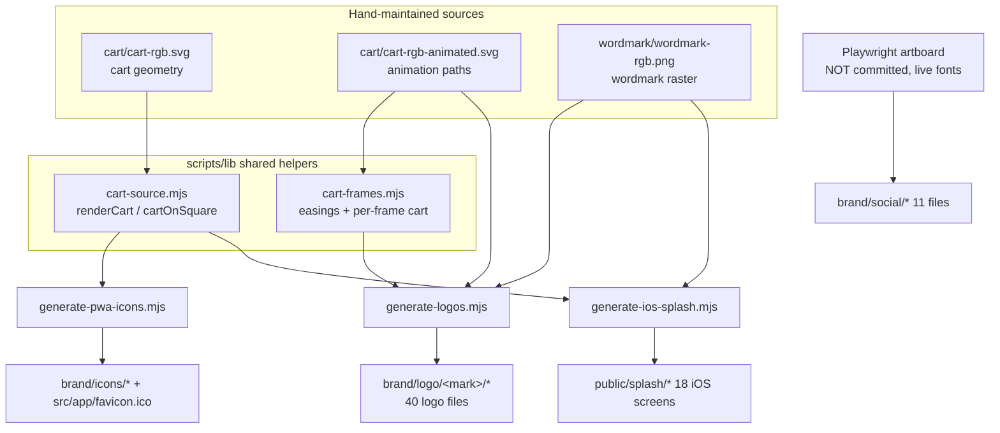
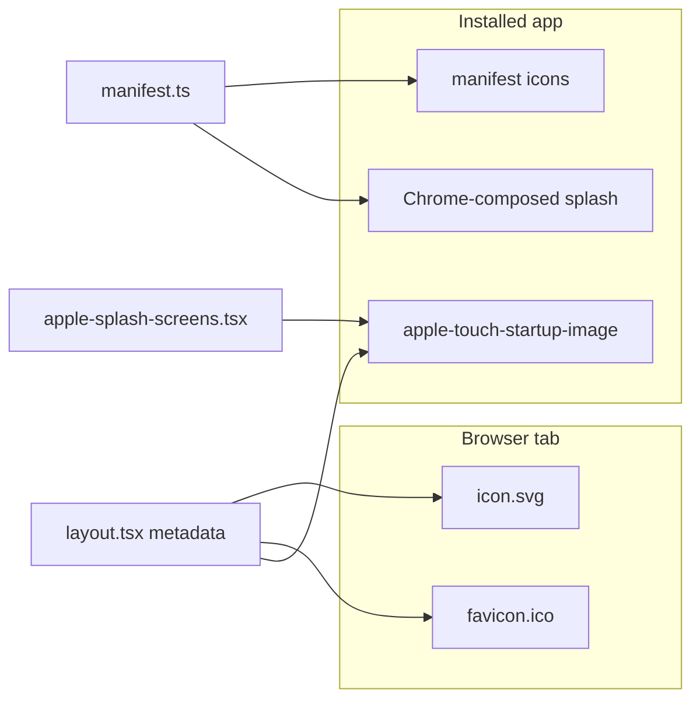

# Disscount: Brand & Logo Assets Guide

A complete reference for the Disscount brand image system: the happy-cart logo, its colour and format matrix, the favicon and PWA icons, the iOS splash screens, and the social-media kit. Written to be understandable even if you're new to this. Keep it up to date as the brand changes.

_Last verified end-to-end on 2026-07-21: all generators run clean, every raster carries an sRGB profile, app + docs point at the new paths._

> **Mental model in one sentence:** every brand image in the app is **generated from three hand-drawn source files** by three small Node scripts, so the mark, its green, and its shape stay pixel-identical everywhere, and changing the cart once and re-running the scripts propagates the change to the favicon, the PWA icons, the splash screens, and the downloadable logo pack all at once.

> **Usage & licensing:** this repository is **public**, so these files are visible to anyone, but the Disscount name and the happy-cart logo are **brand marks, not part of the code licence**. Do not reuse them to represent another product or to imply affiliation with or endorsement by Disscount. Referencing the project (for example linking to it, or writing about it) is fine.

---

## Table of contents

1. [Quick reference](#1-quick-reference)
2. [How it works, end to end](#2-how-it-works-end-to-end)
3. [The single source of truth](#3-the-single-source-of-truth)
4. [Folder layout (`public/brand/`)](#4-folder-layout-publicbrand)
5. [The logo matrix](#5-the-logo-matrix)
6. [The in-app logo vs the exported files](#6-the-in-app-logo-vs-the-exported-files)
7. [Favicon, PWA icons & splash (auto-wired)](#7-favicon-pwa-icons--splash-auto-wired)
8. [Social media kit (manual upload)](#8-social-media-kit-manual-upload)
9. [The generator scripts](#9-the-generator-scripts)
10. [What's automatic vs manual](#10-whats-automatic-vs-manual)
11. [Key files](#11-key-files)
12. [Libraries & config](#12-libraries--config)
13. [Gotchas & lessons learned](#13-gotchas--lessons-learned)
14. [Future improvements & TODOs](#14-future-improvements--todos)

---

## 1. Quick reference

| Thing                | Value                                                                                                 |
| -------------------- | ----------------------------------------------------------------------------------------------------- |
| Brand green          | `#2ec50d` = `rgb(46, 197, 13)` = `oklch(0.7183 0.2344 141.297)` (the app's `--primary` in light mode) |
| Wordmark font        | Saira Stencil SemiBold (weight 600), self-hosted                                                      |
| Tagline font         | Huninn (weight 400), self-hosted latin-ext subset                                                     |
| Tagline              | "Pronađi najbolje cijene u Hrvatskoj"                                                                 |
| Source of truth      | 3 files under `frontend/public/brand/logo/` (see [section 3](#3-the-single-source-of-truth))          |
| Generated asset root | `frontend/public/brand/` (`logo/`, `icons/`, `social/`) + `frontend/public/splash/`                   |
| Generators           | `frontend/scripts/generate-logos.mjs`, `generate-pwa-icons.mjs`, `generate-ios-splash.mjs`            |
| Image library        | `sharp` (`^0.35.2`)                                                                                   |

**Daily workflow:** you almost never touch these. You only regenerate when the cart shape, the wordmark, or the brand green changes: edit the relevant source, run the three scripts, commit the output.

---

## 2. How it works, end to end

Three hand-maintained source files feed two shared helper modules, which feed three generator scripts, which write every raster and vector the app and the outside world use. The social kit is the one exception: it is rendered from a live-font Playwright artboard rather than from `sharp`.



Because everything downstream of the sources is generated, the assets never drift from each other. The cart in the favicon, the cart in the splash screen, and the cart in the animated GIF are all the same geometry rasterized at different sizes.

---

## 3. The single source of truth

Only three files are edited by hand. Everything else is output.

| Source file                             | What it is                                                                                                        | Consumed by                                                          |
| --------------------------------------- | ----------------------------------------------------------------------------------------------------------------- | -------------------------------------------------------------------- |
| `brand/logo/cart/cart-rgb.svg`          | The static cart, as stroked vector paths (the geometry)                                                           | `cart-source.mjs` -> icons, splash, JSON-LD logo                     |
| `brand/logo/cart/cart-rgb-animated.svg` | The same cart with CSS-animated classes (`cart-body`, `cart-eyes`, `cart-wheel`); the animation timing lives here | `cart-frames.mjs` (paths extracted by regex) -> all animated exports |
| `brand/logo/wordmark/wordmark-rgb.png`  | The "disscount" wordmark set in Saira Stencil, rasterized once (1938 x 331)                                       | `generate-logos.mjs`, `generate-ios-splash.mjs`                      |

The brand green `#2ec50d` is duplicated in two constants so the scripts don't have to parse the SVG: `GREEN` in `scripts/lib/cart-frames.mjs` and `GREEN` in `scripts/generate-logos.mjs`. If you ever change the green, change it in the SVG sources **and** both constants, then regenerate.

---

## 4. Folder layout (`public/brand/`)

```
frontend/public/brand/
├── logo/                      # the downloadable logo pack (see section 5)
│   ├── cart/                  # 12 files: cart-only mark
│   ├── wordmark/              # 10 files: text-only mark
│   ├── lockup-horizontal/     # 10 files: cart + wordmark side by side
│   └── lockup-vertical/       # 10 files: cart above wordmark
├── icons/                     # favicon + PWA / home-screen icons (auto-wired)
│   ├── icon.svg               # primary favicon, adapts to dark mode
│   ├── mask-icon.svg          # Safari pinned-tab silhouette (tinted brand green)
│   ├── icon-192.png
│   ├── icon-512.png
│   ├── icon-maskable-512.png
│   └── apple-touch-icon-180.png
└── social/                    # per-platform upload images (manual, see section 8)

frontend/public/splash/        # 18 iOS launch screens (auto-wired)
frontend/src/app/favicon.ico   # legacy favicon fallback (Next.js file convention)
frontend/src/app/opengraph-image.tsx, twitter-image.tsx   # link-preview images, generated by next/og
frontend/src/app/og/render-og.tsx                         # shared OG renderer (brand + CTA)
```

Each logo mark lives in its own subfolder so the pack stays browsable, and filenames keep the full mark prefix (`cart/cart-rgb.svg`, not `cart/rgb.svg`) so a file stays self-descriptive once someone downloads and copies it around.

---

## 5. The logo matrix

Four marks, each in two colour variants and five formats, named `<mark>-<variant>.<format>`.

| Mark              | Subfolder            | Base names                                         | When to use it                                |
| ----------------- | -------------------- | -------------------------------------------------- | --------------------------------------------- |
| Cart only         | `cart/`              | `cart-rgb`, `cart-white`                           | Icon / favicon / avatar contexts              |
| Wordmark          | `wordmark/`          | `wordmark-rgb`, `wordmark-white`                   | Text-only lockups                             |
| Horizontal lockup | `lockup-horizontal/` | `lockup-horizontal-rgb`, `lockup-horizontal-white` | Headers, footers, email signatures, most uses |
| Vertical lockup   | `lockup-vertical/`   | `lockup-vertical-rgb`, `lockup-vertical-white`     | Splash / hero / when a taller mark is needed  |

**Colour variants:** `-rgb` is the brand green for light backgrounds; `-white` is pure white for dark or photo backgrounds.

**Formats** (each base name ships all five):

| Format   | Extension        | Notes                                                                              |
| -------- | ---------------- | ---------------------------------------------------------------------------------- |
| Vector   | `.svg`           | Cart is vector, wordmark is an embedded PNG; self-contained, renders anywhere      |
| Raster   | `.png`           | Transparent background, sRGB-tagged                                                |
| Raster   | `.webp`          | Lossless, transparent, sRGB-tagged, smaller than PNG                               |
| Animated | `-animated.gif`  | Loops the draw-on animation. `-rgb` has a **white matte**, `-white` is transparent |
| Animated | `-animated.webp` | Loops the draw-on animation, always transparent, sRGB-tagged                       |

The cart subfolder has two extra files, `cart-rgb-animated.svg` and `cart-white-animated.svg`: the CSS-animated vector source (12 files total instead of 10).

**Clear space & don't:** keep a margin equal to the cart's height around any lockup; never recolour, restretch, or re-shadow the mark.

---

## 6. The in-app logo vs the exported files

This is the part that surprises people: **the logo the running app shows in its header, footer and sidebar is NOT one of the files in `brand/logo/`.** It is an inline React component, `src/components/icons/cart-logo.tsx` (`<CartLogo />`), that hand-codes the same cart geometry as SVG so it server-renders everywhere and replays its draw-on animation on every mount (via the `.dis-cart-*` keyframes in `globals.css`). The wordmark next to it is live text set in `font-saira-stencil-semibold`, not the `wordmark-rgb.png` raster.

So there are two parallel representations of the same mark, kept in sync by hand:

| Where                                                                          | Representation                      | Source                               |
| ------------------------------------------------------------------------------ | ----------------------------------- | ------------------------------------ |
| Live app UI (header, footer, sidebar, landing sections)                        | Inline animated SVG + live web font | `cart-logo.tsx` + Saira Stencil font |
| Everything external (favicon, PWA, splash, OG image, social, email, downloads) | Generated raster/vector files       | `brand/` + the generator scripts     |

`cart-logo.tsx` carries a comment reminding you to keep its geometry in sync with `brand/logo/cart/cart-rgb-animated.svg`. If you reshape the cart, update both.

---

## 7. Favicon, PWA icons & splash (auto-wired)

These need no manual upload; the app references them directly.

**Favicon** is declared in `src/app/layout.tsx` `metadata.icons` as three layers, on purpose:

| Layer      | File                                   | Why it exists                                                                                                                               |
| ---------- | -------------------------------------- | ------------------------------------------------------------------------------------------------------------------------------------------- |
| Primary    | `brand/icons/icon.svg`                 | Crisp at any size; used by Chrome, Edge, Firefox. Has an inline `prefers-color-scheme` style so its plate turns dark on dark browser themes |
| Fallback   | `src/app/favicon.ico`                  | Safari before v26, Google's crawler, and email/RSS clients ignore SVG favicons                                                              |
| Apple      | `brand/icons/apple-touch-icon-180.png` | iOS home-screen icon                                                                                                                        |
| Safari tab | `brand/icons/mask-icon.svg`            | Monochrome cart silhouette for macOS Safari pinned tabs; Safari tints it with the `color` in the `<link>` (brand green)                     |

The theme colour is set in `layout.tsx` `viewport.themeColor` as a light/dark pair (`#ffffff` / `#121212`) so the mobile browser chrome matches the page. Both `opengraph-image.png` and `twitter-image.png` carry alt text via sibling `*.alt.txt` files (a Next.js convention).

**PWA icons** are declared in `src/app/manifest.ts`: `icon-192`, `icon-512` (both `purpose: "any"`), and `icon-maskable-512` (`purpose: "maskable"`, a tighter crop so Android's circle/squircle mask never clips the cart). The install banners (`install-banner.tsx`, `install-sidebar-banner.tsx`) reuse `icon-192.png`.

**iOS splash screens** (`public/splash/`, 18 of them) are the branded image iOS shows while an installed app launches, instead of a white flash. iOS ignores the manifest for this and matches a `<link rel="apple-touch-startup-image">` per device by media query. The component `apple-splash-screens.tsx` and the generator both read the **same** device list, `src/constants/ios-splash-screens.json`, so the tags and the files never drift. Each image is the cart plus the wordmark on white.

**Android / Chrome splash** cannot take a custom image. Chrome composes it at runtime from the manifest's `background_color` (`#ffffff`, set to match the iOS screens) + the 512 icon + the app `name`, so it shows the cart + "Disscount" text on white. Parity with the iOS design stops there by platform design.



---

## 8. Social media kit (manual upload)

The 11 files in `brand/social/` are sized and safe-area-checked to current platform specs. Unlike everything else, these are **built from a live-font Playwright artboard, not from `sharp`** (a browser is needed to render Saira Stencil and lay out the banners), so the artboard script is not committed. Upload them by hand in each platform's settings.

| File                    | Platform                                                                         | Size                          | Where to upload                                |
| ----------------------- | -------------------------------------------------------------------------------- | ----------------------------- | ---------------------------------------------- |
| `avatar.png`            | Any profile photo (FB, IG, LinkedIn, YouTube, Reddit, X, Gmail/Google, WhatsApp) | 1000 x 1000                   | Profile picture (circle-cropped)               |
| `og-image.png`          | Link previews (FB, LinkedIn, X, Discord, WhatsApp, Gmail)                        | 1200 x 630                    | Also served automatically as the site OG image |
| `github-social.png`     | GitHub repo                                                                      | 1280 x 640                    | Repo -> Settings -> Social preview             |
| `kofi-cover.png`        | Ko-fi                                                                            | 1920 x 640 (3:1)              | Ko-fi page -> Edit cover                       |
| `youtube-banner.png`    | YouTube channel                                                                  | 2560 x 1440 (safe 1546 x 423) | Channel -> Customize -> Branding -> Banner     |
| `youtube-thumbnail.png` | YouTube video                                                                    | 1280 x 720                    | Per-video thumbnail                            |
| `linkedin-banner.png`   | LinkedIn profile                                                                 | 1584 x 396                    | Profile -> Edit background                     |
| `facebook-cover.png`    | Facebook page                                                                    | 1640 x 624                    | Page -> Edit cover                             |
| `reddit-banner.png`     | Reddit                                                                           | 1920 x 384                    | Community/profile -> Banner                    |
| `post-square.png`       | Feed post (IG, FB, LinkedIn)                                                     | 1080 x 1080                   | New post                                       |
| `story.png`             | Story / status (IG, FB, WhatsApp status)                                         | 1080 x 1920 (9:16)            | New story/status                               |

**Gmail / WhatsApp** need no bespoke files: profile photo = `avatar.png`, WhatsApp status = `story.png`, chat/email link previews = `og-image.png`, email signature = `logo/lockup-horizontal/lockup-horizontal-rgb`.

The app's own OG and Twitter link-preview images are **generated dynamically** by `src/app/opengraph-image.tsx` / `twitter-image.tsx` (both thin wrappers over `src/app/og/render-og.tsx`), using Next.js's `next/og` `ImageResponse`. The renderer reuses the app's brand (happy cart + Saira Stencil wordmark + Huninn tagline on the green gradient) and adds a "Uštedi već danas" CTA. Satori cannot read woff2, so the tagline uses a `.woff` build of the Huninn latin-ext subset (`src/app/fonts/Huninn/huninn-latin-ext.woff`, converted from the committed woff2).

---

## 9. The generator scripts

All live in `frontend/scripts/` and are run manually with `node`. They share two helper modules so the cart and its animation are defined once.

| Script                    | Produces                                                  | Key ideas                                                                                                      |
| ------------------------- | --------------------------------------------------------- | -------------------------------------------------------------------------------------------------------------- |
| `lib/cart-source.mjs`     | (helper) `renderCart(width)`, `cartOnSquare(size, ratio)` | Strips the `<style>` block from the animated SVG to freeze the finished cart, then rasterizes it               |
| `lib/cart-frames.mjs`     | (helper) easings + `cartFrameSvg()`                       | librsvg can't play CSS animation, so the draw-on is rebuilt frame by frame with cubic-bezier easings           |
| `generate-logos.mjs`      | The 40-file logo matrix                                   | A `markFile()` router sends each output into its per-mark subfolder; `flood()` fixes edge fringe (see gotchas) |
| `generate-pwa-icons.mjs`  | PWA icons + `favicon.ico`                                 | Wraps PNG frames in a hand-built ICO container since `sharp` can't emit `.ico`                                 |
| `generate-ios-splash.mjs` | 18 iOS splash screens                                     | Composites the cart + a smaller wordmark label centred on white, per device from the JSON list                 |

**Order matters** if you run them fresh: `generate-logos.mjs` first (it writes `cart/cart-rgb.svg`, which the other two read via `cart-source.mjs`), then the icon and splash scripts.

### Regenerating

Run from `frontend/`:

```bash
node scripts/generate-logos.mjs       # 4 marks x 2 variants x 5 formats
node scripts/generate-pwa-icons.mjs   # PWA icons + favicon.ico
node scripts/generate-ios-splash.mjs  # iOS splash screens
```

The social kit (`brand/social/`) is not regenerated by these; it comes from the separate, uncommitted Playwright artboard.

---

## 10. What's automatic vs manual

| Task                                                | Automatic? | Notes                                                                                    |
| --------------------------------------------------- | ---------- | ---------------------------------------------------------------------------------------- |
| Favicon in the browser tab                          | Automatic  | `layout.tsx` metadata + `favicon.ico`                                                    |
| PWA / home-screen icon                              | Automatic  | `manifest.ts`                                                                            |
| iOS launch splash                                   | Automatic  | `apple-splash-screens.tsx` hoists the link tags                                          |
| Android launch splash                               | Automatic  | Chrome composes it from the manifest                                                     |
| Site OG / Twitter preview image                     | Automatic  | `src/app/opengraph-image.png`, `twitter-image.png`                                       |
| In-app header/footer logo                           | Automatic  | Inline `<CartLogo />`, no file needed                                                    |
| Social profile pics & banners                       | **Manual** | Upload `brand/social/*` in each platform                                                 |
| Email signature logo                                | **Manual** | Use `logo/lockup-horizontal/lockup-horizontal-rgb`                                       |
| Regenerating after a brand change                   | **Manual** | Edit a source, run the three scripts, commit                                             |
| Keeping `cart-logo.tsx` in sync with the SVG source | **Manual** | Two parallel representations (see [section 6](#6-the-in-app-logo-vs-the-exported-files)) |

---

## 11. Key files

| Path                                                          | Role                                                  |
| ------------------------------------------------------------- | ----------------------------------------------------- |
| `frontend/public/brand/logo/<mark>/`                          | The generated logo pack, one subfolder per mark       |
| `frontend/public/brand/icons/`                                | Favicon SVG + PWA / apple-touch icons                 |
| `frontend/public/brand/social/`                               | Per-platform social images (manual upload)            |
| `frontend/public/splash/`                                     | 18 generated iOS launch screens                       |
| `frontend/src/app/favicon.ico`                                | Legacy favicon fallback (Next.js file convention)     |
| `frontend/src/app/opengraph-image.png`, `twitter-image.png`   | Site link-preview images                              |
| `frontend/scripts/generate-logos.mjs`                         | Builds the logo matrix                                |
| `frontend/scripts/generate-pwa-icons.mjs`                     | Builds PWA icons + favicon.ico                        |
| `frontend/scripts/generate-ios-splash.mjs`                    | Builds the iOS splash screens                         |
| `frontend/scripts/lib/cart-source.mjs`                        | Shared cart rasterizer                                |
| `frontend/scripts/lib/cart-frames.mjs`                        | Shared animation math + brand green                   |
| `frontend/src/components/icons/cart-logo.tsx`                 | The live in-app animated cart                         |
| `frontend/src/components/custom/pwa/apple-splash-screens.tsx` | Emits the iOS splash `<link>` tags                    |
| `frontend/src/constants/ios-splash-screens.json`              | Device list shared by the component and the generator |
| `frontend/src/app/layout.tsx`                                 | `metadata.icons` (favicon + apple-touch)              |
| `frontend/src/app/manifest.ts`                                | PWA icons, `background_color`, `name`                 |
| `frontend/src/app/(root)/components/json-ld.tsx`              | `Organization.logo` points at `cart/cart-rgb.svg`     |
| `frontend/src/app/fonts/index.ts`                             | Self-hosted Saira Stencil + Huninn                    |

---

## 12. Libraries & config

**Libraries** (versions from `frontend/package.json`):

- `sharp` (`^0.35.2`): all rasterization, compositing, resizing, PNG/WebP/GIF encoding, and the sRGB profile tagging.
- No dedicated favicon/ICO library: the `.ico` container is hand-assembled in `generate-pwa-icons.mjs` because `sharp` can't write `.ico`.

**Fonts** (self-hosted under `src/app/fonts/`, loaded via `next/font/local`, not Google Fonts):

- Saira Stencil SemiBold (weight 600), the wordmark, exposed as `--font-saira-stencil`.
- Huninn (weight 400), the tagline, a 28 KB latin + latin-ext `.woff2` subset. The full Google Huninn TTF is a 4.5 MB CJK font with no fallback metrics, hence the local subset.

**Config / env / flags:** the brand system has **no env vars and no feature flags**. Absolute asset URLs in JSON-LD use `NEXT_PUBLIC_APP_URL` (falling back to `http://localhost:3000`), which is a general app variable, not brand-specific.

---

## 13. Gotchas & lessons learned

**Untagged rasters over-saturate on wide-gamut (P3) displays.** A PNG that stores the correct sRGB green (`46, 197, 13`) but carries **no colour profile** is treated as device-native on a P3 screen, so the green renders as roughly `#00d829`, brighter than the SVG. The fix: every raster is written with `.withIccProfile("srgb")`, so viewers colour-manage it identically to the vector. If you add a new raster output, tag it.

**GIFs cannot carry a colour profile.** Animated GIFs are palette-based and have no ICC slot, so on a P3 display a GIF may still look a touch saturated. Prefer SVG / PNG / WebP for colour-critical placements; the GIF is for chat and legacy embeds.

**Single-colour marks get a hue-shifted edge fringe.** When `sharp` composites or resizes a one-colour shape, the anti-aliased edges are blended through premultiplied-alpha space and overshoot the hue (again toward `#00d829`). The `flood()` helper in `generate-logos.mjs` rewrites every pixel's RGB to the exact brand colour and lets the alpha channel carry the shape, killing the fringe.

**librsvg does not play CSS animations.** Rasterizing `cart-rgb-animated.svg` directly would capture only the first (blank) frame. That's why `cart-frames.mjs` rebuilds the draw-on frame by frame with cubic-bezier easings, and why the static `cart-rgb.svg` exists separately as the always-visible mark.

**The header logo is not a file.** If you reshape the cart, updating `brand/logo/` is only half the job; the live app renders `cart-logo.tsx`, which hand-codes the geometry. Keep the two in sync.

**The iOS device list is shared, don't fork it.** `apple-splash-screens.tsx` and `generate-ios-splash.mjs` both read `ios-splash-screens.json`. Add a device there once and both the `<link>` tags and the generated images stay aligned; edit either side alone and they drift.

**Favicon is deliberately three files, not just the SVG.** Safari before v26, Google's crawler, and many email clients ignore SVG favicons and fall back to `.ico` or the apple-touch PNG. Keep all three.

**Green lives in three places.** The two SVG sources plus the two `GREEN` script constants. A partial change leaves the SVGs one shade and the rasters another.

---

## 14. Future improvements & TODOs

- **Commit the social artboard.** The Playwright artboard that builds `brand/social/*` is not in the repo, so the social kit can't be regenerated from a clean checkout. Add a committed `generate-social.mjs` (or the HTML artboard + a small runner) so the whole brand is reproducible.
- **Deduplicate the brand green.** Derive `GREEN` in the scripts from a single shared constant (or read it out of the SVG) instead of repeating the hex in `cart-frames.mjs` and `generate-logos.mjs`.
- **Single source for the cart geometry.** `cart-logo.tsx` and `cart-rgb-animated.svg` hand-duplicate the same paths. Consider generating the component from the SVG (or vice versa) so a reshape is a one-file change.
- **Generate a maskable Apple icon.** iOS 18+ supports tinted/dark home-screen icons; a dedicated dark/tinted variant could be added to the icon script.
- **Automate an optimization pass.** Run the PNGs through a lossless optimizer (e.g. `oxipng`) as a final generator step to shave bytes without touching pixels.
