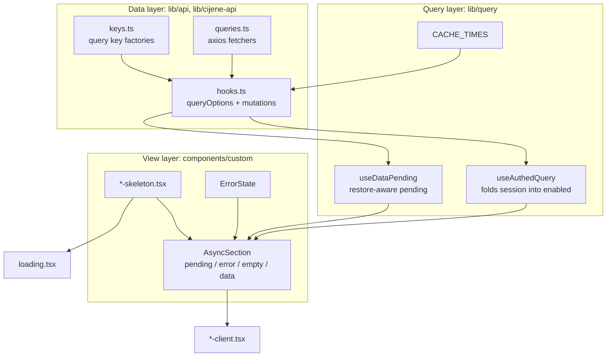
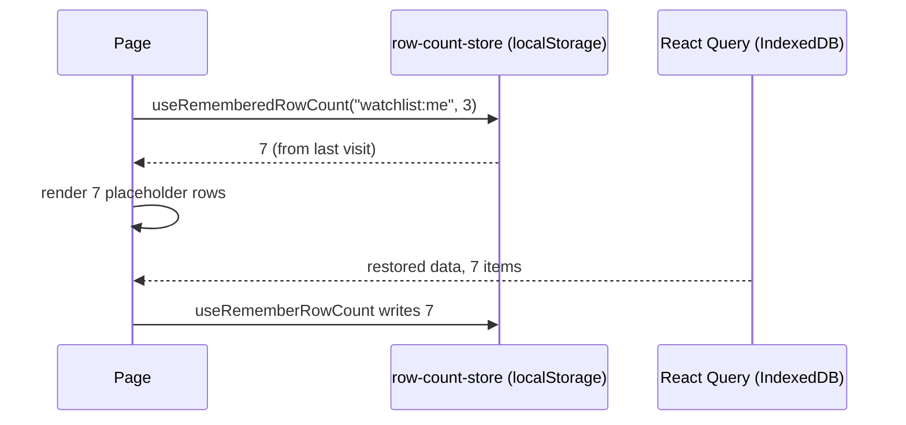

# Disscount: Data Fetching & Loading UI Guide

A complete reference for how the frontend asks the server for data and what the screen shows while it waits. Written to be understandable even if you're new to this. Keep it up to date as the layer changes.

_Last verified end-to-end on 2026-07-30: every data-driven route converted, `tsc --noEmit` and `next build` clean._

> **Mental model in one sentence:** the **data layer** (`lib/api`, `lib/cijene-api`) only describes requests, the **query layer** (`lib/query`) turns a description into state a page can branch on, and the **view layer** (`AsyncSection` plus a colocated skeleton) turns that state into pixels that never move once the data lands.

---

## Table of contents

1. [Quick reference](#1-quick-reference)
2. [Architecture](#2-architecture)
3. [Layer 1: the data layer](#3-layer-1-the-data-layer)
4. [Layer 2: the query layer](#4-layer-2-the-query-layer)
5. [Layer 3: the view layer](#5-layer-3-the-view-layer)
6. [The skeleton kit](#6-the-skeleton-kit)
7. [Route-level loading.tsx](#7-route-level-loadingtsx)
8. [Remembered row counts](#8-remembered-row-counts)
9. [Offline persister interaction](#9-offline-persister-interaction)
10. [What's automatic vs manual](#10-whats-automatic-vs-manual)
11. [Key files](#11-key-files)
12. [Config, flags, and libraries](#12-config-flags-and-libraries)
13. [Gotchas & lessons learned](#13-gotchas--lessons-learned)
14. [Future improvements & TODOs](#14-future-improvements--todos)

---

## 1. Quick reference

| Thing                  | Value                                                                            |
| ---------------------- | -------------------------------------------------------------------------------- |
| Query client           | `frontend/src/app/providers/react-query-provider.tsx`                            |
| Global `staleTime`     | `CACHE_TIMES.default` (60s)                                                      |
| Global `gcTime`        | 7 days, matched to the persister `maxAge`                                        |
| Reads are described as | `queryOptions()` in `lib/api/<domain>/hooks.ts`                                  |
| Authed reads use       | `useAuthedQuery`                                                                 |
| Loading flag           | `pending` from `useAuthedQuery`, or `useDataPending(...)`. **Never `isLoading`** |
| Branching              | `AsyncSection`, fixed order: pending, error, empty, data                         |
| Skeletons              | `<component-name>-skeleton.tsx`, colocated next to the component                 |
| Error copy             | `toUserMessage(error, fallback)`                                                 |

**Adding a read to a page, in four steps:** add a `queryOptions()` entry to the domain's `hooks.ts`, call it through `useAuthedQuery` (or `useQuery` for public data), write a sibling skeleton mirroring the component, wire both into `AsyncSection`.

---

## 2. Architecture

Three layers, each ignorant of the one above it. That is what stops the fetch layer needing React context, and stops pages hand-rolling their own loading logic.



**Why reads are descriptors, not hooks.** A `queryOptions()` object can be handed to `useQuery`, `useAuthedQuery`, `useQueries`, a prefetch, or `getQueryData`, so one definition serves every consumer. It also keeps `lib/api` free of React context: `useAuthedQuery` reads `useUser()`, and `user-context.tsx` imports the `lib/api` barrel, so a domain hook importing `useAuthedQuery` would close an import cycle.

---

## 3. Layer 1: the data layer

Every domain under `frontend/src/lib/api/` has the same three files plus a thin `index.ts` barrel.

| File         | Owns                                                       | Never does                 |
| ------------ | ---------------------------------------------------------- | -------------------------- |
| `keys.ts`    | query key factories                                        | anything else              |
| `queries.ts` | axios fetchers                                             | touch React Query          |
| `hooks.ts`   | `queryOptions()` descriptors, mutation hooks, invalidation | render, expose `isLoading` |

### Query keys

Keys are factories, never inline literals. Every domain exports a `*_QUERY_KEYS` object:

```ts
export const SHOPPING_LIST_QUERY_KEYS = {
  all: ["shoppingLists"] as const,
  me: ["shoppingLists", "me"] as const,
  byId: (id: string) => ["shoppingLists", id] as const,
  itemsAll: ["shoppingListItems"] as const,
  myItems: ["shoppingListItems", "me"] as const,
};
```

The external price API (`lib/cijene-api/keys.ts`) takes params, and each key ends in an **explicit object of the optional filters**:

```ts
productByEan: ({ ean, date, chains }: GetProductParams) =>
  [ROOT, "product", "ean", ean, { date, chains }] as const,
```

This replaced a `JSON.stringify(params)` form that keyed on argument _shape_. React Query hashes object keys in sorted order and skips `undefined` members, so a product card seeding the cache with `{ ean }` now lands on the same key a reader passing `{ ean, date: undefined }` looks up. Under the old form that only worked because every caller happened to pass the same fields.

### Cache times

`staleTime` is never a hand-written number. It comes from `frontend/src/lib/query/cache-times.ts`:

| Constant               | Value  | Why                                                                                |
| ---------------------- | ------ | ---------------------------------------------------------------------------------- |
| `default`              | 1 min  | Global default, so moving between pages does not refetch a list you just looked at |
| `products`             | 6 h    | The upstream price feed publishes once a day                                       |
| `chains`               | 1 h    | Chains change when a retailer enters or leaves the market                          |
| `stores`               | 30 min | Store lists change when a location opens or closes                                 |
| `priceHistoryEdge`     | 1 min  | The newest archived day can still be revised upstream                              |
| `priceHistoryArchived` | 6 h    | Older archived days never change again                                             |
| `health`               | 30 s   | A health probe that is cached is not a health probe                                |

`staleTime` is how long data counts as fresh. Retention is `gcTime`, set once in the provider to match the persister's `maxAge`.

---

## 4. Layer 2: the query layer

### `useAuthedQuery`

For any read that only makes sense for a signed-in user. It folds the session into `enabled` and returns two extra fields on top of the normal query result:

| Field          | Meaning                                                                                 |
| -------------- | --------------------------------------------------------------------------------------- |
| `pending`      | Show the skeleton. Covers auth resolution and cache restore, not just the network fetch |
| `requiresAuth` | Auth resolved to no session. Show `LoginRequired`, not an error                         |

```tsx
const { data = [], pending, error, requiresAuth } = useAuthedQuery(
  shoppingListQueries.me(),
);

if (requiresAuth) return <LoginRequired ... />;
```

Before this, every authed page hand-wrote the same three things: fold `isAuthenticated` into `enabled`, merge `userLoading || isLoading` into one flag, and separately decide when to show the login gate. That merge was also load-bearing by accident, since a disabled query reports `isLoading: false`, so the gate only held while `userLoading` happened to still be true.

### `useDataPending`

For public reads and for combining several flags:

```ts
const pending = useDataPending(productPending, waitingForLocations);
```

It ORs the flags with `useIsRestoring()`. See [gotcha 13.1](#131-isloading-is-false-while-the-cache-restores) for why that matters.

Note that a query with `enabled: false` reports `isPending` forever, so gate that flag on whatever disables it, or use `useAuthedQuery`, which already does.

### `useProductsByEans`

Prices for a set of products, one request per EAN so each row resolves on its own rather than the slowest one holding up the page. It replaced four near-identical `useQueries` blocks in the shopping list detail, its store analysis, the watchlist, and the notification bell.

Returns `{ results, products, productsByEan, pending, isError, updatedAt }`. `results` is the raw per-EAN array for callers that render a row while its own product loads; `updatedAt` is the newest successful fetch, for a "last synced" label.

---

## 5. Layer 3: the view layer

### `AsyncSection`

Every data-backed section renders through it, and the state order is **fixed**: pending, then error, then empty, then the data.

```tsx
<AsyncSection
  pending={pending}
  error={error}
  isEmpty={items.length === 0}
  skeleton={
    <RepeatSkeleton count={rows}>
      <ProductCardSkeleton />
    </RepeatSkeleton>
  }
  empty={<NoResults />}
>
  {items.map((item) => (
    <Row key={item.id} item={item} />
  ))}
</AsyncSection>
```

The order being structural is the whole point. Roughly a dozen clients used to hand-write this ternary chain, and several checked error or emptiness _before_ loading had finished, so a cold cache painted "Greška" or "(0)" for a frame. There is no way to express that mistake through this component.

Auth is deliberately absent from it: a missing session replaces the whole page rather than one section, so callers return `LoginRequired` early off `requiresAuth`.

### `ErrorState` and `toUserMessage`

Two error shapes reach the UI, and callers should not have to know which one they got:

| Source             | Shape                    | Parsed by                    |
| ------------------ | ------------------------ | ---------------------------- |
| Our Spring backend | RFC 9457 Problem Details | `lib/api/problem-details.ts` |
| Upstream price API | `CijeneApiError`         | `lib/cijene-api/errors.ts`   |

`toUserMessage(error, fallback)` in `lib/api/error-message.ts` is the single consumer-facing entry point. It maps `CijeneApiError` statuses onto Croatian copy (the upstream messages are English and leak implementation detail), prefers Problem Details `detail` over `title`, and falls back to the caller's own copy for anything else. `ErrorState` is the shared block that renders it, with an optional retry or way back.

---

## 6. The skeleton kit

### The convention

- File: `<component-name>-skeleton.tsx`, **colocated next to** `<component-name>.tsx`. Default export `<ComponentName>Skeleton`.
- Skeletons are **server-renderable**: no `"use client"`, no hooks, plain scalar props. That is what lets `loading.tsx` and the client's pending branch share one file.
- A skeleton **never re-types** the real component's wrapper classes. It imports them (for example `PRODUCT_SUMMARY_ROW_CLASSES`, exported from `product-summary.tsx`) or both render a shared shell.

This beats a central `skeletons/` mirror, because the pair stays adjacent in the file tree and drift is visible in review. It also beats one big barrel file, which blows past the 50 to 100 line target immediately.

### Shared primitives

Under `frontend/src/components/custom/skeleton/`:

| Component               | Role                                                                                            |
| ----------------------- | ----------------------------------------------------------------------------------------------- |
| `SkeletonRegion`        | The a11y contract. One `role="status"` label, everything inside `aria-hidden`                   |
| `RepeatSkeleton`        | Renders `count` keyed copies of a row, so no list skeleton writes its own `Array.from(...).map` |
| `CountSkeleton`         | The inline pill that stands in for a `(N)` in a heading                                         |
| `TextSkeleton`          | `lines` bars, last line shorter, the way wrapped prose ends                                     |
| `SectionHeaderSkeleton` | The collapsed header row of `CollapsibleSection`                                                |
| `TableSkeleton`         | Generic rows and columns, for the admin tables                                                  |
| `ChartSkeleton`         | A price chart's footprint: axis labels plus plot area                                           |
| `PageShellSkeleton`     | Neutral page shape, the last-resort fallback                                                    |

`SkeletonRegion` puts its label in a separate `sr-only` element rather than wrapping the bars, so the element carrying `className` is still the direct layout parent. Nesting a div there would break any caller whose children must stay direct grid or flex items, which is exactly the shift these skeletons exist to prevent.

### Sizing bars correctly

Bars are `h-[1lh]` inside a wrapper carrying **the same font classes** as the text they stand in for. One line box of that text, exactly:

```tsx
<div className="text-sm @md:text-base font-bold">
  <Skeleton className="h-[1lh] w-48 max-w-full" />
</div>
```

Do not reach for a fixed `h-4`. See [gotcha 13.2](#132---spacing-is-02rem-so-h-4-is-128px).

---

## 7. Route-level `loading.tsx`

Each data-driven route has its own `loading.tsx` rendering that route's page skeleton. It paints during the RSC navigation, before the client component mounts, which is the window the old global spinner used to fill.

| Route                  | Skeleton                                               |
| ---------------------- | ------------------------------------------------------ |
| `/shopping-lists`      | `ShoppingListsSkeleton`                                |
| `/shopping-lists/[id]` | `ShoppingListDetailSkeleton`                           |
| `/products`            | `ProductsSkeleton` (also the page's Suspense fallback) |
| `/products/[id]`       | `ProductDetailSkeleton`                                |
| `/watchlist`           | `WatchlistSkeleton`                                    |
| everything else        | `app/loading.tsx` renders `PageShellSkeleton`          |

A page skeleton must mirror the **stored default open state** of its collapsible sections, or the page height jumps as soon as the real component reads localStorage:

| Section                     | Default | Skeleton shows       |
| --------------------------- | ------- | -------------------- |
| Shopping list items         | open    | header + rows        |
| Shopping list price history | closed  | header only          |
| Shopping list stores        | open    | header + store cards |
| Product price history       | closed  | header only          |
| Product chains              | open    | header + store cards |

Routes with no skeleton, and why: `/map` and `/spending` are Coming Soon placeholders, `/updates` and `/suggestions` read static local data with no query, and the static legal pages fetch nothing.

---

## 8. Remembered row counts

A list skeleton drawing a generic three rows still jumps when the real list has nine. The persisted React Query cache cannot help on the first paint, because IndexedDB resolves asynchronously.

So a small synchronous `localStorage` note carries the last known length:



Counts are clamped to 1 to 8, so a long list does not paint a wall of grey. `useRememberedRowCount` uses `useSyncExternalStore` with `fallback` as the server snapshot, so `loading.tsx` and the first client render agree and hydration stays quiet.

---

## 9. Offline persister interaction

The persisted cache is documented in full in [PWA.md](PWA.md#5-offline-reads-caching-and-persistence). Two things bind it to this layer:

1. **Key roots are load-bearing.** `lib/offline/cached-query-keys.ts` allowlists dehydration by the _top-level_ key string (`cijene`, `shoppingLists`, `watchlist`, and so on), and `lib/offline/purge.ts` treats `cijene` as the public root that survives logout. The key factories deliberately keep those roots spelled exactly as before, and each `keys.ts` says so in a comment.
2. **Changing key shapes needs a buster bump.** Entries written under the old shape would never be read again, so `CACHE_BUSTER` in `lib/offline/persister.ts` went from `"1"` to `"2"`. Every existing user takes one cold load after that deploys, then it is back to normal.

---

## 10. What's automatic vs manual

| Thing                                           | Automatic?   | Notes                                                       |
| ----------------------------------------------- | ------------ | ----------------------------------------------------------- |
| Skeleton on a cold cache                        | ✅ automatic | `AsyncSection` picks it off `pending`                       |
| Instant render on a warm cache                  | ✅ automatic | Data present means `pending` is false, so no skeleton flash |
| Background refresh of stale data                | ✅ automatic | `staleTime` expiry plus refetch on focus                    |
| Reduced motion                                  | ✅ automatic | `[data-slot="skeleton"]` rule in `globals.css`              |
| Row count memory                                | ✅ automatic | Written whenever a list renders with data                   |
| **Writing the skeleton**                        | ❌ manual    | One per component, mirroring its geometry                   |
| **Adding a `loading.tsx`**                      | ❌ manual    | New data-driven route needs one                             |
| **Adding a query key to the offline allowlist** | ❌ manual    | `cached-query-keys.ts`                                      |
| **Bumping the cache buster**                    | ❌ manual    | After any breaking key or data-shape change                 |
| **Picking a `CACHE_TIMES` value**               | ❌ manual    | Add a named constant rather than a number                   |

---

## 11. Key files

| Path                                                      | Role                                                      |
| --------------------------------------------------------- | --------------------------------------------------------- |
| `frontend/src/lib/query/cache-times.ts`                   | Named `staleTime` windows                                 |
| `frontend/src/lib/query/use-authed-query.ts`              | Session-gated query, returns `pending` and `requiresAuth` |
| `frontend/src/lib/query/use-data-pending.ts`              | Restore-aware pending flag                                |
| `frontend/src/lib/api/<domain>/keys.ts`                   | Query key factory per domain                              |
| `frontend/src/lib/api/<domain>/queries.ts`                | axios fetchers                                            |
| `frontend/src/lib/api/<domain>/hooks.ts`                  | `queryOptions()` descriptors + mutation hooks             |
| `frontend/src/lib/api/error-message.ts`                   | `toUserMessage`, the one place an error becomes copy      |
| `frontend/src/lib/cijene-api/keys.ts`                     | Keys for the external price API                           |
| `frontend/src/lib/cijene-api/use-products-by-eans.ts`     | Batched per-EAN product fetch                             |
| `frontend/src/lib/skeleton/row-count-store.ts`            | Clamped localStorage map of last list lengths             |
| `frontend/src/hooks/use-remembered-row-count.ts`          | Read and write hooks for the above                        |
| `frontend/src/components/custom/common/async-section.tsx` | The four-state branch                                     |
| `frontend/src/components/custom/common/error-state.tsx`   | Shared error block                                        |
| `frontend/src/components/custom/skeleton/`                | Shared skeleton primitives                                |
| `frontend/src/app/providers/react-query-provider.tsx`     | `QueryClient` defaults + persistence                      |
| `frontend/src/lib/offline/cached-query-keys.ts`           | Which key roots persist to disk                           |
| `frontend/src/lib/offline/persister.ts`                   | IndexedDB persister, `maxAge`, `buster`                   |

---

## 12. Config, flags, and libraries

No environment variables are specific to this layer. One existing flag is relevant:

| Variable                                  | Effect                                                                                                           |
| ----------------------------------------- | ---------------------------------------------------------------------------------------------------------------- |
| `NEXT_PUBLIC_ENABLE_REACT_QUERY_DEVTOOLS` | `true` mounts the React Query devtools panel. Opt-in because its floating button sits over the mobile bottom nav |

Libraries, versions from `frontend/package.json`:

| Library                                   | Version    | Role                                                        |
| ----------------------------------------- | ---------- | ----------------------------------------------------------- |
| `@tanstack/react-query`                   | `^5.90.12` | Query cache, `queryOptions`, `useQueries`, `useIsRestoring` |
| `@tanstack/react-query-persist-client`    | `^5.101.1` | `PersistQueryClientProvider`                                |
| `@tanstack/query-async-storage-persister` | `^5.101.1` | Async persister used with IndexedDB                         |
| `idb-keyval`                              | `^6.2.5`   | IndexedDB storage adapter                                   |
| `axios`                                   | `^1.13.2`  | HTTP client, auth interceptors in `lib/api/api-base.ts`     |
| `zod`                                     | `^4.1.13`  | Response validation, Problem Details schema                 |
| `tailwindcss`                             | `^4`       | `animate-pulse`, `h-[1lh]`, the `--spacing` scale           |

---

## 13. Gotchas & lessons learned

### 13.1 `isLoading` is false while the cache restores

**The trap.** `PersistQueryClientProvider` parks every query at `fetchStatus: "idle"` while it restores the IndexedDB cache. TanStack Query v5 derives `isLoading` as `isPending && isFetching`, so throughout that window **`isLoading` reads false with `data` still `undefined`**.

**What it looked like.** Every `if (isLoading)` guard fell straight through to the next branch. Detail pages rendered "Greška" and "Proizvod nije pronađen" for a frame on every hard reload, and index headings rendered `(0)` before the real count landed. It looked like a data bug; it was a flag bug, in 147 places.

**The fix.** Never branch on a query's `isLoading`. Use `pending` from `useAuthedQuery`, or `useDataPending(...)`, both of which OR in `useIsRestoring()`.

### 13.2 `--spacing` is `0.2rem`, so `h-4` is 12.8px

**The trap.** This project overrides Tailwind's spacing unit from `0.25rem` to `0.2rem` in `globals.css`. Every `h-*`, `w-*`, `gap-*` and `p-*` is therefore 0.8x what the Tailwind docs say. `h-4` is 12.8px, not 16px, and matches none of our text sizes.

**The fix.** Size text bars with `h-[1lh]` inside a wrapper carrying the same font classes as the real text. That is one line box of that exact text, whatever the spacing scale does.

### 13.3 `animate-pulse` was not covered by reduced motion

**The trap.** `globals.css` disables every custom animation by class name under `prefers-reduced-motion: reduce`. Skeletons use Tailwind's built-in `animate-pulse`, which no rule named, so skeletons would have kept pulsing for readers who asked for less motion.

**The fix.** A `[data-slot="skeleton"] { animation: none; }` rule in that block. Anything hand-rolling a skeleton must carry that `data-slot` to inherit it, which is why `CountSkeleton` sets it explicitly.

### 13.4 A heading only permits phrasing content

**The trap.** The shared `Skeleton` renders a `div`. Dropping it inside an `<h3>` to stand in for a count is invalid HTML.

**The fix.** `CountSkeleton` renders a `span` with the same classes and `data-slot`, rather than reusing the shared component.

### 13.5 Hooks cannot sit after the auth gate

**The trap.** `requiresAuth` invites an early `return <LoginRequired />` near the top of a client, and it is natural to put the row-count hooks just below it. That makes them conditional, which breaks the rules of hooks.

**The fix.** All hooks go above the gate. Every converted client does this, with a comment where it is not obvious.

### 13.6 Changing a query key shape invalidates persisted caches

**The trap.** Moving from `JSON.stringify(params)` keys to explicit tuples means every persisted entry is written under a key nothing will ever read again. Left alone, users carry dead weight in IndexedDB and get a cold load anyway, just silently.

**The fix.** Bump `CACHE_BUSTER` in `persister.ts` so the old snapshot is discarded cleanly. Keep top-level key roots identical, or `cached-query-keys.ts` silently stops persisting the data.

### 13.7 `pnpm` inside a git worktree purges the main tree's `node_modules`

Not specific to this layer, but it bit during the work. The worktree's `node_modules` is a symlink to the main tree's, and `pnpm lint` triggers a dependency check that tries to remove and reinstall through it. Call the binaries directly instead: `./node_modules/.bin/eslint .`, `./node_modules/.bin/tsc --noEmit`.

---

## 14. Future improvements & TODOs

- **Prefetch on hover or viewport entry.** `useProductNavigation` already seeds the product cache before pushing a route. The same trick would suit shopping list cards, so opening one is a cache hit.
- **Server-side prefetch with `HydrationBoundary`.** Nothing currently prefetches on the server, so every page starts empty on a cold cache. Public product data is the obvious first candidate, and it would remove the skeleton entirely on a first visit.
- **Extend the offline allowlist.** `cached-query-keys.ts` carries `TODO(offline)` markers for `/spending`, `/updates` and `/map` keys, to add when those features ship.
- **Skeletons for the Coming Soon routes.** `/map` and `/spending` need them once they hold real data.
- **A visual regression check on CLS.** The zero-shift claim is currently verified by hand. A Lighthouse or Playwright assertion per route would keep it honest.
- **Retry affordance in `ErrorState`.** The `action` slot exists but only the shopping list detail passes one. A standard "Pokušaj ponovno" that calls `refetch()` would suit most sections.
- **Reconsider `digital-cards`.** The domain still uses inline query keys and the old file layout because the feature is dead code pending removal on `refactor/remove-digital-cards`.
