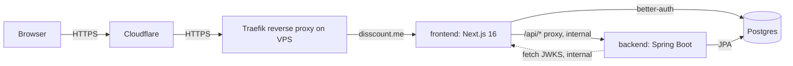
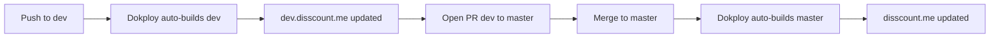
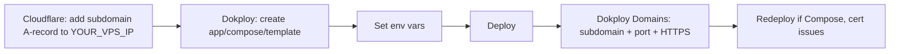

# Disscount: Infrastructure & Deployment Guide

A complete reference for how Disscount is hosted, deployed, secured, backed up, and monitored, written to be understandable even if you're new to this. Keep it up to date as the setup changes.

*Last verified end-to-end on 2026-06-28: prod + dev healthy, redirects and certs valid, backups in place.*

> **Mental model in one sentence:** a single Hetzner server runs **Dokploy** (a self-hosted Heroku/Vercel alternative), which builds our app from GitHub into Docker containers and exposes them to the internet through **Traefik** (a reverse proxy that also gets free HTTPS certificates), while **Cloudflare** sits in front for DNS, CDN, and DDoS protection.

---

## Table of contents
1. [Quick reference](#1-quick-reference)
2. [Architecture](#2-architecture)
3. [Accounts & services](#3-accounts--services)
4. [How a deploy works (git to live)](#4-how-a-deploy-works-git-to-live)
5. [Environment variables (the #1 gotcha)](#5-environment-variables-the-1-gotcha)
6. [Domains, DNS & HTTPS](#6-domains-dns--https)
7. [Security & networking](#7-security--networking)
8. [Backups & restore](#8-backups--restore)
9. [Monitoring & alerts](#9-monitoring--alerts)
10. [What's automatic vs manual](#10-whats-automatic-vs-manual)
11. [Common operations (how-to)](#11-common-operations-how-to)
12. [Deploying ANOTHER app on this VPS (Umami, cijene-api, etc.)](#12-deploying-another-app-on-this-vps)
13. [Gotchas & lessons learned](#13-gotchas--lessons-learned)
14. [Future improvements & TODOs](#14-future-improvements--todos)

---

## 1. Quick reference

| Thing | Value |
|---|---|
| Production site | `https://disscount.me` (aliases `www.` / `app.` 301-redirect to it) |
| Dev/staging site | `https://dev.disscount.me` |
| Dokploy panel | `https://dokploy.disscount.me` |
| VPS | Hetzner **CX33** (4 vCPU / 8 GB / 80 GB), Ubuntu, Helsinki, IP **YOUR_VPS_IP** |
| SSH | `ssh YOUR_USER@YOUR_VPS_IP` (key-only; root + password login disabled) |
| Repo | `OffCrazyFreak/Disscount` (**public**), prod from `master`, dev from `dev` |
| Cost | ~**€10.61/mo** VPS (fixed) + free tiers (Cloudflare, R2, Sentry, UptimeRobot, Resend) |

**Daily workflow:** push to `dev`, test on `dev.disscount.me`, open PR `dev` to `master`, merge, production auto-deploys.

> 🔒 *This doc lives in a **public** repo, so the server IP and SSH user are shown as `YOUR_VPS_IP` / `YOUR_USER` placeholders. Keep the real values in your password manager, never commit them here.*

---

## 2. Architecture

Three containers per environment, on a private Docker network. **Only the frontend is exposed:** the browser talks to the frontend, which proxies API calls to the backend internally. The backend and database are never reachable from the internet.



| Service | Tech | Internal address | Public? | Role |
|---|---|---|---|---|
| `frontend` | Next.js 16 (standalone) | `frontend:3000` | **yes** (via Traefik) | UI + **better-auth** identity provider; proxies `/api/*` to backend |
| `backend` | Spring Boot 3.1 / Java 21 | `backend:8080` | no | REST API; validates better-auth JWTs (resource server) |
| `db` | Postgres 17 | `db:5432` | no | one shared database, used by both |
| `migrate` | (frontend build image) | n/a | no | one-shot: runs drizzle auth-table migrations on deploy, then exits |

**Why the backend isn't public:** the browser only ever calls `https://disscount.me/api/...` (relative URLs). Next.js `rewrites()` forwards those to `backend:8080` *server-side*, inside the Docker network. This means no CORS config is needed and the backend/DB have no internet-facing attack surface.

**Auth flow:** better-auth (in the frontend) mints **ES256 JWTs**. The backend trusts them by fetching the public keys (**JWKS**) from `frontend:3000/api/auth/jwks` and checking the token issuer equals `https://disscount.me`.

**Compose files:**
- `docker-compose.yml`: **local development** (publishes ports to localhost, named container names).
- `docker-compose.prod.yml`: **Dokploy** (no host ports, joins the external `dokploy-network`, no `container_name`, and Traefik handles routing). This is the file Dokploy deploys.

---

## 3. Accounts & services

| Service | What it's for | Where / notes |
|---|---|---|
| **Hetzner** | The VPS (server) | Cloud console, plus it hosts the **Cloud Firewall** `disscount-web` |
| **Dokploy** | Deployment platform (on the VPS) | `https://dokploy.disscount.me`; admin login = your email |
| **Cloudflare** | DNS, CDN, DDoS, redirects, SSL mode | zone `disscount.me` (free plan) |
| **GitHub** | Source code + auto-deploy trigger | `OffCrazyFreak/Disscount`; connected to Dokploy via a **GitHub App** |
| **Sentry** | Error tracking | projects `disscount-frontend` + `disscount-backend` (EU region) |
| **Cloudflare R2** | Off-site backup storage | bucket `disscount-backups` (S3-compatible) |
| **Resend** | Transactional email + Dokploy alert emails | domain `disscount.me` verified |
| **UptimeRobot** | Uptime monitoring | monitors `https://disscount.me/health` |
| **Google / Meta** | OAuth login providers | redirect URIs must include each live domain |

---

## 4. How a deploy works (git to live)



- **Autodeploy** is ON: pushing to a branch triggers Dokploy (via GitHub webhook) to **rebuild that environment on the VPS** (`pnpm install` + `next build --webpack` for the frontend, Maven for the backend). The frontend is pinned to **webpack on purpose** (see the [webpack gotcha](#13-gotchas--lessons-learned)); the Dockerfile runs `pnpm build`, so that flag flows into the production image.
- Builds run **on the server** (~2-4 min, uses CPU + the 4 GB swap). This is fine for now; see [TODOs](#14-future-improvements--todos) for moving builds to CI later.
- Each environment is **fully isolated:** its own containers **and its own database/volume**. Dev data never touches prod data.

> ⚠️ **After any deploy, hard-refresh the browser** (Ctrl/Cmd+Shift+R). Otherwise you may see Next.js `Failed to find Server Action ...`, which is just your old cached page hitting the new build.

---

## 5. Environment variables (the #1 gotcha)

There are **two kinds** of env vars, and mixing them up causes the most confusing bugs:

| Kind | Examples | When it's read | If you change it |
|---|---|---|---|
| **Build-time, baked** (`NEXT_PUBLIC_*`) | `NEXT_PUBLIC_APP_URL`, `NEXT_PUBLIC_GOOGLE_CLIENT_ID`, `NEXT_PUBLIC_SENTRY_DSN` | compiled **into the JS bundle** during `next build` | you **must REDEPLOY** (rebuild): editing the value alone does nothing |
| **Runtime, secret** | `DATABASE_URL`, `BETTER_AUTH_SECRET`, `GOOGLE_CLIENT_SECRET`, `RESEND_API_KEY`, `SENTRY_DSN`, etc. | read by the server **when it starts/handles requests** | takes effect on the next container restart |

- **Where they're set:** in **Dokploy, your service, Environment** (one set per environment). The local `.env` / `example.env` files are only for local dev.
- **Production vs dev difference:** prod uses `https://disscount.me`, dev uses `https://dev.disscount.me` for `BETTER_AUTH_URL` / `NEXT_PUBLIC_APP_URL` / `BETTER_AUTH_ISSUER`; each has its **own** strong `POSTGRES_PASSWORD` + `BETTER_AUTH_SECRET`.
- **Internal URLs stay the same** in every environment (they're Docker service names): `NEXT_PUBLIC_API_URL=http://backend:8080`, `BETTER_AUTH_JWKS_URI=http://frontend:3000/api/auth/jwks`, `...@db:5432/disscount`.

> 🔑 **Real bug we hit:** `auth.ts` reads `NEXT_PUBLIC_GOOGLE_CLIENT_ID` via `requireEnv(...)` (a *dynamic* lookup), so Next.js can't inline it, so it must also be present at **runtime**, not just as a build arg. All `NEXT_PUBLIC_*` are passed both as build args **and** runtime env in compose.

---

## 6. Domains, DNS & HTTPS

**DNS lives in Cloudflare.** Records pointing at the VPS:

| Record | Type | Value | Cloudflare proxy | Purpose |
|---|---|---|---|---|
| `disscount.me` | A | `YOUR_VPS_IP` | 🟠 Proxied | production app |
| `www` / `app` | A | `YOUR_VPS_IP` | 🟠 Proxied | aliases, **301 redirect** to apex (Redirect Rules) |
| `dev` | A | `YOUR_VPS_IP` | 🟠 Proxied | staging |
| `dokploy` | A | `YOUR_VPS_IP` | 🟠 Proxied | Dokploy admin panel |
| MX / TXT (`_domainkey`, SPF, etc.) | n/a | Cloudflare/Resend | n/a | **email, leave untouched** |

**Two SSL layers** (this confuses people):
- **Browser to Cloudflare:** Cloudflare's edge cert. **All public domains are now Proxied (orange):** prod, `www`/`app`, `dev`, and the Dokploy panel, so everything goes through Cloudflare (IP hidden + CDN/DDoS).
- **Cloudflare to VPS (origin):** Traefik's **Let's Encrypt** cert. Cloudflare SSL mode = **Full (strict)**, which means Cloudflare verifies the origin's real cert.
- **Cert renewal (~every 60 days):** Traefik renews via an HTTP-01 challenge, which still works *through* Cloudflare. If a renewal ever fails (you'd see a cert-expiry warning), flip that record to **DNS-only** for a few minutes so it renews, then re-proxy. (Bulletproof alternative: Cloudflare **DNS-01** challenge in Traefik, see [TODOs](#14-future-improvements--todos).)

> 💡 **Why grey-cloud first for new certs:** Let's Encrypt validates by hitting the domain on port 80. Set a new subdomain to **DNS only** so the challenge reaches the VPS, let the cert issue, *then* optionally flip it to Proxied + Full(strict).

**Adding a domain to a service:** done in **Dokploy, service, Domains** (Host + Service + Container Port + HTTPS/Let's Encrypt). ⚠️ For **Compose** services you must **redeploy once** afterward so the Traefik routing labels actually attach to the container.

**HTTP to HTTPS** redirect is automatic (Cloudflare). No config needed.

---

## 7. Security & networking

**Defense in layers** (important: **Docker bypasses UFW** for published ports, so the *Hetzner Cloud Firewall* is the authoritative network filter):

| Layer | What it does |
|---|---|
| **Hetzner Cloud Firewall** (`disscount-web`) | Network-level; allows **only inbound TCP 22 / 80 / 443** (+ ICMP). This is what actually keeps the Dokploy panel port (3000) and backend (8080) off the internet. |
| **UFW** (on the VM) | Same 22/80/443 allow-list as a second layer (note: Docker can punch through UFW, hence the Hetzner firewall above). |
| **fail2ban** | Bans IPs after repeated failed SSH logins. |
| **SSH hardening** | Key-only auth; **root login + password login disabled**. Login as your non-root **sudo user**. |
| **unattended-upgrades** | Automatic OS security updates. |
| **Cloudflare proxy** | Hides the origin IP + DDoS protection for proxied records. |

Other: **4 GB swap** for build headroom; the Dokploy admin panel is reachable only via its HTTPS domain (login-protected), not the raw `:3000` port.

---

## 8. Backups & restore

**Three automated backups:** the app's Postgres database (off-site + local), plus Dokploy's own config.

| Copy | How | Schedule | Retention | Where |
|---|---|---|---|---|
| **App DB, off-site** | Dokploy **Backups** tab (`pg_dump` to S3) | nightly 03:00 | keep 30 | Cloudflare R2 bucket `disscount-backups`, prefix `disscount-prod/` |
| **App DB, local** | Dokploy **global Schedule** (`/dashboard/schedules`, "Server" script type) | nightly 02:00 | 7 days | `/etc/dokploy/backups/disscount` on the VPS |
| **Dokploy config** | Dokploy **Web Server Backups** (its internal DB + `/etc/dokploy`) | daily 04:00 | keep 7 | Cloudflare R2, prefix `dokploy/` |

- The app DB dumps use the consistent logical dump `pg_dump -Fc --no-acl --no-owner ... | gzip` (no downtime).
- **Why back up Dokploy too:** the app DB alone cannot rebuild your *setup*. The **Web Server backup** captures Dokploy's internal database (projects, services, domains, env vars, schedules) plus `/etc/dokploy`, so if the VPS dies you reinstall Dokploy and restore all of it. Restore from **Web Server, Backups**.
- **R2 lifecycle backstops:** two R2 rules cap storage and cost even if Dokploy's own pruning ever fails. `Clear old db backups` deletes `disscount-prod/` objects after 60 days, and `Clear old dokploy backups` deletes `dokploy/` objects after 15 days. Each is set longer than its Dokploy keep-count, so it only ever removes stragglers, never a backup Dokploy still wants.
- **Alerts:** Dokploy, Settings, Notifications (Resend) emails you on **deploy failures**. Per-backup notifications are intentionally **off** (Dokploy fires one on *every* backup = daily spam), see [Monitoring](#9-monitoring--alerts) for how to catch a *failed* backup instead.
- ✅ **Restore-tested:** confirmed a dump restores cleanly (all tables + rows) into a throwaway container.

> ⚠️ Do **NOT** use Dokploy **Volume Backups** for Postgres: copying the live data volume risks a corrupt backup (it'd need to stop the DB). The `pg_dump` approach above is the correct one.

### How to restore (disaster recovery)

**Option 1, via the Dokploy dashboard (easiest):** Dokploy, the service, **Backups** tab, pick a backup, **Restore**. Dokploy pulls the dump from R2 and restores it into the database. ⚠️ It **overwrites** the target database, so for a drill, restore into a non-prod target first.

**Option 2, manual (full control; also how you'd use the local copies):**
```bash
# get a dump: from R2 (Cloudflare dashboard) or the local copies on the VPS:
ls /etc/dokploy/backups/disscount/        # local copies

# restore into a target Postgres (example: a throwaway test container)
docker run -d --name pg-test -e POSTGRES_PASSWORD=test -e POSTGRES_DB=restoretest postgres:17-alpine
gunzip < <dump>.sql.gz | docker exec -i pg-test pg_restore -U postgres -d restoretest --no-owner --no-acl
docker exec pg-test psql -U postgres -d restoretest -c '\dt'   # verify

# To restore into PROD, target the prod db container instead (⚠️ overwrites data, be sure).
```

---

## 9. Monitoring & alerts

| Tool | Watches | Alerts via |
|---|---|---|
| **UptimeRobot** | `https://disscount.me/health` every 5 min | email if down |
| **Sentry** | runtime errors (frontend + backend) | Sentry dashboard / email |
| **Dokploy Notifications** | deploy failures (`App Build Error`) | Resend email |

- `/health` (frontend) is a lightweight liveness route; the backend also has `/actuator/health` (internal only, used by the container healthcheck).
- Sentry `send-default-pii=false` (privacy). Source-map upload is **not** enabled yet (see TODOs).

### Sentry env vars (production)

Set in **Dokploy → service → Environment**, per environment. Both DSNs live in Sentry under **Project → Settings → Client Keys (DSN)**.

| Var | Service | Kind | Value (prod) | Notes |
|---|---|---|---|---|
| `SENTRY_DSN` | backend | runtime | DSN of the `disscount-backend` project | **Empty/missing = SDK silently disabled** (`sentry.dsn=${SENTRY_DSN:}` in `application.properties`), so a forgotten var means zero events with no error anywhere. Takes effect on container **restart**. |
| `SENTRY_ENVIRONMENT` | backend | runtime | `production` (dev env: `dev`) | Defaults to `local` when unset; drives the environment filter in the Sentry UI. |
| `SENTRY_DEBUG` | backend | runtime | `false` | Defaults to `false` (`sentry.debug=${SENTRY_DEBUG:false}` in `application.properties`). Set `true` only to confirm the SDK is initialising (see the verification bullet below), then set it back: it logs on every event. Takes effect on container **restart**. |
| `NEXT_PUBLIC_SENTRY_DSN` | frontend | build-time, baked | DSN of the `disscount-frontend` project | Public by design (ships in the JS bundle). Changing it requires a **redeploy**, not a restart. |
| `SENTRY_AUTH_TOKEN` | frontend build | build-time | org auth token | Only for source-map upload; stored but **not wired into the build yet** (see TODOs). Secret - never commit. |

- Backend tracing is sampled at **10%** (`sentry.traces-sample-rate=0.1` in `application.properties`), so the `disscount-backend` project should show transactions under any real traffic. **A project showing 0 transactions + 0 issues for days almost always means the DSN env var isn't reaching the container** - check Dokploy env, then restart the backend.
- Quick verification: temporarily set `SENTRY_DEBUG=true` on the backend and check the container logs for the SDK init lines, or trigger any 5xx and watch the project's Issues feed.
- The project's **Client Security → Allowed Domains** setting only restricts *browser* SDKs (`Origin`/`Referer` headers); it never blocks the backend SDK.
- **Per-backup notifications are intentionally OFF** (Dokploy fires one on *every* backup = daily spam). Trade-off: no automatic alert if a backup **fails**. Catch it by glancing at the R2 bucket for a fresh nightly object, or add a **dead-man's switch** (e.g. healthchecks.io, where the backup pings a URL on success and no ping in 24 h triggers an alert). See [TODOs](#14-future-improvements--todos).

---

## 10. What's automatic vs manual

| Task | Automatic? | Notes |
|---|---|---|
| Build & deploy on `git push` | ✅ auto | Dokploy autodeploy (per branch) |
| HTTPS certificate issuance + renewal | ✅ auto | Traefik + Let's Encrypt |
| HTTP to HTTPS redirect | ✅ auto | Cloudflare |
| DB migrations (auth tables + app tables) | ✅ auto | `migrate` service (drizzle) + Hibernate `ddl-auto=update` on each deploy |
| Nightly DB backups (R2 + local) + rotation | ✅ auto | Dokploy Backups + Schedule |
| OS security updates | ✅ auto | unattended-upgrades |
| Uptime checks | ✅ auto | UptimeRobot |
| **Adding/Changing a `NEXT_PUBLIC_*` var** | ❌ manual | edit in Dokploy env **+ redeploy** |
| **Adding a new domain/subdomain** | ❌ manual | Cloudflare DNS + Dokploy Domains (+ redeploy for Compose) |
| **New OAuth provider redirect URIs** | ❌ manual | add in Google/Meta consoles |
| **Hard-refresh after deploy** | ❌ manual | avoids stale-bundle errors |
| **Restoring a backup** | ❌ manual | see [§8](#8-backups--restore) |
| **Rotating secrets / tokens** | ❌ manual | as needed |

---

## 11. Common operations (how-to)

| I want to | Do this |
|---|---|
| **Deploy a change** | push to `dev` (test), PR `dev` to `master`, merge (autodeploys) |
| **Force a redeploy** | Dokploy, service, **Redeploy** |
| **Roll back** | Dokploy, service, **Deployments**, redeploy a previous successful build (or revert the git commit and push) |
| **See logs** | Dokploy, service, **Logs**; or `ssh YOUR_USER@YOUR_VPS_IP` then `docker logs <container>` |
| **List containers** | `ssh YOUR_USER@YOUR_VPS_IP`, then `docker ps` |
| **Open a DB shell** | `docker exec -it <db-container> psql -U postgres -d disscount` |
| **Add a runtime secret** | Dokploy, service, Environment, add, redeploy |
| **Add a `NEXT_PUBLIC_*` var** | Environment, add, **redeploy** (it's baked), hard-refresh |
| **Reach the Dokploy panel** | `https://dokploy.disscount.me` |
| **Run a backup now** | Dokploy, Backups, Run, or the Schedule, Run |

### Disk management (don't let the VPS fill up)

Builds run on the VPS, so old images and build cache accumulate and can fill the 80 GB disk, a common cause of failed deploys on small servers. Safeguards:

- **Docker log rotation:** cap container log size in `/etc/docker/daemon.json` so logs cannot grow forever:
  ```json
  { "log-driver": "json-file", "log-opts": { "max-size": "10m", "max-file": "3" } }
  ```
  then `sudo systemctl restart docker` (restarts containers briefly).
- **Scheduled cleanup:** enable **Daily Docker Cleanup** (Dokploy, Settings, Web Server). It prunes stopped containers, unused images, dangling volumes, and build cache daily. Data-safe (in-use DB volumes are never pruned); the only cost is that build cache is cleared, so the next build is slower.

Inspect first, then prune (understand what each removes before running it):
```bash
docker system df       # what's using disk: images, containers, volumes, build cache
docker image prune     # remove dangling images (safe)
docker builder prune   # remove old build cache (safe; the next build is just slower)
```
⚠️ Do not blindly run aggressive prunes. `docker system prune -a` removes all unused images, and any `volume` prune can delete data. Read what a command removes before running it.

---

## 12. Deploying ANOTHER app on this VPS

You can host more apps on the same server (e.g. **Umami** analytics, a self-hosted **cijene-api**, etc.). The pattern is always the same:



**Step-by-step:**
1. **DNS** (Cloudflare): add `something.disscount.me`, A, `YOUR_VPS_IP`, **DNS only (grey)** first (so the cert can issue), proxy later if you want.
2. **Create the app in Dokploy:**
   - **Templates** (easiest): Dokploy has a one-click **Umami** template (and Plausible, etc.). Create, pick the template, it sets up the app + its DB.
   - **From a Docker image:** Create, Application, set the image + env.
   - **From a Git repo / compose:** like our app, point at the repo + compose file.
3. **Env:** set whatever the app needs (DB URL, secrets). Each app gets its own DB/volume.
4. **Deploy.**
5. **Domain:** Dokploy, the app, **Domains**, Host `something.disscount.me`, the app's container **port**, HTTPS **Let's Encrypt**. For Compose apps, **redeploy once** so labels attach.
6. **No firewall change needed:** it's served over 443 through Traefik, which is already open.

> **Important for any Compose app you write yourself** (Dokploy rules): don't set `container_name`, join the **external `dokploy-network`**, and don't publish host ports, so Dokploy's Domains feature can route it. (See `docker-compose.prod.yml` for a working example.)

> **Umami note:** it's free + self-hostable and has a Dokploy template, an ideal first extra app.
> **cijene-api note:** today the app *consumes* the hosted `https://api.cijene.dev` via env (`CIJENE_API_URL` / `CIJENE_API_TOKEN`); to self-host it, deploy its repo/compose as above and point `CIJENE_API_URL` at the new internal/subdomain URL.

---

## 13. Gotchas & lessons learned

These are the things that actually cost us time, worth remembering:

| Gotcha | What happened / fix |
|---|---|
| **`NEXT_PUBLIC_*` is baked at build** | Changing it in env does nothing until a **redeploy**. |
| **Hard-refresh after deploy** | Stale browser bundle causes `Failed to find Server Action`. Ctrl+Shift+R. A service-worker "update available" prompt (see [`PWA.md`](PWA.md) TODOs) would remove the need for this. |
| **Frontend builds with `--webpack`** | Next.js 16 defaults `next build` to **Turbopack**, but Serwist (the PWA service worker) and Sentry's webpack options need webpack, so the frontend `build` script is `next build --webpack`. Do **not** revert it to plain `next build`, the service worker silently stops being generated. See [`PWA.md`](PWA.md). |
| **Docker bypasses UFW** | Published container ports ignore UFW, so rely on the **Hetzner Cloud Firewall** to truly close ports. |
| **Dokploy domain needs a redeploy** | Adding a domain to a Compose service only applies the Traefik labels on the **next deploy**. |
| **kysely pin** | `@better-auth/kysely-adapter` imports a symbol removed in kysely 0.29, so we pin **`kysely@0.28.17`** (as a direct dep in `package.json`). |
| **pnpm overrides got stripped** | `overrides` in `pnpm-workspace.yaml` weren't honored, so the kysely pin is a direct dependency instead. |
| **Ubuntu 26.04 too new for Dokploy's pinned Docker** | Installed Docker manually (`get.docker.com`) first, then ran the Dokploy installer. |
| **Swarm needs `ADVERTISE_ADDR`** | The box has no private network, so installed Dokploy with `ADVERTISE_ADDR=YOUR_VPS_IP`. |
| **Two kinds of Schedules** | Per-service Schedules run **inside a container**; the global `/dashboard/schedules` "Server" type runs a **host script** (what we used for local backups). |
| **Volume Backups are not DB backups** | Use `pg_dump` (Backups tab), not Volume Backups, for Postgres. |

---

## 14. Future improvements & TODOs

**Security / housekeeping**
- [ ] **IP-filter the R2 API token** to the VPS egress IP (least privilege).
- [ ] **Before serious traffic:** add Cloudflare rate-limiting (free plan includes one rule) on the auth and API routes, then app-level rate limiting in Spring Boot. (Keep the exact endpoint list in a private note, not in this public doc.)

**Reliability / ops**
- [ ] **Hetzner snapshots** (whole-VM image) in addition to DB backups.
- [ ] Move builds to **GitHub Actions CI** (build image, push to registry, Dokploy pulls) to take build CPU off the VPS, especially once preview/dev deploys are frequent. (A `.github/workflows/ci.yml` quality gate already runs typecheck + lint + format on push; this item is specifically about moving the Docker *image build/deploy* off the VPS.)
- [ ] Consider **Flyway/Liquibase** instead of Hibernate `ddl-auto=update` for safer prod schema changes.
- [ ] **Cloudflare DNS-01 challenge** in Traefik (a Cloudflare API token) so certs renew without relying on inbound HTTP through the proxy, more robust now that all domains are proxied.
- [ ] **Backup-failure alerting** (dead-man's switch, e.g. healthchecks.io), since per-backup notifications are off to avoid spam.

**Product / auth**
- [ ] **Facebook public login**: complete **Meta Business Verification** (needs a registered entity, e.g. a Croatian *obrt*), then flip `FACEBOOK_COMING_SOON` to `false`. Until then Google + email cover login.
- [ ] **Sentry source-map upload** (readable prod stack traces): `SENTRY_AUTH_TOKEN` is already stored, wire it into the frontend build.

**Nice-to-have**
- [ ] Self-host **Umami** (Dokploy template) and/or **PostHog** later.
- [ ] Per-PR **preview deploys** (wildcard `*.preview.disscount.me`) on top of the existing dev environment.
- [ ] Point UptimeRobot at additional checks (e.g. an authenticated endpoint) for deeper monitoring.
