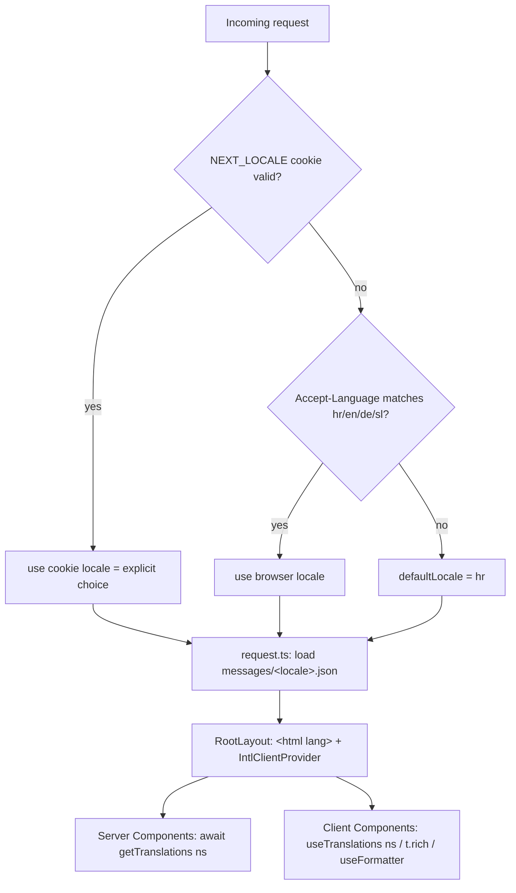
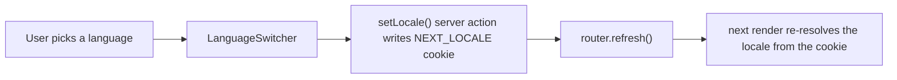
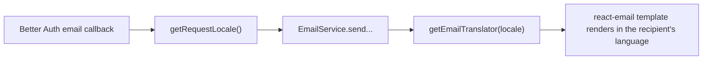

# Disscount: Internationalization (i18n) Guide

A complete reference for how Disscount is translated into multiple languages, written to be understandable even if you are new to i18n. Keep it up to date as the setup changes.

*Last verified on 2026-07-04: 652 keys in parity across hr/en/de/sl, `pnpm i18n:check` green, `pnpm exec tsc --noEmit` clean, `no-literal-string` clean.*

> **Mental model in one sentence:** every user-facing string is a **key** looked up at render time in a per-language JSON catalog; next-intl picks the language from a **cookie** (falling back to the browser's `Accept-Language`), so the URL never changes, and an ESLint rule plus a parity script make sure no string is ever hardcoded or left untranslated.

---

## Table of contents
1. [Quick reference](#1-quick-reference)
2. [How it works (end to end)](#2-how-it-works-end-to-end)
3. [Locale resolution & the language switcher](#3-locale-resolution--the-language-switcher)
4. [Message catalogs & namespaces](#4-message-catalogs--namespaces)
5. [Type safety, fallback & time zone](#5-type-safety-fallback--time-zone)
6. [Emails (localized separately)](#6-emails-localized-separately)
7. [Guardrails: the ESLint rule & parity script](#7-guardrails-the-eslint-rule--parity-script)
8. [Key files](#8-key-files)
9. [What's automatic vs manual](#9-whats-automatic-vs-manual)
10. [How to: add a language / add a string](#10-how-to-add-a-language--add-a-string)
11. [Language vs market (the two-axis design)](#11-language-vs-market-the-two-axis-design)
12. [Gotchas & lessons learned](#12-gotchas--lessons-learned)
13. [Files that had hardcoded Croatian (migration checklist)](#13-files-that-had-hardcoded-croatian-migration-checklist)
14. [Future improvements & TODOs](#14-future-improvements--todos)

---

## 1. Quick reference

| Thing | Value |
|---|---|
| Library | `next-intl` `^4.13.0` |
| Locales | `hr` (default) · `en` · `de` · `sl` |
| Strategy | Cookie-based, **no** URL routing (URLs stay `/products`, `/shopping-lists`) |
| Cookie | `NEXT_LOCALE` (1 year, `sameSite=lax`) |
| First-visit fallback | `Accept-Language` header, then `hr` |
| Catalog size | **652 keys** per locale, full parity (2,608 strings) |
| Catalogs | `frontend/src/i18n/messages/{hr,en,de,sl}.json` |
| Time zone | fixed `Europe/Zagreb` (avoids date hydration mismatches) |
| Type-safe keys | yes, via `frontend/src/typings/next-intl.d.ts` |
| Lint guard | `i18next/no-literal-string` (fails CI on hardcoded strings) |
| Parity check | `pnpm i18n:check` |
| New env vars | none |

**Daily workflow when adding text:** add the key to all four catalogs (`hr` is the reference), read it with `useTranslations` / `getTranslations`, then run `pnpm i18n:check` and `pnpm exec tsc --noEmit`.

---

## 2. How it works (end to end)

Nothing about the language lives in the URL. On every request, a small config function reads the locale, loads the matching catalog, and hands the messages to both Server and Client Components through a provider. Components never hold Croatian text; they hold keys.



The two ways to read a string:

- **Server Components** call `const t = await getTranslations("namespace")` from `next-intl/server`.
- **Client Components** call `const t = useTranslations("namespace")` from `next-intl`.

Both return a `t("key")` function. `t.rich("key", { tag: (chunks) => <El>{chunks}</El> })` renders embedded links or icons, and counts use ICU plurals (`{count, plural, one {...} few {...} other {...}}`) so Croatian and Slovenian plural rules are correct, not just singular/plural.

---

## 3. Locale resolution & the language switcher

`request.ts` resolves the active locale with a clear priority so an explicit choice always wins and a first-time visitor still gets a sensible default:

1. `NEXT_LOCALE` cookie (the user's explicit choice, written by the switcher).
2. `Accept-Language` header (the browser's preference), matched on the primary subtag so `de-AT` maps to `de`.
3. `defaultLocale` (`hr`).

The switcher is `frontend/src/components/custom/language-switcher.tsx`. It has two variants driven by a `variant` prop, so the language logic lives in one place:

| Variant | Where | Look |
|---|---|---|
| `icon` (default) | header (guests only) and footer (always) | icon button; icon goes muted to primary on hover, like the other header/footer icons |
| `sidebar` | mobile sidebar, above the PWA install banner | full-width sidebar row with a `Languages` icon and a translated "Language" label |

On mobile the header/footer switchers are hidden (`hidden md:flex`) and the sidebar one takes over (`md:hidden`), matching the convention already used for the dashboard and header-only items in the sidebar.

Selecting a language calls the `setLocale` server action (`frontend/src/i18n/locale-actions.ts`), which writes the `NEXT_LOCALE` cookie, then `router.refresh()` re-renders with the new locale. Because it is a refresh and not a navigation, the sidebar stays open.



The language names in the dropdown are **endonyms** (each language written in itself: Hrvatski, English, Deutsch, Slovenščina). These are intentionally not translated, which is the conventional way to list languages.

---

## 4. Message catalogs & namespaces

Catalogs live in `frontend/src/i18n/messages/<locale>.json` and are organized by feature namespace, mirroring the app's feature folders. `hr.json` is the reference: it defines the full set of keys and also drives the TypeScript types. The other three mirror its keys exactly.

Representative namespaces:

| Namespace | Covers |
|---|---|
| `common` | shared verbs and labels (save, cancel, add, search, loading), endonym helpers, placeholders |
| `metadata`, `pages.*` | root and per-page metadata, plus page content (products, watchlist, shopping-lists, statistics, dashboard, digital-cards, suggestions, updates, map, offline, notFound, resetPassword, ...) |
| `navigation` | sidebar and header nav labels, keyed by item `id` |
| `auth` (+ `auth.modal`, `auth.oauthErrors`, ...) | login/signup/forgot forms, auth modal, social-login errors |
| `userMenu`, `settings.*` | user menu and the preferences/profile/security modals |
| `productDetail`, `addToList`, `watchModal`, `scanner` | product page, both modals, camera scanner |
| `shoppingListDetail` (+ `.toasts`) | list detail, item rows, availability tables, mutation-hook toasts |
| `priceHistory`, `statistics` | charts, period buttons, chain stats |
| `accountTypes`, `acquisitionChannels` | constant label maps rendered via i18n |
| `offline`, `pwa` | offline banners, install prompts (rich text) |
| `validation` | Zod message strings |
| `emails` | transactional email copy (see section 6) |

Data-driven labels (navigation items, account types, acquisition channels) keep their `id` or enum value in the data file and are translated at render time by key, so the data files never store display strings.

---

## 5. Type safety, fallback & time zone

**Type-safe keys.** `frontend/src/typings/next-intl.d.ts` augments next-intl's `AppConfig` so `Messages` equals the shape of `hr.json`. That means `t("some.key")` is checked at compile time: a typo or a missing key is a TypeScript error, so `pnpm exec tsc --noEmit` passing is a strong guarantee that no key is dangling.

**Missing-key fallback.** `frontend/src/i18n/message-fallback.ts` provides `getMessageFallback`, which resolves a missing key from the default (`hr`) catalog instead of showing the raw `namespace.key` path, and `onIntlError`, which swallows the "missing message" error so it does not throw. These are wired on the server in `request.ts` and on the client through `intl-client-provider.tsx`. Parity is enforced (section 7), so this is a safety net, not an everyday path.

**Time zone.** `config.ts` exports a fixed `TIME_ZONE = "Europe/Zagreb"`, applied on the server config, the client provider, and the email translator. A fixed zone (rather than the server's own zone) guarantees the server-rendered HTML and the client's first render format dates identically, which prevents hydration mismatches. Without it, next-intl raises an `ENVIRONMENT_FALLBACK` warning as soon as anything formats a date.

**The client wrapper.** `getMessageFallback` and `onIntlError` are functions, and functions cannot be passed from a Server Component to a Client Component across the React boundary. That is why `intl-client-provider.tsx` is a small `"use client"` module: it imports those functions and hands them to `NextIntlClientProvider` from inside the client boundary.

---

## 6. Emails (localized separately)

Transactional emails (verification, password reset, set password, change-email confirmation) are rendered with react-email **outside** a normal request render, so they cannot use `getTranslations` (which is request-bound). Instead they use `getEmailTranslator(locale)` in `frontend/src/emails/email-translator.ts`, which builds a translator with next-intl's `createTranslator` over the `emails` namespace.

The recipient's locale is resolved at send time by `getRequestLocale()` (`frontend/src/i18n/get-request-locale.ts`), which reads the cookie or `Accept-Language` the same way `request.ts` does. `lib/auth.ts` calls it inside each Better Auth email callback and threads the locale through `EmailService` into the templates.



The templates keep their react-email `PreviewProps` (locale defaults to `hr`) so the `pnpm email` preview server still works.

---

## 7. Guardrails: the ESLint rule & parity script

Two checks make the translation coverage self-defending, so a regression fails CI instead of shipping.

**`i18next/no-literal-string`** (from `eslint-plugin-i18next` `^6.1.5`, configured in `frontend/eslint.config.mjs`, run by `pnpm lint`). It fails on any hardcoded JSX text and on the user-visible attributes `placeholder`, `alt`, `title`, `aria-label`, and `label`. It is tuned to zero false positives with:

- `callees.exclude`: skip the key argument of translation and utility calls (`t`, `t*`, `nav.label`, `form.register`, `localeCompare`, and similar), so `t("key")` is not itself flagged.
- `words.exclude`: allow symbol/number-only text, hex color examples, and intentional proper names (Disscount, Jakov Jakovac, GitHub, LinkedIn, N/A).
- `ignores`: the shadcn `ui/` primitives, unused scaffolds (`sidebar-08/`, `shadcn-studio/`, the unused landing `sections/*`), and `emails/` (localized separately).

Because the rule's `jsx-only` mode also flags string literals inside JSX expression containers, one tailwind class ternary in `store-chain-select.tsx` was hoisted into a module-level helper so its class names live in plain JS rather than JSX.

**`pnpm i18n:check`** (`frontend/scripts/check-i18n.mjs`). It flattens every catalog to dotted key paths and compares each locale against `hr`, printing any missing or extra keys and exiting non-zero on a mismatch. Suitable for CI.

`pnpm exec tsc --noEmit` is the third leg: it verifies every `t("key")` actually exists in the catalog shape.

---

## 8. Key files

| Path | Role |
|---|---|
| `frontend/src/i18n/config.ts` | single source of truth: `locales`, `defaultLocale`, `LOCALE_COOKIE`, `TIME_ZONE`, `isLocale`, `matchLocale` |
| `frontend/src/i18n/request.ts` | `getRequestConfig`: resolves the locale per request, loads the catalog, sets fallback + time zone |
| `frontend/src/i18n/locale-actions.ts` | `"use server"` `setLocale(locale)`: writes the `NEXT_LOCALE` cookie |
| `frontend/src/i18n/get-request-locale.ts` | server helper to resolve the locale outside a render (used by emails) |
| `frontend/src/i18n/message-fallback.ts` | `getMessageFallback` (falls back to `hr`) and `onIntlError` |
| `frontend/src/i18n/intl-client-provider.tsx` | `"use client"` wrapper adding fallback/onError/time zone to `NextIntlClientProvider` |
| `frontend/src/i18n/messages/{hr,en,de,sl}.json` | the message catalogs (`hr` is the reference) |
| `frontend/src/typings/next-intl.d.ts` | type augmentation for compile-time key checking |
| `frontend/src/hooks/use-nav-translation.ts` | translate nav items by `id` (`label` / `short`) |
| `frontend/src/components/custom/language-switcher.tsx` | the switcher (icon + sidebar variants) |
| `frontend/src/emails/email-translator.ts` | `getEmailTranslator`: a `createTranslator` bound to a locale for emails |
| `frontend/next.config.ts` | wires `createNextIntlPlugin("./src/i18n/request.ts")` |
| `frontend/src/app/layout.tsx` | dynamic `<html lang>`, `generateMetadata`, `IntlClientProvider` |
| `frontend/eslint.config.mjs` | `no-literal-string` rule configuration |
| `frontend/scripts/check-i18n.mjs` | catalog parity checker (`pnpm i18n:check`) |

---

## 9. What's automatic vs manual

| Automatic | Manual |
|---|---|
| Locale detection on first visit (Accept-Language) | Choosing a language (footer/sidebar switcher) |
| Loading the right catalog per request | Adding a new key to all four catalogs |
| Compile-time checking that every `t("key")` exists | Translating the value in `en` / `de` / `sl` |
| Failing CI on a hardcoded string (`no-literal-string`) | Fixing the flagged string by wrapping it in `t()` |
| Failing CI on a catalog mismatch (`i18n:check`) | Keeping the four catalogs in parity |
| Correct plural forms via ICU + `Intl.PluralRules` | Writing the ICU `{count, plural, ...}` message |
| Falling back to `hr` for a missing key | (nothing: this is a safety net) |
| Localized email language at send time | Adding new email copy to the `emails` namespace |

---

## 10. How to: add a language / add a string

**Add a new language (about 5 minutes).**

1. Add the code to `locales` in `frontend/src/i18n/config.ts` (for example `"it"`).
2. Add its endonym to `LANGUAGE_NAMES` in `language-switcher.tsx` (for example `it: "Italiano"`).
3. Create `frontend/src/i18n/messages/it.json` mirroring every key in `hr.json`.
4. Run `pnpm i18n:check` (must pass) and `pnpm exec tsc --noEmit`.

The switcher, provider, detection, and type-checking pick it up automatically. This is exactly how `sl` was added on top of `hr`/`en`/`de`.

**Add or change a user-facing string.**

1. Add the key to a suitable namespace in `hr.json`, then translate it in `en.json`, `de.json`, `sl.json`.
2. Read it in the component: `useTranslations` (client) or `getTranslations` (server). Use `t.rich` for embedded links/icons, ICU plurals for counts, and `useFormatter` for numbers/currency/dates.
3. Never hardcode the text: the ESLint rule will fail on it.
4. Run `pnpm i18n:check` and `pnpm exec tsc --noEmit`.

---

## 11. Language vs market (the two-axis design)

`docs/disscount_knowledge_base.md` section 19 specifies i18n as **two independent axes**, and only the first is implemented today:

```ts
language: 'hr' | 'en' | 'de' | 'sl'   // implemented (this subsystem)
market:   'HR' | 'AT' | 'SI'          // not implemented (future)
```

**Language** is what this document covers: the UI text the user reads. **Market** is which country's stores, price sources, currency, and retailer data are shown. They are independent, so combinations like "English language + Croatia market" or "Croatian language + Austria market" are intended.

When the market axis is built, it should be a **separate** setting (its own cookie/preference), not an overload of `NEXT_LOCALE`. The fixed `Europe/Zagreb` time zone can then derive from the market instead of being constant (all current markets HR/AT/SI happen to share CET).

---

## 12. Gotchas & lessons learned

| Trap | Fix |
|---|---|
| Reading the cookie / headers opts routes into dynamic rendering | Expected and unavoidable for cookie-based i18n without routing; not a bug |
| `no-literal-string` in `jsx-only` mode also flags `t("key")` arguments and className ternaries | Exclude translation/util callees via `callees.exclude`; hoist class ternaries into plain-JS helpers |
| `getMessageFallback` / `onError` cannot be passed from Server to Client Components (they are functions) | Wire them inside a `"use client"` module (`intl-client-provider.tsx`) |
| next-intl warns `ENVIRONMENT_FALLBACK` when a date is formatted with no time zone | Set a global `TIME_ZONE` on server config, client provider, and email translator |
| Emails render outside a request, so `getTranslations` is unavailable | Use `createTranslator` (via `getEmailTranslator`) with the locale resolved by `getRequestLocale` at send time |
| Croatian and Slovenian have three plural forms, not two | Use ICU `{count, plural, one {} few {} other {}}`, not a binary singular/plural helper |
| `pnpm exec tsc` sometimes runs a deps-status check that fails on ignored build scripts | Run `./node_modules/.bin/tsc --noEmit` directly if that happens |
| Endonyms look like untranslated strings | They are intentional (languages named in themselves); keep them out of the catalogs |
| Currency and dates still render the same in every locale | Known gap: `.toFixed(2)€` and the custom `formatDate` are not yet locale-aware (see TODOs) |
| Em dashes in copy | Never use em dashes anywhere, including catalog values |

---

## 13. Files that had hardcoded Croatian (migration checklist)

Every file below contained hardcoded user-facing Croatian and was migrated to `t()` / `t.rich()` in this branch. If the app is ever re-internationalized from scratch, use this as the checklist of files to re-verify. It does **not** include the i18n infrastructure files (catalogs, `config.ts`, `request.ts`, the provider, `next-intl.d.ts`, the switcher, `use-nav-translation.ts`), which are new rather than migrated.

Deliberately **not** migrated (intentional, so do not "fix" them): SEO keyword arrays in `layout.tsx`, `manifest.ts` and `navigation.ts` manifest labels, `constants/name-mappings.ts` (store/city proper nouns), mock content data (`updates/posts.ts`, `suggestions/suggestions.ts`), the `Slovenščina` endonym, and the deferred Zod messages in `lib/api/schemas/*` (see TODOs).

### Root, layout & legal
- [ ] `app/layout.tsx`
- [ ] `app/not-found.tsx`
- [ ] `app/(root)/page.tsx`
- [ ] `app/(root)/components/sections/hero-section.tsx`
- [ ] `app/(root)/components/sections/hero-actions.tsx`
- [ ] `app/privacy-policy/page.tsx`
- [ ] `app/terms-of-service/page.tsx`
- [ ] `app/data-deletion/page.tsx`
- [ ] `components/custom/legal-page.tsx`

### Header, footer, sidebar & shared UI
- [ ] `components/custom/header/header.tsx`
- [ ] `components/custom/header/user-menu.tsx`
- [ ] `components/custom/header/notifications-dropdown.tsx`
- [ ] `components/custom/footer.tsx`
- [ ] `components/custom/app-sidebar.tsx`
- [ ] `components/custom/search-bar.tsx`
- [ ] `components/custom/coming-soon.tsx`
- [ ] `components/custom/no-results.tsx`
- [ ] `components/custom/camera-scanner.tsx`
- [ ] `components/custom/view-switcher.tsx`
- [ ] `components/custom/price-history-period-select.tsx`
- [ ] `components/custom/store-chain-select.tsx`
- [ ] `components/custom/store-chain-multi-select.tsx`
- [ ] `components/custom/oauth-error-toast.tsx`
- [ ] `components/custom/offline/offline-indicator.tsx`
- [ ] `components/custom/offline/last-synced-label.tsx`
- [ ] `components/custom/pwa/install-banner.tsx`
- [ ] `components/custom/pwa/install-sidebar-banner.tsx`
- [ ] `components/custom/pwa/install-instructions-sheet.tsx`

### Auth (forms & modals)
- [ ] `components/custom/header/forms/auth-modal.tsx`
- [ ] `components/custom/header/forms/login-form.tsx`
- [ ] `components/custom/header/forms/signup-form.tsx`
- [ ] `components/custom/header/forms/forgot-password-form.tsx`
- [ ] `components/custom/header/forms/inbox-notice.tsx`
- [ ] `components/custom/header/forms/account-credentials-form.tsx`
- [ ] `components/custom/header/forms/linked-accounts.tsx`
- [ ] `components/custom/header/forms/profile-modal.tsx`
- [ ] `components/custom/header/forms/security-modal.tsx`
- [ ] `components/custom/header/forms/user-preferences-modal.tsx`
- [ ] `app/reset-password/page.tsx`
- [ ] `app/reset-password/reset-password-modal.tsx`

### Products & product detail
- [ ] `app/products/page.tsx`
- [ ] `app/products/components/products-client.tsx`
- [ ] `app/products/components/product-info-display.tsx`
- [ ] `app/products/components/product-info-table.tsx`
- [ ] `app/products/components/product-action-buttons.tsx`
- [ ] `app/products/components/watchlist-action-button.tsx`
- [ ] `app/products/components/product-item/product-info.tsx`
- [ ] `app/products/components/product-item/product-price.tsx`
- [ ] `app/products/components/forms/add-to-shopping-list-form.tsx`
- [ ] `app/products/components/forms/shopping-list-selector.tsx`
- [ ] `app/products/components/forms/quantity-input.tsx`
- [ ] `app/products/components/forms/mark-as-checked-checkbox.tsx`
- [ ] `app/products/components/forms/watchlist-item-modal.tsx`
- [ ] `app/products/[id]/page.tsx`
- [ ] `app/products/[id]/components/product-detail-client.tsx`
- [ ] `app/products/[id]/components/store-item/store-item.tsx`
- [ ] `app/products/[id]/components/store-item/store-prices-table.tsx`
- [ ] `app/products/[id]/components/price-history/price-history-base.tsx`
- [ ] `app/products/[id]/components/price-history/price-history-chart.tsx`

### Shopping lists
- [ ] `app/(user)/shopping-lists/page.tsx`
- [ ] `app/(user)/shopping-lists/components/shopping-lists-client.tsx`
- [ ] `app/(user)/shopping-lists/components/shopping-list-item.tsx`
- [ ] `app/(user)/shopping-lists/components/create-shopping-list-button.tsx`
- [ ] `app/(user)/shopping-lists/components/forms/shopping-list-modal.tsx`
- [ ] `app/(user)/shopping-lists/components/forms/delete-shopping-list-dialog.tsx`
- [ ] `app/(user)/shopping-lists/hooks/use-shopping-list-modal.ts`
- [ ] `app/(user)/shopping-lists/[id]/page.tsx`
- [ ] `app/(user)/shopping-lists/[id]/components/shopping-list-detail-client.tsx`
- [ ] `app/(user)/shopping-lists/[id]/components/shopping-list-header.tsx`
- [ ] `app/(user)/shopping-lists/[id]/components/shopping-list-info-table.tsx`
- [ ] `app/(user)/shopping-lists/[id]/components/shopping-list-action-buttons.tsx`
- [ ] `app/(user)/shopping-lists/[id]/components/shopping-list-price-history.tsx`
- [ ] `app/(user)/shopping-lists/[id]/components/items/shopping-list-items.tsx`
- [ ] `app/(user)/shopping-lists/[id]/components/items/shopping-list-item.tsx`
- [ ] `app/(user)/shopping-lists/[id]/components/stores/shopping-list-stores-list.tsx`
- [ ] `app/(user)/shopping-lists/[id]/components/stores/shopping-list-store-card.tsx`
- [ ] `app/(user)/shopping-lists/[id]/components/stores/shopping-list-items-table.tsx`
- [ ] `app/(user)/shopping-lists/[id]/hooks/use-shopping-list-mutations.ts`
- [ ] `app/(user)/shopping-lists/[id]/hooks/use-shopping-list-item-mutations.ts`

### Watchlist
- [ ] `app/(user)/watchlist/page.tsx`
- [ ] `app/(user)/watchlist/components/watchlist-client.tsx`
- [ ] `app/(user)/watchlist/components/watchlist-item.tsx`
- [ ] `app/(user)/watchlist/components/watchlist-item-discount-info.tsx`
- [ ] `app/(user)/watchlist/components/create-discounted-list-button.tsx`

### Digital cards
- [ ] `app/(user)/digital-cards/page.tsx`
- [ ] `app/(user)/digital-cards/components/digital-cards-client.tsx`
- [ ] `app/(user)/digital-cards/components/digital-card-item.tsx`
- [ ] `app/(user)/digital-cards/components/forms/digital-card-modal.tsx`

### Other pages
- [ ] `app/(user)/spending/page.tsx`
- [ ] `app/map/page.tsx`
- [ ] `app/map/components/map-client.tsx`
- [ ] `app/suggestions/page.tsx`
- [ ] `app/suggestions/components/suggestions-client.tsx`
- [ ] `app/suggestions/[id]/page.tsx`
- [ ] `app/suggestions/[id]/components/suggestion-details-client.tsx`
- [ ] `app/updates/page.tsx`
- [ ] `app/updates/components/updates-client.tsx`
- [ ] `app/updates/[id]/page.tsx`
- [ ] `app/offline/page.tsx`
- [ ] `app/offline/components/offline-retry-button.tsx`

### Dashboard & statistics
- [ ] `app/dashboard/page.tsx`
- [ ] `app/dashboard/components/dashboard-content.tsx`
- [ ] `app/dashboard/components/admin-users-table.tsx`
- [ ] `app/statistics/page.tsx`
- [ ] `app/statistics/components/health-status.tsx`
- [ ] `app/statistics/components/store-item.tsx`
- [ ] `app/statistics/components/stores-list.tsx`

### Emails & their wiring
- [ ] `emails/verification-email.tsx`
- [ ] `emails/password-reset-email.tsx`
- [ ] `emails/set-password-email.tsx`
- [ ] `emails/change-email-confirmation.tsx`
- [ ] `emails/components/action-email.tsx`
- [ ] `emails/components/email-layout.tsx`
- [ ] `lib/email/email-service.ts`
- [ ] `lib/auth.ts`

---

## 14. Future improvements & TODOs

- **Locale-aware currency, number, and date formatting.** The knowledge base section 19 explicitly requires this, and it is the largest remaining gap. Prices still render as `.toFixed(2)€` and dates via a custom `formatDate`, so a German user sees Croatian-style numbers. Replace with `useFormatter().number(v, { style: "currency", currency: "EUR" })` and `format.dateTime(...)`, ideally behind one shared helper reused everywhere.
- **Market / country axis.** Implement `market: 'HR' | 'AT' | 'SI'` as a separate setting (see section 11), which controls stores, price sources, and currency independently of language.
- **Zod validation messages in `lib/api/schemas/*`.** These schemas are double-duty (form validation and API-response parsing via the `@/lib/api/types` barrel), so translating them cleanly needs a message-object factory plus passthrough static instances for the DTO schemas. The `validation` namespace keys are already in the catalogs; only the form-only inline schemas (forgot-password, reset-password) are translated so far.
- **Persist the locale to the user profile.** Today the cookie is the source of truth, so a logged-in user on a new device gets detection or the default. A `language` field via better-auth `additionalFields`, synced on login, would make the preference follow the account.
- **Native review of `de` and `sl`.** Current German and Slovenian are solid machine-quality; a native pass (or a TMS like Tolgee/Crowdin/Lokalise if this grows) is the professional next step.
- **Backend-generated content.** Product labels/categories (from the cijene API) and notification content are not covered by frontend i18n; localizing them is a backend concern.
- **SEO in other languages.** Cookie-based i18n means search engines only index the default (`hr`). If ranking `en`/`de`/`sl` content matters later, that requires URL-based routing plus `hreflang` tags and per-locale sitemaps, a deliberate trade-off away from the current simplicity.
- **Update the stale docs.** `disscount_technical_documentation.md` and `disscount_state_of_reality.md` still describe the app as "Croatian only / i18n not wired"; refresh them now that this subsystem is live.
