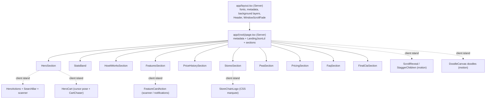

# Landing page

The landing page is the public marketing home of Disscount, served at `/` to logged-out and logged-in visitors alike. It explains what the app does (grocery price comparison across Croatian retail chains), shows the live and upcoming features, and funnels people into the product (search, scan, sign up). It is built to be fully server-rendered for SEO, in hardcoded Croatian, with small client-side islands only where interactivity is genuinely needed.

This document covers how the page is composed, the server-vs-client rendering model, the shared visual primitives (fades, glows, doodles), the data that drives the copy, the SEO plumbing, the fonts, and the traps that will bite you if you touch it.

## What it is, end to end

The route lives in the `(root)` route group, which adds no URL segment, so `app/(root)/page.tsx` is the page for `/`. It is a React Server Component: it renders a `metadata` export and a single stack of section components separated by vertical spacing. Every section is itself a Server Component; the only client-side code runs inside small nested islands (animation wrappers, the search bar, the barcode scanner trigger, etc.).

The trick that keeps the page SEO-friendly while still animated is that all text lives in Server Components and is passed as `children` into client animation wrappers. React streams that server-rendered text through the client boundary as part of the RSC payload, so crawlers see the real copy in the initial HTML even though a client component wraps it.

## Sections, in order

`page.tsx` renders these sections top to bottom inside a `space-y-14 sm:space-y-20 pb-16` wrapper. Each has its own file under `app/(root)/components/sections/`.

| #   | Section       | File                        | Purpose                                                  | Client islands inside                                       |
| --- | ------------- | --------------------------- | -------------------------------------------------------- | ----------------------------------------------------------- |
| 1   | Hero          | `hero-section.tsx`          | Logo, wordmark, rotating tagline, search + scan card     | `HeroActions`, `HeroTagline`, `HeroCart`, `StaggerChildren` |
| 2   | Stats band    | `stats-band.tsx`            | Green band with real numbers (29 lanaca, 100% besplatno) | `ScrollReveal`                                              |
| 3   | How it works  | `how-it-works-section.tsx`  | Three steps with animated doodles                        | `ScrollReveal`, doodles                                     |
| 4   | Features      | `features-section.tsx`      | Grid of feature cards, live and USKORO                   | `ScrollReveal`, `FeatureCardAction`                         |
| 5   | Price history | `price-history-section.tsx` | "Is the discount real?" with a chart doodle              | `ScrollReveal`, `PriceLineDoodle`                           |
| 6   | Stores        | `stores-section.tsx`        | Marquee of 29 real chain logos, link to discounts        | `StoresMarquee`                                             |
| 7   | PWA           | `pwa-section.tsx`           | Install + offline perks, phone + desktop screenshots     | `ScrollReveal`                                              |
| 8   | Pricing       | `pricing-section.tsx`       | Two receipt cards (free + premium USKORO)                | `ScrollReveal`                                              |
| 9   | FAQ           | `faq-section.tsx`           | Native `
` accordion, `FAQPage` schema source    | `ScrollReveal`                                              |
| 10  | Final CTA     | `final-cta-section.tsx`     | Green block, two CTA buttons                             | `ScrollReveal`                                              |

`SectionHeading` (`section-heading.tsx`) is the shared title + subtitle block used by the How it works, Features, Stores, Pricing, and FAQ sections. It also carries the white `TextGlow` behind the heading, so adding the glow in one place covers every heading. The Stats band and the Final CTA style their own headings instead, and the Stats band's `<h2>` is `sr-only` (visually the numbers are the heading), which keeps the one-`<h2>`-per-section rule intact for crawlers.

## Server vs client rendering model

The rule is: sections are Server Components, and interactivity is pushed into the smallest possible client leaf. Text is never trapped inside a client component; it is always passed as `children` so it stays in the server-rendered HTML.

| Concern                      | Where it runs                              | Why                                             |
| ---------------------------- | ------------------------------------------ | ----------------------------------------------- |
| Section layout and copy      | Server                                     | SEO; the whole page must be in the initial HTML |
| Scroll-in reveals            | Client (`ScrollReveal`, `StaggerChildren`) | Needs `whileInView` from the `motion` library   |
| Hand-drawn doodle animations | Client (`DoodleCanvas` + doodles)          | Needs `motion` path-draw                        |
| Search + scan in the hero    | Client (`HeroActions`)                     | Uses router, react-hook-form, camera scanner    |
| Cursor-aware hero cart       | Client (`HeroCart`, `CartChaser`)          | Pointer tracking, motion springs, body portal   |
| Feature card actions         | Client (`FeatureCardAction`)               | Opens scanner / notifications; router           |
| Store logo marquee           | Client leaf (`StoreChainLogo`)             | Image error fallback uses `useState`            |
| Bottom page fade             | Client (`WindowScrollFade`)                | Reads window scroll                             |

The key pattern for feature cards: `FeatureCard` stays a Server Component and renders the Lucide icon server-side. When a card needs a client action (scanner or notifications), it wraps its already-rendered content in `FeatureCardAction`, a client component that receives only serializable props (`action` string, `className`) plus the server-rendered `children`. The icon function is never handed across the boundary. See the RSC gotcha below for what happens if you break this.

## Interactivity and actions

Feature cards can navigate or trigger a client action. The behaviour is data-driven from `features.ts`:

| Field on a feature        | Effect                                                                 | Rendered as                    |
| ------------------------- | ---------------------------------------------------------------------- | ------------------------------ |
| `href`                    | Navigate to a page                                                     | `<Link>` (server)              |
| `action: "scanner"`       | Open the camera scanner, then go to the scanned product                | `<FeatureCardAction>` (client) |
| `action: "notifications"` | Open the header notifications dropdown (or the login modal if a guest) | `<FeatureCardAction>` (client) |
| none                      | Not clickable                                                          | plain `
`                  |

Coming-soon cards keep their `href` commented out in `features.ts` so they render as non-clickable divs today; uncommenting the line turns them into working links the moment their page ships.

The notifications action needs the header dropdown to open from elsewhere on the page, so the dropdown's open state was lifted into the notifications context: `INotificationsContext` exposes `isMenuOpen` and `setMenuOpen`, `useWatchlistNotifications` owns the `useState`, and `NotificationsDropdown` is now controlled by that shared state. `FeatureCardAction` calls `setMenuOpen(true)` for a logged-in user, or opens the login modal (`openModalUrl({ name: "login" })`) for a guest, because the dropdown only mounts when authenticated.

Store logos in the marquee are `<Link>`s to `/products?chain=<chain>`, matching the exact URL param the products page and the sidebar filter already use. The duplicated (aria-hidden) marquee row uses `tabIndex={-1}` so keyboard users do not tab through the logos twice.

## The cursor-aware hero cart

The hero `CartLogo` behaves like a small pet on desktop: it watches the cursor, and once you scroll it jumps out of the hero and chases it. `HeroCart` (`sections/hero-cart.tsx`) is the client island that replaced the bare `CartLogo` in `hero-section.tsx`; because client components still SSR their HTML, the SVG stays in the initial payload and the section itself remains a Server Component.

Everything is gated by `interactive = useFinePointer() && !useReducedMotionSafe()`. `useFinePointer` (shared, `hooks/use-fine-pointer.ts`) is a `useSyncExternalStore` matchMedia hook on `(hover: hover) and (pointer: fine)` with a `false` server snapshot, so touch devices, reduced-motion users, the server render, and the first client render all get the plain static cart with no hydration mismatch.

Three behaviours, in escalating order:

| Behaviour   | Where                                              | What happens                                                                                       |
| ----------- | -------------------------------------------------- | -------------------------------------------------------------------------------------------------- |
| Idle spin   | `HeroCart`                                         | A subtle full `rotateY` turn (with `transformPerspective`) every 10s, like the search button shine |
| Cursor pose | `use-cursor-pose.ts`                               | Flips (`scaleX`) toward the cursor's half of the viewport and tilts (`rotate`) up/down at it       |
| Chaser      | `doodles/cart-chaser.tsx` + `use-cursor-follow.ts` | After 10px of scroll the hero cart shrinks away and a mini cart trails the cursor                  |

The pose hook writes raw pointer-derived values into `useMotionValue`s that feed `useSpring`s, so the motion is fully fluid; routing it through React state would quantize it into visible steps. It stays neutral (and lets the idle spin run) while the cursor is over the hero copy: the copy block's vertical band, narrowed horizontally to the h1's rect, plus a 32px buffer, so the cart does not fidget while the visitor reads. Pointer listeners are window-level, passive, and rAF-throttled.

The chaser activates once `useScrolledPast(10)` trips. `useCursorFollow` `.jump()`s its springs to the hero cart's current center (so it visibly escapes from the hero), then lazily trails the pointer with a soft spring, always aiming `STOP_DISTANCE_PX` (64px) short of the cursor along the approach direction so it never sits under it. It re-orients on both pointer moves and its own position changes, flipping only outside a 12px horizontal deadzone so it does not flap on near-vertical approaches. Visually it is a `pointer-events-none aria-hidden` fixed element at `z-30` (under the FAB backdrop at `z-40` and the header/FAB at `z-50`), portaled to `document.body`, with a masked `backdrop-blur` disc plus a `TextGlow` behind the SVG so the green cart stays readable over the green stats band. Scrolling back to the top exits the chaser (`AnimatePresence`) and restores the hero cart.

`cursorTiltDeg` (`app/(root)/utils/cursor.ts`) holds the one non-obvious bit of math: with `scaleX(-1)` applied before `rotate(r)`, the rendered rotation is mirrored to `-r`, so tilt is computed as `atan2(dy, |dx|)`; the same value then aims the nose at the cursor under both facings. It clamps via the shared `clamp` in `utils/generic.ts`.

## Shared visual primitives

These generic, presentational components live in `components/custom/common/` (and `components/ui/`), and are reused across the landing (and elsewhere).

| Component          | File                            | What it does                                                           | Server/client |
| ------------------ | ------------------------------- | ---------------------------------------------------------------------- | ------------- |
| `EdgeFade`         | `common/edge-fade.tsx`          | Gradient overlay that fades content against one edge                   | Server        |
| `ScrollFade`       | `common/scroll-fade.tsx`        | Scroll-aware `EdgeFade` for an overflow container (sidebar, dropdowns) | Client        |
| `WindowScrollFade` | `common/window-scroll-fade.tsx` | Fixed bottom fade for the whole page; hides at the end of the document | Client        |
| `TextGlow`         | `common/text-glow.tsx`          | Soft white radial glow behind a text block                             | Server        |
| `ScrollReveal`     | `ui/scroll-reveal.tsx`          | Staggered scroll-in reveal (spring), reduced-motion safe               | Client        |
| `StaggerChildren`  | `ui/stagger-children.tsx`       | Staggered fade/rise of children on mount (hero)                        | Client        |
| `DoodleCanvas`     | `doodles/doodle-canvas.tsx`     | `motion.svg` shell whose child paths draw on when scrolled into view   | Client        |
| `SparkleField`     | `doodles/sparkle-field.tsx`     | Seeded scatter of twinkling sparkles                                   | Server        |

The doodles (`barcode`, `price-tag`, `cart`, `receipt`, `price-line`, `scale`) are hand-drawn SVGs built on `DoodleCanvas` with `drawVariants`, so their strokes draw themselves on scroll. `squiggle-underline` and `sparkle-doodle` are pure CSS-animated Server Components. `WindowScrollFade` is mounted once in `app/layout.tsx`, so every page gets a bottom fade that self-hides when there is nothing more to scroll.

`TextGlow` uses `radial-gradient(ellipse closest-side ...)` so the glow reaches full transparency exactly at the wrapper edges (no hard rectangular cut-off), plus a solid `spread` core so it reads strongly while still showing the dot pattern faintly through it. It must sit as the first child of a `relative isolate` wrapper; the `isolate` keeps its `-z-10` contained behind the section text instead of escaping behind the page background.

## Data files

Copy is centralised in `app/(root)/data/` so a non-developer can edit text without touching JSX.

| File               | Exports                                                                   | Used by                                         |
| ------------------ | ------------------------------------------------------------------------- | ----------------------------------------------- |
| `data/landing.ts`  | `tagLines`, `howItWorksSteps`, `statItems`, `freePlanRows`, `proPlanRows` | Hero tagline, How it works, Stats band, Pricing |
| `data/features.ts` | `featureItems` (title, description, icon, `comingSoon`, `href`, `action`) | Features grid                                   |
| `data/faq.ts`      | `faqItems` (question, answer)                                             | FAQ section and the `FAQPage` JSON-LD           |

Because `faqItems` feeds both the visible accordion and the structured data, the two can never drift apart.

## SEO

The landing is the app's most SEO-sensitive surface, so several layers work together.

| Layer                    | Where                                              | Notes                                                                                   |
| ------------------------ | -------------------------------------------------- | --------------------------------------------------------------------------------------- |
| Page title + description | `page.tsx` `metadata`                              | Title fills the `Disscount - %s` template from the layout; Croatian description         |
| Site-wide metadata       | `app/layout.tsx`                                   | `openGraph` (`hr_HR`), `twitter` (`summary_large_image`), keywords, robots index/follow |
| Structured data          | `components/json-ld.tsx`                           | One `<script type="application/ld+json">` with a `@graph`                               |
| Sitemap                  | `app/sitemap.ts`                                   | Public routes only; pulls `/updates/<id>` from `templatePosts`                          |
| Robots                   | `app/robots.ts`                                    | Allows `/`, disallows user/admin/auth routes; points at the sitemap                     |
| Social images            | `app/opengraph-image.tsx`, `app/twitter-image.tsx` | Generated with `next/og` (see the OG-image work)                                        |

The JSON-LD `@graph` contains a `WebSite` node with a `SearchAction` (`/products?q={search_term_string}`), an `Organization` node (logo, `sameAs` socials), a `SoftwareApplication` node (category `ShoppingApplication`, a free `Offer`, screenshots), and a `FAQPage` node built from `faqItems`. Heading semantics matter: the hero `<h1>` carries the keyword copy ("Pronađi najbolje cijene u Hrvatskoj"), the wordmark is a styled `
`, and each section contributes exactly one `<h2>`.

Temper FAQ expectations: since 2023 Google shows FAQ rich results almost exclusively for government and health sites. Keep the `FAQPage` schema anyway (it costs nothing, and other engines and LLMs consume it), just do not expect visible rich snippets from it.

The page is also fully static: neither `page.tsx` nor `app/layout.tsx` touches request-time APIs (`cookies()`, `headers()`, `searchParams`), so Next prerenders `/` to static HTML at build time. Crawlers and users get the finished page with zero server work per request. Keep it that way: adding a request-time API anywhere in the root layout would silently turn every page dynamic (the production build output marks static routes with a circle, dynamic with an f).

## Fonts

Two fonts are loaded through `next/font/local` in `app/fonts/index.ts`.

| Font                   | Variable               | Role                                                   | Note                                                                                                                                       |
| ---------------------- | ---------------------- | ------------------------------------------------------ | ------------------------------------------------------------------------------------------------------------------------------------------ |
| Huninn                 | `--font-huninn`        | Body font (`--font-sans`)                              | Self-hosted 28 KB latin + latin-ext subset; the full Google TTF is a 4.5 MB CJK font and `next/font/google` has no fallback metrics for it |
| Saira Stencil SemiBold | `--font-saira-stencil` | The "disscount" wordmark, stat numbers, big CTA titles | Applied via the `.font-saira-stencil-semibold` utility in `globals.css`                                                                    |

The latin-ext subset is what makes Croatian diacritics (č, ć, đ, š, ž) render; a plain latin subset would show tofu.

## Styling and animation

Landing animation is split between the `motion` library (scroll reveals, doodle path-draws) and pure CSS keyframes in `globals.css`.

| Keyframe / utility                | Used by                                                                                                                                                    |
| --------------------------------- | ---------------------------------------------------------------------------------------------------------------------------------------------------------- |
| `dis-draw`                        | `squiggle-underline` self-drawing stroke                                                                                                                   |
| `dis-twinkle`                     | `sparkle-doodle`                                                                                                                                           |
| `dis-marquee`                     | `stores-marquee` infinite scroll (pauses on `group/marquee` hover); each row's trailing `pr-*` must equal its `gap-*` so the loop seam stays evenly spaced |
| `dis-scanline`                    | `barcode-doodle` red scanline                                                                                                                              |
| `.faq-item` + `::details-content` | FAQ accordion open/close (`interpolate-size: allow-keywords`)                                                                                              |

Every CSS animation is disabled under `@media (prefers-reduced-motion: reduce)`, and the `motion`-based components use the hydration-safe `useReducedMotionSafe` hook so they render the static branch identically on the server and first client render.

## Automatic vs manual

| Thing                              | Automatic                                                        | Manual                                                    |
| ---------------------------------- | ---------------------------------------------------------------- | --------------------------------------------------------- |
| Metadata, JSON-LD, sitemap, robots | Regenerate from code on every build                              | Editing the copy/routes they list                         |
| FAQ structured data                | Built from `faqItems`                                            | Editing the questions/answers                             |
| Store logos grid                   | Derived from `storeNamesMap` keys + `/public/store-chains/*.png` | Adding a new chain (add the PNG + map entry)              |
| Feature grid                       | Rendered from `featureItems`                                     | Adding/reordering/retiring a feature                      |
| Coming-soon card links             | Render as non-clickable divs                                     | Uncomment the `href` in `features.ts` when the page ships |
| OG / social images                 | Rendered by the image routes                                     | Redesigning the artwork                                   |

## Key files

| Path                                                                                    | Role                                                      |
| --------------------------------------------------------------------------------------- | --------------------------------------------------------- |
| `app/(root)/page.tsx`                                                                   | Composes the sections, page metadata, JSON-LD             |
| `app/(root)/components/sections/*`                                                      | One file per section                                      |
| `app/(root)/components/sections/section-heading.tsx`                                    | Shared heading + `TextGlow`                               |
| `app/(root)/components/sections/feature-card.tsx`                                       | Server card; chooses `<Link>` / action / div              |
| `app/(root)/components/sections/feature-card-action.tsx`                                | Client action island (scanner / notifications)            |
| `app/(root)/components/sections/hero-cart.tsx`                                          | Client island: cursor-aware hero cart + mounts the chaser |
| `app/(root)/components/doodles/cart-chaser.tsx`                                         | Mini cart that trails the cursor after scroll             |
| `app/(root)/hooks/{use-cursor-pose,use-cursor-follow}.ts`                               | Pose (flip/tilt) and lazy-follow motion values            |
| `app/(root)/utils/cursor.ts`, `hooks/use-fine-pointer.ts`                               | Mirror-safe tilt math; desktop-pointer matchMedia hook    |
| `app/(root)/data/*`                                                                     | Copy: landing, features, faq                              |
| `app/(root)/components/doodles/*`                                                       | Hand-drawn animated SVGs + `DoodleCanvas`, `SparkleField` |
| `app/(root)/components/json-ld.tsx`                                                     | Structured data `@graph`                                  |
| `components/custom/common/{edge-fade,scroll-fade,window-scroll-fade,text-glow}.tsx`     | Shared fade/glow primitives                               |
| `components/ui/scroll-reveal.tsx`                                                       | Scroll-in reveal wrapper                                  |
| `app/{sitemap,robots}.ts`, `app/{opengraph,twitter}-image.tsx`                          | SEO plumbing                                              |
| `app/fonts/index.ts`                                                                    | Huninn + Saira Stencil                                    |
| `context/{notifications-context,notifications-types,use-watchlist-notifications}.ts(x)` | Lifted notifications open state                           |

## Config, env, and feature flags

| Name                            | Where                                    | Effect                                                       |
| ------------------------------- | ---------------------------------------- | ------------------------------------------------------------ |
| `NEXT_PUBLIC_APP_URL`           | JSON-LD, sitemap, robots, `metadataBase` | Absolute URLs for SEO; falls back to `http://localhost:3000` |
| `NEXT_PUBLIC_UMAMI_WEBSITE_ID`  | `app/layout.tsx`                         | Injects the privacy-friendly analytics script when set       |
| `NEXT_PUBLIC_ENABLE_REACT_SCAN` | `app/providers/react-scan.tsx`           | Turns on the render-profiling overlay; off by default        |

There are no landing-specific secrets. The page is Croatian-only and there is no i18n framework, so all copy is plain Croatian string literals.

## Libraries

Versions come from `frontend/package.json`.

| Library           | Version     | Use on the landing                                              |
| ----------------- | ----------- | --------------------------------------------------------------- |
| next              | `16.2.9`    | App Router, RSC, metadata, `next/font`, `next/og`, `next/image` |
| react / react-dom | `19.2.4`    | Server + client components                                      |
| motion            | `^12.23.26` | Scroll reveals, doodle path-draws, tagline cross-fade           |
| lucide-react      | `^0.561.0`  | Feature and perk icons                                          |
| tailwindcss       | `^4`        | Styling, CSS-first theme, keyframes                             |

## Gotchas

The RSC boundary is the big one. Passing a non-serializable value (a Lucide icon is a function/object) from a Server Component to a Client Component throws "Only plain objects can be passed to Client Components" and "Functions cannot be passed directly to Client Components". This happened when `FeatureCard` was briefly a Client Component receiving the whole `feature` (with its icon). The fix is the pattern above: keep sections and cards server-rendered, render the icon server-side, and pass only serializable props plus already-rendered `children` into the tiny client island.

The Tailwind spacing scale is rescaled. `globals.css` sets `--spacing: 0.2rem` (Tailwind's default is `0.25rem`), so every spacing/size utility is 0.8x: `w-64` is `205px`, not `256px`; `p-2.5` is `8px`. Any pixel math for positioning (the PWA screenshot overlap, marquee tile sizes) has to account for this. `max-w-*` uses a separate rem scale and is not affected.

`useReducedMotion` from `motion` reads `matchMedia` during hydration and can cause a server/client markup mismatch. Use `useReducedMotionSafe` (returns `false` until mounted) for anything that branches markup on reduced motion.

A `drop-shadow` filter on the same element as a `clip-path` gets clipped away, because the browser applies `filter` before `clip-path`. The pricing receipt's torn (zigzag) bottom needs its shadow on the outer wrapper, not on the clipped element, or the tear is invisible on the white card.

`Math.random()` at render time breaks SSR determinism (hydration mismatch). The sparkle scatter uses a seeded PRNG (`SparkleField`), and the hero tagline renders `tagLines[0]` deterministically on the server and only starts rotating after mount. Reduced-motion users skip the rotation but still get variety: the mount effect picks one random tagline per load instead (safe because it runs post-hydration).

Filled and outline buttons look different sizes when only the outline one has a border. Give the filled button a matching `border-2 border-transparent` so both share the same box model. This also fixes the submit-vs-outline size mismatch in modals.

Opening notifications from the landing only does something when authenticated, because `NotificationsDropdown` mounts only for logged-in users. Guests are sent to the login modal instead.

`TextGlow` and the section glows depend on their `relative isolate` wrapper. Without `isolate`, the `-z-10` glow can escape its section and render behind the page background layers.

CSS transform order mirrors rotation. With `scaleX(-1)` before `rotate(r)`, the element visually rotates by `-r`, so a tilt computed naively flips sign whenever the cart flips. Compute the tilt from `atan2(dy, |dx|)` (see `cursorTiltDeg`) and one value is correct for both facings.

`position: fixed` breaks inside a transformed ancestor: any ancestor with a transform (here, `StaggerChildren` animating the hero) becomes the containing block, so a "fixed" chaser would move with the hero instead of the viewport. That is why `CartChaser` portals to `document.body`. It can do so safely only because it never renders on the server (`HeroCart` mounts it behind the `interactive` flag, which is `false` until after hydration).

Mixing an `animate` prop with `style` MotionValues on one element makes them fight over the same transforms. `HeroCart` and `CartChaser` both nest two `motion.div`s instead: the outer one owns `animate` (opacity/scale/rotateY enter-exit states), the inner one owns the continuous `style` springs (`scaleX`, `rotate`).

Decorative overflow becomes a horizontal scrollbar unless it is clipped. `TextGlow` is positioned with negative insets (`-inset-6`/`-inset-8`) so its halo intentionally sits ~25px outside its text box; on a narrow viewport a near-full-width heading pushes that transparent overhang past the right edge (~13px at 390px). The doodle glows do the same to a smaller degree. This surfaces as a scrollbar because of a CSS rule: when one overflow axis is `hidden` (not `visible`/`clip`), the other axis computes to `auto`. `<main>` in `app/layout.tsx` therefore uses `overflow-clip` (both axes clip, no scroll container) rather than `overflow-y-hidden`, which had silently made the x-axis scrollable. `overflow-clip` clips the transparent glow edge with zero visible loss and does not affect page (body) vertical scroll. Prefer `overflow-*-clip` over `overflow-*-hidden` for containing decorative bleed.

## Future improvements and TODOs

- Wire the coming-soon feature cards (Dijeljenje popisa, Analiza potrošnje, Digitalne kartice, Karta trgovina) once their pages ship, by uncommenting the `href` in `features.ts` and dropping `comingSoon`.
- Move `ScrollReveal` and `StaggerChildren` out of `components/ui/` (AGENTS.md reserves that folder for unedited shadcn primitives) into `components/custom/` (e.g. an `animation/` folder) with default exports, matching the convention for hand-written components.
- Consider an FAQ-driven long-tail SEO expansion and a real testimonials/social-proof section once there is content for it.
- The landing is Croatian-only; if the app adds `next-intl`, the landing copy in the `data/*` files is the natural first surface to translate.
- Revisit the notifications-from-guest flow: today it opens the login modal, but a dedicated "sign in to get price alerts" nudge could convert better.
- If the filled-vs-outline button box-model fix is wanted app-wide, bake a transparent border into the filled button variants in `components/ui/button.tsx` instead of per-usage.
