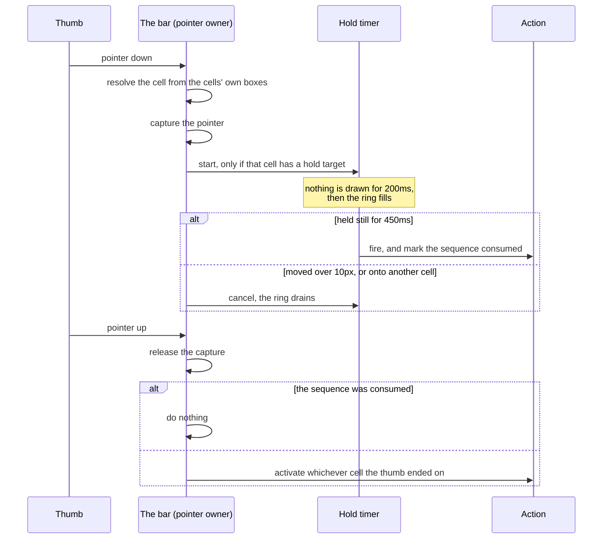

# Disscount: Mobile Navigation Specification

A build specification for the mobile primary navigation: a fixed bottom bar, its gestures, and the bottom sheet that its centre cell opens.

This describes **what must be true**, not how to build it. Every number here was measured or derived on a real implementation, and every prohibition is a bug that was actually shipped and then removed. Treat the prohibitions as seriously as the requirements: most of them cost a day each to find.

## How to use this document

1. Read `AGENTS.md` first. It governs file size, naming, comments, exports, function style, and Croatian copy. This spec never overrides it.
2. Read the frontend design skill at `frontend/.github/skills/frontend-design/SKILL.md` before writing any UI, as `AGENTS.md` requires.
3. Build in the phase order in [§17](#17-build-order). Each phase is independently verifiable and independently committable.
4. Verify against [§16](#16-acceptance-criteria) at a 360x740 viewport before calling any phase done.

Wording: **must** is a hard requirement, **should** is a strong default that needs a stated reason to break, **may** is free choice.

---

## Table of contents

1. [Goals and scope](#1-goals-and-scope)
2. [The bar](#2-the-bar)
3. [Cell states](#3-cell-states)
4. [The interaction model](#4-the-interaction-model)
5. [Long press](#5-long-press)
6. [Live state on the bar](#6-live-state-on-the-bar)
7. [The search sheet](#7-the-search-sheet)
8. [The filters panel](#8-the-filters-panel)
9. [Bottom sheets in general](#9-bottom-sheets-in-general)
10. [Layering](#10-layering)
11. [Layout, safe areas and spacing](#11-layout-safe-areas-and-spacing)
12. [Motion](#12-motion)
13. [Accessibility](#13-accessibility)
14. [Copy](#14-copy)
15. [Invariants and known traps](#15-invariants-and-known-traps)
16. [Acceptance criteria](#16-acceptance-criteria)
17. [Build order](#17-build-order)
18. [Explicitly out of scope](#18-explicitly-out-of-scope)

---

## 1. Goals and scope

### Why this exists

Below `md` every primary destination currently lives behind the hamburger sidebar. Nielsen Norman Group measured that across 179 participants on 6 live sites: hidden-only navigation is used by 57% of people against 86% for visible plus hidden, content discoverability is over 20% worse, and mobile task completion is 15% slower.

The winning condition was **visible and hidden together**, not visible instead of hidden. So:

- The bar carries the five destinations that matter most.
- The sidebar stays exactly as it is and keeps carrying everything else.
- There must be **no "Više" tab**. Overflow is the sidebar's job.

Hoober's field observation of 1,333 real interactions found 49% of people hold a phone one-handed and 75% of interactions are thumb-driven, which is why this is bottom chrome and why the least useful cells go on the outer edges.

### In scope

The bar, its five cells, its indicators, its gestures, the search sheet the centre cell opens, the product filters that live inside that sheet, and one shared bottom-sheet surface that every bottom sheet in the app uses.

### Out of scope

The desktop header, the desktop sidebar, and the mobile sidebar drawer, all of which keep their current behaviour. See [§18](#18-explicitly-out-of-scope) for features deliberately not built.

---

## 2. The bar

| Requirement          | Value                                                                                 |
| -------------------- | ------------------------------------------------------------------------------------- |
| Visible at           | widths under `md` (768px), in a browser tab and in the installed PWA alike            |
| Hidden by            | CSS only, never a media-query hook, so the markup ships in the prerendered HTML       |
| Position             | fixed to the bottom, above the safe-area inset                                        |
| Shape                | a floating pill, inset from all three edges, translucent with a light backdrop blur   |
| Surface treatment    | identical to the scrolled header's, so the app's two floating bars read as one family |
| Content height       | 72px, plus the bottom safe-area inset                                                 |
| DOM order            | last, after the page content and the footer                                           |
| Cells                | exactly 5, equal width, filling the pill                                              |
| Cell element         | a real `<button>`. **Never** an anchor, see [§15](#15-invariants-and-known-traps)     |
| Minimum touch target | 48px per cell in both axes. Measured 65.8x72px at 360px wide, 57.8x72px at 320px      |

### The cells

Left to right, and this order **must not change once shipped**. A tab set whose shape shifts between sessions cannot build muscle memory, which is Apple's stability rule and the reason there is no adaptive per-section variant.

| #   | Label     | Destination       | Notes                                          |
| --- | --------- | ----------------- | ---------------------------------------------- |
| 1   | Karta     | `/map`            | coming soon, public route                      |
| 2   | Praćenje  | `/watchlist`      | auth protected, carries the notification badge |
| 3   | Proizvodi | `/products`       | **raised centre cell**, opens the search sheet |
| 4   | Popisi    | `/shopping-lists` | auth protected, carries the completion ring    |
| 5   | Kartice   | `/digital-cards`  | coming soon, auth protected                    |

The two unshipped teasers sit on the **outer edges** on purpose: the arrangement stays symmetric with search dead centre, and the least useful cells take the hardest thumb positions.

The bar must read its five items from the app's existing shared navigation registry, the same source the header and sidebar read, so a label, an icon, a route or a coming-soon flag is never defined twice. The registry currently splits items into an account group and a catalogue group, and the bar needs items from both.

### Cell anatomy

Every non-centre cell composes, back to front: the active indicator disc, then the completion ring and the long-press progress ring (both concentric with the disc), then a 24px icon carrying the badge and the re-tap chevron, then a 10.4px label, then the USKORO chip for a teaser.

Labels are **always visible**, never icon-only.

The active indicator is a **57.6px disc** enclosing icon and label together. Size it against the widest label **in its bold weight**, not its normal weight: the active label is bold, it is the one people look at, and sizing against the unbolded width leaves exactly that cell touching its own edges. The disc must stay clear of the pill's inner edge on the first and last cell (measured 11.5px at 360px, 7.5px at 320px).

The **centre cell** is different: a raised, filled, brand-green circle roughly 45px across with its label underneath. It sits inside its cell like the others, not detached beside the pill.

### Compaction on scroll

Once the page is scrolled, the labels fade and collapse and the surface drops to 90% opacity, over a scroll range of roughly 40px to 180px.

- It **compacts, it never hides.** Hiding navigation gives back the ~21% task-completion penalty this feature exists to remove.
- Drive it from scroll position without a scroll listener, so there is no jank and no hydration behaviour. Browsers that cannot do that must keep the full-size bar, which is the correct fallback.
- The bar's **outer height must not change** during compaction, so the pill never resizes mid-scroll and the page's reserved space never shifts.
- Any custom property that animates must be registered, or it animates discretely and snaps at the halfway point instead of fading.

---

## 3. Cell states

| State           | Presentation                                                                            |
| --------------- | --------------------------------------------------------------------------------------- |
| Idle            | muted icon and label                                                                    |
| Active          | the disc, plus a tinted icon, plus a **bold** label. Three signals, never colour alone  |
| Scrubbed        | the icon swells while the thumb is over that cell                                       |
| Long-press held | a ring fills concentrically with the disc                                               |
| Locked teaser   | disabled, further muted, keeps its USKORO chip, takes no tap, focus, scrub tint or hold |

**Active means route match, nothing else.** The predicate is a pure path-prefix test applied to all five cells, including the centre one, so the centre cell lights up on `/products`. Whether a cell navigates or opens a sheet is a **separate** question. Conflating the two is a real bug: it left `/products` with no current-page state at all, and lit the centre cell up merely because a sheet had opened, which is not a route change.

### Teaser cells

A coming-soon cell is a **dead end for everyone but an admin**, which is the rule the sidebar already applies. Admins pass through, so a working-but-unannounced page stays reachable from a phone.

Two things to know before changing this:

- It runs **against** Apple's Human Interface Guidelines, which are emphatic that a tab must never be disabled. Consistency with the app's other two navigations won: a bar that walks you into a teaser page the header refuses to open is the more confusing inconsistency.
- Locking must be enforced on the pointer path as well as on the element, because a disabled button does not stop a bar-level pointer handler from resolving that cell.

Recognise the standing risk: two of five cells being teasers means 40% of the bar is inert for most users, and no UX research endorses teaser destinations in primary navigation. If those two features stay unshipped for long, the bar starts reading as vaporware.

### Signed out

Three destinations are auth protected. Those cells **must still navigate**. The pages already explain the feature and offer sign-in, and explaining beats dead-ending wherever there is something to explain. Do not lock them, do not open an auth modal directly (that would make four of five cells the same button), and do not render a smaller signed-out bar (its shape would change at login and shift on hydration).

---

## 4. The interaction model

A tap, a horizontal scrub and a long press must be **one pointer path owned by the bar**, not three handlers per cell. That is what makes them compose, because a tap is just a zero-distance scrub.

### Activation

| Case                       | Result                                                        |
| -------------------------- | ------------------------------------------------------------- |
| The centre cell            | opens the search sheet, or closes it if it is already open    |
| A locked teaser            | nothing, beyond dismissing the search sheet                   |
| The tab you are already on | scroll to the top, and a second tap returns to where you were |
| Any other cell             | navigate to that destination                                  |

Every branch **except the centre one** must dismiss the search sheet first. That covers what a route-change effect cannot: re-tapping the tab you are already on does not change the route.

### Re-tapping the active tab

Scroll to top, then a second tap returns to the previous position. Expo's native tabs, Ionic, Instagram and Medium all do the first; X adds the return trip. Show a small chevron on the active icon while a return position is held, and clear that position on any route change, since a position from one route means nothing on the next.

This must move the window explicitly, because the router does not scroll when you navigate to the URL you are already on.

### Scrubbing

Press anywhere on the bar and drag: the active disc follows the thumb, each icon it passes swells, and release commits whichever cell the thumb ended on. This composes with the long press for free, because the 10px movement threshold that abandons a hold is the same threshold that means "this is a scrub, not a tap".

- Resolve the cell index from the **cells' own bounding boxes**. Never divide the bar's width by five: the pill has inner padding, so width division skews every boundary.
- Ignore any press starting within **16px of a screen edge**, so the bar never competes with the iOS back-swipe or the home-indicator gesture.
- Suppress touch panning on the bar itself, so a horizontal scrub is never read as a page pan. The bar is fixed chrome, so this is safe here and only here.

---

## 5. Long press

Long press is strictly an **accelerator**. Every target must also be reachable by a visible, tappable control, which is what keeps it usable by keyboard and screen reader (WCAG 2.1.1, 2.5.1). Nothing may be gesture-only.

Prefer targets that are already URL-addressable modals, so a hold is a navigation and needs no new plumbing.

### Timing

| Value                     | Rationale                                                                          |
| ------------------------- | ---------------------------------------------------------------------------------- |
| **450ms** to fire         | iOS uses 0.5s, Android roughly 400-500ms, react-aria defaults to 500ms             |
| **200ms** silent gate     | nothing at all is drawn or scheduled before this, so an ordinary tap shows nothing |
| **250ms** ring fill       | whatever the gate leaves of the 450ms, so a full ring reads as "committed"         |
| **10px** cancel threshold | past this the press is a drag or a scroll                                          |

The silent gate must be a **real gate**, not a clamp: before it elapses there is no animation frame loop and no progress written anywhere.

This shipped at 120ms first, chosen to sit inside Nielsen's 0.1s "instant" window, and it was wrong. A deliberate tap on a nav cell commonly lasts 150-200ms, so **every** tap flashed a sliver of ring and the bar felt broken. The general lesson: a gesture's feedback threshold has to clear the gesture it distinguishes itself from, not an abstract perception budget.

The ring is the discoverability mechanism, and the reason **no coachmark is built**: a press that outlives the gate shows the ring begin to fill, which teaches the gesture while you perform it. NN/g found users do not read coach marks and forget them within about 20 seconds.

All long-press consumers, the bar's cells and the product cards alike, must share one timing source, so they can never drift apart.

### Targets

| Hold           | On `/products/<ean>`       | Everywhere else            | Enabled                                |
| -------------- | -------------------------- | -------------------------- | -------------------------------------- |
| **Karta**      | store preferences          | store preferences          | admins only, until the map ships       |
| **Praćenje**   | watch this product         | nothing                    | yes                                    |
| **Proizvodi**  | the barcode scanner        | the barcode scanner        | yes                                    |
| **Popisi**     | add this product to a list | create a new shopping list | yes                                    |
| **Kartice**    | create a new digital card  | create a new digital card  | wired but off until digital cards ship |
| A product card | its quick-actions sheet    | its quick-actions sheet    | yes                                    |

Notes that must survive into the implementation:

- **Two cells change meaning on a product's page.** Each cell declares its own product-scoped target, and one shared resolver answers both "what does this hold do" and "does this cell have a hold at all", so the two can never disagree.
- **This was a reversal.** Per-route gestures were first rejected on the grounds that a gesture meaning different things per route cannot be learned. It was overruled deliberately, because on a product page both targets are also on-screen buttons, so the hold is a thumb shortcut past a journey rather than a hidden feature. The learnability cost is real and unmeasured, and it is the first thing to check if the holds go unused.
- **Karta's hold is deliberately not map-specific.** The map will load pinned stores and centre on the user by itself, so the only thing left worth a shortcut is the preferences behind that behaviour. A "nearby stores" hold was considered and dropped as redundant.
- **The centre cell's hold is the one guessable gesture**: typing a name and scanning a barcode answer the same question, so tap to type, hold to scan. Its visible equivalent is the scan button in the sheet's field.
- **Product cards keep their own quick-actions sheet** even though the bar now reaches the same two actions, because in a list the bar has no way to know which card you meant.
- A cell that is locked must not respond to a hold, whatever target it declares.
- Any product modal opened this way must find its product already in cache, so it never opens empty and never refetches what the page already has.

---

## 6. Live state on the bar

| Indicator                     | Source                                       | When it shows                                          |
| ----------------------------- | -------------------------------------------- | ------------------------------------------------------ |
| Badge on **Praćenje**         | the same notification count the header shows | only above zero                                        |
| Completion ring on **Popisi** | the shopping list currently open             | only on a single list's page, and only if it has items |
| Active disc                   | route match                                  | one cell at a time, sliding between cells              |
| Chevron on the active icon    | a held return-scroll position                | only while one is held                                 |

The badge is knowingly a placeholder: it reuses the notification count so the bar and the header can never disagree and no new endpoint is needed. A real "watched products cheaper since your last visit" count is future work.

The completion ring is scoped to a list's own page on purpose, so you can glance at the bar in a store and see how far through you are without opening anything.

### The disc on the centre cell

The disc's tint lands **behind** the raised green circle and reads as a smudge rather than a highlight. So the disc must fade out as it slides onto the centre cell and resolve as it slides off. Keep it as one shared sliding element throughout: not rendering it on that cell at all makes it pop instead of fade.

This needs the **previous** route's opacity to survive the disc being replaced on navigation, so that value has to be held above the disc, not inside it.

---

## 7. The search sheet

Tapping the centre cell opens a compact bottom sheet directly above the bar.

Contents, top to bottom:

1. The app's existing search field, with its scan button, reused rather than reimplemented.
2. A **Popusti** shortcut into the catalogue, presented exactly as the sidebar presents a teaser: an outline button with the USKORO badge, locked by the same rule as the bar's own teasers.
3. A **Filteri** toggle that expands the product facets in place ([§8](#8-the-filters-panel)).
4. A full-width **Pretraži** button, pinned in the sheet's footer.

### Opening and closing

| Action                                 | Sheet                    |
| -------------------------------------- | ------------------------ |
| Tap the centre cell                    | opens, filters collapsed |
| Tap the centre cell again              | closes                   |
| Tap **Filteri** on the products page   | opens, filters expanded  |
| Tap any other bar cell                 | closes                   |
| Submit a search from any route         | stays open               |
| Scan a barcode, or open a product      | closes                   |
| Swipe the handle down, or press Escape | closes                   |

The rule is one line: **close on any pathname change except an exact match on the products list**, which is the one route whose filters live inside the sheet. Do not add a second "close on submit" path; submitting either lands on the products list, where it must stay open, or on a product page, where the pathname rule already closes it. Exact equality, not a prefix: a product's own page has no result set to filter.

The centre cell **must be a toggle**, and its glyph must say so: the search icon rotates out and a downward double-chevron rotates in while the sheet is open, with a cross-fade that is instant under reduced motion. Chevrons rather than an X, because they point the way the sheet actually leaves, which is also the swipe that dismisses it. Its accessible name and expanded state must change with it.

That toggle is the **only** way to close this sheet from the bar, and that is a consequence of it being non-modal, not a choice. See [§15](#15-invariants-and-known-traps).

### Focus

Focus the search field on open, so you can type immediately, **unless** the sheet was opened straight into its filters: raising the keyboard there would cover the facets the user just asked to see. Set focus explicitly on open rather than relying on a child's autofocus surviving a focus scope.

On iOS the keyboard may still need one tap, because iOS raises it only when focus runs in the same task as the gesture and a sheet that mounts on open cannot guarantee that. Accept it; the alternatives are an always-mounted field or a decoy input, both worse.

### The Pretraži button

- It lives in the sheet's **footer**, outside the scrolling body, so expanding the filters can never push the one control that acts on them out of thumb reach. Leaving it under the field, or last in the body, both fail on a short phone.
- It must be **disabled whenever submitting would change nothing**: the trimmed query matches the route's own query, or the field is empty. Off the search route any text enables it immediately, because submitting navigates.
- Treat an **empty field as unchanged** whatever the URL holds. Comparing it instead makes the button flash on for one render after the clear button empties the field and before the navigation lands. The clear button already drops the query, so nothing is lost.
- Every submit surface in the app must share that same rule: the sheet, the landing hero, the sidebar, the header and the products page all behave identically.
- The rule can only ever answer for the **query**, never for the filters, because filters apply themselves as you pick them ([§8](#8-the-filters-panel)). Do not write a "filters changed" branch; it can never fire.

---

## 8. The filters panel

The sheet carries the products page's four facet controls (Trgovine, Lokacije, Kategorije, Marka) behind the **Filteri** toggle, on **every route**.

**This must be the only filters surface below `md`.** Two surfaces were built first, the sheet's panel plus the products page's own filters sheet, both from the same four controls, which put a query and the facets narrowing it on separate layers. The page's Filteri button must instead open this sheet already expanded. Above `md` the page keeps rendering every facet inline.

Three ways in:

| Gesture                              | Result                                                            |
| ------------------------------------ | ----------------------------------------------------------------- |
| Tap **Filteri** inside the sheet     | expands, the chevron flips                                        |
| Tap **Filteri** on the products page | opens the sheet already expanded, field left unfocused            |
| **Drag the sheet upward** past 40px  | expands, mid-drag, so it grows under the finger that asked for it |

Requirements:

- **Expanding grows the sheet upward in place.** Never stack a second sheet over it: NN/g is explicit that stacked sheets disorient, and a second layer hides the query you just typed. Replacing the sheet's content behind a back arrow has the same flaw. Past the sheet's height cap the body scrolls instead.
- **The expanded state must live above both entry points**, so opening and expanding happen in one batch. Two consequences, both required: the sheet never renders at the wrong size for a frame, and no effect is needed to reconcile it.
- **The filters always start collapsed.** Restoring whatever was left expanded was the first behaviour and it meant the centre cell sometimes opened a tall sheet nobody asked for.
- **A pick always lands on the products list.** On that route it amends the URL and the list behind updates live. Off that route there is no filter state to amend, so the pick and whatever is currently typed must travel together in one navigation, so a half-typed query survives the trip. This matches what the sidebar's filter menu already does.
- **Facet options come from the submitted query, and only on the products list.** Elsewhere the query is deliberately empty, which avoids a stray request and stops another page's query parameter (the map page has one, for store names) from facetting products.
- **No extra requests.** Reuse the query the page already holds, and fetch nothing when the query is empty.
- **Do not run the pinned-store seeding twice.** The products page already owns it; a second reader racing it double-appends parameters.
- Any popover a facet opens must be portalled **into** the sheet, or touch scrolling inside it breaks.
- **Očisti filtere is an outlined icon-only button below `md`**, named by an accessible label and a tooltip, and rendered with its label visible above `md`. It must stay **mounted and disabled** when there is nothing to clear, not removed: removing it reflowed the row every time the last filter went. Beside a full-width Filteri button at 360px, a labelled reset takes as much room as the control it sits next to.
- The tooltip may be dropped above `md`, where the label is already visible. Note that a disabled control cannot show a tooltip at all, which is fine here (it is disabled exactly when there is nothing to explain) but rules tooltips out as the only label for anything disabled for a reason the user needs to know.

---

## 9. Bottom sheets in general

There must be **one shared bottom-sheet surface** that every bottom sheet in the app uses, and it must own everything in this table. A call site supplies content, a title, a modality and nothing else.

The app has three bottom sheets: the search sheet, the product quick-actions sheet, and the PWA install instructions. Four sheets built four different ways is the state this replaces, and it produced content sitting under the bar in some sheets and under the home indicator in others, depending on which one you opened.

| Owned centrally  | Requirement                                                                                      |
| ---------------- | ------------------------------------------------------------------------------------------------ |
| Layer            | below the bar, so the pill is never covered                                                      |
| Surface          | the bar's blur, but at 85% background opacity, not the bar's 50%                                 |
| Height cap       | 85% of the dynamic viewport height, so a growing sheet always yields to the viewport             |
| Bottom clearance | the bar's full height plus a small gap, from one shared token                                    |
| Handle gap       | at least 16px of clear space below the grab handle, **whether or not the header draws anything** |
| Handle contrast  | visible on a light surface                                                                       |
| Footer           | pinned below the scrolling body                                                                  |
| Focus in         | a named field, optionally declined                                                               |
| Focus out        | suppressed, because there is no trigger to restore to and the default jumps the scroll           |
| Modality default | non-modal                                                                                        |

**No call site may set a sheet's layer, its bottom padding, or any safe-area value.** After this is built, a search for hand-rolled sheet padding or z-index should return nothing outside the shared surface and the token definitions.

The header must stack **title over description**, not side by side. A visible description is a real requirement (the install instructions need one) and a single row cannot serve it.

Do not offer a slot that only one sheet fills. A slot nothing fills is a slot that drifts.

### Modality

One question decides it: **does the page behind change while the sheet is open?**

| Sheet                    | Modal | Because                                                                                        |
| ------------------------ | ----- | ---------------------------------------------------------------------------------------------- |
| Search                   | no    | picking a facet re-filters the list behind it live, so it must not be covered or lock the page |
| Product quick actions    | yes   | a launcher; nothing behind it changes and two of its actions open a dialog anyway              |
| PWA install instructions | yes   | instructions to read and then leave; the scrim helps focus and costs nothing                   |

This mirrors Material's split between a standard sheet, which "co-exists with the screen's main UI region", and a modal sheet, which "presents a set of choices while blocking interaction with the rest of the screen".

Only the search sheet earns the standard treatment. All three were shipped non-modal first, which made two sheets pay for a property only one needed, and cost them tap-outside-to-close, which is the dismissal users try first.

A modal sheet's scrim must sit **below the bar**, so all three sheets layer identically and the pill stays visible, dimming through its own translucency. Accepted consequence: while a modal sheet is open the bar is visible but inert. That is already true under every dialog in the app, so it is a newly visible behaviour, not a new one.

Sheets must **not** be used for the mobile sidebar. That is a full-height side drawer, it genuinely is modal, and its scrim should cover the bar.

---

## 10. Layering

One documented stack, top to bottom. Every value here is load-bearing; the two adjacent pairs are the ones that were wrong.

| Layer | Element                                               |
| ----- | ----------------------------------------------------- |
| 60    | offline indicator                                     |
| 50    | dialogs, popovers, dropdowns, tooltips, selects       |
| 50    | the mobile sidebar drawer, deliberately above the bar |
| 45    | **the bottom nav**                                    |
| 44    | bottom sheets                                         |
| 43    | a modal sheet's scrim, below the bar by design        |
| 41    | the PWA install banner                                |
| 40    | the window scroll fade                                |
| 30    | the back-to-top button                                |
| 20    | the header                                            |
| 10    | the desktop sidebar                                   |

Two things must move down to make room: the back-to-top button, which is desktop-only and belongs under every layer, and the PWA install banner, which opens the install sheet and must not float over the sheet it opened.

Popovers inside a sheet are unaffected, as long as they portal into the sheet, because their layer then resolves inside the sheet's own stacking context.

If the sheet primitive renders its own scrim internally with no way to restyle it, that has to be opened up. Overriding only the sheet's layer gets you a sheet **below its own scrim**.

### Other bottom-anchored elements

Three things collide with the bar and must be offset from the same shared height token: the PWA install banner, toast notifications, and any dev overlay. Next's dev indicator lands over the left cell and the query devtools button over the right one, which makes the bar impossible to judge or test, so both should be off by default.

---

## 11. Layout, safe areas and spacing

### The spacing trap

This project overrides the spacing base to `0.2rem` against Tailwind's `0.25rem`, so **every spacing utility renders 20% smaller than it reads**: a nominal 64px is 51px, a nominal 48px is 38px, a nominal 16px is 12.8px.

Therefore the bar must express **none** of its dimensions through the spacing scale. Its height, its inset and its inner padding must be explicit values, and its height must live in one shared token that the page's bottom clearance also derives from, so the two can never drift.

Two tokens are required:

1. **The bar's total height**: content height, plus its inset from the bottom edge, plus the bottom safe-area inset.
2. **Where every bottom sheet ends**: the bar's total plus a small gap. Above `md` this becomes a plain comfortable inset, since there is no bar there. That media query should be the **only** place a sheet's geometry branches on breakpoint, which is what lets the shared surface hardcode one padding value and be right on both.

### Viewport requirements

| Requirement                                      | Why                                                                                                      |
| ------------------------------------------------ | -------------------------------------------------------------------------------------------------------- |
| Viewport fit set to cover                        | without it **every safe-area inset silently resolves to zero** and the bar sits under the home indicator |
| Interactive widget set to resize the content     | so fixed bottom elements reposition when the keyboard opens instead of hiding behind it                  |
| Full-height shells use the dynamic viewport unit | the static one is computed as if browser UI were hidden, so the shell is taller than the visible area    |
| Scroll padding on the root element               | so anchor jumps and programmatic scrolls do not land under the bar                                       |

**Reserve the bar's space on the shell wrapper, not on the main element.** The footer renders after main and is pushed down, so main's bottom padding sits above it and the bar covers the footer regardless. Measured before the fix: the footer's last 76px were unreachable.

---

## 12. Motion

| Element                     | Behaviour                                                                  |
| --------------------------- | -------------------------------------------------------------------------- |
| The active disc             | slides between cells as one shared element, never disappears and reappears |
| The disc on the centre cell | cross-fades out and back in, holding the previous route's value            |
| Compaction                  | driven by scroll position, no listener                                     |
| The long-press ring         | fills over 250ms after the silent gate, drains on cancel                   |
| Scrub                       | the icon under the thumb swells                                            |
| The centre glyph            | search and chevrons cross-fade                                             |
| Re-tap scroll               | smooth, and instant under reduced motion                                   |

Under `prefers-reduced-motion` the disc, the compaction, the glyph swap and every programmatic scroll must all be instant.

Note that reduced motion applies to the CSS scroll-behaviour property and **never** to a scripted scroll's behaviour option. A scripted scroll must check the preference itself.

Write long-press progress straight to the element as a custom property rather than into state, so the ring does not re-render a subtree once per frame.

One trade-off to watch: the header, the bar and every sheet all use a backdrop blur, and a sheet's blur repaints on every frame of a drag. Stacked blurs are the classic mid-range Android jank source, and this is the first thing to test on real hardware.

---

## 13. Accessibility

| Concern              | Requirement                                                                                                                                                             |
| -------------------- | ----------------------------------------------------------------------------------------------------------------------------------------------------------------------- |
| Landmark             | a real navigation landmark with a distinguishing accessible name, since the page has three                                                                              |
| Current page         | the current-page attribute on the active cell, the only thing that conveys "you are here" to a screen reader                                                            |
| Roles                | a navigation landmark wrapping a list of buttons. **Do not** use tablist and tab roles, which are for in-page tab panels and imply roving-tabindex arrow-key navigation |
| Locked cells         | genuinely disabled, so they leave the tab order and announce as unavailable, with the USKORO chip still readable                                                        |
| Toggles              | the centre cell carries an expanded state, and its accessible name changes while the sheet is open                                                                      |
| Not colour alone     | active state is the disc plus the tint plus a bold label (WCAG 1.4.1)                                                                                                   |
| Touch targets        | at least 48px per cell in both axes                                                                                                                                     |
| Keyboard             | cells are real buttons, and because pointer activation runs at bar level, cells must respond only to keyboard-originated clicks                                         |
| Gesture parity       | every hold target also reachable by a visible control (WCAG 2.1.1, 2.5.1)                                                                                               |
| Pointer cancellation | a hold fires on the timer and is abandoned by movement (WCAG 2.5.2)                                                                                                     |
| Icon-only controls   | named by both an accessible label and a tooltip, with the label rendered outright wherever there is room                                                                |
| Focus order          | the bar is last in the DOM, so keyboard users reach content first. Its visual position is the bottom anyway                                                             |
| Under dialogs        | sheets hand the page back so the bar stays live; a real dialog keeps the page locked and its overlay covers the bar                                                     |

---

## 14. Copy

All copy is hardcoded Croatian; there is no i18n framework. Use drugo lice ("ti"), never treće lice ("vi"), ungendered forms throughout, and leave the company voice ("mi") intact.

| Surface                  | String                                        |
| ------------------------ | --------------------------------------------- |
| Navigation landmark      | Glavna navigacija                             |
| Cells                    | Karta, Praćenje, Proizvodi, Popisi, Kartice   |
| Teaser chip              | USKORO                                        |
| Centre cell while open   | Zatvori traženje                              |
| Sheet title              | Traži proizvode                               |
| Sheet description        | Upiši naziv proizvoda ili skeniraj crtni kod. |
| Search field placeholder | Pretraži proizvode...                         |
| Submit button            | Pretraži                                      |
| Catalogue shortcut       | Popusti                                       |
| Filters toggle           | Filteri                                       |
| Facets                   | Trgovine, Lokacije, Kategorije, Marka         |
| Reset filters            | Očisti filtere                                |

---

## 15. Invariants and known traps

Each of these was found the hard way. They are ordered roughly by how much time they cost.

**Cells must be buttons, never anchors.** iOS shows a link-preview popover, a text callout and a drag affordance on a long-pressed anchor, and the property that is supposed to suppress the callout is unreliable (there is an open Apple report against iOS 26.1). A button has none of those. Crawlability is unaffected, because the prerendered header and sidebar already carry the links for these routes, and they must keep carrying them.

**The context-menu event never fires on an iOS long press.** It has not since iOS 13.1, so a hold has to be a pointer-down timer.

**A non-modal sheet does not automatically leave the page usable.** Drawer libraries commonly leave the underlying dialog primitive in modal mode, which sets pointer-events to none on the document body regardless of the non-modal flag. So "non-modal" can buy you no scrim and no scroll lock **and an inert page anyway**, which is a silent trap: the page looks live and is not. Verify explicitly that the page behind the search sheet scrolls and takes clicks, and that a real dialog still does not. If the fix has to be a stylesheet override, key it off a marker the sheet stamps itself, since a marker shared with the modal side drawer will break that drawer.

**A non-modal sheet may not be dismissable from outside itself.** The same primitives that veto the body unlock also veto outside-press and focus-outside dismissal when non-modal. That is why the centre cell had to become a toggle and why every other cell closes the sheet explicitly. Useful consequence once you accept it: the sheet's open state cannot change mid-gesture, so reading it on pointer-up is race-free.

**Never make a sheet's surface pointer-transparent to protect what is above it.** This was the first fix for keeping the tabs tappable and it was both unnecessary and harmful. Unnecessary, because the bar sits above the sheet and already wins hit testing on its own box. Harmful, because making the layer transparent and its children opaque leaves **every pixel of the sheet's own padding** as a hole: a press in a hole hits the document, the drag never starts, and no pointer is captured. Measured at 360px: a 16px dead strip along the top edge, exactly where the grab handle is. The result is a swipe-to-close that feels unreliable rather than broken, which is much harder to diagnose. Leave the surface whole.

**Screen-reader-only styling on a container takes its padding with it.** It is absolutely positioned, so a row marked that way contributes no height at all, padding included. Hiding a whole sheet header this way is how a grab handle ended up 6.4px above an input. Mark the **text** and let the row keep its padding, and the handle gap holds either way with no conditional padding anywhere.

**A component mounted in the root layout must not read search params.** Doing so drops **every page in the app** out of the prerender. If a control inside such a sheet needs the URL, it must be created in the layout but only rendered when the sheet opens, since creating an element calls no hooks.

**Route params never reach the root layout either.** A layout has no dynamic segment of its own, so anything mounted there that needs an id from the URL has to parse the pathname.

**A layout-mounted sheet writes to whatever route it is on.** If its filter controls build their target from the current pathname, rendering them unguarded lets a facet picked from the sheet rewrite an unrelated route. Guard the render, and note that a guard cannot live in the same unit as the hooks it guards without changing hook order between renders.

**Capturing the pointer at bar level retargets the click.** Once the pointer is captured on the container, a click no longer lands on the button that was pressed. So activation runs on pointer-up and the cells themselves handle only keyboard clicks. Release the capture **explicitly** on both end and abort: relying on the spec's implicit release left captures outliving their gesture, which showed up as a tap on one tab activating a different one.

**A submit button outside its form needs an explicit form association, and gets more than submission from it.** Moving the submit into the sheet's footer takes it out of the form, and DOM ancestry is what associates the two. Once associated, the spec picks a form's default button as the first submit button whose form **owner** is that form, so implicit submission still works: pressing Enter in the field still submits, and disabling the button also blocks Enter, which is the behaviour you want.

**Comparing a field against the URL flashes on a clear.** The clear resets the field and then navigates, so for one render an empty field sits over the old query and reads as a change. Treat empty as unchanged, as [§7](#7-the-search-sheet) requires.

**Feedback timed inside the "instant" window fires on ordinary taps.** See [§5](#5-long-press).

**Do not suppress touch panning on anything inside a scroller.** Pointer cancellation arrives for free when a pan or scroll claims the pointer, which is what abandons a hold on a product card, and suppressing panning suppresses that too. Only the bar itself, which is fixed chrome, may do it.

**Haptics are a dead end.** The vibration API has never shipped in WebKit and the checkbox-switch workaround was patched in iOS 26.5. Android supports it, but a buzz that exists on one platform only is worse than none. The feel must come from motion and timing alone.

**A controlled multi-select must emit from its props, not from an internal set.** A set seeded once at mount and never re-synced desyncs from the displayed values, and the next toggle emits the wrong payload: clear the filters, pick one option, and every cleared option comes back.

**Any product modal opened without seeding the by-ean cache opens empty.** URL-driven modals take no props, so they refetch what the caller already had.

---

## 16. Acceptance criteria

Run these at **360x740** signed in, and repeat the geometry checks at **320px**. Verify in a browser; static analysis says nothing about a gesture.

### The bar

- [ ] Present under 768px, absent at 768px and above, in the prerendered HTML with no shift on hydration
- [ ] 72px of content, plus the safe-area inset, with the page's last content and the footer both fully reachable
- [ ] Five cells, correct order, correct labels, all labels visible
- [ ] Each cell at least 48px in both axes
- [ ] The active disc never touches the pill's inner edge on the first or last cell
- [ ] Scrolling compacts the labels and dims the surface without changing the bar's outer height, and the labels fade rather than snapping
- [ ] The bar never hides

### Navigation and gestures

- [ ] Tapping a cell navigates; the disc slides rather than reappearing
- [ ] The centre cell lights up on the products list and carries the current-page attribute there
- [ ] Re-tapping the active tab scrolls to top, and a second tap returns, with a chevron shown in between
- [ ] Scrubbing across the bar moves the disc and commits the cell released on
- [ ] A press starting within 16px of either screen edge does nothing
- [ ] An ordinary tap on any cell draws **no** ring at all
- [ ] A hold shows the ring begin to fill and fires at roughly 450ms
- [ ] Moving more than 10px during a hold drains the ring and fires nothing
- [ ] Every hold in [§5](#5-long-press) opens its target, and each target is also reachable by a visible control
- [ ] Holding Praćenje does nothing off a product page; holding Popisi opens the new-list modal there and the add-to-list modal on a product page
- [ ] Teaser cells take no tap, no focus, no scrub tint and no hold as a non-admin, and do as an admin
- [ ] Signed out, the protected cells still navigate and the pages explain themselves

### The search sheet

- [ ] Opens above the bar with the field focused, filters collapsed, whatever was left expanded last time
- [ ] The page behind it scrolls and takes clicks while it is open
- [ ] The centre cell closes it; its glyph and accessible name change while open
- [ ] Swiping the handle down closes it, and so does a press starting anywhere on the surface, including on its padding
- [ ] Escape closes it
- [ ] Pretraži sits at the bottom regardless of the sheet's height, and Enter in the field submits
- [ ] Pretraži is disabled when the field is empty, and when it matches the current query, with no flash after the clear button
- [ ] Submitting from another route lands on the products list with the sheet still open; then tapping any other cell closes it
- [ ] Scanning a barcode closes it
- [ ] Popusti is present, disabled, badged, and enabled for an admin

### The filters

- [ ] Filteri expands in place and the sheet grows upward; past 85% of the viewport the body scrolls
- [ ] Dragging the sheet up 40px expands it mid-drag; a 20px nudge does nothing
- [ ] The products page's Filteri button opens the sheet already expanded with the field unfocused
- [ ] Picking a facet on the products list updates the URL and the list behind, live, without closing the sheet
- [ ] Picking a facet from another route navigates to the products list carrying both the facet and whatever was typed
- [ ] Clearing the filters and then picking one option does not resurrect the cleared ones
- [ ] Očisti filtere is present but disabled with no filters set, icon-only below `md` with a tooltip, labelled above it
- [ ] A facet's popover scrolls by touch

### Sheets and layers

- [ ] All three sheets end the same distance above the bar, and none of them covers it
- [ ] The gap below the grab handle is identical in all three, including the one with a hidden title
- [ ] A modal sheet's scrim leaves the bar visible, and the bar is inert under it
- [ ] The install instructions sheet shows its description, closes on an outside press, and has a visible close control
- [ ] No sheet's own code sets a layer, a bottom padding or a safe-area value
- [ ] Toasts, the install banner and any dev overlay all clear the bar

### Housekeeping

- [ ] Formatted, type-clean and lint-clean, per `AGENTS.md`
- [ ] No file grew past the size `AGENTS.md` asks for
- [ ] No multi-line explanatory comment survived where a rename or a split would remove the need for it

---

## 17. Build order

Each phase must leave the app working and is worth its own commit.

| Phase | Deliverable                                                                                                                                                               |
| ----- | ------------------------------------------------------------------------------------------------------------------------------------------------------------------------- |
| 1     | The layout tokens, the viewport requirements, and the page's reserved space. Nothing visible yet                                                                          |
| 2     | The shared bottom-sheet surface, with the geometry and layering of [§9](#9-bottom-sheets-in-general) and [§10](#10-layering), and the app's existing sheets moved onto it |
| 3     | The bar: cells, states, the sliding disc, compaction, the teaser lock, accessibility                                                                                      |
| 4     | The bar's pointer layer: tap, re-tap, scrub, edge exclusion                                                                                                               |
| 5     | Long press: the shared timer, the ring, the target map, the contextual targets                                                                                            |
| 6     | The search sheet: contents, the open and close rules, focus, the footer submit and its disabled rule                                                                      |
| 7     | The filters panel, and the removal of the products page's separate mobile filters surface                                                                                 |
| 8     | The elements that had to move: the old floating action menu, the install banner, toasts, the scroll fade                                                                  |
| 9     | Documentation, then verification against [§16](#16-acceptance-criteria) on a real phone if one is available                                                               |

Phase 8 note: the mobile floating action menu is **redundant** with the bar, not merely colliding with it. Its per-page create action becomes a long press plus the page's own inline button, and its back-to-top becomes re-tapping the active tab. Two consequences: the inline create buttons must become visible on mobile, since with the menu gone a long press alone would be the only path and would fail WCAG 2.1.1; and the back-to-top button must move from the `sm` breakpoint to `md`, or widths between 640px and 768px show both it and the bar.

---

## 18. Explicitly out of scope

Rejected with reasons, so none of these is re-litigated:

| Idea                                       | Why not                                                                                                                                               |
| ------------------------------------------ | ----------------------------------------------------------------------------------------------------------------------------------------------------- |
| A "Više" overflow tab                      | the sidebar is the overflow, and hiding navigation is the cost this feature exists to remove                                                          |
| Showing the bar only in the installed PWA  | purer, but hides the best navigation from most visitors, who arrive in a browser tab                                                                  |
| An edge-to-edge bar, flat or frosted       | both were built and compared on a device against the floating pill; the pill won                                                                      |
| Hiding the bar on scroll                   | trades away the discoverability the whole feature buys                                                                                                |
| Swipe left/right on content to change tabs | fights the iOS back gesture and the app's own horizontal carousels                                                                                    |
| Swipe up on the bar for a menu             | competes with the home-indicator gesture, the most used gesture on the phone                                                                          |
| Dragging a product card onto a tab         | drag-and-drop does not work on touch, so it is a hand-rolled pointer system plus a keyboard fallback for something a hold does in a tenth of the work |
| Double tap as a distinct action            | forces a ~250ms wait on every tap to disambiguate, making all taps feel broken. Even Spotify removed theirs                                           |
| Shake to scan                              | iOS re-prompts for motion permission every session                                                                                                    |
| Sound design                               | needs user activation, and phones are on silent                                                                                                       |
| Adaptive tabs that change per section      | directly against the rule that a tab set stays stable                                                                                                 |
| A peek menu above a held tab               | more discoverable and gives free cancellation, but much more UI; revisit if holds go unused                                                           |
| A coachmark teaching the holds             | users do not read them and forget them within about 20 seconds; the ring teaches in place                                                             |

Deferred, and worth doing after this ships:

- Strip the mobile header to brand plus account, and collapse the mobile footer to legal links, so 360px does not carry three competing navigations.
- Decide what happens to the window scroll fade, whose scrim is taller than the bar and washes over the area behind the translucent pill.
- Make the Praćenje badge a real price-drop count, cleared on visit and capped at 9+, with the number in the accessible name.
- An accessory strip above the bar carrying the active list's name, ticked count and running total. The highest-value idea from the research and nothing in this category has it, but it needs a product answer for what makes a list "active".
- Selection mode on a shopping list: hold an item, get a contextual action bar, and cost a subset of the list across chains. Real product upside, and its own feature.
- Decide whether the submit button should become the apply gate for the filters. Today every pick applies itself, so the button only answers for the query. Batching the picks would make the sheet a form you fill and submit, at the cost of the live filtering the non-modal sheet exists for. A product call, not a technical one.
