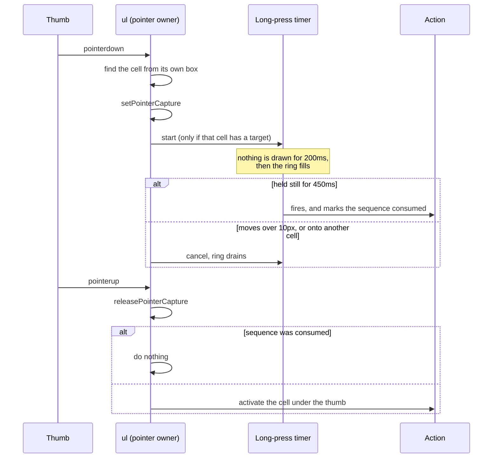
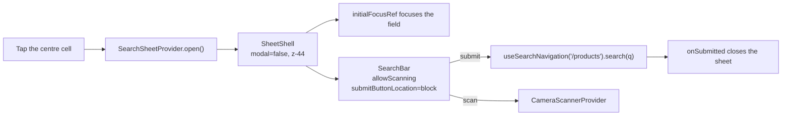
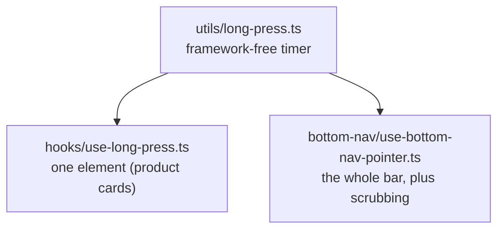

# Disscount: Mobile Navigation Guide

A complete reference for the mobile bottom navigation bar, its gestures, and the shared bottom-sheet shell it opens, written to be understandable even if you're new to this. Keep it up to date as the setup changes.

_Last verified end-to-end on 2026-07-25 against `feat/mobile-bottom-nav`, measured in a real browser at 360x740 and 320x568._

> **Mental model in one sentence:** below the `md` breakpoint the app grows a five-cell **tab bar** pinned to the bottom of the screen, and that bar becomes the primary navigation a phone user needs, because the hamburger sidebar stays on as overflow, the create actions hang off **long presses**, and back-to-top becomes **re-tapping the tab you are already on**.

---

## Table of contents

1. [Quick reference](#1-quick-reference)
2. [Why this exists](#2-why-this-exists)
3. [Anatomy of the bar](#3-anatomy-of-the-bar)
4. [How a touch becomes an action](#4-how-a-touch-becomes-an-action)
5. [The surface](#5-the-surface)
6. [The search sheet](#6-the-search-sheet)
7. [SheetShell, the shared bottom sheet](#7-sheetshell-the-shared-bottom-sheet)
8. [Long-press gestures](#8-long-press-gestures)
9. [Live state on the bar](#9-live-state-on-the-bar)
10. [Layout, safe areas and CSS tokens](#10-layout-safe-areas-and-css-tokens)
11. [What the bar replaced](#11-what-the-bar-replaced)
12. [Design decisions and the roads not taken](#12-design-decisions-and-the-roads-not-taken)
13. [Key files](#13-key-files)
14. [Config, env vars and flags](#14-config-env-vars-and-flags)
15. [Libraries](#15-libraries)
16. [Accessibility](#16-accessibility)
17. [What's automatic vs manual](#17-whats-automatic-vs-manual)
18. [Gotchas & lessons learned](#18-gotchas--lessons-learned)
19. [Future improvements & TODOs](#19-future-improvements--todos)

---

## 1. Quick reference

| Thing                 | Value                                                                                           |
| --------------------- | ----------------------------------------------------------------------------------------------- |
| Shown at              | widths under `md` (768px), in the browser and the installed PWA alike                           |
| Cells, left to right  | Potrošnja (USKORO), Praćenje, Proizvodi (search), Popisi, Kartice (USKORO)                      |
| USKORO cells          | disabled for everyone but admins, as in the sidebar                                             |
| Bar height            | 72px of content, plus `env(safe-area-inset-bottom)`                                             |
| Cell width (measured) | 65.8px at a 360px viewport, 57.8px at 320px                                                     |
| Icon / label          | 24px icon, 10.4px label, labels always visible                                                  |
| Active indicator      | a 57.6px disc enclosing icon and label, sliding between cells and fading out on the search cell |
| Surface               | a floating pill matching the scrolled header's translucent blurred treatment                    |
| z-index               | search sheet 44, **bar 45**, Radix and vaul overlays 50, offline indicator 60                   |
| Element type per cell | `<button>`, never `<a href>` (see [§18](#18-gotchas--lessons-learned))                          |
| Long press            | fires at 450ms, silent for the first 200ms, cancels past 10px of movement                       |
| Haptics               | none, deliberately (see [§18](#18-gotchas--lessons-learned))                                    |

**Daily workflow:** nothing to configure. The bar reads its items from `frontend/src/constants/navigation.ts` and mounts itself once in the root layout.

---

## 2. Why this exists

Before this, mobile navigation was hamburger-only: `HeaderNav` is `hidden md:flex` and `HeaderSearch` is `hidden lg:block`, so on a phone every primary destination lived behind the `AppSidebar` drawer.

Nielsen Norman Group measured what that costs, across 179 participants on 6 live sites:

| Metric                       | Hidden nav (hamburger) | Visible + hidden |
| ---------------------------- | ---------------------- | ---------------- |
| Navigation actually used     | 57%                    | **86%**          |
| Content discoverability      | over 20% worse         | baseline         |
| Task completion time, mobile | 15% slower             | baseline         |

The important detail is that the best-performing condition was **visible and hidden together**, not visible instead of hidden. That is why the sidebar was kept: the bar carries the five destinations that matter, and the sidebar keeps carrying Karta, Statistika, Novosti, Popusti, Kontakt and the rest. There is deliberately **no "Više" tab**.

Ergonomics back this up. Hoober's field observation of 1,333 real interactions found 49% of people hold a phone one-handed and 75% of interactions are thumb-driven, which makes the bottom-centre band the easiest reach on the screen and the top corners the hardest.

---

## 3. Anatomy of the bar


Each non-centre cell stacks, from back to front:

1. the **active disc**, a `motion.span` with a shared `layoutId` so it slides between cells rather than reappearing,
2. the **completion ring** and the **long-press ring**, both circles sharing the disc's geometry so they stay concentric,
3. the **icon** at 24px, with the notification **badge** and the re-tap **chevron** hung off it,
4. the **label**, bold when the cell is active,
5. the **USKORO chip** for teaser cells, rotated off the right edge.

The centre cell is different: a raised, filled, brand-green 44.8px circle with `Proizvodi` underneath, which opens a sheet instead of navigating.

### Why the two teaser cells sit on the outside

`Potrošnja` and `Kartice` are not shipped yet. Putting them at the far left and far right keeps the arrangement symmetric with search dead centre, and puts the least useful cells in the hardest thumb positions.

### Locked teaser cells

Both teaser cells are **dead ends for everyone but an admin**, which is the rule `sidebar-nav-item.tsx` already applies:

```ts
const isLocked = Boolean(item.comingSoon) && !isAdmin(user?.accountType);
```

A locked cell is a `disabled` button in `text-muted-foreground/70`, so it takes no tap, no keyboard focus, no scrub tint and no long press. It keeps its USKORO chip, and `activate()` in `bottom-nav.tsx` guards the pointer path separately, because a disabled button does not stop the `<ul>` from resolving that cell.

Two things worth knowing:

- This runs **against** Apple's Human Interface Guidelines, which are emphatic that a tab must never be disabled (in iOS 26 `UITabBarItem.isEnabled` has no effect at all). Consistency with the app's other two navigations won, since a bar that walks you into a teaser page the header refuses to open is the more confusing inconsistency.
- The admin escape exists so `/digital-cards`, which is a working page carrying the badge only until barcode rendering lands, stays reachable from a phone.

The same rule now applies to `HeaderNavItem`, which previously blocked coming-soon items for admins too. Note that the escape is unreachable there today: `HeaderNav` swaps the whole list for a single dashboard link whenever `canAccessDashboard` is true, which covers every admin. It is there for consistency and for whenever that layout changes.

### Signed out

Four of the five destinations are in `PROTECTED_ROUTE_PREFIXES` (`/spending`, `/watchlist`, `/shopping-lists`, `/digital-cards`), so for a signed-out visitor only the centre search cell is public.

`Praćenje` and `Popisi` still navigate. The page then renders the existing `LoginRequired`, which explains the feature and opens the auth modal. That needed no new code, and it is why those cells are not locked: explaining beats dead-ending wherever there is something to explain.

---

## 4. How a touch becomes an action

All pointer handling lives on the `<ul>`, not on the individual cells. That is what lets a tap, a scrub and a long press be one code path, because **a tap is just a zero-distance scrub**.



Activation branches four ways, in `bottom-nav.tsx`:

| Case                        | What happens                                                  |
| --------------------------- | ------------------------------------------------------------- |
| Centre cell                 | opens the search sheet, or closes it when it is already open  |
| A locked teaser cell        | nothing, beyond dismissing the sheet                          |
| The cell you are already on | `useTabReentry`: scroll to top, then a second tap returns you |
| Any other cell              | `router.push(item.href)`                                      |

Every branch except the centre one dismisses the search sheet first. That covers what the sheet's own pathname effect cannot: re-tapping the tab you are already on does not change the route.

Note that **route match and activation are deliberately separate questions.** `isActiveIndex` is a pure `pathname.startsWith` check covering all five cells, so the centre cell lights up on `/products`; `isSearch` decides what a tap _does_. Conflating the two was a real bug, see [§18](#18-gotchas--lessons-learned).

### Re-tapping the active tab

A documented convention: Expo's native tabs, Ionic, Instagram and Medium all scroll to top when you tap the tab you are on, and X adds a return trip. Ours does both, showing a small chevron on the active icon while a return position is held.

It has to move the window by hand, because **Next does not scroll when you navigate to the URL you are already on**. The saved position clears whenever the pathname changes, since a position from one route means nothing on the next.

### Tab scrubbing

Press anywhere on the bar and drag: the active disc follows your thumb, each icon it passes swells, and release commits whichever cell you ended on. This composes with the long press for free, because the 10px movement threshold that abandons a long press is the same threshold that means "you are scrubbing, not tapping".

Presses starting within **16px of a screen edge** are ignored entirely, so the bar never competes with the iOS back-swipe or the home-indicator gesture. The bar also carries `touch-none`, so a horizontal drag is never read as a page pan.

---

## 5. The surface

A floating pill, taking the scrolled header's treatment verbatim so the app's two floating bars match:

```
mx-[0.5rem] px-[0.4rem] rounded-full border bg-background/50 backdrop-blur-sm
```

The horizontal inset and inner padding are explicit rem values rather than spacing utilities, because of the `--spacing` trap in [§10](#10-layout-safe-areas-and-css-tokens). Together they hold the 57.6px active disc **11.5px** clear of the pill's edges at a 360px viewport and **7.5px** at 320px, so the first and last cell's disc never touches the border.

One trade-off, flagged and then accepted deliberately: this is a second blurred fixed layer over the header's own `backdrop-blur-sm`. Stacked blurs are Apple's "glass sandwich" and the main scroll-jank source on mid-range Android, so it is worth watching on real hardware.

### Compaction on scroll

Once the page is scrolled, the labels fade and collapse and the surface drops to 90% opacity. That is the same trigger the header already uses via `useScrolledPast(50)`, but driven by a **scroll timeline**, so there is no scroll listener, no jank and no hydration behaviour:

```css
@supports (animation-timeline: scroll()) {
  @media (prefers-reduced-motion: no-preference) {
    .bottom-nav-compacts {
      animation: bottom-nav-compact auto linear both;
      animation-timeline: scroll(root block);
      animation-range: 40px 180px;
    }
  }
}
```

Three things to know:

- The three animated values are registered with `@property`. **Unregistered custom properties animate discretely** and would snap at the halfway point instead of fading.
- The bar's outer height never changes, so the pill does not resize mid-scroll and the page's padding never shifts.
- It **compacts, it never hides.** Hiding navigation is the roughly 21% task-completion penalty this whole feature exists to avoid. Browsers without scroll-driven animations keep the full-size bar, which is the correct fallback.

---

## 6. The search sheet

Tapping the centre cell opens a compact sheet directly above the bar, holding the existing `SearchBar` with its scan button and a full-width **Pretraži** button that stays disabled until something is typed.



The centre cell is a toggle, and its glyph says so: the `Search` icon rotates out and a `ChevronsDown` rotates in while the sheet is open, so the same cell closes what it opened. Chevrons rather than an `X`, because they point the way the sheet actually leaves, which is also the swipe that dismisses it. Both glyphs are stacked in the raised circle and cross-faded in CSS, with `motion-reduce:transition-none` for the reduced-motion case. Its accessible name switches to `Zatvori traženje` alongside `aria-expanded`.

That toggle is also the only way to close the sheet from the bar, because vaul **vetoes every outside dismissal for a non-modal drawer** (`dist/index.js`, its `onPointerDownOutside` handler returns early when `!modal`, and `onFocusOutside` likewise). So no press on the bar, or anywhere else on the page, can close the sheet on its own. Useful consequence: the sheet's open state cannot change mid-gesture, so reading it on `pointerup` is race-free.

Five deliberate choices:

- **`modal={false}`.** This drops vaul's scrim and scroll lock, which is what lets the sheet sit _behind_ the bar at `z-44` with the nav still visible on top at `z-45`. The sheet pads its own bottom by `--bottom-nav-total`, so none of its content hides under the bar.
- **The centre cell toggles it**, since vaul leaves the bar as the only thing that can close it.
- **The sheet's surface is left whole.** The bar wins hit testing on its own box at `z-45`, so the sheet needs no pointer-events holes to keep the tabs tappable. Punching holes in it broke the swipe, see [§18](#18-gotchas--lessons-learned).
- **It closes on route change**, matching `AppSidebar`. Submitting from `/products` only changes the query, not the pathname, which `onSubmitted` already covers.
- **The field is focused on open** via `initialFocusRef`, so you can start typing immediately.

Measured at a 360px viewport, the sheet is 204px tall: its top 120px receives pointers and is draggable, and the bottom 84px lies under the `<nav>`'s box, which is exactly the region whose taps belong to the bar.

The sheet reuses `SearchBar` rather than adding a second search field, in the same configuration the sidebar already uses (`submitButtonLocation="block"`). `SearchBar` gained two small props for this: `inputRef`, so an owner can focus the field, and `onSubmitted`, so an owner knows when a search or scan has navigated.

---

## 7. SheetShell, the shared bottom sheet

`SheetShell` is `ModalShell`'s bottom-sheet counterpart. Three sheets had grown three different shells; now the grab handle, the swipe-to-close and the focus behaviour are identical everywhere and only the content differs.

| Prop                   | Purpose                                                                                                 |
| ---------------------- | ------------------------------------------------------------------------------------------------------- |
| `open`, `onOpenChange` | Controlled, exactly like `ModalShell`                                                                   |
| `title`, `description` | `description` defaults to screen-reader-only; omit it and Radix's `aria-describedby` opt-out is applied |
| `srOnlyTitle`          | For a sheet whose content already names itself                                                          |
| `headerExtra`          | Sits opposite the title, e.g. the filters sheet's "Očisti filtere"                                      |
| `footer`               | Rendered in a `DrawerFooter`, e.g. "Prikaži rezultate"                                                  |
| `initialFocusRef`      | Focused on open, so the user can start typing straight away                                             |
| `modal`                | `false` drops the scrim and scroll lock, leaving the page usable behind                                 |

Current users:

| Sheet                 | File                                                  | Notes                            |
| --------------------- | ----------------------------------------------------- | -------------------------------- |
| Search                | `components/custom/search/search-sheet.tsx`           | non-modal, runs behind the bar   |
| Product quick actions | `components/custom/product/product-quick-actions.tsx` | opened by a long press on a card |
| Product filters       | `app/products/components/product-filters-bar.tsx`     | mobile only, has a footer        |

The grab handle comes free: `DrawerContent` in `components/ui/drawer.tsx` already renders one for `direction="bottom"`.

Focus is set explicitly in `onOpenAutoFocus` rather than by relying on a child's `autoFocus` surviving Radix's focus scope. `ModalShell` takes the other approach for dialogs, focusing the container so a first-control focus does not pop its tooltip; both the new-list and new-card forms carry `autoFocus` on their name field, so a long press lands the cursor ready to type.

---

## 8. Long-press gestures

Long press is strictly an **accelerator**, never the only way to reach something. Every target is a `?modal=` URL that a visible, tappable control also reaches, which is what keeps it keyboard and screen-reader accessible.

| Gesture                  | Opens                      | Enabled?                                                           |
| ------------------------ | -------------------------- | ------------------------------------------------------------------ |
| Hold **Popisi**          | `?modal=shopping-list/new` | yes                                                                |
| Hold **Kartice**         | `?modal=digital-card/new`  | wired, off until digital cards ship, and the cell is locked anyway |
| Hold the **centre cell** | the barcode scanner        | yes                                                                |
| Hold a **product card**  | the quick-actions sheet    | yes                                                                |

### Timing

| Value                     | Source                                                                                      |
| ------------------------- | ------------------------------------------------------------------------------------------- |
| **450ms** fire            | iOS `minimumPressDuration` is 0.5s, Android roughly 400-500ms, react-aria defaults to 500ms |
| **200ms** silent debounce | past a deliberate tap, so an ordinary tap draws nothing at all                              |
| **250ms** ring fill       | whatever the debounce leaves of the 450ms, so the fill reads as "committed"                 |
| **10px** cancel           | beyond this, the press is a drag or a scroll                                                |

The debounce is a real gate, not a clamp: for the first 200ms `createLongPressTimer` has scheduled nothing but a single timeout, with no `requestAnimationFrame` loop and no writes to `--press-progress`. Only when it elapses does the ramp start.

It began at 120ms, chosen to put feedback inside Nielsen's 0.1s "instant" window, and that was wrong in practice: a deliberate tap on a nav cell commonly lasts 150-200ms, so **every** tap on `Popisi` flashed a sliver of ring and the bar felt broken. 200ms is the smallest value that clears a tap.

The ring is still the discoverability mechanism and the reason no coachmark was built: a press that outlives the gate shows the ring **begin** to fill, which teaches the gesture while you are performing it. NN/g's own finding on coach marks is that users do not read them and forget them within about 20 seconds. The trade is that a press has to be a little more deliberate before it teaches you anything.

Both consumers inherit the gate, since they share the timer: the bar's cells and the product cards. `isPending()` stays true through the debounce, which is what lets a drag abandon the gesture before anything has been drawn.

### Why the centre cell holds the scanner

Typing a product name and scanning its barcode answer the same question, "what does this cost?", so they belong on the same control: **tap to type, hold to scan**. It is the one long press whose meaning is guessable without being taught. The visible path is the scan button inside the sheet's search field.

### Where the code lives



The timer lives outside React because the bar and the product cards own very different pointer streams but need identical timing. Press progress is written straight to the element as a `--press-progress` custom property rather than held in state, so the ring does not re-render its subtree once per frame.

---

## 9. Live state on the bar

| Indicator                     | Source                                                        | Behaviour                                                             |
| ----------------------------- | ------------------------------------------------------------- | --------------------------------------------------------------------- |
| Badge on **Praćenje**         | `useNotifications()`, the same count the desktop header shows | only when the count is above zero                                     |
| Completion ring on **Popisi** | `useGetShoppingListById`, keyed off the pathname              | only on `/shopping-lists/[id]`, and only for a list that has items    |
| Active disc                   | `pathname.startsWith(item.href)`                              | slides between cells via `layoutId`, and fades out on the search cell |
| Chevron on the active icon    | `useTabReentry`                                               | only while a return position is held                                  |

### Why the disc fades on the search cell

On `/products` the disc's `bg-primary/15` lands behind the raised `bg-primary` circle, which reads as a smudge rather than a highlight. The raised circle already marks that cell, so the disc dissolves as it slides onto it and resolves as it slides off, which keeps one shared `layoutId` element instead of making the disc appear and disappear.

The previous route's value has to be held **outside** the disc, in `use-indicator-opacity.ts`, called from `BottomNav`:

```ts
const [wasSearchActive, setWasSearchActive] = useState(isSearchActive);

useEffect(() => setWasSearchActive(isSearchActive), [isSearchActive]);

return { from: wasSearchActive ? 0 : 1, to: isSearchActive ? 0 : 1 };
```

`{isActive && <BottomNavIndicator />}` replaces the element on every navigation, so a value kept inside it would be lost with it, and `initial` needs somewhere to start. One pair serves all five cells, because the target is only `0` while the search cell is the active one, and that is the only time it renders the disc. The update is deliberately in an effect rather than during render: the disc has to mount with the previous value, so React's "adjust state during render" pattern would defeat it.

The completion ring is scoped to a list's own page on purpose: it tracks the list you are actually shopping, so you can glance at the bar in a store and see how far through you are without opening anything.

The badge is a placeholder. It reuses the notification count so the bar and the desktop header can never disagree, and so the bar needs no new endpoint. Making it a real price-drop count is tracked on the project board.

---

## 10. Layout, safe areas and CSS tokens

### The `--spacing: 0.2rem` trap

`globals.css` sets `--spacing: 0.2rem`, where Tailwind's default is `0.25rem`. **Every spacing utility in this project is 20% smaller than it reads:**

| Utility   | Renders as |
| --------- | ---------- |
| `h-16`    | 51px       |
| `size-12` | 38px       |
| `p-4`     | 12.8px     |

So the bar expresses none of its dimensions through the spacing scale. They live in custom properties instead, which also stops the bar's height and the page's bottom clearance from drifting apart:

```css
:root {
  --bottom-nav-h: 4.5rem; /* 72px of content */
  --bottom-nav-gap: 0.75rem; /* the pill's inset from the bottom edge */
  --bottom-nav-safe: env(safe-area-inset-bottom, 0px);
  --bottom-nav-total: calc(
    var(--bottom-nav-h) + var(--bottom-nav-gap) + var(--bottom-nav-safe)
  );
}
```

Targets to hit: 72px content height, 24px icons, 10-11px labels, at least 48px of touch target per cell.

### Why 72px and a 57.6px disc

Worked out by measuring, not by eye. Labels are 10.4px, and the widest is `Potrošnja` at 45.9px unbolded. The active label is **bold**, which widens it, so sizing the disc against the unbolded width leaves the active cell (the one you actually look at) touching its own edges.

The resulting numbers, verified in the browser:

| Measure                        | 360px viewport | 320px viewport |
| ------------------------------ | -------------- | -------------- |
| Cell width                     | 65.8px         | 57.8px         |
| Disc                           | 57.6px         | 57.6px         |
| Padding around the bold label  | 7.8px          | 7.8px          |
| Padding inside the bar         | 7.2px          | 7.2px          |
| Clearance from the pill's edge | 11.5px         | 7.5px          |

At 320px the disc essentially fills its cell, which is fine because only one cell carries a disc at a time.

### Viewport changes this required

| Change                                 | Why                                                                                                                                                       |
| -------------------------------------- | --------------------------------------------------------------------------------------------------------------------------------------------------------- |
| `viewportFit: "cover"`                 | Without it **every `env(safe-area-inset-*)` silently resolves to 0**, and the bar would sit under the iOS home indicator                                  |
| `interactiveWidget: "resizes-content"` | Shrinks the layout viewport when the keyboard opens, so fixed bottom elements reposition instead of hiding behind it. Chromium and Firefox only           |
| `min-h-screen` to `min-h-svh`          | `100vh` is computed as if browser UI were hidden, so a `100vh` shell is taller than the visible area                                                      |
| bottom padding on the shell wrapper    | `calc(var(--bottom-nav-total) + 1rem)` below `md`. It sits on the wrapper, **not** `<main>`, see the footer gotcha in [§18](#18-gotchas--lessons-learned) |
| `scroll-pb` on `<html>`                | So anchor jumps and `scrollIntoView` do not land under the bar                                                                                            |

---

## 11. What the bar replaced

The mobile `FabMenu` used to sit at `bottom-4 right-4 z-50`, exactly where the bar goes. But both of its jobs moved into the bar, so it was **redundant with it, not merely colliding**:

| Old FAB job                | Where it went now                                                   |
| -------------------------- | ------------------------------------------------------------------- |
| Per-page create action     | a long press, plus the inline button which is now visible on mobile |
| Back-to-top on `/products` | re-tapping the active tab                                           |

| File                             | Fate                                       |
| -------------------------------- | ------------------------------------------ |
| `fab/fab-menu.tsx`               | deleted                                    |
| `fab/page-fab.tsx`               | deleted                                    |
| `fab/fab-action.ts`              | deleted                                    |
| `fab/floating-action-button.tsx` | kept, `BackToTopButton` still builds on it |
| `fab/back-to-top-button.tsx`     | kept, now `hidden md:block`                |

Two consequences worth remembering:

- The inline create buttons **had** to lose `hidden sm:inline-flex`. With the FAB gone they were the only remaining tappable path, and a long press alone would fail WCAG 2.1.1.
- `BackToTopButton` moved from `sm` to `md`, or widths between 640px and 768px would have shown the bar and the FAB at once.

Three other bottom-anchored elements needed offsetting:

| Element                          | Change                                                                                                    |
| -------------------------------- | --------------------------------------------------------------------------------------------------------- |
| `pwa/install-banner.tsx`         | `bottom-[var(--bottom-nav-total)]` below `md`; it was directly on top of the bar at `z-50`                |
| `providers/toaster-provider.tsx` | `mobileOffset` from `--bottom-nav-total`, or every toast landed on the bar                                |
| dev overlays                     | Next's indicator and the React Query button both sat on the bar; see [§14](#14-config-env-vars-and-flags) |

---

## 12. Design decisions and the roads not taken

Recorded so the next person does not re-litigate them. Each of these was an explicit choice against a real alternative.

| Decision                                          | Alternatives rejected                                                                                                                                                                                                 |
| ------------------------------------------------- | --------------------------------------------------------------------------------------------------------------------------------------------------------------------------------------------------------------------- |
| 5 cells, two of them teasers                      | 3 live cells only, or 4 dropping Potrošnja. Both change the bar's shape as features land, and Apple's stability rule cuts against that                                                                                |
| Always visible below `md`                         | Standalone-PWA only, which is purer but hides the best navigation from most visitors, who arrive in a browser tab                                                                                                     |
| Floating pill                                     | Edge-to-edge flat (Material's convention), and edge-to-edge frosted (iOS 18). All three were built behind a switcher and compared on a device; the pill won                                                           |
| Centre cell opens a sheet                         | Navigating to `/products` and then focusing its field, which cannot raise the keyboard on iOS. Also a plain tab with no autofocus, which loses a tap                                                                  |
| Centre cell toggles, morphing into chevrons       | An `X`, which reads as "cancel" rather than "put it away"; a close button inside the sheet, which duplicates the grab handle; or leaving the sheet closable only by swipe, Escape or navigation, which is what it was |
| Locked teaser cells                               | Letting them navigate to a teaser page, which the header and sidebar both refuse to do. Apple's rule says never disable a tab; app-wide consistency won                                                               |
| Disc fades out on the search cell                 | Not rendering it there at all, which pops instead of fading; or tinting the raised circle differently, which weakens the one primary control on the bar                                                               |
| 200ms silent long-press gate                      | The 120ms it shipped with, which is shorter than a real tap; and a literal 100ms, asked for and declined because it makes the flashing ring worse, not better                                                         |
| Centre cell raised and filled, keeping its cell   | A detached circle beside the pill (iOS 26's search role), and an equal-weight segment with only a different icon                                                                                                      |
| Signed-out cells navigate                         | Opening the login modal directly, which makes four of five cells the same button; or a smaller signed-out bar, which changes shape at login and shifts on hydration                                                   |
| Long press fires directly, with a cancel window   | A peek menu rising above the tab, which is more discoverable and gives free cancellation, but is more UI to build                                                                                                     |
| No long press on Praćenje                         | Holding Praćenje on a product page to watch it. Rejected: the same gesture would mean different things per route, so it can never be learned                                                                          |
| Product cards hold the watchlist shortcut instead | Nothing; this is where that idea went, because the context is unambiguous when you are holding the product                                                                                                            |
| Compaction on scroll, never hiding                | iOS 26's full minimize behaviour, which trades away the discoverability this feature exists to buy                                                                                                                    |
| Completion ring on Popisi                         | A full "active list" accessory strip above the bar (iOS 26's `tabViewBottomAccessory`), which is higher value but needs a product answer for what "active" means                                                      |
| Reuse the notification count for the badge        | A real price-drop count, which needs backend work; or a dot; or no badge                                                                                                                                              |
| No haptics                                        | Android-only `navigator.vibrate`, which is inconsistent across platforms for no gain                                                                                                                                  |
| Sheet runs behind the bar                         | Ending the sheet at the bar's top edge (a visible gap), or covering the bar like a normal modal sheet                                                                                                                 |

Explicitly ruled out as gimmicks, with reasons, in case they come up again:

- **Swipe left/right on content to change tabs.** Fights the iOS left-edge back gesture and the app's own horizontal carousels.
- **Swipe up on the bar to expand a menu.** Competes with the iOS home-indicator gesture, the most-used gesture on the phone.
- **Drag a product card onto the Popisi tab.** HTML5 drag-and-drop does not work on touch at all, so this is a hand-rolled pointer system plus a keyboard alternative, for something a long-press sheet does in a tenth of the work.
- **Shake to scan.** iOS re-prompts for motion permission every session.
- **Sound design.** Needs user activation, and phones are on silent.
- **Adaptive tabs that change per section.** Directly against the HIG rule that a tab set stays stable.
- **Double-tap as a distinct action.** Would force a ~250ms wait on every tap to disambiguate, making all taps feel broken. Even Spotify removed theirs.

---

## 13. Key files

### The bar

| File                                                       | Role                                                                 |
| ---------------------------------------------------------- | -------------------------------------------------------------------- |
| `components/custom/bottom-nav/bottom-nav.tsx`              | The `md:hidden` shell, owning the surface, activation and long press |
| `components/custom/bottom-nav/bottom-nav-item.tsx`         | One plain cell: icon, label, badge, rings, USKORO chip               |
| `components/custom/bottom-nav/bottom-nav-center-item.tsx`  | The raised filled search cell with its `Proizvodi` label             |
| `components/custom/bottom-nav/bottom-nav-indicator.tsx`    | The `layoutId` active disc                                           |
| `components/custom/bottom-nav/bottom-nav-ring.tsx`         | One ring, shared by long-press feedback and list completion          |
| `components/custom/bottom-nav/bottom-nav-items.ts`         | The five-cell order and the long-press mapping                       |
| `components/custom/bottom-nav/use-bottom-nav-pointer.ts`   | One pointer stream for tap, scrub and long press                     |
| `components/custom/bottom-nav/use-active-list-progress.ts` | Completion of the list on screen                                     |
| `components/custom/bottom-nav/use-indicator-opacity.ts`    | The disc's fade pair, tracking the route it is coming from           |

### Shared primitives

| File                                            | Role                                                         |
| ----------------------------------------------- | ------------------------------------------------------------ |
| `utils/long-press.ts`                           | Framework-free press timer with progress and cancellation    |
| `hooks/use-long-press.ts`                       | Element-scoped Pointer Events wrapper, used by product cards |
| `hooks/use-tab-reentry.ts`                      | Scroll to top, then return to the saved position             |
| `hooks/use-product-modals.ts`                   | Opens the product modals, seeding the by-ean cache first     |
| `utils/scroll.ts`                               | `scrollWindowTo`, which honours `prefers-reduced-motion`     |
| `utils/browser/share.ts`                        | OS share sheet, falling back to copying the link             |
| `components/custom/modal/sheet-shell.tsx`       | The shared bottom sheet                                      |
| `context/search-sheet-context.tsx`              | Holds the search sheet open across the tree                  |
| `components/custom/common/notify-me-button.tsx` | The "Obavijesti me" CTA on a teaser page                     |

### Touched elsewhere

| File                                         | Change                                                             |
| -------------------------------------------- | ------------------------------------------------------------------ |
| `app/layout.tsx`                             | Viewport flags, `min-h-svh`, wrapper padding, mounts bar and sheet |
| `app/globals.css`                            | The custom properties and the compaction keyframes                 |
| `app/providers/providers.tsx`                | Adds `SearchSheetProvider`                                         |
| `constants/navigation.ts`                    | Added `productsNavItem`                                            |
| `components/custom/search/search-bar.tsx`    | Added `inputRef` and `onSubmitted`, plus search input attributes   |
| `components/custom/product/product-card.tsx` | Accepts `pressProps`                                               |
| `components/custom/product/product-item/…`   | Wires the long press and the quick-actions sheet                   |
| `components/custom/common/coming-soon.tsx`   | Accepts an `action` slot                                           |
| `app/(user)/spending/page.tsx`               | A value prop plus the notify CTA                                   |
| `components/custom/header/components/…`      | `HeaderNavItem` locks on an `isLocked` prop, not on `comingSoon`   |

---

## 14. Config, env vars and flags

| Setting                                   | Where                              | Purpose                                                                            |
| ----------------------------------------- | ---------------------------------- | ---------------------------------------------------------------------------------- |
| `viewportFit: "cover"`                    | `app/layout.tsx` `viewport` export | Makes `env(safe-area-inset-*)` non-zero. Load-bearing                              |
| `interactiveWidget: "resizes-content"`    | same                               | Reflows the layout viewport for the keyboard. Chromium and Firefox only            |
| `devIndicators: false`                    | `next.config.ts`                   | Next's dev indicator landed bottom-left, over Potrošnja                            |
| `NEXT_PUBLIC_ENABLE_REACT_QUERY_DEVTOOLS` | `.env.local`, `.env.local.example` | Default `false`. Its floating button landed bottom-right, over Kartice             |
| `longPressEnabled` on the Kartice entry   | `bottom-nav-items.ts`              | Keeps the wired gesture inert until digital cards ship                             |
| `Disscount_app` in `localStorage`         | `utils/browser/storage/*`          | Unrelated to the bar now; its `bottomNavVariant` key was removed with the variants |

Both dev-overlay switches are read at compile time, so they need a **dev-server restart**, not just a reload. The flag follows the existing `NEXT_PUBLIC_ENABLE_REACT_SCAN` naming.

There are no production env vars for this feature, and nothing to configure in Dokploy.

---

## 15. Libraries

Versions read from `frontend/package.json`. **Nothing new was installed** for this feature.

| Library                          | Version   | Used for                                                           |
| -------------------------------- | --------- | ------------------------------------------------------------------ |
| `next`                           | 16.2.11   | `usePathname`, `useRouter`, the `Viewport` export                  |
| `react`                          | 19.2.8    | Pointer event types, context, refs                                 |
| `motion`                         | ^12.23.26 | The `layoutId` active disc and `useReducedMotion`                  |
| `vaul`                           | ^1.1.2    | The drawer under `SheetShell`, including the grab handle and swipe |
| `radix-ui`                       | ^1.4.3    | Dialog and focus-scope primitives beneath vaul                     |
| `lucide-react`                   | ^1.26.0   | Every icon on the bar                                              |
| `tailwindcss`                    | ^4        | All styling, including the pill's translucent blurred surface      |
| `sonner`                         | ^2.0.7    | Toasts, offset above the bar                                       |
| `@tanstack/react-query`          | ^5.90.12  | The list-completion query                                          |
| `@tanstack/react-query-devtools` | ^5.91.1   | Now behind the env flag above                                      |
| `react-hook-form`                | ^7.68.0   | Inside `SearchBar`                                                 |
| `@yudiel/react-qr-scanner`       | ^2.6.0    | The scanner the centre long press opens                            |
| `barcode-detector`               | ^3.2.1    | Barcode decoding for that scanner                                  |

There is **no shadcn bottom-navigation component** and no suitable Radix primitive, so the bar is hand-built. Radix `Tabs` would be the wrong semantics, see [§16](#16-accessibility).

---

## 16. Accessibility

| Concern              | How it is handled                                                                                                                       |
| -------------------- | --------------------------------------------------------------------------------------------------------------------------------------- |
| Landmark             | A real `<nav>` with `aria-label="Glavna navigacija"`. There are three `<nav>` landmarks now, so each needs a distinguishing label       |
| Current page         | `aria-current="page"` on the active cell, the only thing that conveys "you are here" to a screen reader                                 |
| Locked cells         | A `disabled` button, so it is skipped by tab order and announced as unavailable, with its USKORO chip still readable                    |
| Toggling controls    | The centre cell carries `aria-expanded`, and its accessible name changes to `Zatvori traženje` while the sheet is open                  |
| Not colour alone     | Active state is the disc **plus** the tint **plus** a bold label, satisfying WCAG 1.4.1                                                 |
| Touch targets        | Measured 65.8px wide at a 360px viewport and 57.8px at 320px, by 72px tall, both over the 48px practical minimum                        |
| Keyboard             | Cells are real `<button>`s. Pointer activation runs on the list, so cells act only on keyboard clicks, which arrive with `detail === 0` |
| Long press           | Every target is also reachable by a visible control, so no action is gesture-only (WCAG 2.1.1, 2.5.1)                                   |
| Pointer cancellation | The press fires on the hold timer, and moving 10px abandons it (WCAG 2.5.2)                                                             |
| Focus on open        | Sheets focus a named field, so a long press or a tap lands the cursor ready to type                                                     |
| Focus order          | The bar is last in DOM order, so keyboard users reach content first. Its visual position is the bottom anyway                           |
| Reduced motion       | The disc, the compaction and every scroll are all instant under `prefers-reduced-motion`                                                |
| Inert under modals   | The bar only opts back into pointer events for the non-modal search sheet, so a real modal still traps interaction                      |

**Do not** reach for `role="tablist"` and `role="tab"` here. Those are for in-page tab panels and imply roving-tabindex arrow-key navigation. A bottom nav is a list of destinations, so `<nav><ul><li><button>` is correct.

---

## 17. What's automatic vs manual

| Task                                          | Automatic? | Notes                                                                        |
| --------------------------------------------- | ---------- | ---------------------------------------------------------------------------- |
| Showing and hiding the bar by width           | ✅ auto    | Pure CSS `md:hidden`, so it ships in the prerendered HTML with no shift      |
| Safe-area padding                             | ✅ auto    | `env(safe-area-inset-bottom)`, once `viewportFit: "cover"` is set            |
| Reserving page space for the bar              | ✅ auto    | The shell wrapper's padding derives from `--bottom-nav-total`                |
| Compaction on scroll                          | ✅ auto    | Scroll timeline, no listener                                                 |
| Closing the search sheet on navigation        | ✅ auto    | Pathname effect, like `AppSidebar`                                           |
| The active disc following the route           | ✅ auto    | `usePathname` plus `layoutId`                                                |
| Signed-out cells explaining themselves        | ✅ auto    | The pages already render `LoginRequired`                                     |
| Locking and unlocking teaser cells            | ✅ auto    | Derived from `comingSoon` in `constants/navigation.ts` plus the admin check  |
| **Adding or reordering a cell**               | ❌ manual  | Edit `bottom-nav-items.ts`, and remember a shipped tab set should not change |
| **Enabling the Kartice long press**           | ❌ manual  | Flip `longPressEnabled`, and drop `comingSoon` so the cell unlocks           |
| **A real price-drop badge count**             | ❌ manual  | Needs an endpoint or a per-user last-seen timestamp                          |
| **Turning the React Query devtools back on**  | ❌ manual  | `NEXT_PUBLIC_ENABLE_REACT_QUERY_DEVTOOLS=true`, then restart the dev server  |
| **Verifying the iOS keyboard and safe areas** | ❌ manual  | Needs a real iPhone; DevTools emulation cannot show either                   |

---

## 18. Gotchas & lessons learned

**Cells must be `<button>`, never `<a href>`.** iOS shows a link-preview popover, a callout and a drag affordance on a long-pressed anchor, and `-webkit-touch-callout: none` is unreliable (an open Apple report against iOS 26.1). A button has none of those. SEO is unaffected because the prerendered header and sidebar already carry the crawlable links for these routes, which commit `c0c050c` specifically preserved.

**`contextmenu` never fires on iOS long press.** It has not since iOS 13.1, so the gesture cannot be built on it and has to be a `pointerdown` timer.

**`viewportFit: "cover"` is not optional.** Without it every `env(safe-area-inset-*)` resolves to `0`, and there is no error to tell you: the bar just quietly sits under the home indicator.

**`--spacing: 0.2rem` makes every spacing utility 20% small.** `h-16` is 51px here, not 64px. See [§10](#10-layout-safe-areas-and-css-tokens).

**Custom properties need `@property` to animate.** Without registration they animate discretely and snap at the halfway point, so the compaction would jump instead of fading.

**Padding on `<main>` does not protect the footer.** `<Footer>` renders _after_ main with `mt-auto`, so main's bottom padding sits above it and the bar covers the footer anyway. Measured before the fix: the footer's bottom edge at y=740 with the bar occupying 664-740, so its last 76px were unreachable. The clearance belongs on the shell wrapper.

**Route match and activation are different questions.** `isActiveIndex` originally short-circuited on `!entry.isSearch`, so the centre cell could never be active and `/products` had no `aria-current` at all. It also lit up merely because the sheet opened, which is not a route change. Keep the styling predicate pure and let a separate flag decide behaviour.

**Bold widens the active label.** Sizing the active disc against the unbolded label leaves the active cell touching its own edges, and the active cell is the one you actually look at. Size against the widest label _once bold_.

**Capturing the pointer on the list retargets the click.** Because `setPointerCapture` is called on the `<ul>`, a click no longer lands on the button that was pressed. That is why activation runs on `pointerup` and cells handle only keyboard clicks, discriminated by `detail === 0`.

**Release the pointer capture explicitly.** The spec releases it on `pointerup`, but relying on that left captures outliving their gesture and retargeting the next one to the list, which showed up as a tap on one tab activating a different one. `end` and `abort` both call `releasePointerCapture`, guarded by `hasPointerCapture`.

**Do not derive a cell index by dividing the bar's width.** The pill has inner padding, so width division skews every boundary. The index comes from the cells' own `getBoundingClientRect()`, which is exact and self-correcting if the layout changes.

**An open sheet disables pointer events on the whole page.** vaul never passes `modal` down to Radix's `Dialog.Root`, so Radix is always in modal mode and sets `pointer-events: none` on **`<body>`**, which makes everything underneath unreachable. The bar opts back in with `pointer-events-auto`, but only while the non-modal search sheet is open, so it stays correctly inert under real modals. (vaul does try to undo this in a `requestAnimationFrame` for non-modal drawers, and loses the race.)

**Do not make a sheet's surface pointer-transparent to protect what is above it.** This was the original fix for the tabs, and it was both unnecessary and harmful:

- Unnecessary, because the bar is at `z-45` and the sheet at `z-44`, so **the bar already wins hit testing** on its own box. Measured with `elementFromPoint`: all five cells resolve to the nav whether the sheet's surface takes pointers or not.
- Harmful, because `pointer-events-none!` on the layer with `[&>div]:pointer-events-auto` on its children leaves every pixel of the sheet's **own padding** as a hole. A press in a hole hits `<html>`, and vaul's `onPress` bails on `!drawerRef.current.contains(event.target)`, so no drag starts and no pointer is captured. Measured at 360px: a 16px dead strip along the sheet's top edge, right where the grab handle is, and another at the body's lower edge. The gesture worked only when a press happened to land on a child element, which is why swiping the sheet closed felt unreliable rather than broken.

Two smaller things that make those holes worse: `touch-action: none` is set on the drawer, so it does not apply in a hole, leaving the browser free to pan the page instead; and shadcn's drawer replaces vaul's `Drawer.Handle` with a plain div, so the handle is `h-2`, which is **6.4px** under this project's `--spacing`, with no hit area around it.

**A non-modal vaul drawer cannot be dismissed from outside itself.** Its `onPointerDownOutside` returns early when `!modal`, and `onFocusOutside` does the same, so no press anywhere on the page closes it. Anything that should close such a sheet has to do it explicitly, which is why the bar closes it on every cell and why the centre cell had to become a toggle.

**Feedback timed inside the "instant" window fires on ordinary taps.** The long press showed its ring from 120ms, which sounds right by Nielsen's numbers and is wrong for a thumb: a deliberate tap on a nav cell runs 150-200ms, so the ring flashed on taps that were never presses. A gesture's feedback threshold has to clear the gesture it is distinguishing itself from, not an abstract perception budget.

**Do not set `touch-action: none` on things inside a scroller.** `pointercancel` fires for free when a pan or scroll claims the pointer, which is what abandons a long press on a product card, and `touch-action: none` would suppress it. The bar itself is fixed chrome, so it does use `touch-none` to keep a horizontal scrub from being read as a page pan.

**Haptics are a dead end on iOS.** `navigator.vibrate` has never shipped in WebKit and the `<input type="checkbox" switch>` workaround was patched in iOS 26.5. Android Chrome supports it, but a buzz that exists on one platform only is worse than none, so the feel comes entirely from motion and timing.

**The iOS keyboard will not always open by itself.** iOS raises it only when `.focus()` runs inside the same task as the gesture, and a sheet that mounts on open, a router transition and Next's history sync are all async. The cursor lands in the field, but on iOS the user may need one tap. Android and desktop open it directly. Avoiding this needs an always-mounted field or a decoy-input hack, both traded away for one consistent sheet shell.

**`scrollToTop` never honoured reduced motion.** Its comment claimed it did, but browsers apply `prefers-reduced-motion` to the CSS `scroll-behavior` property and never to the JS `behavior` option. `scrollWindowTo` now chooses explicitly.

**The by-ean cache must be seeded before opening a product modal.** Those modals are URL-driven and take no props, so without the seed they refetch what the caller already has and open empty. `useProductModals` is the one place that does it.

**Dev overlays sat exactly on the bar.** Next's indicator lands bottom-left over Potrošnja and the React Query button bottom-right over Kartice, which makes the bar impossible to judge or test. Both are now off by default, see [§14](#14-config-env-vars-and-flags).

**Two of five cells being teasers is a real risk, and locking them sharpens it.** No UX research endorses teaser destinations in primary navigation, and now two of the five tabs are visibly inert for everyone but an admin. If `Potrošnja` and `Kartice` stay unshipped for long, 40% of the bar is dead weight and it starts reading as vaporware.

---

## 19. Future improvements & TODOs

### On the Disscount Roadmap board, in Backlog

| Item                                                    | Domain         | Notes                                                                                                                                                    |
| ------------------------------------------------------- | -------------- | -------------------------------------------------------------------------------------------------------------------------------------------------------- |
| Price-drop count badge on Praćenje                      | Watchlist      | Swap the notification count for "watched products cheaper since your last visit", cleared on visit, capped at 9+, with the number in the accessible name |
| Price-drop pulse on the Praćenje icon                   | Watchlist      | One 300ms scale pulse when a watched price drops while the app is open, at most once a minute, off under reduced motion. Blocked by the badge above      |
| Enable the Kartice long press                           | Digital Cards  | One flag in `bottom-nav-items.ts` the day digital cards ship, plus dropping `comingSoon` so the cell unlocks for everyone                                |
| Selection mode: the bar becomes a contextual action bar | Shopping Lists | On `/shopping-lists/[id]`, long-press an item to get "N odabrano" plus move, delete, mark bought, and "nađi najjeftiniji lanac za ovih N"                |

Selection mode is the one with real product upside: costing a subset of a list across chains is something no competing Croatian price app does. It is also its own feature, needing selection state and back-button semantics, so it is a separate PR rather than a line item.

### Deferred pending a look on real hardware

- **Strip the mobile header** to brand plus account. `HeaderNav` is already hidden below `md` and `HeaderSearch` below `lg`, so this is mostly about not having two nav landmarks competing at 360px.
- **Collapse the mobile footer** to legal links and copyright. A full footer plus a fixed bar is double bottom chrome you scroll past to reach nothing, and the legal links must stay crawlable.
- **Decide what happens to `WindowScrollFade`.** Its `h-28` scrim is taller than the bar and washes over the area behind the translucent pill, which is part of why the blur reads as weaker than expected. Either offset it above the bar or drop it on mobile, where the floating pill already gives the "content continues" cue.
- **Watch the stacked blurs.** The header and the bar now both use `backdrop-blur-sm`. This is the classic mid-range Android jank source, and it is the first thing to test on a real device.
- **Confirm the iOS pieces**: safe areas, the keyboard behaviour on the centre tab, and whether the pill's floating gutter feels right one-handed in a store.

### Not yet scheduled

- **An accessory strip above the bar**, the iOS 26 `tabViewBottomAccessory` pattern: the active list's name, its ticked count and a running total, which expands into the list. The highest-value idea from the research, and nothing in this category has it. It needs a product answer for what makes a list "active", which is why the completion ring shipped instead.
- **Instrument the bar in Umami**: per-cell taps plus the sidebar open rate, before and after. If sidebar opens do not drop, the bar is not actually absorbing navigation and the extra chrome is not paying for itself.
- **A peek menu for the long press**, a capsule rising above the tab that you slide onto to commit. More discoverable than the current fire-on-timer, and it gives cancellation for free.
- **View transitions between tabs.** Two board items already exist for `<ViewTransition>` and `<Activity>` boundaries under Design System & Shell; a tab bar is a natural place to use them.
