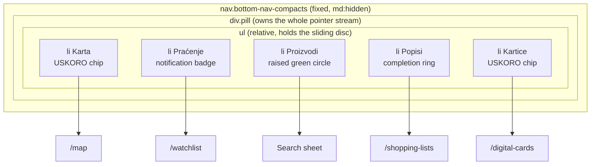
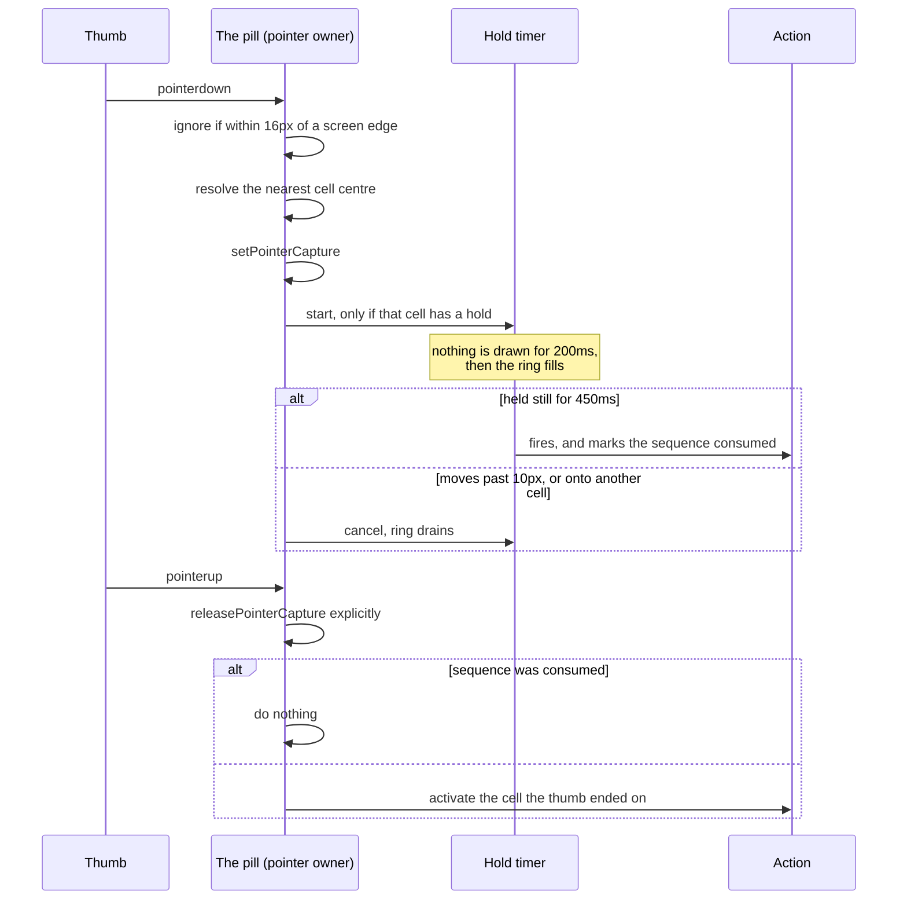
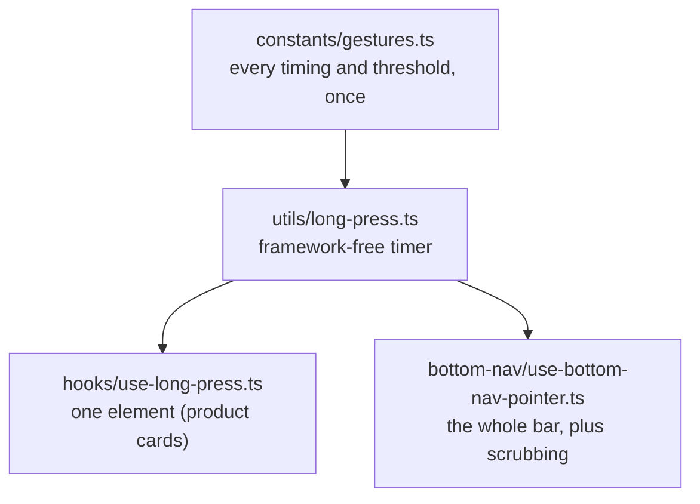
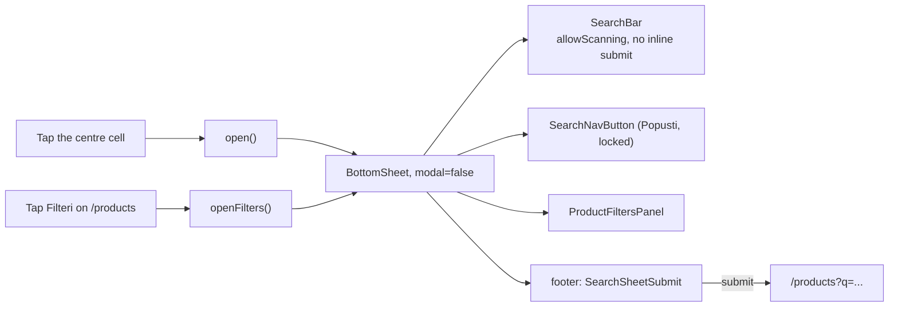
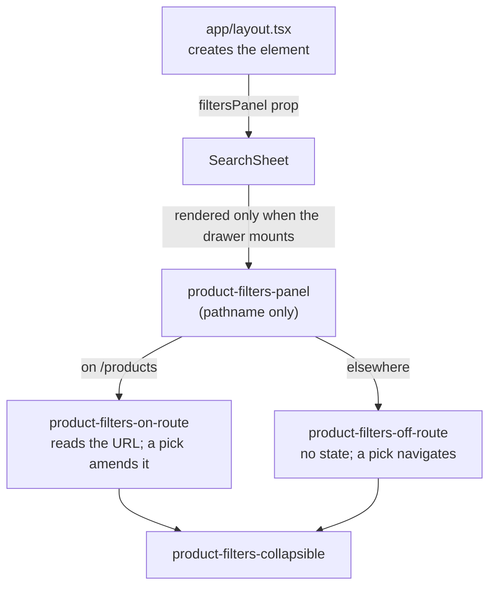

# Disscount: Mobile Navigation Guide

A complete reference for the mobile bottom navigation: the bar itself, its gestures, the search sheet it opens, the product filters inside that sheet, and the shared bottom-sheet surface they all sit on. Written to be understandable even if you are new to the codebase. Keep it up to date as the feature changes.

_Built against `docs/MOBILE-NAV-SPEC.md`, which is the requirements document. This file is the implementation reference: what exists, where it lives, and why it is shaped this way._

> **Mental model in one sentence:** below `md` the app grows a fixed five-cell bar pinned to the bottom of the screen, whose middle cell opens a **non-modal bottom sheet** for searching and filtering (non-modal meaning the page behind it stays live and re-filters as you pick), while every cell also answers a **long press** with a shortcut that a visible button can always reach too.

---

## Table of contents

1. [Quick reference](#1-quick-reference)
2. [Why this exists](#2-why-this-exists)
3. [Anatomy of the bar](#3-anatomy-of-the-bar)
4. [How a touch becomes an action](#4-how-a-touch-becomes-an-action)
5. [Long press](#5-long-press)
6. [The search sheet](#6-the-search-sheet)
7. [The filters panel](#7-the-filters-panel)
8. [The shared bottom sheet](#8-the-shared-bottom-sheet)
9. [Layers, tokens and safe areas](#9-layers-tokens-and-safe-areas)
10. [What's automatic vs manual](#10-whats-automatic-vs-manual)
11. [Config, env vars & feature flags](#11-config-env-vars--feature-flags)
12. [Libraries](#12-libraries)
13. [Key files](#13-key-files)
14. [Accessibility](#14-accessibility)
15. [Gotchas & lessons learned](#15-gotchas--lessons-learned)
16. [Future improvements & TODOs](#16-future-improvements--todos)

---

## 1. Quick reference

| Thing                | Value                                                                                        |
| -------------------- | -------------------------------------------------------------------------------------------- |
| Shown at             | widths under `md` (768px), in a browser tab and in the installed PWA alike                   |
| Cells, left to right | Karta (USKORO), Praćenje, Proizvodi (search), Popisi, Kartice (USKORO)                       |
| USKORO cells         | disabled for everyone but an admin, the same rule the sidebar applies                        |
| Bar height           | 72px of content, plus `env(safe-area-inset-bottom)`                                          |
| Surface              | a floating pill, matching the scrolled header's translucent blurred treatment                |
| Active indicator     | a 57.6px disc that slides between cells and fades out over the centre one                    |
| Bottom sheets        | three, all sitting behind the bar; only the search sheet is non-modal                        |
| Long press           | fires at 450ms, draws nothing for the first 200ms, cancels past 10px of movement             |
| Contextual holds     | on `/products/<ean>`, Praćenje watches that product and Popisi adds it to a list             |
| Haptics              | none, deliberately (see [§15](#15-gotchas--lessons-learned))                                 |
| Env vars             | none. The whole feature is config-free (see [§11](#11-config-env-vars--feature-flags))       |
| Daily workflow       | nothing to configure. The bar reads its items from `constants/navigation.ts` and mounts once |

---

## 2. Why this exists

Before this, mobile navigation was hamburger-only: the header nav is hidden below `md` and the header search below `lg`, so on a phone every primary destination lived behind the sidebar drawer.

Nielsen Norman Group measured what that costs, across 179 participants on 6 live sites:

| Metric                       | Hidden nav (hamburger) | Visible + hidden |
| ---------------------------- | ---------------------- | ---------------- |
| Navigation actually used     | 57%                    | **86%**          |
| Content discoverability      | over 20% worse         | baseline         |
| Task completion time, mobile | 15% slower             | baseline         |

The important detail is that the best condition was **visible and hidden together**, not visible instead of hidden. That is why the sidebar was kept exactly as it was: the bar carries the five destinations that matter, the sidebar keeps carrying Statistika, Novosti, Popusti, Kontakt and the rest. There is deliberately **no "Više" tab**; overflow is the sidebar's job.

Ergonomics back this up. Hoober's field observation of 1,333 real interactions found 49% of people hold a phone one-handed and 75% of interactions are thumb-driven, which makes the bottom-centre band the easiest reach and the top corners the hardest.

---

## 3. Anatomy of the bar



Each ordinary cell stacks, back to front: the two rings (list completion and long-press progress, both concentric with the disc), then a 24px icon carrying the notification badge and the re-tap chevron, then the label, then the USKORO chip for a teaser. The centre cell is different: a raised, filled, brand-green 44.8px circle with `Proizvodi` underneath, which opens a sheet instead of navigating.

**The active disc is a single element that never unmounts.** It lives in the `<ul>` as an `aria-hidden` list item, positioned with a percentage `left` inside the cell row, so both its slide and its fade are ordinary CSS transitions. This matters more than it sounds: an indicator that unmounts and remounts per cell has no previous value to animate from, which forces you to hold the outgoing opacity somewhere outside it. Keeping one element deletes that whole problem.

Why the two teasers sit on the outside: `Karta` and `Kartice` are not shipped. Putting them at the far edges keeps the arrangement symmetric with search dead centre, and puts the least useful cells in the hardest thumb positions.

### Locked teaser cells

A coming-soon cell is a dead end for everyone but an admin, which is the rule `sidebar-nav-item.tsx` already applies:

```ts
const isLocked = Boolean(item.comingSoon) && !isAdmin(user?.accountType);
```

A locked cell is a `disabled` button: no tap, no keyboard focus, no scrub tint, no long press. Two things worth knowing:

- This runs **against** Apple's Human Interface Guidelines, which are emphatic that a tab must never be disabled. Consistency with the app's other two navigations won, since a bar that walks you into a teaser page the header refuses to open is the more confusing inconsistency.
- The lock is enforced **twice**, on the element and on the bar's pointer path, because a disabled button does not stop a container-level pointer handler from resolving that cell.

### Signed out

Three of the five destinations are auth protected (`/watchlist`, `/shopping-lists`, `/digital-cards`). Those cells **still navigate**. The page then renders the existing `LoginRequired`, which explains the feature and opens the auth modal. That needed no new code, and it is why those cells are not locked: explaining beats dead-ending wherever there is something to explain.

### Compaction on scroll

Once the page is scrolled, the labels fade and collapse and the surface drops to 90% opacity, over a scroll range of roughly 40px to 180px. It is driven by a CSS **scroll timeline**, so there is no scroll listener, no jank and no hydration behaviour.

Three things to know:

- The three animated values are registered with `@property`. **Unregistered custom properties animate discretely** and would snap at the halfway point instead of fading.
- The bar's outer height never changes, so the pill does not resize mid-scroll and the page's reserved space never shifts.
- It **compacts, it never hides.** Hiding navigation gives back the roughly 21% task-completion penalty this feature exists to avoid. Browsers without scroll-driven animations keep the full-size bar, which is the correct fallback.

---

## 4. How a touch becomes an action

All pointer handling lives on the pill, not on the individual cells. That is what lets a tap, a scrub and a long press be one code path, because **a tap is just a zero-distance scrub**.



Activation branches four ways:

| Case                        | What happens                                                      |
| --------------------------- | ----------------------------------------------------------------- |
| Centre cell                 | opens the search sheet, or closes it when it is already open      |
| A locked teaser cell        | nothing, beyond dismissing the sheet                              |
| The cell you are already on | scroll to the top, and a second tap returns you to where you were |
| Any other cell              | navigate to that destination                                      |

Every branch except the centre one dismisses the search sheet first. That covers what a route-change rule cannot: re-tapping the tab you are already on does not change the route.

**Route match and activation are deliberately separate questions.** `useBottomNavCells` runs a pure `pathname.startsWith` test over all five cells, so the centre cell lights up on `/products`, while an `isCenter` flag on the cell decides what a tap _does_. Conflating them is a real bug class: it leaves the products route with no `aria-current` at all, and lights the centre cell up merely because a sheet opened, which is not a route change.

### Scrubbing

Press anywhere on the bar and drag: the disc follows your thumb, each icon it passes swells, and release commits whichever cell you ended on. This composes with the long press for free, because the 10px movement threshold that abandons a hold is the same threshold that means "you are scrubbing, not tapping".

Cells resolve by **nearest centre, measured from the cells' own bounding boxes**. Dividing the pill's width by five would skew every boundary, because the pill has inner padding, and nearest-centre also answers correctly for a press that lands in that padding rather than on any cell.

### Re-tapping the active tab

Scroll to top, then a second tap returns. Expo's native tabs, Ionic, Instagram and Medium all do the first; X adds the return trip. A small chevron shows on the active icon while a return position is held.

It has to move the window by hand, because **Next does not scroll when you navigate to the URL you are already on**. The saved position carries the pathname it was taken on, so it expires by itself on navigation without needing an effect: a position from one route means nothing on the next.

---

## 5. Long press

Long press is strictly an **accelerator**, never the only way to reach something. Every target is also reachable by a visible, tappable control, which is what keeps it usable by keyboard and screen reader.

| Gesture                  | On `/products/<ean>`       | Everywhere else            | Enabled?                            |
| ------------------------ | -------------------------- | -------------------------- | ----------------------------------- |
| Hold **Karta**           | store preferences          | store preferences          | admins only, until the map ships    |
| Hold **Praćenje**        | watch this product         | nothing                    | yes                                 |
| Hold the **centre cell** | the barcode scanner        | the barcode scanner        | yes                                 |
| Hold **Popisi**          | add this product to a list | create a new shopping list | yes                                 |
| Hold **Kartice**         | create a new digital card  | create a new digital card  | wired, off until digital cards ship |
| Hold a **product card**  | its quick-actions sheet    | its quick-actions sheet    | yes                                 |

### Timing

| Value                 | Source                                                                                      |
| --------------------- | ------------------------------------------------------------------------------------------- |
| **450ms** fire        | iOS `minimumPressDuration` is 0.5s, Android roughly 400-500ms, react-aria defaults to 500ms |
| **200ms** silent gate | past a deliberate tap, so an ordinary tap draws nothing at all                              |
| **250ms** ring fill   | whatever the gate leaves of the 450ms, so the fill reads as "committed"                     |
| **10px** cancel       | beyond this, the press is a drag or a scroll                                                |

The gate is a **real gate, not a clamp**: until it elapses the timer has scheduled nothing but two timeouts, with no animation-frame loop and no progress written anywhere. This matters because a threshold chosen from perception research alone (Nielsen's 0.1s "instant" window) is shorter than a real thumb tap, which runs 150 to 200ms, so it would flash a sliver of ring on **every** tap and make the bar feel broken. A gesture's feedback threshold has to clear the gesture it distinguishes itself from.

The ring is the discoverability mechanism, and the reason no coachmark was built: a press that outlives the gate shows the ring begin to fill, which teaches the gesture while you are performing it. NN/g's own finding is that users do not read coach marks and forget them within about 20 seconds.

### Where the code lives



The timer lives outside React because the two consumers own very different pointer streams (a single element versus a container with capture and index resolution) but must never drift on timing. Progress is written straight to the pressed element as a `--press-progress` custom property rather than held in state, so the ring does not re-render its subtree once per frame.

Cells declare the **kind** of hold they have, never what it does. `resolveHoldTarget` maps a kind to an action and is the single answer to both "what does this hold do" and "does this cell have a hold at all", so the firing path and the enablement check cannot disagree.

Why the centre cell holds the scanner: typing a product name and scanning its barcode answer the same question, "what does this cost?", so they belong on the same control. Tap to type, hold to scan. It is the one long press whose meaning is guessable without being taught.

Product cards keep their own quick-actions sheet even though the bar reaches the same two targets, because in a list the bar has no way to know which card you meant.

---

## 6. The search sheet

Tapping the centre cell opens a compact sheet directly above the bar. Top to bottom it holds the existing `SearchBar` with its scan button, a **Popusti** shortcut, the **Filteri** toggle, and a full-width **Pretraži** button pinned in the sheet's footer.



It is the **only non-modal sheet in the app**, because it is an addition to the page rather than a task on top of it: picking a facet re-filters the list behind it live. That costs it every outside dismissal, which is why the centre cell is a toggle whose glyph rotates from a magnifier to double chevrons, pointing the way the sheet actually leaves.

### When it closes

The close rule is **derived, not reset in an effect**. The state carries the pathname the sheet was opened on, and the sheet counts as open only while you are still on that route, or on `/products`, whose filters live inside it. So it cannot be open for even one frame on a route that should have dismissed it.

| Action                            | Pathname          | Sheet                  |
| --------------------------------- | ----------------- | ---------------------- |
| Submit a search from `/watchlist` | `/products`       | stays open             |
| Submit again on `/products`       | unchanged         | stays open             |
| Scan a barcode                    | `/products/<ean>` | closes                 |
| Open a product                    | `/products/<ean>` | closes                 |
| Tap any other nav cell            | that tab          | closes, via activation |

### The Pretraži button

It sits in the sheet's **footer**, outside the scrolling body, so expanding the filters can never push the one control that acts on them out of thumb reach. That puts it outside `SearchBar`'s `<form>`, so it carries that form's id. Form **ownership**, not DOM ancestry, is what the HTML spec uses to pick a form's default button, so Enter in the field still submits from there, and disabling the button disables that too.

It is disabled whenever submitting would change nothing. `isUnchanged` lives on `useSearchNavigation`, right next to the `routeQuery` it compares against, so the landing hero, the header, the sidebar, the products page and the sheet all behave identically. An empty field counts as unchanged whatever the URL holds, because the clear button already drops the query itself.

---

## 7. The filters panel

The sheet carries the products page's four facet controls (Trgovine, Lokacije, Kategorije, Marka) behind the **Filteri** toggle, on **every route**. Expanding grows the sheet upward in place rather than stacking a second sheet over it, so the query you typed stays in view and there is only ever one layer to dismiss. NN/g's guidance is explicit that stacked sheets disorient.

**This is the only filters surface below `md`.** The products page's own Filteri button calls `openFilters()` and lands you in this panel; above `md` the page still renders every facet inline.

Three ways in:

| Gesture                              | Result                                                            |
| ------------------------------------ | ----------------------------------------------------------------- |
| Tap **Filteri** inside the sheet     | expands, chevron flips                                            |
| Tap **Filteri** on the products page | opens the sheet already expanded, with the field left unfocused   |
| **Drag the sheet upward** past 40px  | expands, mid-drag, so the sheet grows under the finger that asked |

### How the panel is wired



Two things fall out of passing the panel down from the layout as an opaque node. Nothing under `components/custom/` imports a feature folder, and the panel's hooks only run once the drawer mounts, which is what keeps `useSearchParams` out of the prerender path.

Five things make this work without touching the facet controls themselves:

- **The guard is its own file**, holding no hook but the pathname, because a component that owns hooks cannot early-return on a route without changing its hook order between renders.
- **Filters always land on `/products`.** On that route a pick amends the URL and the list behind updates live. Anywhere else there is no filter state to amend, so the pick and whatever is typed travel together in one navigation.
- **The facet query is empty off the route**, deliberately. That avoids a stray request and stops another page's own `q` (the map page has one, for store names) from facetting products.
- **`useProductFilters` reads only.** Seeding the user's pinned stores into the URL is the page's job, called once from `products-client.tsx`, so any number of readers can mount without racing it into double-appending params.
- **No extra requests.** The facets hook reuses the query key the list already holds, and it fetches nothing when the query is empty.

**Očisti filtere is icon-only below `md`**, an outlined X naming itself through a tooltip, and labelled outright above `md`. It stays mounted and disabled when there is nothing to clear, so the row does not reflow every time the last filter goes.

---

## 8. The shared bottom sheet

One surface owns everything a sheet used to hand-roll, so a call site supplies content, a title and a modality and nothing else.

| Fixed by the shell | Value                              | Why it cannot be per call site                            |
| ------------------ | ---------------------------------- | --------------------------------------------------------- |
| Layer              | below the bar                      | so the pill is never covered                              |
| Surface            | the bar's blur at 85% background   | at the bar's own 50% the page ghosts through the controls |
| Height cap         | `85dvh`                            | one cap, so a growing sheet always yields to the viewport |
| Bottom inset       | `--sheet-bottom-clearance`         | so no content hides under the bar                         |
| Handle gap         | the header row's own padding, 16px | holds whether or not the header draws anything            |
| Focus              | a named field on open, declinable  | so a tap lands the cursor ready to type                   |

Current users:

| Sheet                    | Modal | Why                                                                               |
| ------------------------ | ----- | --------------------------------------------------------------------------------- |
| Search                   | no    | picking a facet re-filters the list behind it live                                |
| Product quick actions    | yes   | a launcher; nothing behind it changes and two of its actions open a dialog anyway |
| PWA install instructions | yes   | instructions to read and then leave; the scrim helps focus and costs nothing      |

**Modality is decided by one question: does the page behind change while the sheet is open?** This mirrors Material's split between a standard sheet, which "co-exists with the screen's main UI region", and a modal sheet, which "presents a set of choices while blocking interaction with the rest of the screen". The default is modal, because two of the three are, and because a non-modal sheet needs the pointer-events workaround in [§15](#15-gotchas--lessons-learned) that nobody should get by accident.

A modal sheet's scrim sits **below the bar**, so all three sheets layer identically and the pill stays visible, dimming through its own translucency. Accepted consequence: while a modal sheet is open the bar is visible but inert, which is already true under every dialog in the app.

---

## 9. Layers, tokens and safe areas

### The `--spacing: 0.2rem` trap

`globals.css` sets `--spacing: 0.2rem`, where Tailwind's default is `0.25rem`. **Every spacing utility in this project is 20% smaller than it reads:**

| Utility   | Renders as |
| --------- | ---------- |
| `h-16`    | 51px       |
| `size-12` | 38px       |
| `p-4`     | 12.8px     |

So the bar and the sheets express none of their dimensions through the spacing scale. They use explicit lengths and two custom properties instead.

### The two geometry tokens

```css
--bottom-nav-total: calc(
  var(--bottom-nav-h) + var(--bottom-nav-gap) + var(--bottom-nav-safe)
);
--sheet-bottom-clearance: calc(var(--bottom-nav-total) + 0.5rem);
```

Both go to zero-ish above `md`, in the **one** media query where this geometry branches on breakpoint. That is what lets the sheet hardcode a single bottom padding and be correct at both sizes.

Exactly five files may mention these: `globals.css` (defines them), the sheet surface, the layout's reserved space, the install banner and the toaster. **No sheet call site sets a padding, a layer or a safe-area value.**

### The layer ladder

Written as named tokens in descending order, so the ordering is the contract rather than a comment:

| Token                    | Value | Element                     |
| ------------------------ | ----- | --------------------------- |
| `--z-offline`            | 60    | offline indicator           |
| `--z-overlay`            | 50    | dialogs, popovers, tooltips |
| `--z-bottom-nav`         | 45    | **the bar**                 |
| `--z-bottom-sheet`       | 44    | bottom sheets               |
| `--z-bottom-sheet-scrim` | 43    | a modal sheet's scrim       |
| `--z-install-banner`     | 41    | PWA install banner          |
| `--z-scroll-fade`        | 40    | window scroll fade          |
| `--z-back-to-top`        | 30    | back-to-top button          |
| `--z-header`             | 20    | header                      |
| `--z-sidebar`            | 10    | desktop sidebar             |

### Viewport changes this required

| Change                                 | Why                                                                                                             |
| -------------------------------------- | --------------------------------------------------------------------------------------------------------------- |
| `viewportFit: "cover"`                 | Without it **every `env(safe-area-inset-*)` silently resolves to 0**, and the bar sits under the home indicator |
| `interactiveWidget: "resizes-content"` | Shrinks the layout viewport when the keyboard opens, so fixed bottom elements reposition                        |
| `min-h-screen` to `min-h-svh`          | `100vh` is computed as if browser UI were hidden, so a `100vh` shell is taller than the visible area            |
| bottom padding on the shell wrapper    | Not on `<main>`, because `Footer` renders after it (see [§15](#15-gotchas--lessons-learned))                    |
| `scroll-padding-bottom` on `:root`     | So anchor jumps and scripted scrolls do not land under the bar                                                  |

---

## 10. What's automatic vs manual

| Task                                        | Automatic? | Notes                                                                        |
| ------------------------------------------- | ---------- | ---------------------------------------------------------------------------- |
| Showing and hiding the bar by width         | auto       | Pure CSS `md:hidden`, so it ships in the prerendered HTML with no shift      |
| Safe-area padding                           | auto       | `env(safe-area-inset-bottom)`, once `viewportFit: "cover"` is set            |
| Reserving page space for the bar            | auto       | The shell wrapper's padding derives from the shared token                    |
| Compaction on scroll                        | auto       | Scroll timeline, no listener                                                 |
| Closing the search sheet on navigation      | auto       | Derived from the pathname it was opened on                                   |
| Keeping a sheet clear of the bar            | auto       | The shell pads it; no call site sets padding                                 |
| Routing a filter pick to `/products`        | auto       | On the route it amends the URL, off it the pick and query travel together    |
| Collapsing the filters between opens        | auto       | `open()` and `openFilters()` each set it as they open                        |
| Disabling Pretraži when it would do nothing | auto       | `isUnchanged()` compares the field with the route's own `q`                  |
| Locking and unlocking teaser cells          | auto       | Derived from `comingSoon` plus the admin check                               |
| Swapping a hold's target on a product page  | auto       | Resolved from the path at press time                                         |
| **Adding or reordering a cell**             | manual     | Edit `bottom-nav-items.ts`, and remember a shipped tab set should not change |
| **Enabling the Kartice long press**         | manual     | Flip `holdDisabled`, and drop `comingSoon` so the cell unlocks               |
| **A real price-drop badge count**           | manual     | Needs an endpoint or a per-user last-seen timestamp                          |
| **Verifying iOS safe areas and keyboard**   | manual     | Needs a real iPhone; DevTools emulation shows neither                        |

---

## 11. Config, env vars & feature flags

**This feature adds no environment variables at all.** Nothing about the bar, the sheets or the gestures is configurable per environment, and nothing needs to be kept in sync between `.env.local` and `.env.local.example`.

What does gate behaviour lives in code:

| Flag                            | Where                            | Effect                                                                   |
| ------------------------------- | -------------------------------- | ------------------------------------------------------------------------ |
| `comingSoon` on a nav item      | `constants/navigation.ts`        | Renders the USKORO chip and locks the cell for non-admins                |
| `holdDisabled` on a cell        | `bottom-nav/bottom-nav-items.ts` | Wires a hold ahead of the feature it belongs to, but keeps it inert      |
| `isCenter` on a cell            | `bottom-nav/bottom-nav-items.ts` | Makes the cell raised, and makes a tap open the sheet instead of routing |
| `PROTECTED_ROUTE_PREFIXES`      | `constants/protected-routes.ts`  | Decides which cells land on a `LoginRequired` page when signed out       |
| `devIndicators.position`        | `next.config.ts`                 | Moves Next's dev overlay off the bar's left cell                         |
| `NEXT_PUBLIC_ENABLE_REACT_SCAN` | `.env.local` (pre-existing)      | Unrelated to the bar, but its toolbar overlaps the bottom of the screen  |

---

## 12. Libraries

Versions read from `frontend/package.json`. Nothing new was installed for this feature.

| Library                       | Version             | Role here                                                                     |
| ----------------------------- | ------------------- | ----------------------------------------------------------------------------- |
| `next`                        | `16.2.11`           | App Router, `usePathname` / `useSearchParams`, the viewport export            |
| `react` / `react-dom`         | `19.2.8`            | The component model; ref callbacks with cleanup                               |
| `vaul`                        | `^1.1.2`            | The drawer primitive under every bottom sheet (swipe to close, the handle)    |
| `radix-ui`                    | `^1.4.3`            | The dialog primitives vaul builds on, and the focus scope the shell overrides |
| `@radix-ui/react-collapsible` | `^1.1.12`           | The filters panel's expand-in-place animation                                 |
| `@radix-ui/react-tooltip`     | `^1.2.8`            | Names the icon-only Očisti filtere button                                     |
| `lucide-react`                | `^1.26.0`           | Every icon on the bar and in the sheets                                       |
| `react-hook-form`             | `^7.68.0`           | The search field's form state                                                 |
| `@tanstack/react-query`       | `^5.90.12`          | The list-completion ring and the facet options, both from existing cache keys |
| `sonner`                      | `^2.0.7`            | Toasts, lifted clear of the bar via `mobileOffset`                            |
| `tailwindcss`                 | `^4`                | All styling, including the scroll-driven compaction                           |
| `clsx` + `tailwind-merge`     | `^2.1.1` / `^3.4.0` | The `cn()` helper used throughout                                             |

**`motion` (`^12.23.26`) is deliberately not used by the bar.** Every animation here is a CSS transition or a scroll timeline, which is why the sliding disc needs no layout-animation library and no shared layout id.

---

## 13. Key files

### The bar

| File                                          | Role                                                              |
| --------------------------------------------- | ----------------------------------------------------------------- |
| `components/custom/bottom-nav/bottom-nav.tsx` | The pill, and where the pointer layer attaches                    |
| `bottom-nav/bottom-nav-items.ts`              | The five cells, each declaring the kind of hold it has            |
| `bottom-nav/bottom-nav-cell.tsx`              | One ordinary cell: rings, icon, badge, chevron, label, chip       |
| `bottom-nav/bottom-nav-center-cell.tsx`       | The raised circle and its search-to-chevrons glyph swap           |
| `bottom-nav/bottom-nav-active-disc.tsx`       | The single sliding disc                                           |
| `bottom-nav/bottom-nav-rings.tsx`             | Completion and hold-progress rings, concentric with the disc      |
| `bottom-nav/bottom-nav-label.tsx`             | The label that collapses with the compaction                      |
| `bottom-nav/use-bottom-nav-cells.ts`          | Five view models from the registry, pathname, user, notifications |
| `bottom-nav/use-bottom-nav-pointer.ts`        | Capture, edge exclusion, scrub, hold, activation, release         |
| `bottom-nav/use-cell-rects.ts`                | Nearest-centre resolution from the cells' own boxes               |
| `bottom-nav/use-bottom-nav-activation.ts`     | The four activation branches                                      |
| `bottom-nav/use-retap-scroll.ts`              | Scroll to top, then back, expiring on navigation                  |
| `bottom-nav/use-shopping-list-progress.ts`    | The ticked share of the list whose page you are on                |
| `bottom-nav/resolve-hold-target.ts`           | Hold kind to action, and the enablement answer                    |

### Shared primitives

| File                                              | Role                                                     |
| ------------------------------------------------- | -------------------------------------------------------- |
| `components/custom/bottom-sheet/bottom-sheet.tsx` | The one geometry contract every sheet uses               |
| `bottom-sheet/bottom-sheet-header.tsx`            | Title over description, holding the grab handle's gap    |
| `bottom-sheet/use-bottom-sheet-drag-expand.ts`    | The 40px upward drag vaul clamps away                    |
| `constants/gestures.ts`                           | Every timing and threshold, defined once                 |
| `utils/long-press.ts`                             | The framework-free hold timer                            |
| `hooks/use-long-press.ts`                         | One element's worth of it, for product cards             |
| `utils/route-ids.ts`                              | The product EAN and list id parsed from a pathname       |
| `utils/events.ts`                                 | `isKeyboardClick`, so cells ignore pointer-driven clicks |
| `utils/scroll.ts`                                 | Reduced-motion-aware scrolling                           |

### The search sheet and its filters

| File                                                      | Role                                                     |
| --------------------------------------------------------- | -------------------------------------------------------- |
| `components/custom/search/search-sheet.tsx`               | The sheet's contents and its modality                    |
| `search/search-sheet-submit.tsx`                          | The footer button, and the only place that reads the URL |
| `search/search-submit-button.tsx`                         | Shared by the inline bars and the sheet footer           |
| `search/search-nav-button.tsx`                            | The Popusti teaser                                       |
| `search/use-search-bar-form.ts`                           | The field's form, route mirroring, clearing and scanning |
| `context/use-search-sheet-state.ts`                       | Open, expanded and the typed draft, in one update        |
| `context/search-sheet-context.tsx`                        | The provider and its hook                                |
| `app/products/components/product-filters-panel.tsx`       | The pathname guard over the two variants                 |
| `app/products/components/product-filters-collapsible.tsx` | The trigger row and the facets, shared by both variants  |
| `app/products/hooks/use-off-route-filters.ts`             | A pick off the route, carried with the typed query       |

---

## 14. Accessibility

| Concern              | How it is handled                                                                                          |
| -------------------- | ---------------------------------------------------------------------------------------------------------- |
| Landmark             | A real `<nav>` with `aria-label="Glavna navigacija"`, since the page has three landmarks                   |
| Current page         | `aria-current="page"` on the active cell, the only thing that says "you are here" to a reader              |
| Roles                | `nav > ul > li > button`. **Not** tablist/tab, which are for in-page panels and imply arrow-key navigation |
| Locked cells         | A `disabled` button, skipped by tab order and announced as unavailable, chip still readable                |
| Toggling controls    | The centre cell carries `aria-expanded` and renames to `Zatvori traženje` while open                       |
| Not colour alone     | Active state is the disc **plus** the tint **plus** a bold label (WCAG 1.4.1)                              |
| Touch targets        | Five equal cells across the pill, 72px tall, comfortably over the 48px practical minimum                   |
| Keyboard             | Real buttons. Because the bar owns the pointer stream, cells act only on keyboard clicks                   |
| Gesture parity       | Every hold target is also reachable by a visible control (WCAG 2.1.1, 2.5.1)                               |
| Pointer cancellation | The press fires on the hold timer, and moving 10px abandons it (WCAG 2.5.2)                                |
| Icon-only controls   | Očisti filtere keeps its name in both `aria-label` and a tooltip, and renders it above `md`                |
| Focus order          | The bar is last in the DOM, so keyboard users reach the content first                                      |
| Reduced motion       | The disc, the compaction, the glyph swap and every scripted scroll are all instant                         |

---

## 15. Gotchas & lessons learned

**Cells must be `<button>`, never `<a href>`.** iOS shows a link-preview popover, a callout and a drag affordance on a long-pressed anchor, and `-webkit-touch-callout: none` is unreliable. A button has none of those. SEO is unaffected, because the prerendered header and sidebar already carry the crawlable links for these routes.

**`contextmenu` never fires on an iOS long press.** It has not since iOS 13.1, so the gesture cannot be built on it and has to be a `pointerdown` timer.

**`viewportFit: "cover"` is not optional.** Without it every `env(safe-area-inset-*)` resolves to `0`, and there is no error to tell you: the bar just quietly sits under the home indicator.

**`--spacing: 0.2rem` makes every spacing utility 20% small.** `h-16` is 51px here, not 64px. Bar and sheet geometry uses explicit lengths for exactly this reason.

**Custom properties need `@property` to animate.** Without registration they animate discretely and snap at the halfway point, so the compaction would jump instead of fading.

**Padding on `<main>` does not protect the footer.** `Footer` renders _after_ main with `mt-auto`, so main's bottom padding sits above it and the bar covers the footer anyway. The clearance belongs on the shell wrapper.

**A non-modal drawer does not actually leave the page usable.** vaul never passes `modal` down to Radix's dialog, so Radix is always in modal mode and writes an inline `pointer-events: none` onto `<body>`. So "non-modal" gets you no scrim and no scroll lock but an inert page anyway, which is a silent trap: the page looks live and is not. `globals.css` overrides it with `!important`, keyed off the sheet's own `data-bottom-sheet="non-modal"` marker, because the only shared vaul marker is also worn by the mobile sidebar drawer.

**A non-modal drawer also cannot be dismissed from outside itself.** Its outside-press and focus-outside handlers return early when `!modal`, so anything that should close such a sheet has to do it explicitly. That is why the centre cell is a toggle and why every other cell closes it.

**Do not make a sheet's surface pointer-transparent to protect what is above it.** The bar is above the sheet and already wins hit testing on its own box. Making the layer transparent and its children opaque leaves every pixel of the sheet's **own padding** as a hole, and a press in a hole never starts the drag, which breaks swipe-to-close exactly where the grab handle is.

**`sr-only` on a header container takes its padding with it.** It is `position: absolute`, so a row marked `sr-only` contributes no height at all, padding included. Mark the _text_ and let the row keep its padding, and the handle's gap holds either way with no conditional padding anywhere.

**Nothing rendered during prerender may call `useSearchParams`.** A component mounted in the root layout that reads the URL drops **every page in the app** out of the prerender. The submit comparison and the filters panel are both only _created_ in the layout and only rendered once the drawer mounts; creating an element calls no hooks.

**Route params never reach the root layout either.** A layout has no dynamic segment of its own, so anything mounted there parses `usePathname()` instead. That is what `utils/route-ids.ts` is for.

**Capturing the pointer on the container retargets the click**, so activation runs on `pointerup` and cells handle only keyboard clicks. Release the capture **explicitly** on both end and abort: relying on the implicit release leaves captures outliving their gesture, which shows up as a tap on one tab activating a different one.

**Comparing the field against the URL flashes on a clear.** Clearing resets the field and _then_ navigates, so for one render an empty field sits over the old `q` and reads as a change. Treating empty as unchanged removes it and costs nothing.

**Filters never wait on a submit**, so there is nothing to compare them against. Every pick writes itself to the URL as you make it, which is why the Pretraži rule can only ever answer for the query.

**A disabled trigger cannot open a tooltip**, because the button sets `disabled:pointer-events-none`. Fine for Očisti filtere, which is disabled exactly when there is nothing to explain, but it rules tooltips out as the only label for a control disabled for a reason the user needs to know.

**A controlled multi-select must emit from its props.** Its internal set is seeded once at mount and never resynced, so emitting from it resurrects cleared values: clear the filters, pick one option, and every cleared one comes back.

**Do not set `touch-action: none` on things inside a scroller.** `pointercancel` fires for free when a scroll claims the pointer, which is what abandons a hold on a product card, and suppressing panning suppresses that too. Only the bar, which is fixed chrome, sets it.

**Reduced motion never applies to a scripted scroll.** Browsers apply the preference to the CSS `scroll-behavior` property and never to the JS `behavior` option, so `utils/scroll.ts` checks it itself.

**Haptics are a dead end on iOS.** `navigator.vibrate` has never shipped in WebKit. Android Chrome supports it, but a buzz that exists on one platform only is worse than none, so the feel comes entirely from motion and timing.

**The iOS keyboard will not always open by itself.** iOS raises it only when `.focus()` runs inside the same task as the gesture, and a sheet that mounts on open is async. The cursor lands in the field, but on iOS the user may need one tap.

**Two of five cells being teasers is a real risk, and locking them sharpens it.** No UX research endorses teaser destinations in primary navigation. If `Karta` and `Kartice` stay unshipped for long, 40% of the bar is dead weight and it starts reading as vaporware.

---

## 16. Future improvements & TODOs

### Not yet verified

- **Nothing on this branch has been exercised in a browser.** Types, lint and formatting are clean and the structural checks pass, but no gesture, sheet geometry or swipe has been observed. This is the first thing to do.
- **The iOS pieces need real hardware**: safe areas, the keyboard on the centre cell, and whether the pill's floating gutter feels right one-handed in a store.
- **Watch the stacked blurs on mid-range Android.** The header, the bar and every sheet all use a backdrop blur, and a sheet's blur repaints on every frame of a drag. This is the classic jank source.

### Feature work

| Item                                         | Notes                                                                                                                               |
| -------------------------------------------- | ----------------------------------------------------------------------------------------------------------------------------------- |
| Price-drop count badge on Praćenje           | Swap the notification count for "watched products cheaper since your last visit", capped at 9+                                      |
| Enable the Kartice long press                | One flag the day digital cards ship, plus dropping `comingSoon` so the cell unlocks                                                 |
| Selection mode on a shopping list            | Hold an item to get a contextual action bar, and cost a subset across chains. Its own feature                                       |
| An accessory strip above the bar             | The active list's name, ticked count and running total. Needs a product answer for "active"                                         |
| Strip the mobile header, collapse the footer | So 360px does not carry three competing navigations                                                                                 |
| Instrument the bar in Umami                  | Per-cell taps plus the sidebar open rate, before and after. If sidebar opens do not drop, the extra chrome is not paying for itself |

### Open questions

- **Should Pretraži become the apply gate for the filters?** Today every pick applies itself, so the button only answers for the query. Batching the picks would make the sheet a form you fill and submit, at the cost of the live filtering the non-modal sheet exists for. A product call, not a technical one.
- **A peek menu for the long press**, a capsule rising above the tab that you slide onto to commit. More discoverable than firing on a timer, and it gives cancellation for free.
- **Let `ModalShell` present as a sheet below `md`.** Its `TODO(responsive-drawer)` predates this work, and now that the shell owns its geometry the remaining gap is the prop shapes.
