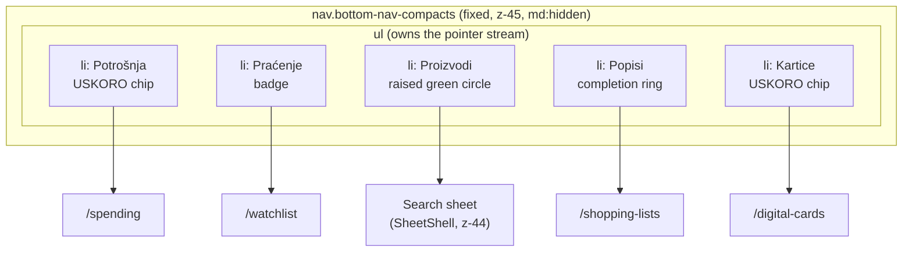
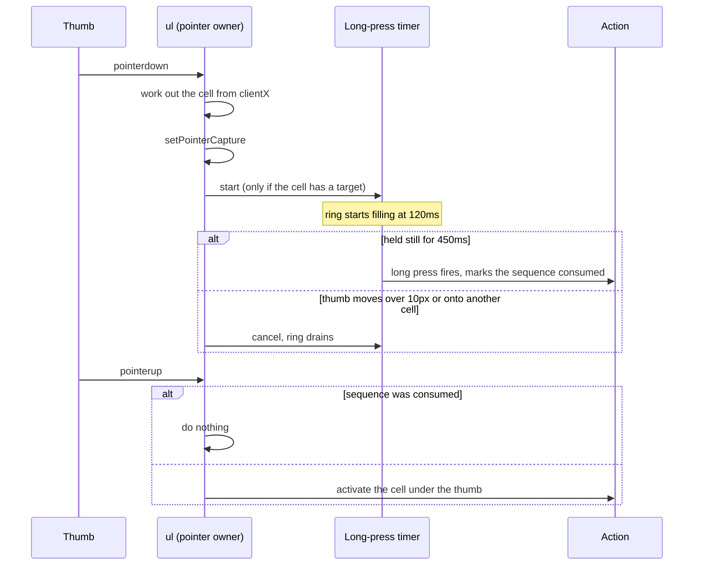
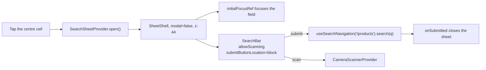
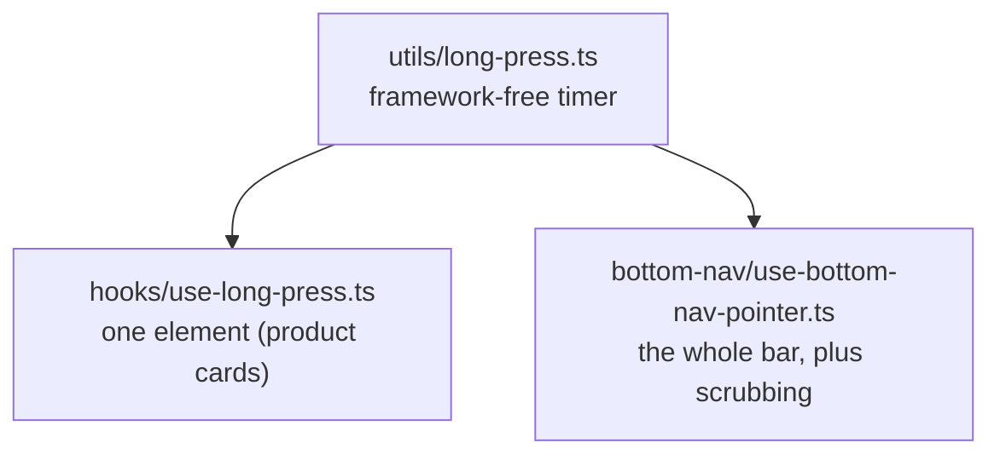

# Disscount: Mobile Navigation Guide

A complete reference for the mobile bottom navigation bar, its gestures, and the shared bottom-sheet shell it opens, written to be understandable even if you're new to this. Keep it up to date as the setup changes.

_Last verified end-to-end on 2026-07-25 against `feat/mobile-bottom-nav`._

> **Mental model in one sentence:** below the `md` breakpoint the app grows a five-cell **tab bar** pinned to the bottom of the screen, and that bar is the only primary navigation a phone user needs, because the hamburger sidebar stays as overflow, the create actions hang off **long presses**, and back-to-top becomes **re-tapping the tab you are already on**.

---

## Table of contents

1. [Quick reference](#1-quick-reference)
2. [Why this exists](#2-why-this-exists)
3. [Anatomy of the bar](#3-anatomy-of-the-bar)
4. [How a touch becomes an action](#4-how-a-touch-becomes-an-action)
5. [The surface](#5-the-surface)
6. [The search sheet](#6-the-search-sheet)
7. [SheetShell, the shared bottom sheet](#7-sheetshell-the-shared-bottom-sheet)
8. [Long-press gestures](#8-long-press-gestures)
9. [Live state on the bar](#9-live-state-on-the-bar)
10. [Layout, safe areas and CSS tokens](#10-layout-safe-areas-and-css-tokens)
11. [What the bar replaced](#11-what-the-bar-replaced)
12. [Key files](#12-key-files)
13. [Libraries](#13-libraries)
14. [Accessibility](#14-accessibility)
15. [What's automatic vs manual](#15-whats-automatic-vs-manual)
16. [Gotchas & lessons learned](#16-gotchas--lessons-learned)
17. [Future improvements & TODOs](#17-future-improvements--todos)

---

## 1. Quick reference

| Thing                 | Value                                                                      |
| --------------------- | -------------------------------------------------------------------------- |
| Shown at              | widths under `md` (768px), in the browser and the installed PWA alike      |
| Cells, left to right  | Potrošnja (USKORO), Praćenje, Proizvodi (search), Popisi, Kartice (USKORO) |
| Bar height            | 72px of content, plus `env(safe-area-inset-bottom)`                        |
| Icon / label size     | 24px icon, 10.4px label, always visible                                    |
| z-index               | search sheet 44, **bar 45**, Radix and vaul overlays 50                    |
| Element type per cell | `<button>`, never `<a href>` (see [§16](#16-gotchas--lessons-learned))     |
| Long-press threshold  | 450ms, with the ring starting to fill at 120ms                             |
| Surface               | A floating pill, matching the scrolled header's treatment                  |
| Haptics               | none, deliberately (see [§16](#16-gotchas--lessons-learned))               |

**Daily workflow:** nothing to configure. The bar reads its items from `frontend/src/constants/navigation.ts` and mounts itself once in the root layout.

---

## 2. Why this exists

Before this, mobile navigation was hamburger-only: `HeaderNav` is `hidden md:flex` and `HeaderSearch` is `hidden lg:block`, so on a phone every primary destination lived behind the `AppSidebar` drawer.

Nielsen Norman Group measured what that costs, across 179 participants on 6 live sites:

| Metric                       | Hidden nav (hamburger) | Visible + hidden |
| ---------------------------- | ---------------------- | ---------------- |
| Navigation actually used     | 57%                    | **86%**          |
| Content discoverability      | over 20% worse         | baseline         |
| Task completion time, mobile | 15% slower             | baseline         |

The important detail is that the best-performing condition was **visible and hidden together**, not visible instead of hidden. That is why the sidebar was kept: the bar carries the five destinations that matter, and the sidebar keeps carrying Karta, Statistika, Novosti, Popusti, Kontakt and the rest. There is deliberately **no "Više" tab**.

---

## 3. Anatomy of the bar



Each non-centre cell stacks, from back to front:

1. the **active disc**, a `motion.span` with a shared `layoutId` so it slides between cells,
2. the **completion ring** and the **long-press ring**, both circles matching the disc's geometry,
3. the **icon** at 24px, with the notification **badge** and the re-tap **chevron** hung off it,
4. the **label**, bold when the cell is active,
5. the **USKORO chip** for teaser cells.

The centre cell is different: it is a raised, filled, brand-green circle with `Proizvodi` underneath, and it opens a sheet instead of navigating.

### Why the two teaser cells sit on the outside

`Potrošnja` and `Kartice` are not shipped yet. Putting them at the far left and far right does two things: it keeps the arrangement symmetric with search dead centre, and it puts the least useful cells in the **hardest thumb positions**. Field observation (Hoober, 1,333 real interactions) found 49% of people hold a phone one-handed and 75% of interactions are thumb-driven, so the centre-bottom band is the easiest reach and the outer corners the hardest.

Apple's Human Interface Guidelines are emphatic that a tab must never be disabled or removed. In iOS 26 `UITabBarItem.isEnabled` has no effect at all. So the teaser cells **navigate normally** to their real routes and the page explains itself, rather than being greyed out or dead-ended.

---

## 4. How a touch becomes an action

All pointer handling lives on the `<ul>`, not on the individual cells. That is what lets a tap, a scrub and a long press be one code path, because **a tap is just a zero-distance scrub**.



Activation itself branches three ways, in `bottom-nav.tsx`:

| Case                        | What happens                                                  |
| --------------------------- | ------------------------------------------------------------- |
| Centre cell                 | opens the search sheet                                        |
| The cell you are already on | `useTabReentry`: scroll to top, then a second tap returns you |
| Any other cell              | `router.push(item.href)`                                      |

### Re-tapping the active tab

This is a documented convention: Expo's native tabs, Ionic, Instagram and Medium all scroll to top when you tap the tab you are on, and X adds a return trip. Ours does both, and shows a small chevron on the active icon while a return position is held.

It has to move the window by hand, because **Next does not scroll when you navigate to the URL you are already on**. The saved position is cleared whenever the pathname changes, since a position from one route means nothing on the next.

### Tab scrubbing

Press anywhere on the bar and drag: the active disc follows your thumb, each icon it passes swells, and release commits whichever cell you ended on. This composes with the long press for free, because the 10px movement threshold that abandons a long press is the same threshold that means "you are scrubbing, not tapping".

Presses that start within **16px of a screen edge** are ignored entirely, so the bar never competes with the iOS back-swipe or the home-indicator gesture.

---

## 5. The surface

A floating pill, taking the scrolled header's treatment verbatim so the app's two floating bars match:

```
mx-[0.5rem] px-[0.4rem] rounded-full border bg-background/50 backdrop-blur-sm
```

Three variants (this pill, an edge-to-edge flat bar and an edge-to-edge frosted one) were built behind a switcher so the look could be chosen on a real device. The pill won, and the other two plus their URL parameter, storage key and dev chip were removed.

The horizontal inset and inner padding are explicit rem values rather than spacing utilities, because of the `--spacing` trap in [§10](#10-layout-safe-areas-and-css-tokens). Together they hold the 57.6px active disc 11.5px clear of the pill's edges at a 360px viewport, and 7.5px at 320px, so the first and last cell's disc never touches the border.

One trade-off, flagged and accepted deliberately: this is a second blurred fixed layer over the header's own `backdrop-blur-sm`. Stacked blurs are the main scroll-jank source on mid-range Android, so it is worth watching on real hardware.

---

## 6. The search sheet

Tapping the centre cell opens a compact sheet directly above the bar, holding the existing `SearchBar` with its scan button and a full-width **Pretraži** button that stays disabled until something is typed.



Four deliberate choices:

- **`modal={false}`.** This drops vaul's scrim and scroll lock, which is what lets the sheet sit _behind_ the bar at `z-44` with the nav still visible on top at `z-45`. The sheet pads its own bottom by `--bottom-nav-total` so none of its content hides under the bar.
- **`passThroughSurface`.** The sheet's surface extends under the bar, so without this it would swallow taps meant for the tabs. See the pointer-events gotcha in [§16](#16-gotchas--lessons-learned), which needs two separate fixes to work.
- **It closes on route change**, matching `AppSidebar`. Submitting from `/products` only changes the query, not the pathname, which `onSubmitted` already covers.
- **The field is focused on open** via `initialFocusRef`, so the user can start typing immediately, and **Pretraži stays disabled** until something is typed.

The sheet reuses `SearchBar` rather than adding a second search field, which is the same configuration the sidebar already uses (`submitButtonLocation="block"`).

---

## 7. SheetShell, the shared bottom sheet

`SheetShell` is `ModalShell`'s bottom-sheet counterpart. Three sheets had grown three different shells; now the grab handle, the swipe-to-close and the focus behaviour are identical everywhere and only the content differs.

| Prop                   | Purpose                                                                                                 |
| ---------------------- | ------------------------------------------------------------------------------------------------------- |
| `open`, `onOpenChange` | Controlled, exactly like `ModalShell`                                                                   |
| `title`, `description` | `description` defaults to screen-reader-only; omit it and Radix's `aria-describedby` opt-out is applied |
| `srOnlyTitle`          | For a sheet whose content already names itself                                                          |
| `headerExtra`          | Sits opposite the title, e.g. the filters sheet's "Očisti filtere"                                      |
| `footer`               | Rendered in a `DrawerFooter`, e.g. "Prikaži rezultate"                                                  |
| `initialFocusRef`      | Focused on open, so the user can start typing straight away                                             |
| `modal`                | `false` drops the scrim and scroll lock, leaving the page usable behind                                 |

Current users:

| Sheet                 | File                                                  | Notes                            |
| --------------------- | ----------------------------------------------------- | -------------------------------- |
| Search                | `components/custom/search/search-sheet.tsx`           | `modal={false}`, behind the bar  |
| Product quick actions | `components/custom/product/product-quick-actions.tsx` | Opened by a long press on a card |
| Product filters       | `app/products/components/product-filters-bar.tsx`     | Mobile only, has a footer        |

The grab handle comes free: `DrawerContent` in `components/ui/drawer.tsx` already renders one for `direction="bottom"`.

Focus is set explicitly in `onOpenAutoFocus` rather than by relying on a child's `autoFocus` surviving Radix's focus scope. `ModalShell` takes the other approach for dialogs, focusing the container so a first-control focus does not pop its tooltip, and both the new-list and new-card forms carry `autoFocus` on their name field so a long press lands the cursor ready to type.

---

## 8. Long-press gestures

Long press is treated strictly as an **accelerator**, never as the only way to reach something. Every target is a `?modal=` URL that a visible, tappable control also reaches, which is what keeps it keyboard and screen-reader accessible.

| Gesture                  | Opens                      | Enabled?                            |
| ------------------------ | -------------------------- | ----------------------------------- |
| Hold **Popisi**          | `?modal=shopping-list/new` | yes                                 |
| Hold **Kartice**         | `?modal=digital-card/new`  | wired, off until digital cards ship |
| Hold the **centre cell** | the barcode scanner        | yes                                 |
| Hold a **product card**  | the quick-actions sheet    | yes                                 |

### Timing

| Value           | Source                                                                                      |
| --------------- | ------------------------------------------------------------------------------------------- |
| **450ms** fire  | iOS `minimumPressDuration` is 0.5s, Android roughly 400-500ms, react-aria defaults to 500ms |
| **120ms** ring  | Inside Nielsen's 0.1s "instant" window                                                      |
| **10px** cancel | Beyond this, the press is a drag or a scroll                                                |

The 120ms figure is the discoverability mechanism, and it is the reason no coachmark was built: an accidental 200ms press shows the ring **begin** to fill, which teaches the gesture while you are performing it.

### Why the centre cell holds the scanner

Typing a product name and scanning its barcode answer the same question, "what does this cost?", so they belong on the same control: **tap to type, hold to scan**. It is the one long press whose meaning is guessable without being taught. The visible path is the scan button inside the sheet's search field.

### Why long-pressing Praćenje was rejected

An earlier idea was to hold Praćenje on a product page to add that product to the watchlist. It was dropped because the same gesture would mean different things depending on the route, which is exactly what makes a hidden gesture unlearnable, and the ring would appear and disappear per page, reading as a bug. Holding the **product card** instead means one thing everywhere, because the context is the product in your hand.

### Where the code lives



The timer lives outside React because the bar and the product cards own very different pointer streams but need identical timing. Press progress is written straight to the element as a `--press-progress` custom property rather than held in state, so the ring does not re-render its subtree once per frame.

---

## 9. Live state on the bar

| Indicator                     | Source                                                        | Behaviour                                                          |
| ----------------------------- | ------------------------------------------------------------- | ------------------------------------------------------------------ |
| Badge on **Praćenje**         | `useNotifications()`, the same count the desktop header shows | Only when the count is above zero                                  |
| Completion ring on **Popisi** | `useGetShoppingListById`, keyed off the pathname              | Only on `/shopping-lists/[id]`, and only for a list that has items |
| Active disc                   | `pathname.startsWith(item.href)`                              | Slides between cells via `layoutId`                                |
| Chevron on the active icon    | `useTabReentry`                                               | Only while a return position is held                               |

The completion ring is scoped to a list's own page on purpose: it tracks the list you are actually shopping, so you can glance at the bar in a store and see 18 of 23 ticked off without opening anything.

The badge is a placeholder. It reuses the notification count so the bar and the desktop header can never disagree, and so the bar needs no new endpoint. Making it a real price-drop count is tracked on the project board.

---

## 10. Layout, safe areas and CSS tokens

### The `--spacing: 0.2rem` trap

`globals.css` sets `--spacing: 0.2rem`, where Tailwind's default is `0.25rem`. **Every spacing utility in this project is 20% smaller than it reads:**

| Utility   | Renders as |
| --------- | ---------- |
| `h-16`    | 51px       |
| `size-12` | 38px       |
| `p-4`     | 12.8px     |

So the bar expresses none of its dimensions through the spacing scale. They live in custom properties instead, which also means the bar's height and the page's padding can never drift apart:

```css
:root {
  --bottom-nav-h: 4.5rem; /* 72px of content */
  --bottom-nav-gap: 0.75rem; /* the pill's inset from the bottom edge */
  --bottom-nav-safe: env(safe-area-inset-bottom, 0px);
  --bottom-nav-total: calc(
    var(--bottom-nav-h) + var(--bottom-nav-gap) + var(--bottom-nav-safe)
  );
}
```

`--bottom-nav-total` includes the pill's gap, so the page's bottom clearance always matches what the bar actually occupies.

### Viewport changes this required

| Change                                 | Why                                                                                                                                             |
| -------------------------------------- | ----------------------------------------------------------------------------------------------------------------------------------------------- |
| `viewportFit: "cover"`                 | Without it **every `env(safe-area-inset-*)` silently resolves to 0**, and the bar would sit under the iOS home indicator                        |
| `interactiveWidget: "resizes-content"` | Shrinks the layout viewport when the keyboard opens, so fixed bottom elements reposition instead of hiding behind it. Chromium and Firefox only |
| `min-h-screen` to `min-h-svh`          | `100vh` is computed as if browser UI were hidden, so a `100vh` shell is taller than the visible area                                            |
| `<main>` bottom padding                | `calc(var(--bottom-nav-total) + 1rem)` below `md`, or content ends up under the bar                                                             |
| `scroll-pb` on `<html>`                | So anchor jumps and `scrollIntoView` do not land under the bar                                                                                  |

### Compaction on scroll

Once the page is scrolled, the labels fade and collapse and the surface drops to 90% opacity, which is the same trigger the header already uses via `useScrolledPast(50)`. It is driven by a **scroll timeline**, so there is no scroll listener, no jank and no hydration behaviour:

```css
@supports (animation-timeline: scroll()) {
  @media (prefers-reduced-motion: no-preference) {
    .bottom-nav-compacts {
      animation: bottom-nav-compact auto linear both;
      animation-timeline: scroll(root block);
      animation-range: 40px 180px;
    }
  }
}
```

Two things to know:

- The three animated values are registered with `@property`. **Unregistered custom properties animate discretely** and would snap at the halfway point.
- The bar's outer height never changes, so the pill does not resize mid-scroll and the page padding never shifts.
- It **compacts, it never hides.** Hiding navigation is the roughly 21% task-completion penalty this whole feature exists to avoid. Browsers without scroll-driven animations simply keep the full-size bar, which is the correct fallback.

---

## 11. What the bar replaced

The mobile `FabMenu` used to sit at `bottom-4 right-4 z-50`, exactly where the bar goes. But both of its jobs moved into the bar, so it was **redundant with it, not merely colliding**:

| Old FAB job                | Where it went now                                                   |
| -------------------------- | ------------------------------------------------------------------- |
| Per-page create action     | A long press, plus the inline button which is now visible on mobile |
| Back-to-top on `/products` | Re-tapping the active tab                                           |

| File                             | Fate                                       |
| -------------------------------- | ------------------------------------------ |
| `fab/fab-menu.tsx`               | deleted                                    |
| `fab/page-fab.tsx`               | deleted                                    |
| `fab/fab-action.ts`              | deleted                                    |
| `fab/floating-action-button.tsx` | kept, `BackToTopButton` still builds on it |
| `fab/back-to-top-button.tsx`     | kept, now `hidden md:block`                |

Two consequences worth remembering:

- The inline create buttons **had** to lose `hidden sm:inline-flex`. With the FAB gone they were the only remaining tappable path, and a long press alone would fail WCAG 2.1.1.
- `BackToTopButton` moved from `sm` to `md`, or widths between 640px and 768px would have shown the bar and the FAB at once.

Two other bottom-anchored elements were offset out of the way:

| Element                          | Change                                                                                  |
| -------------------------------- | --------------------------------------------------------------------------------------- |
| `pwa/install-banner.tsx`         | `bottom-[var(--bottom-nav-total)]` below `md`, was directly on top of the bar at `z-50` |
| `providers/toaster-provider.tsx` | `mobileOffset` set from `--bottom-nav-total`, or every toast landed on the bar          |

---

## 12. Key files

### The bar

| File                                                       | Role                                                                 |
| ---------------------------------------------------------- | -------------------------------------------------------------------- |
| `components/custom/bottom-nav/bottom-nav.tsx`              | The `md:hidden` shell, owning the surface, activation and long press |
| `components/custom/bottom-nav/bottom-nav-item.tsx`         | One plain cell: icon, label, badge, rings, USKORO chip               |
| `components/custom/bottom-nav/bottom-nav-center-item.tsx`  | The raised filled search cell with its `Proizvodi` label             |
| `components/custom/bottom-nav/bottom-nav-indicator.tsx`    | The `layoutId` active disc                                           |
| `components/custom/bottom-nav/bottom-nav-ring.tsx`         | One ring, shared by long-press feedback and list completion          |
| `components/custom/bottom-nav/bottom-nav-items.ts`         | The five-cell order and the long-press mapping                       |
| `components/custom/bottom-nav/use-bottom-nav-pointer.ts`   | One pointer stream for tap, scrub and long press                     |
| `components/custom/bottom-nav/use-active-list-progress.ts` | Completion of the list on screen                                     |

### Shared primitives

| File                                      | Role                                                         |
| ----------------------------------------- | ------------------------------------------------------------ |
| `utils/long-press.ts`                     | Framework-free press timer with progress and cancellation    |
| `hooks/use-long-press.ts`                 | Element-scoped Pointer Events wrapper, used by product cards |
| `hooks/use-tab-reentry.ts`                | Scroll to top, then return to the saved position             |
| `hooks/use-product-modals.ts`             | Opens the product modals, seeding the by-ean cache first     |
| `utils/scroll.ts`                         | `scrollWindowTo`, which honours `prefers-reduced-motion`     |
| `utils/browser/share.ts`                  | OS share sheet, falling back to copying the link             |
| `components/custom/modal/sheet-shell.tsx` | The shared bottom sheet                                      |
| `context/search-sheet-context.tsx`        | Holds the search sheet open across the tree                  |

### Touched elsewhere

| File                                            | Change                                                           |
| ----------------------------------------------- | ---------------------------------------------------------------- |
| `app/layout.tsx`                                | Viewport flags, `min-h-svh`, main padding, mounts the bar        |
| `app/globals.css`                               | The custom properties and the compaction keyframes               |
| `constants/navigation.ts`                       | Added `productsNavItem`                                          |
| `components/custom/search/search-bar.tsx`       | Added `inputRef` and `onSubmitted`, plus search input attributes |
| `components/custom/product/product-card.tsx`    | Accepts `pressProps`                                             |
| `components/custom/common/coming-soon.tsx`      | Accepts an `action` slot                                         |
| `components/custom/common/notify-me-button.tsx` | The "Obavijesti me" CTA on a teaser page                         |

---

## 13. Libraries

Versions read from `frontend/package.json`. Nothing new was installed for this feature.

| Library                    | Version   | Used for                                                           |
| -------------------------- | --------- | ------------------------------------------------------------------ |
| `next`                     | 16.2.11   | `usePathname`, `useRouter`, the `Viewport` export                  |
| `react`                    | 19.2.8    | Pointer event types, context, refs                                 |
| `motion`                   | ^12.23.26 | The `layoutId` active disc and `useReducedMotion`                  |
| `vaul`                     | ^1.1.2    | The drawer under `SheetShell`, including the grab handle and swipe |
| `lucide-react`             | ^1.26.0   | Every icon on the bar                                              |
| `tailwindcss`              | ^4        | All styling, including the pill's translucent blurred surface      |
| `sonner`                   | ^2.0.7    | Toasts, offset above the bar                                       |
| `@tanstack/react-query`    | ^5.90.12  | The list-completion query                                          |
| `react-hook-form`          | ^7.68.0   | Inside `SearchBar`                                                 |
| `@yudiel/react-qr-scanner` | ^2.6.0    | The scanner the centre long press opens                            |
| `barcode-detector`         | ^3.2.1    | Barcode decoding for that scanner                                  |

There is **no shadcn bottom-navigation component** and no suitable Radix primitive, so the bar is hand-built. Radix `Tabs` would be the wrong semantics (see [§14](#14-accessibility)).

---

## 14. Accessibility

| Concern              | How it is handled                                                                                                                       |
| -------------------- | --------------------------------------------------------------------------------------------------------------------------------------- |
| Landmark             | A real `<nav>` with `aria-label="Glavna navigacija"`. There are three `<nav>` landmarks now, so each needs a distinguishing label       |
| Current page         | `aria-current="page"` on the active cell, which is the only thing that conveys "you are here" to a screen reader                        |
| Not colour alone     | Active state is the disc **plus** the tint **plus** a bold label, satisfying WCAG 1.4.1                                                 |
| Touch targets        | Measured 65.8px wide at a 360px viewport and 57.8px at 320px, by 72px tall, both over the 48px practical minimum                        |
| Keyboard             | Cells are real `<button>`s. Pointer activation runs on the list, so cells act only on keyboard clicks, which arrive with `detail === 0` |
| Long press           | Every target is also reachable by a visible control, so no action is gesture-only (WCAG 2.1.1, 2.5.1)                                   |
| Pointer cancellation | The press fires on the hold timer, and moving 10px abandons it (WCAG 2.5.2)                                                             |
| Focus order          | The bar is last in DOM order, so keyboard users reach content first. Its visual position is the bottom anyway                           |
| Reduced motion       | The disc, the compaction and every scroll are all instant under `prefers-reduced-motion`                                                |

**Do not** reach for `role="tablist"` and `role="tab"` here. Those are for in-page tab panels and imply roving-tabindex arrow-key navigation. A bottom nav is a list of destinations, so `<nav><ul><li><button>` is correct.

---

## 15. What's automatic vs manual

| Task                                          | Automatic? | Notes                                                                                          |
| --------------------------------------------- | ---------- | ---------------------------------------------------------------------------------------------- |
| Showing and hiding the bar by width           | ✅ auto    | Pure CSS `md:hidden`, so it ships in the prerendered HTML with no shift                        |
| Safe-area padding                             | ✅ auto    | `env(safe-area-inset-bottom)`, once `viewportFit: "cover"` is set                              |
| Reserving page space for the bar              | ✅ auto    | `<main>` padding derives from `--bottom-nav-total`                                             |
| Compaction on scroll                          | ✅ auto    | Scroll timeline, no listener                                                                   |
| Closing the search sheet on navigation        | ✅ auto    | Pathname effect, like `AppSidebar`                                                             |
| The active disc following the route           | ✅ auto    | `usePathname` plus `layoutId`                                                                  |
| **Adding or reordering a cell**               | ❌ manual  | Edit `bottom-nav-items.ts`, and remember Apple's rule that a shipped tab set should not change |
| **Enabling the Kartice long press**           | ❌ manual  | Flip `longPressEnabled` when digital cards ship                                                |
| **A real price-drop badge count**             | ❌ manual  | Needs an endpoint or a per-user last-seen timestamp                                            |
| **Verifying the iOS keyboard and safe areas** | ❌ manual  | Needs a real iPhone; DevTools emulation cannot show either                                     |
| **Turning the React Query devtools back on**  | ❌ manual  | `NEXT_PUBLIC_ENABLE_REACT_QUERY_DEVTOOLS=true`, then restart the dev server                    |

---

## 16. Gotchas & lessons learned

**Cells must be `<button>`, never `<a href>`.** iOS shows a link-preview popover, a callout and a drag affordance on a long-pressed anchor, and `-webkit-touch-callout: none` is unreliable (there is an open Apple report against iOS 26.1). A button has none of those. SEO is unaffected because the prerendered header and sidebar already carry the crawlable links for these routes, which commit `c0c050c` specifically preserved.

**`contextmenu` never fires on iOS long press.** It has not since iOS 13.1, so the gesture cannot be built on it and has to be a `pointerdown` timer.

**`viewportFit: "cover"` is not optional.** Without it, every `env(safe-area-inset-*)` resolves to `0` and there is no error to tell you: the bar just quietly sits under the home indicator.

**`--spacing: 0.2rem` makes every spacing utility 20% small.** `h-16` is 51px here, not 64px. See [§10](#10-layout-safe-areas-and-css-tokens).

**Custom properties need `@property` to animate.** Without registration they animate discretely and snap at the halfway point, so the compaction would jump instead of fading.

**Capturing the pointer on the list retargets the click.** Because `setPointerCapture` is called on the `<ul>`, a click no longer lands on the button that was pressed. That is why activation runs on `pointerup` and cells handle only keyboard clicks, discriminated by `detail === 0`.

**Release the pointer capture explicitly.** The spec releases it on `pointerup`, but relying on that left captures outliving their gesture and retargeting the next one to the list, which showed up as a tap on one tab activating a different one. `end` and `abort` both call `releasePointerCapture` now, guarded by `hasPointerCapture`.

**Do not derive a cell index by dividing the bar's width.** The pill has inner padding, so width division skews every boundary. The index comes from the cells' own `getBoundingClientRect()`, which is exact and self-correcting if the layout changes.

**An open sheet disables pointer events on the whole page, and beating it takes two fixes.** A sheet that deliberately sits under the bar needs both, and either alone silently fails:

1. Radix sets `pointer-events` **inline** on the layer, so a plain `pointer-events-none` class loses on specificity. It has to be `pointer-events-none!`, with `[&>div]:pointer-events-auto` handing them back to the children so the grab handle still drags.
2. Radix also sets `pointer-events: none` on **`<body>`**, which makes everything underneath unreachable no matter what the sheet does. The bar opts back in with `pointer-events-auto`, but only while the non-modal search sheet is open, so it stays correctly inert under real modals.

**Devtools overlays sat exactly on the bar.** The Next indicator lands bottom-left over Potrošnja and the React Query button bottom-right over Kartice. `devIndicators: false` handles the first; the second is now behind `NEXT_PUBLIC_ENABLE_REACT_QUERY_DEVTOOLS`, matching the existing `NEXT_PUBLIC_ENABLE_REACT_SCAN` pattern. Both need a dev-server restart, since `next.config.ts` and `NEXT_PUBLIC_*` are read at compile time.

**Bold widens the active label.** Sizing the active disc against the unbolded label leaves the active one touching its edges, which is the state you actually look at. The disc is sized against the widest label _once bold_.

**Do not set `touch-action: none` on things inside a scroller.** `pointercancel` fires for free when a pan or scroll claims the pointer, which is what abandons a long press on a product card, and `touch-action: none` would suppress it. The bar itself is fixed chrome, so it does use `touch-none` to keep a horizontal scrub from being read as a page pan.

**Haptics are a dead end on iOS.** `navigator.vibrate` has never shipped in WebKit and the `<input type="checkbox" switch>` workaround was patched in iOS 26.5. Android Chrome supports it, but a buzz that exists on one platform only is worse than none, so the feel comes entirely from motion and timing.

**The iOS keyboard will not always open by itself.** iOS raises the keyboard only when `.focus()` runs inside the same task as the gesture, and a sheet that mounts on open, a router transition and Next's history sync are all async. The cursor lands in the field, but on iOS the user may need one tap to raise the keyboard. Android and desktop open it directly. Fighting this needs either an always-mounted field or a decoy-input hack, both of which were traded away for one consistent sheet shell.

**`scrollToTop` never honoured reduced motion.** Its comment claimed it did, but browsers apply `prefers-reduced-motion` to the CSS `scroll-behavior` property and never to the JS `behavior` option. `scrollWindowTo` now chooses explicitly.

**The by-ean cache must be seeded before opening a product modal.** Those modals are URL-driven and take no props, so without the seed they refetch what the caller already has and open empty. `useProductModals` is the one place that does it.

**Two of five cells being teasers is a real risk.** Apple's guidance not to disable a tab is clear, but no UX research endorses teaser destinations in primary navigation. If `Potrošnja` and `Kartice` stay unshipped for long, the bar starts reading as vaporware.

---

## 17. Future improvements & TODOs

Tracked on the **Disscount Roadmap** project board, in Backlog:

| Item                                  | Notes                                                                                                                                                    |
| ------------------------------------- | -------------------------------------------------------------------------------------------------------------------------------------------------------- |
| Price-drop count badge on Praćenje    | Swap the notification count for "watched products cheaper since your last visit", cleared on visit, capped at 9+, with the number in the accessible name |
| Price-drop pulse on the Praćenje icon | One 300ms scale pulse when a watched price drops while the app is open, at most once a minute, off under reduced motion. Blocked by the badge            |
| Enable the Kartice long press         | One flag in `bottom-nav-items.ts` the day digital cards ship                                                                                             |
| Selection mode                        | The bar crossfades into "N odabrano" plus move, delete, mark bought, and "nađi najjeftiniji lanac za ovih N" on a list's page                            |

Not yet scheduled:

- **Decide the rest of the mobile chrome.** Still deferred: stripping the mobile header to brand plus account, collapsing the mobile footer to legal links, and whether `WindowScrollFade` should be offset above the bar or dropped on mobile. Its `h-28` scrim is taller than the bar and currently draws a wash over the area.
- **An accessory strip above the bar**, the iOS 26 `tabViewBottomAccessory` pattern: an active list's name, its ticked count and a running total, which no competing Croatian price app has. Needs a product answer for what makes a list "active".
- **Instrument the bar in Umami**, per-cell taps plus the sidebar open rate before and after. If sidebar opens do not drop, the bar is not actually absorbing navigation.
- **Verify on real hardware**: iOS safe areas, the keyboard, and whether the pill's floating gutter feels right in a store with one hand.
