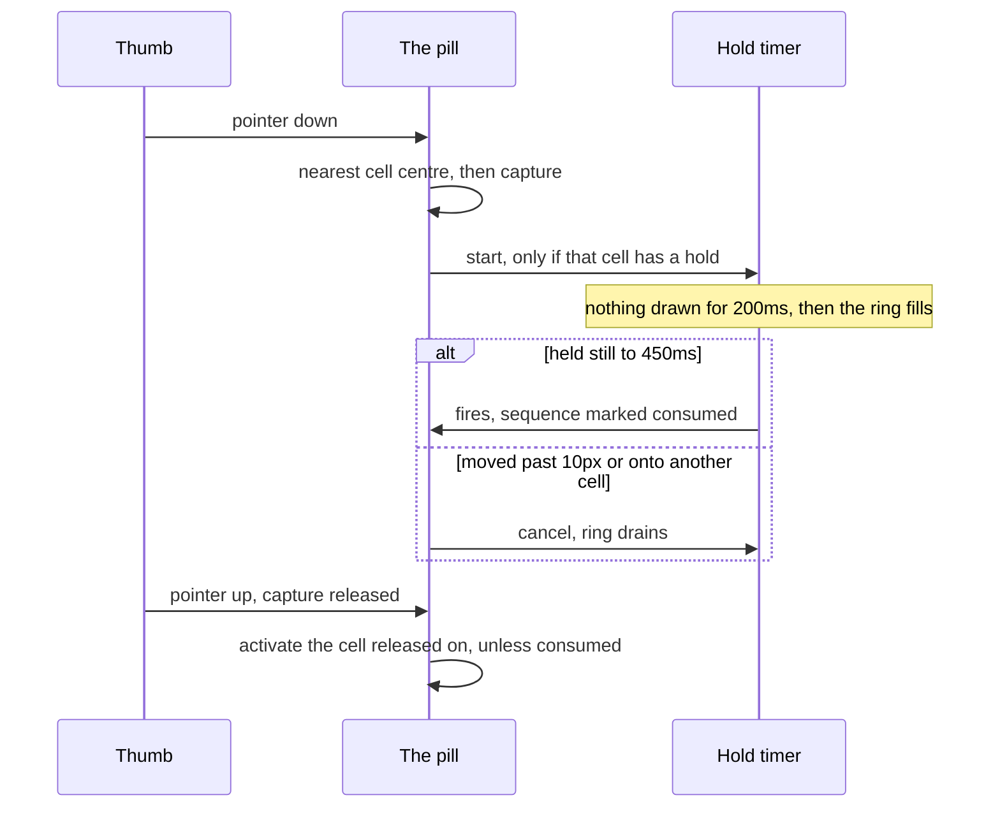
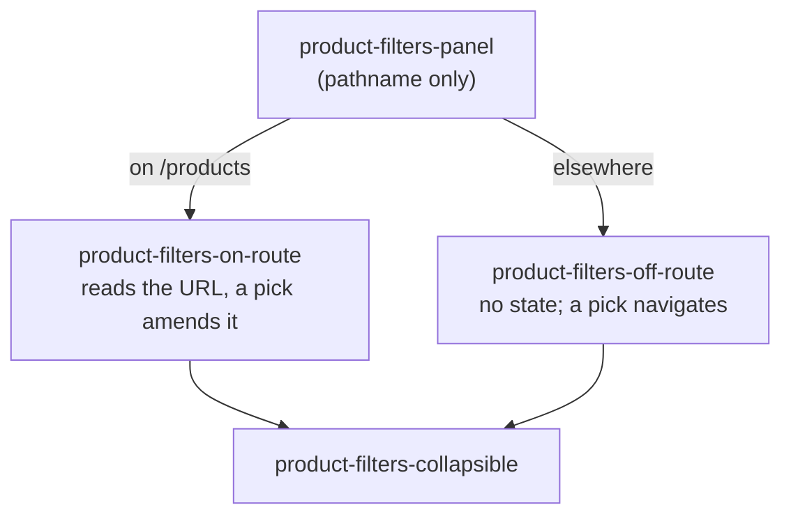

# Disscount: Mobile Navigation

What was built against `docs/MOBILE-NAV-SPEC.md`, and why it is shaped the way it is. The spec is the requirements; this is the implementation reference.

## Table of contents

1. [Quick reference](#1-quick-reference)
2. [The bar](#2-the-bar)
3. [One pointer path](#3-one-pointer-path)
4. [Long press](#4-long-press)
5. [The search sheet](#5-the-search-sheet)
6. [The filters panel](#6-the-filters-panel)
7. [The shared bottom sheet](#7-the-shared-bottom-sheet)
8. [Layers and tokens](#8-layers-and-tokens)
9. [Accessibility](#9-accessibility)
10. [Key files](#10-key-files)
11. [Automatic vs manual](#11-automatic-vs-manual)
12. [Gotchas](#12-gotchas)
13. [Future work](#13-future-work)

---

## 1. Quick reference

| Thing                | Value                                                                                          |
| -------------------- | ---------------------------------------------------------------------------------------------- |
| Shown at             | widths under `md` (768px), in a browser tab and the installed PWA alike                        |
| Cells                | Karta (USKORO), Praćenje, Proizvodi (search), Popisi, Kartice (USKORO)                         |
| Bar height           | 72px of content, plus the bottom safe-area inset                                               |
| Active indicator     | a 57.6px disc, one element that slides between cells and fades on the centre one               |
| Bottom sheets        | three, all behind the bar; only the search sheet is non-modal                                  |
| Long press           | fires at 450ms, draws nothing for the first 200ms, cancels past 10px of movement               |
| Contextual holds     | on `/products/<ean>` Praćenje watches that product and Popisi adds it to a list                |
| Haptics              | none, deliberately                                                                             |
| Nothing to configure | the bar reads its five items from `constants/navigation.ts` and mounts once in the root layout |

## 2. The bar

A floating pill taking the scrolled header's translucent blurred treatment, so the app's two floating bars read as one family. Five equal cells with search dead centre and the two unshipped teasers on the outer edges, where the thumb reaches worst.

**Hidden above `md` in CSS only**, never through a breakpoint hook, so the markup ships in the prerendered HTML and nothing shifts on hydration. `useIsMobile` is the natural mistake here and it would cost the prerender; it stays legitimate on the products page, where it only picks a grid or a list.

Route match and activation are deliberately separate questions. `useBottomNavCells` runs a pure path-prefix test over all five cells, so the centre cell lights up on `/products`, while an `isCenter` flag on the cell decides that a tap opens the sheet instead of navigating. Conflating the two is a known bug class: it leaves the products route with no current-page state at all.

Teaser cells are genuinely `disabled` for everyone but an admin, the rule the sidebar already applies. That runs against Apple's guidance that a tab is never disabled, and consistency with the app's other two navigations won. The lock is enforced twice, on the element and on the bar's pointer path, because a disabled button does not stop a container-level handler.

Three destinations are auth protected and their cells **still navigate**, because the pages already explain the feature and offer sign-in. Explaining beats dead-ending wherever there is something to explain.

Once the page is scrolled the labels collapse and the surface dims to 90%, driven by a scroll timeline with no listener and no hydration behaviour. It compacts, it never hides. The bar's outer height never changes, so the page's reserved space cannot shift mid-scroll.

## 3. One pointer path

A tap, a horizontal scrub and a long press are one pointer stream owned by the bar, which is what lets them compose: a tap is a zero-distance scrub.



Cells resolve from their **own bounding boxes**, by nearest centre. Dividing the pill's width would skew every boundary because the pill has inner padding, and nearest-centre also answers for a press landing in that padding. Presses starting within 16px of a screen edge are ignored, so the bar never competes with the back-swipe or the home indicator.

The capture is released explicitly on both end and abort. Relying on the implicit release leaves captures outliving their gesture, which shows up as a tap on one tab activating another. Because the capture retargets clicks away from the pressed button, cells handle **only keyboard clicks**, discriminated by `isKeyboardClick`.

## 4. Long press

Strictly an accelerator: every target is also reachable by a visible control, so nothing is gesture-only.

| Hold               | On `/products/<ean>`       | Everywhere else         | Enabled                             |
| ------------------ | -------------------------- | ----------------------- | ----------------------------------- |
| **Karta**          | store preferences          | store preferences       | admins only, until the map ships    |
| **Praćenje**       | watch this product         | nothing                 | yes                                 |
| **Proizvodi**      | the barcode scanner        | the barcode scanner     | yes                                 |
| **Popisi**         | add this product to a list | create a new list       | yes                                 |
| **Kartice**        | create a new card          | create a new card       | wired, off until digital cards ship |
| **A product card** | its quick-actions sheet    | its quick-actions sheet | yes                                 |

| Value       | Why                                                                             |
| ----------- | ------------------------------------------------------------------------------- |
| 450ms fire  | iOS uses 0.5s, Android roughly 400-500ms, react-aria defaults to 500ms          |
| 200ms gate  | a deliberate tap runs 150-200ms, so anything shorter would flash a ring on taps |
| 250ms ramp  | whatever the gate leaves, so a full ring reads as committed                     |
| 10px cancel | past this the press is a drag or a scroll                                       |

Before the gate elapses the timer has scheduled nothing but two timeouts: no animation frames, no progress written. That is what makes the gate real rather than a clamp. Progress is written to the pressed element as `--press-progress`, so the ring repaints without re-rendering a subtree.

Cells declare the **kind** of hold they have, never what it does; `resolveHoldTarget` maps kind to action and is the single answer to both "what does this hold do" and "does this cell have a hold at all", so the firing path and the enablement check cannot disagree.

The centre cell's hold is the one guessable gesture: typing a name and scanning a barcode answer the same question, so tap to type, hold to scan.

Product cards keep their own quick-actions sheet even though the bar reaches the same two targets, because in a list the bar has no way to know which card you meant.

## 5. The search sheet

Tapping the centre cell opens a compact sheet above the bar: the app's existing search field, a **Popusti** teaser, the **Filteri** toggle, and **Pretraži** pinned in the footer.

It is the only non-modal sheet in the app, because it is an addition to the page: picking a facet re-filters the list behind it live. That costs it every outside dismissal, which is why the centre cell is a toggle whose glyph rotates to chevrons, pointing the way the sheet actually leaves.

**The close rule is derived, not reset in an effect.** The state carries the pathname it was opened on, and the sheet counts as open only while you are still on that route or on `/products`, whose filters live inside it. So it cannot be open for even one frame on a route that should have dismissed it, and no effect is involved.

| Action                             | Result     |
| ---------------------------------- | ---------- |
| Submit a search from another route | stays open |
| Submit again on `/products`        | stays open |
| Scan a barcode, or open a product  | closes     |
| Tap any other cell                 | closes     |

**Pretraži sits in the footer**, outside the scrolling body, so expanding the filters cannot push the one control that acts on them out of thumb reach. It therefore lives outside the field's form and carries the form's id: the HTML spec picks a form's default button by form _ownership_, so Enter in the field still submits, and disabling the button disables that too.

It is disabled whenever submitting would change nothing. `isUnchanged` lives on `useSearchNavigation`, next to the `routeQuery` it compares against, so the landing hero, the header, the sidebar, the products page and the sheet all behave identically. An empty field counts as unchanged whatever the URL holds, because clearing already drops the query.

## 6. The filters panel

The four facet controls live behind the **Filteri** toggle, on every route, and this is the **only** filters surface below `md`. Expanding grows the sheet in place rather than stacking a second sheet over it, so the query you typed stays in view and there is one layer to dismiss.

Three ways in: the toggle in the sheet, the products page's own Filteri button (which opens the sheet already expanded, with the field left unfocused), and dragging the sheet up past 40px, which fires mid-drag so it grows under the finger.

The panel is **products-feature code passed into the sheet as an opaque node**, created in the root layout. Two things fall out of that: nothing under `components/custom/` imports a feature folder, and the panel's hooks only run once the drawer mounts, so no page leaves the prerender.



The guard is its own file because a component that owns hooks cannot pick a branch without changing its hook order between renders. Off the products list there is no filter state to amend, so the pick and whatever is typed travel together in one navigation, and the facet query is deliberately empty: that fetches nothing and stops another page's own `q` facetting products.

`useProductFilters` reads only. Seeding the user's pinned stores into the URL is the page's job, called once from `products-client.tsx`, so any number of readers can mount without racing it into double-appending params.

## 7. The shared bottom sheet

One surface owns everything a sheet used to hand-roll. A call site supplies content, a title and a modality.

| Owned centrally | Value                                                           |
| --------------- | --------------------------------------------------------------- |
| Layer           | below the bar, so the pill is never covered                     |
| Surface         | the bar's blur at 85% background, calmer than the bar's 50%     |
| Height cap      | `85dvh`                                                         |
| Bottom inset    | `--sheet-bottom-clearance`                                      |
| Handle gap      | 16px, from the header row's own padding                         |
| Focus           | a named field on open, optionally declined; suppressed on close |

Modality is decided by one question: **does the page behind change while the sheet is open?** Only the search sheet earns "yes". The default is modal, because two of the three sheets are, and because a non-modal sheet needs a pointer-events workaround nobody should get by accident.

A modal sheet's scrim sits **below the bar**, so all three layer identically and the pill stays visible, dimming through its own translucency. `DrawerContent` renders its own scrim, so it took an `overlay` slot to reach: a `ReactNode` slot rather than a `className`, because a call site must not be able to set a sheet's layer.

## 8. Layers and tokens

The ladder is named tokens in `globals.css`, written in descending order so the ordering is the contract rather than a comment:

```
--z-offline: 60          --z-install-banner: 41
--z-overlay: 50          --z-scroll-fade: 40
--z-bottom-nav: 45       --z-back-to-top: 30
--z-bottom-sheet: 44     --z-header: 20
--z-bottom-sheet-scrim: 43   --z-sidebar: 10
```

Two geometry tokens, and only these two: `--bottom-nav-total` (content height, inset and safe area) and `--sheet-bottom-clearance` (that plus a gap). Both go to zero-ish above `md`, in the one media query where sheet geometry branches on breakpoint, which is what lets the sheet hardcode a single bottom padding and be right at both sizes.

Exactly five files may mention them: `globals.css`, the sheet surface, the layout's reserved space, the install banner and the toaster. **No sheet call site sets a padding, a layer or a safe-area value.**

Everything here is an explicit length, never a spacing utility, because this project sets `--spacing: 0.2rem` and every utility renders 20% smaller than it reads.

## 9. Accessibility

| Concern              | How                                                                                  |
| -------------------- | ------------------------------------------------------------------------------------ |
| Landmark             | a real `<nav>` with a distinguishing name, since the page has three                  |
| Current page         | `aria-current="page"` on the active cell                                             |
| Roles                | `nav > ul > li > button`. Not tablist/tab, which are for in-page panels              |
| Locked cells         | genuinely disabled, so they leave the tab order, with the USKORO chip still readable |
| Toggles              | the centre cell carries `aria-expanded` and renames to "Zatvori traženje"            |
| Not colour alone     | the disc plus the tint plus a bold label                                             |
| Keyboard             | real buttons; because the bar owns the pointer, cells act only on keyboard clicks    |
| Gesture parity       | every hold target also has a visible control (WCAG 2.1.1, 2.5.1)                     |
| Pointer cancellation | a hold fires on the timer and 10px of movement abandons it (WCAG 2.5.2)              |
| Focus order          | the bar is last in the DOM, so keyboard users reach content first                    |
| Reduced motion       | the disc, the compaction, the glyph swap and every scripted scroll are instant       |

## 10. Key files

| File                                                | Role                                                |
| --------------------------------------------------- | --------------------------------------------------- |
| `components/custom/bottom-nav/bottom-nav.tsx`       | The pill, and where the pointer layer attaches      |
| `bottom-nav/bottom-nav-items.ts`                    | The five cells, each declaring its hold's kind      |
| `bottom-nav/resolve-hold-target.ts`                 | Kind to action, and the enablement answer           |
| `bottom-nav/use-bottom-nav-pointer.ts`              | Capture, edge exclusion, scrub, hold, activation    |
| `bottom-nav/use-cell-rects.ts`                      | Nearest-centre resolution from the cells' own boxes |
| `components/custom/bottom-sheet/bottom-sheet.tsx`   | The one geometry contract                           |
| `components/custom/search/search-sheet.tsx`         | The sheet's contents and modality                   |
| `context/use-search-sheet-state.ts`                 | Open, expanded and the typed draft in one update    |
| `app/products/components/product-filters-panel.tsx` | The pathname guard over two variants                |
| `utils/long-press.ts`                               | The framework-free hold timer                       |
| `constants/gestures.ts`                             | Every timing and threshold, once                    |

## 11. Automatic vs manual

| Task                                   | Automatic                                       |
| -------------------------------------- | ----------------------------------------------- |
| Showing and hiding the bar by width    | yes, pure CSS                                   |
| Safe-area padding                      | yes, once viewportFit is cover                  |
| Reserving the page's space for the bar | yes, from the shared token                      |
| Compaction on scroll                   | yes, scroll timeline                            |
| Closing the sheet on navigation        | yes, derived from the pathname                  |
| Keeping a sheet clear of the bar       | yes, the shell pads it                          |
| Routing a filter pick to `/products`   | yes                                             |
| Locking and unlocking teasers          | yes, from `comingSoon` plus the admin check     |
| Swapping a hold on a product page      | yes, resolved from the path at press time       |
| **Adding or reordering a cell**        | manual, and a shipped tab set should not change |
| **Enabling the Kartice hold**          | manual, one flag plus dropping `comingSoon`     |
| **A real price-drop badge count**      | manual, needs an endpoint                       |

## 12. Gotchas

**Cells must be buttons, never anchors.** iOS shows a link preview, a callout and a drag affordance on a long-pressed anchor, and the property that suppresses the callout is unreliable. Crawlability is unaffected: the prerendered header and sidebar carry these links.

**The context-menu event never fires on an iOS long press**, so a hold has to be a pointer-down timer.

**A non-modal drawer does not leave the page usable by itself.** vaul leaves the underlying dialog in modal mode, so Radix still writes an inline `pointer-events: none` onto the body. `globals.css` overrides it with `!important`, keyed off the sheet's own `data-bottom-sheet="non-modal"` marker rather than a shared one, which would break the side drawer.

**A non-modal sheet cannot be dismissed from outside itself**, so anything that should close it has to do so explicitly. That is why the centre cell toggles and why every other cell closes it.

**Never make a sheet's surface pointer-transparent to protect what is above it.** The bar is above the sheet and already wins hit testing. Making the layer transparent leaves every pixel of the sheet's own padding as a hole, which breaks swipe-to-close exactly where the grab handle is.

**`sr-only` on a header container takes its padding with it**, because it is absolutely positioned. The row keeps its padding and only the text is marked, so the handle's gap holds whether or not anything is drawn.

**Nothing rendered during prerender may call `useSearchParams`**, or every page in the app leaves the prerender. The submit comparison and the filters panel are both created in the layout and only rendered once the drawer mounts; creating an element calls no hooks.

**Route params never reach the root layout** either, so anything mounted there parses `usePathname()`.

**Comparing a field against the URL flashes on a clear**, because clearing resets the field and then navigates. Empty counts as unchanged.

**A disabled control cannot open a tooltip.** Fine for Očisti filtere, which is disabled exactly when there is nothing to explain, but it rules tooltips out as the only label for anything disabled for a reason the user needs.

**Do not suppress touch panning inside a scroller.** Pointer cancellation is what abandons a hold when a scroll claims the pointer. Only the bar, which is fixed chrome, sets `touch-none`.

**Reduced motion never applies to a scripted scroll's behaviour option**, only to the CSS property, so `utils/scroll.ts` checks the preference itself.

**A controlled multi-select must emit from its props.** Its internal set is seeded once at mount, so emitting from that resurrects cleared values on the next toggle.

**Haptics are a dead end**: the vibration API has never shipped in WebKit, and a buzz on one platform only is worse than none.

## 13. Future work

- A real price-drop count on Praćenje, cleared on visit and capped at 9+.
- Enable the Kartice hold the day digital cards ship, and drop `comingSoon` from both teasers.
- An accessory strip above the bar carrying the active list's name and running total. Needs a product answer for what makes a list "active".
- Selection mode on a shopping list: hold an item, get a contextual action bar, cost a subset across chains.
- Decide whether Pretraži should become the apply gate for the filters. Today every pick applies itself, so the button only answers for the query. A product call.
- Strip the mobile header and collapse the mobile footer, so 360px does not carry three competing navigations.
- Watch the stacked blurs on mid-range Android: the header, the bar and every sheet all use a backdrop blur, and a sheet's repaints on every frame of a drag.

### Not verified yet

The gestures, the sheet geometry and the safe areas have not been checked in a browser on this branch. iOS safe areas and the keyboard behaviour on the centre cell need real hardware; everything else needs a dev server pointed at this worktree.
