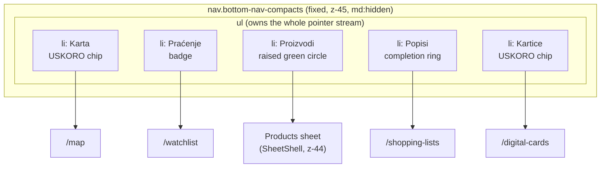
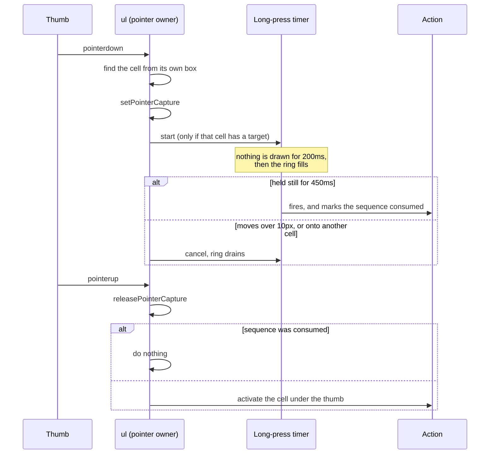
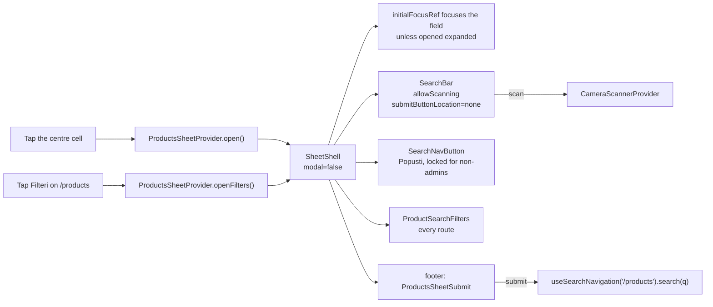
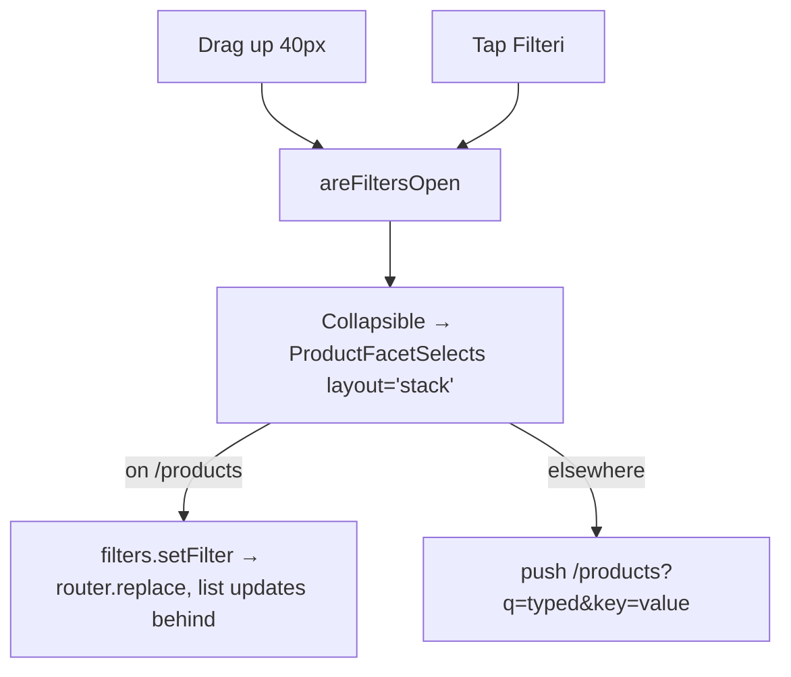
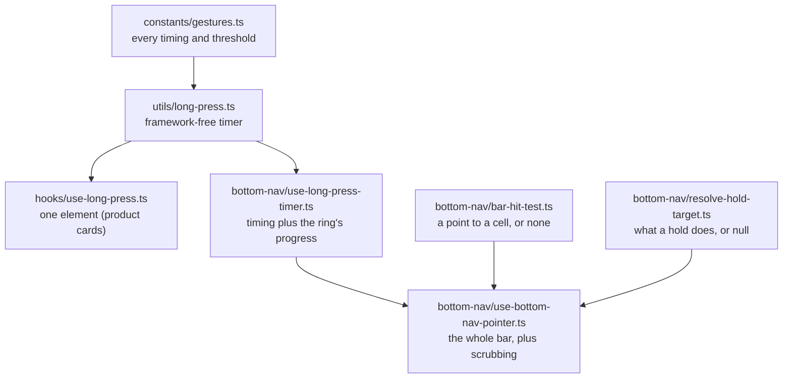

# Disscount: Mobile Navigation Guide

A complete reference for the mobile bottom navigation bar, its gestures, and the shared bottom-sheet shell it opens, written to be understandable even if you're new to this. Keep it up to date as the setup changes.

_Last verified end-to-end on 2026-07-26 against `feat/mobile-bottom-nav`, measured in a real browser at 360x740 and 320x740. The persistent labels and `space-between` layout added on 2026-07-27 passed formatting and type checks but have not been remeasured in a browser. Still unverified on real iOS or Android hardware, see [§19](#19-future-improvements--todos)._

> **Mental model in one sentence:** below the `md` breakpoint the app grows a five-cell **tab bar** pinned to the bottom of the screen, and that bar becomes the primary navigation a phone user needs, because the hamburger sidebar stays on as overflow, the create actions hang off **long presses**, and back-to-top becomes **re-tapping the tab you are already on**.

---

## Table of contents

1. [Quick reference](#1-quick-reference)
2. [Why this exists](#2-why-this-exists)
3. [Anatomy of the bar](#3-anatomy-of-the-bar)
4. [How a touch becomes an action](#4-how-a-touch-becomes-an-action)
5. [The surface](#5-the-surface)
6. [The products sheet](#6-the-products-sheet), and [its filters panel](#61-the-filters-panel)
7. [SheetShell, the shared bottom sheet](#7-sheetshell-the-shared-bottom-sheet)
8. [Long-press gestures](#8-long-press-gestures)
9. [Live state on the bar](#9-live-state-on-the-bar)
10. [Layout, safe areas and CSS tokens](#10-layout-safe-areas-and-css-tokens)
11. [What the bar replaced](#11-what-the-bar-replaced)
12. [Design decisions and the roads not taken](#12-design-decisions-and-the-roads-not-taken)
13. [Key files](#13-key-files)
14. [Config, env vars and flags](#14-config-env-vars-and-flags)
15. [Libraries](#15-libraries)
16. [Accessibility](#16-accessibility)
17. [What's automatic vs manual](#17-whats-automatic-vs-manual)
18. [Gotchas & lessons learned](#18-gotchas--lessons-learned)
19. [Future improvements & TODOs](#19-future-improvements--todos)
20. [Regression checklist](#20-regression-checklist)

---

## 1. Quick reference

| Thing                 | Value                                                                                                                                                                                                                                                   |
| --------------------- | ------------------------------------------------------------------------------------------------------------------------------------------------------------------------------------------------------------------------------------------------------- |
| Shown at              | widths under `md` (768px), in the browser and the installed PWA alike                                                                                                                                                                                   |
| Cells, left to right  | Karta (USKORO), Praćenje, Proizvodi (search), Popisi, Kartice (USKORO)                                                                                                                                                                                  |
| USKORO cells          | disabled for everyone but admins, as in the sidebar                                                                                                                                                                                                     |
| Bar height            | 72px of content, plus `env(safe-area-inset-bottom)`                                                                                                                                                                                                     |
| Cell distribution     | five fixed 57.6px cells with the remaining horizontal room distributed between them                                                                                                                                                                     |
| Icon / label          | 24px icon, 10.4px label, always visible                                                                                                                                                                                                                 |
| Active indicator      | a 57.6px disc enclosing icon and label, sliding between cells and fading out on the search cell                                                                                                                                                         |
| Surface               | a floating pill matching the scrolled header's translucent blurred treatment                                                                                                                                                                            |
| z-index               | scroll fade 40, install banner 41, FAB 42, sheet scrim 43, bottom sheets 44, **bar 45**, dialogs and popovers 50, offline indicator 60. Tokens live in `globals.css`                                                                                    |
| Bottom sheets         | three, all behind the bar and clearing it by `--sheet-bottom-clearance`; only the products sheet is non-modal, and only for pointer input (see [§7](#7-sheetshell-the-shared-bottom-sheet))                                                             |
| Element type per cell | `<button>`, never `<a href>` (see [§18](#18-gotchas--lessons-learned))                                                                                                                                                                                  |
| Long press            | two of five today (Proizvodi opens the scanner, Popisi adds the open product), plus Praćenje on a product page; Karta unlocks for admins and Kartice when digital cards ship. Fires at 450ms, silent for the first 200ms, cancels past 10px of movement |
| Contextual holds      | on `/products/<ean>` Praćenje watches that product and Popisi adds it to a list (see [§8](#8-long-press-gestures))                                                                                                                                      |
| Haptics               | none, deliberately (see [§18](#18-gotchas--lessons-learned))                                                                                                                                                                                            |

**Daily workflow:** nothing to configure. The bar reads its items from `frontend/src/constants/navigation.ts` and mounts itself once in the root layout.

---

## 2. Why this exists

Before this, mobile navigation was hamburger-only: `HeaderNav` is `hidden md:flex` and `HeaderSearch` is `hidden lg:block`, so on a phone every primary destination lived behind the `AppSidebar` drawer.

Nielsen Norman Group measured what that costs, across 179 participants on 6 live sites:

| Metric                       | Hidden nav (hamburger) | Visible + hidden |
| ---------------------------- | ---------------------- | ---------------- |
| Navigation actually used     | 57%                    | **86%**          |
| Content discoverability      | over 20% worse         | baseline         |
| Task completion time, mobile | 15% slower             | baseline         |

The important detail is that the best-performing condition was **visible and hidden together**, not visible instead of hidden. That is why the sidebar was kept: the bar carries the five destinations that matter, and the sidebar keeps carrying Karta, Statistika, Novosti, Popusti, Kontakt and the rest. There is deliberately **no "Više" tab**.

Ergonomics back this up. Hoober's field observation of 1,333 real interactions found 49% of people hold a phone one-handed and 75% of interactions are thumb-driven, which makes the bottom-centre band the easiest reach on the screen and the top corners the hardest.

---

## 3. Anatomy of the bar



Each non-centre cell stacks, from back to front:

1. the **active disc**, a `motion.span` with a shared `layoutId` so it slides between cells rather than reappearing,
2. the **completion ring** and the **long-press ring**, both circles sharing the disc's geometry so they stay concentric,
3. the **icon** at 24px, with the notification **badge** and the re-tap **chevron** hung off it,
4. the **label**, bold when the cell is active,
5. the **USKORO chip** for teaser cells, rotated off the right edge.

The centre cell is different: a raised, filled, brand-green 44.8px circle with `Proizvodi` underneath, which opens a sheet instead of navigating.

### Why the two teaser cells sit on the outside

`Karta` and `Kartice` are not shipped yet. Putting them at the far left and far right keeps the arrangement symmetric with search dead centre, and puts the least useful cells in the hardest thumb positions.

The left cell was `Potrošnja` at first. Both it and `Karta` are `comingSoon` teasers with a real `ComingSoon` page behind them, so the swap is a judgement about which one people will reach for, and a map of nearby stores and their opening hours beats a spending breakdown for a shopper standing in the street. `bottomNavItems` looks up ids across both `userNavItems` and `productNavItems` for it, since `map` lives in the catalogue group.

One knock-on: `/spending` is in `PROTECTED_ROUTE_PREFIXES` and `/map` is not, so the left cell is now reachable signed out.

### Locked teaser cells

Both teaser cells are **dead ends for everyone but an admin**, which is the rule `sidebar-nav-item.tsx` already applies:

```ts
const isLocked = Boolean(item.comingSoon) && !isAdmin(user?.accountType);
```

A locked cell is a `disabled` button in `text-muted-foreground/70`, so it takes no tap, no keyboard focus, no scrub tint and no long press. It keeps its USKORO chip, and `activate()` in `bottom-nav.tsx` guards the pointer path separately, because a disabled button does not stop the `<ul>` from resolving that cell.

Two things worth knowing:

- This runs **against** Apple's Human Interface Guidelines, which are emphatic that a tab must never be disabled (in iOS 26 `UITabBarItem.isEnabled` has no effect at all). Consistency with the app's other two navigations won, since a bar that walks you into a teaser page the header refuses to open is the more confusing inconsistency.
- The admin escape exists so `/digital-cards`, which is a working page carrying the badge only until barcode rendering lands, stays reachable from a phone.

The same rule now applies to `HeaderNavItem`, which previously blocked coming-soon items for admins too. Note that the escape is unreachable there today: `HeaderNav` swaps the whole list for a single dashboard link whenever `canAccessDashboard` is true, which covers every admin. It is there for consistency and for whenever that layout changes.

### Signed out

Three of the five destinations are in `PROTECTED_ROUTE_PREFIXES` (`/watchlist`, `/shopping-lists`, `/digital-cards`), so for a signed-out visitor the centre search cell and `Karta` are public.

`Praćenje` and `Popisi` still navigate. The page then renders the existing `LoginRequired`, which explains the feature and opens the auth modal. That needed no new code, and it is why those cells are not locked: explaining beats dead-ending wherever there is something to explain.

---

## 4. How a touch becomes an action

All pointer handling lives on the `<ul>`, not on the individual cells. That is what lets a tap, a scrub and a long press be one code path, because **a tap is just a zero-distance scrub**.



Activation branches four ways, in `bottom-nav.tsx`:

| Case                        | What happens                                                   |
| --------------------------- | -------------------------------------------------------------- |
| Centre cell                 | opens the products sheet, or closes it when it is already open |
| A locked teaser cell        | nothing, beyond dismissing the sheet                           |
| The cell you are already on | `useTabReentry`: scroll to top, then a second tap returns you  |
| Any other cell              | `router.push(item.href)`                                       |

Every branch except the centre one dismisses the products sheet first. That covers what the sheet's own pathname effect cannot: re-tapping the tab you are already on does not change the route.

Note that **route match and activation are deliberately separate questions.** `isActiveIndex` is a pure `pathname.startsWith` check covering all five cells, so the centre cell lights up on `/products`; `isSearch` decides what a tap _does_. Conflating the two was a real bug, see [§18](#18-gotchas--lessons-learned).

### Re-tapping the active tab

A documented convention: Expo's native tabs, Ionic, Instagram and Medium all scroll to top when you tap the tab you are on, and X adds a return trip. Ours does both, showing a small chevron on the active icon while a return position is held.

It has to move the window by hand, because **Next does not scroll when you navigate to the URL you are already on**. The saved position clears whenever the pathname changes, since a position from one route means nothing on the next.

### Tab scrubbing

Press anywhere on the bar and drag: the active disc follows your thumb, each icon it passes swells, and release commits whichever cell you ended on. This composes with the long press for free, because the 10px movement threshold that abandons a long press is the same threshold that means "you are scrubbing, not tapping".

Presses starting within **16px of a screen edge** are ignored entirely, so the bar never competes with the iOS back-swipe or the home-indicator gesture. The bar also carries `touch-none`, so a horizontal drag is never read as a page pan.

---

## 5. The surface

A floating pill, taking the scrolled header's treatment verbatim so the app's two floating bars match:

```text
mx-[0.5rem] px-[0.4rem] rounded-full border backdrop-blur-sm
```

The horizontal inset and inner padding are explicit rem values rather than spacing utilities, because of the `--spacing` trap in [§10](#10-layout-safe-areas-and-css-tokens). Each cell is fixed at the active disc's 57.6px width, and `justify-between` puts all remaining horizontal room between cells. The 0.4rem inner padding therefore keeps the first and last disc clear of the pill's border at every supported width.

One trade-off, flagged and then accepted deliberately: this is a second blurred fixed layer over the header's own `backdrop-blur-sm`. Stacked blurs are Apple's "glass sandwich" and the main scroll-jank source on mid-range Android, so it is worth watching on real hardware.

### Surface change on scroll

Once the page is scrolled, the surface's alpha eases from 50% to 45% of the background colour while every icon and label stays fully visible. It is driven by a **scroll timeline**, so there is no scroll listener, no jank and no hydration behaviour. Note this is a progressive range rather than a threshold: `animation-range: 40px 180px` interpolates the whole way, so it is not the same trigger as the header's `useScrolledPast(50)`, which flips once at 50px.

```css
@supports (animation-timeline: scroll()) {
  @media (prefers-reduced-motion: no-preference) {
    .bottom-nav-compacts {
      animation: bottom-nav-compact auto linear both;
      animation-timeline: scroll(root block);
      animation-range: 40px 180px;
    }
  }
}
```

Two things to know:

- The animated surface alpha is registered with `@property`. **Unregistered custom properties animate discretely** and would snap at the halfway point instead of fading.
- The bar's outer height never changes, so the pill does not resize mid-scroll and the page's padding never shifts.

---

## 6. The products sheet

Tapping the centre cell opens a compact sheet directly above the bar. Top to bottom it holds the existing `SearchBar` field with its scan button, a **Popusti** shortcut into the catalogue, a **Filteri** toggle ([§6.1](#61-the-filters-panel)), and last a full-width **Pretraži** button pinned in the shell's footer.



**Pretraži lives in the shell's footer**, outside the body's scroll container, so expanding the filters cannot push the one action that acts on them out of reach. That puts it outside `SearchBar`'s `<form>`, so it carries `form="products-sheet-form"` against a `formId` on that form. Form ownership is what the HTML spec uses to pick a form's default button, so Enter in the field still submits from there, see [§18](#18-gotchas--lessons-learned).

**It is disabled whenever submitting would change nothing**: `useSearchNavigation` exposes `isUnchanged(query)`, true when the trimmed query matches the route's own `q`, or when the field is empty. Every surface with a submit button shares it, so the landing hero, the sidebar and the products page behave the same way. Off the search route `routeQuery` is `""`, which is why typing anything there enables it immediately.

**Popusti** is a disabled outline button with the USKORO badge, locked exactly as the sidebar, header and bar lock their teasers. `SearchNavButton` is the sheet's own nav surface, the fourth after those three, drawing its item through the shared `findNavItem()` in `constants/navigation.ts`.

The centre cell is a toggle, and its glyph says so: the `Search` icon rotates out and a `ChevronsDown` rotates in while the sheet is open, so the same cell closes what it opened. Chevrons rather than an `X`, because they point the way the sheet actually leaves, which is also the swipe that dismisses it. Both glyphs are stacked in the raised circle and cross-faded in CSS, with `motion-reduce:transition-none` for the reduced-motion case. Its accessible name switches to `Zatvori traženje` alongside `aria-expanded`.

That toggle is also the only way to close the sheet from the bar, because vaul **vetoes every outside dismissal for a non-modal drawer** (`dist/index.js`, its `onPointerDownOutside` handler returns early when `!modal`, and `onFocusOutside` likewise). So no press on the bar, or anywhere else on the page, can close the sheet on its own. Useful consequence: the sheet's open state cannot change mid-gesture, so reading it on `pointerup` is race-free.

Five deliberate choices:

- **Non-modal**, the only sheet in the app that is, so the list behind it stays live as you filter. Layer and bottom clearance are not this sheet's business: `SheetShell` gives every sheet the same ones, see [§7](#7-sheetshell-the-shared-bottom-sheet).
- **The centre cell toggles it**, since vaul leaves the bar as the only thing that can close it.
- **The sheet's surface is left whole.** The bar wins hit testing on its own box at `z-45`, so the sheet needs no pointer-events holes to keep the tabs tappable. Punching holes in it broke the swipe, see [§18](#18-gotchas--lessons-learned).
- **It closes on route change except on `/products`**, which is the one route whose filters live inside it. Everywhere else it behaves like `AppSidebar` and dismisses.
- **The field is focused on open** via `initialFocusRef`, so you can start typing immediately, _unless_ the sheet was opened straight into its filters, where raising the keyboard would cover the facets you asked for.

Its bottom `--sheet-bottom-clearance` is the shell's, 92px at 360x740, so whatever the sheet's height its last control ends 8px above the `<nav>`.

The sheet reuses `SearchBar` rather than adding a second search field. `SearchBar` gained `inputRef` for the focus, `formId` so the footer button can own its form, and `onQueryChange` so that button can tell a real search from a no-op.

### The `/products` exception

`SearchBar.onSubmitted` used to force a close, which the sheet no longer passes. One rule now covers everything, because every exit from the sheet is a pathname change except the one that should not close it:

| Action                            | Pathname          | Sheet                     |
| --------------------------------- | ----------------- | ------------------------- |
| Submit a search from `/watchlist` | `/products`       | closes                    |
| Submit again on `/products`       | unchanged         | closes, via `onSubmitted` |
| Tap the Popusti shortcut          | `/products?...`   | closes, via `onNavigate`  |
| Scan a barcode                    | `/products/<ean>` | closes                    |
| Open a product                    | `/products/<ean>` | closes                    |
| Tap any other nav cell            | that tab          | closes, via `activate()`  |
| Pick a facet                      | `/products?...`   | **stays open**, by design |
| Cross the `md` breakpoint         | unchanged         | closes                    |

There is no route exception any more. The sheet used to stay open on `/products` so a submitted search would not hide the filters it had just revealed, but that left the results covered by the sheet that asked for them, which is worse.

### 6.1. The filters panel

The sheet carries the products page's four facet controls (Trgovine, Lokacije, Kategorije, Marka) behind a **Filteri** toggle, on **every route**. Expanding grows the sheet upward rather than stacking a second sheet over it, so the query you typed stays in view and there is only ever one layer to dismiss. NN/g's guidance is explicit that stacked sheets disorient.

**This is now the only filters surface below `md`.** The products page used to open a filters sheet of its own, built from the same four controls, which meant a query and the facets narrowing it sat on separate layers. Its **Filteri** button now calls `openFilters()` and lands you in this panel instead; above `md` the page still renders every facet inline, in `product-filters-row.tsx`.

Three ways in:

| Gesture                              | Result                                                            |
| ------------------------------------ | ----------------------------------------------------------------- |
| Tap **Filteri** inside the sheet     | expands, chevron flips                                            |
| Tap **Filteri** on the products page | opens the sheet already expanded, with the field left unfocused   |
| **Drag the sheet upward**            | expands, mid-drag, so the sheet grows under the finger that asked |



Five things make this work without touching the controls:

- **Filters always land on `/products`, wherever you pick them.** On that route `setFilter` amends the URL and the list behind updates live. Anywhere else there is no filter state in the URL to amend, so the pick and whatever is typed travel together in one `router.push`, read off the shared `queryInputRef` so a half-typed query survives the trip. This follows what the app already did: `sidebar-filter-menu.tsx` builds `/products?chain=...` hrefs and navigates on click.
- **`layout="stack"` already existed**, built for the filters sheet this panel replaced, so the four labelled full-width selects drop in unchanged. They render a bare fragment, so the panel supplies the `flex flex-col gap-3` parent.
- **The query comes from `?q`, and only on `/products`.** These facets describe a submitted products search. Elsewhere it is deliberately empty, which both avoids a stray request and stops another page's `?q` (the map page has one, for store names) from facetting products.
- **`useProductFilters({ seedPreferred: false })`.** `ProductsClient` already owns the pinned-store seeding on that route; two readers racing it would double-append params.
- **The expanded state lives in `ProductsSheetContext`**, not in the panel and not in `ProductsSheet`, because two entry points have to decide it. `open()` collapses the filters and `openFilters()` expands them, each in the same batch that flips `isOpen`, so the sheet never renders at the wrong size for a frame and no effect is needed. The centre cell therefore always lands on the compact sheet, whatever you left expanded last time.

No extra request either way: `useProductFacets` reuses the query key the page already holds, and `useGetProductByName` is gated on `enabled: Boolean(params.q)`, so an empty query fetches nothing. Below `md`, which is the only width this sheet exists at, each select expands its list **inline** rather than opening a popover, so there is nothing floating to scroll and nothing to portal. `PortalContainerProvider` is now unused by these selects: it exists for popovers opened inside a vaul drawer, and no drawer above `md` hosts one.

**Očisti filtere is icon-only**, an outlined X naming itself through a tooltip, shared by all three filter surfaces. It reuses `RemoveIconButton`, which already was a tooltip wrapped around an icon button and gained a `tone` so a reset outlines where a deletion stays red. Beside the `flex-1` Filteri button on a 360px screen, a labelled button took as much room as the control it sat next to.

### Dragging up

vaul clamps upward movement on a bottom drawer, so the gesture had to be added. `useSheetDragUp` returns plain React pointer props that `SheetShell` spreads onto `DrawerContent`, which is safe because **vaul composes rather than replaces**: its `onPointerDown`, `onPointerMove` and `onPointerUp` each call the caller's handler first and then run the drag logic (`dist/index.mjs`, its `Content`). So no native listeners, no ref juggling, and swipe-to-close is untouched.

The threshold is 40px, far enough that a scroll, a wobble or a tap cannot trigger it, and it fires **mid-drag** rather than on release so the sheet expands while your finger is still moving. Verified: a 20px nudge does nothing.

---

## 7. SheetShell, the shared bottom sheet

`SheetShell` is `ModalShell`'s bottom-sheet counterpart. Four sheets had grown four different shapes, differing in layer, modality, surface, bottom padding and the gap under the grab handle. All of it is now fixed by the shell, so a call site supplies content and nothing else. Three of those four remain: the products filters sheet is gone, folded into the products sheet ([§6.1](#61-the-filters-panel)).

| Fixed by the shell | Value                                | Why it cannot be per call site                                                                                                 |
| ------------------ | ------------------------------------ | ------------------------------------------------------------------------------------------------------------------------------ |
| Content layer      | `z-[var(--z-bottom-sheet)]`          | Under the bar, so the pill is never covered                                                                                    |
| Surface            | `bg-background/85 backdrop-blur-sm`  | The bar's blur, muted, see below                                                                                               |
| Height cap         | `max-h-[85dvh]`                      | One cap, so a growing sheet always yields to the viewport                                                                      |
| Bottom inset       | `pb-[var(--sheet-bottom-clearance)]` | 92px at 360x740, so no content hides under the bar                                                                             |
| Handle gap         | the header's own `pt-[1rem] pb-2`    | 16px, whether or not the header draws anything, see below                                                                      |
| Handle colour      | `bg-muted-foreground/40`             | `bg-muted` all but vanished on a light surface, in `ui/drawer.tsx` for all three handles including the sidebar's vertical ones |
| Modality default   | **modal**                            | Only a sheet the page changes behind earns the opt-out, and the products sheet is the one that does, see below                 |

| Prop                   | Purpose                                                                                                 |
| ---------------------- | ------------------------------------------------------------------------------------------------------- |
| `open`, `onOpenChange` | Controlled, exactly like `ModalShell`                                                                   |
| `title`, `description` | `description` defaults to screen-reader-only; omit it and Radix's `aria-describedby` opt-out is applied |
| `srOnlyTitle`          | For a sheet whose content already names itself                                                          |
| `srOnlyDescription`    | `false` renders it visibly, stacked under the title                                                     |
| `footer`               | Pinned below the body in a `DrawerFooter`, so it survives the body scrolling                            |
| `showCloseButton`      | An X in the header, for a sheet whose own content offers no way out                                     |
| `initialFocusRef`      | Focused on open, so the user can start typing straight away                                             |
| `modal`                | Defaults **on**, adding the scrim, the scroll lock and outside-press dismissal. Off is the opt-out      |

`headerExtra` is gone: the filters sheet was its only user, and a slot nothing fills is a slot that drifts.

Current users, identical apart from their content and their modality:

| Sheet                    | File                                                   | Modal | Explicit dismissal beyond the handle             |
| ------------------------ | ------------------------------------------------------ | ----- | ------------------------------------------------ |
| Search                   | `components/custom/products-sheet/products-sheet.tsx`  | no    | the bar's centre cell; also the only `md:hidden` |
| Product quick actions    | `components/custom/product/product-quick-actions.tsx`  | yes   | an outside press, plus any action it runs        |
| PWA install instructions | `components/custom/pwa/install-instructions-sheet.tsx` | yes   | an outside press and `showCloseButton`           |

### Why the surface is muted

The sheet wears the bar's `backdrop-blur-sm` so the two read as one family of floating chrome, but at `bg-background/85` rather than the bar's `/50`. At the bar's own opacity the page ghosts through hard enough that a sheet full of white inputs looks like the fields are floating in front of it rather than sitting in it. 85% keeps a visible frost at the leading edge, where the "this is floating" cue actually reads, and calms it behind the controls.

### Why the header is its own file

`sheet-shell-header.tsx` exists for two reasons, both of them former bugs:

- **The handle needs a gap that survives a hidden title.** The old shell put `sr-only` on the header _container_, so the products sheet's handle sat 6.4px above the input with nothing between them. `sr-only` is `position: absolute`, so moving it to the title column collapses the row to its own padding and the 16px gap holds either way, with no conditional padding anywhere.
- **A visible description has to sit under the title.** The old header was one `flex-row` holding title, description and `headerExtra` side by side, which is why the PWA sheet never migrated: it needs a visible description. The column fixes it, and that sheet is now the proof.

### Layer stack

The whole ladder lives in `globals.css` as `--z-*` tokens, in descending order, so it can be read in one place. A magic `z-[44]` in one file says nothing about what it has to stay under.

| z   | Token                    | Element                                                     |
| --- | ------------------------ | ----------------------------------------------------------- |
| 60  | `--z-offline`            | offline indicator                                           |
| 50  | `--z-overlay`            | dialogs, popovers, dropdowns, tooltips, selects             |
| 50  | -                        | mobile sidebar drawer, modal and deliberately above the bar |
| 45  | `--z-bottom-nav`         | bottom nav                                                  |
| 44  | `--z-bottom-sheet`       | bottom sheets                                               |
| 43  | `--z-bottom-sheet-scrim` | a modal sheet's scrim                                       |
| 41  | `--z-install-banner`     | PWA install banner                                          |
| 40  | `--z-scroll-fade`        | window scroll fade                                          |
| 39  | `--z-bottom-nav-covered` | what `--z-bottom-nav` becomes while a modal sheet is open   |
| 30  | `--z-fab`                | back-to-top FAB                                             |
| 20  | `--z-header`             | header                                                      |
| 10  | `--z-sidebar`            | desktop sidebar                                             |

`--z-overlay` and `--z-sidebar` are declared but not yet consumed: dialogs and the desktop sidebar still carry shadcn's own `z-50` and `z-10`.

Two moves made room for the bar: the FAB dropped from `z-50` (it is desktop-only and belongs under every layer) and the PWA banner from `z-50` to the install-banner token, since it opens the install sheet and must not float over it.

The **mobile sidebar** stays out of `SheetShell` and keeps `z-50`. It is a `direction={side}` drawer covering the full height, and unlike the sheets it really is modal, so its scrim should cover the bar rather than leave it poking through.

`DrawerOverlay` is rendered by `DrawerContent` with no props, so its `z-50` was unreachable from outside. `DrawerContent` now takes an `overlayClassName` that forwards to it, which is what pins a modal sheet's scrim to 43 instead of letting it land above everything at 50.

43 is still below the bar's resting 45, so the bar is not left poking through the scrim: a rule in `globals.css` keyed on `body:has([data-vaul-drawer][data-state="open"]:not([data-sheet-non-modal]))` swaps `--z-bottom-nav` to `--z-bottom-nav-covered` (39) for as long as a modal sheet is open. Leaving the bar on top would keep it fully visible while Radix's body lock made it inert, which reads as a frozen UI. The non-modal products sheet carries the `data-sheet-non-modal` marker and is the deliberate exception, so the bar stays above it and its centre cell remains the way out.

### Why only the products sheet is non-modal

A non-modal sheet is an **addition to the page**: you open it, you act through it, and what is behind it changes as you do. That is exactly Material's _standard_ bottom sheet, which "co-exists with the screen's main UI region and allows for simultaneously viewing and interacting with both regions" and has no scrim. A _modal_ sheet "presents a set of choices while blocking interaction with the rest of the screen".

Only the products sheet earns the first description, and it earns it completely: picking a facet in it re-filters the list behind it live, which is the entire reason it must not be covered by a scrim or lock the page.

The other two do not, so they are modal:

| Sheet                | Why modal                                                                                                                           |
| -------------------- | ----------------------------------------------------------------------------------------------------------------------------------- |
| Product quick action | A launcher: nothing behind it changes, and two of its three actions open a dialog anyway. Material would call this the modal case   |
| PWA install steps    | Instructions to read and then leave. Nothing on the page behind is involved, so blocking it costs nothing and the scrim helps focus |

Both gain tap-outside-to-close from it, which is the dismissal users try first.

The shell therefore **defaults to modal**, and the products sheet is the single explicit `modal={false}`. It was the other way round at first, which meant a new sheet that simply forgot the prop silently lost its scrim, its scroll lock and tap-outside-to-close. Non-modal is also the buggier path in vaul (see [§18](#18-gotchas--lessons-learned)), so the fewer sheets that take it, the better. The one opt-out is the one that earns it.

That split also matches `ModalShell`'s own line: all 12 of its consumers are self-contained tasks with their own submit (`shopping-list-modal`, `settings-modal` and its four tabs, `onboarding-wizard`, `confirm-dialog`, the auth modals, ...). Dialogs are a mini page; a non-modal sheet changes the page you are on.

What non-modal costs the products sheet, and what had to be paid for it:

- **No outside press dismisses it**, because vaul vetoes that for a non-modal drawer (below). It therefore needs an explicit way out, which is the bar's centre cell. `Escape` and the grab handle work throughout.
- **The page had to be handed back explicitly.** Non-modal did not actually leave the page usable: Radix locks `<body>` regardless (see [§18](#18-gotchas--lessons-learned)), so a rule in `globals.css` keyed on `[data-sheet-non-modal][data-state="open"]` restores `pointer-events` with `!important`, an inline style being the only thing it has to beat. The marker is absent when `modal` is set, since a modal sheet wants the lock. Measured with the products sheet open: `<body>` reads `auto`, the page behind scrolls, and the sheet survives both the scroll and an outside click. A real dialog still reads `none`.
- **The bar's own opt-in became redundant** and is gone. It used to carry `isSearchOpen && "pointer-events-auto"`; the page-level rule now covers it, and the bar stays inert under modal sheets and real dialogs, whose overlays cover it anyway.

### Focus

Focus is set explicitly in `onOpenAutoFocus` rather than by relying on a child's `autoFocus` surviving Radix's focus scope. Closing calls `event.preventDefault()` in `onCloseAutoFocus`, matching `ModalShell`: there is no trigger to restore focus to, and Radix's body fallback jumps the scroll.

A sheet can also decline the field: `ProductsSheet` withholds `initialFocusRef` when it opens straight into its filters, so the keyboard does not rise over the facets the user just asked to see.

---

## 8. Long-press gestures

Long press is strictly an **accelerator**, never the only way to reach something. Every target is a `?modal=` URL that a visible, tappable control also reaches, which is what keeps it keyboard and screen-reader accessible.

| Gesture                  | On `/products/<ean>`       | Everywhere else            | Enabled?                                                |
| ------------------------ | -------------------------- | -------------------------- | ------------------------------------------------------- |
| Hold **Karta**           | store preferences          | store preferences          | admins only, until the map drops `comingSoon`           |
| Hold **Praćenje**        | `?modal=watchlist&ean=…`   | nothing                    | yes                                                     |
| Hold the **centre cell** | the barcode scanner        | the barcode scanner        | yes                                                     |
| Hold **Popisi**          | `?modal=add-to-list&ean=…` | `?modal=shopping-list/new` | yes                                                     |
| Hold **Kartice**         | `?modal=digital-card/new`  | `?modal=digital-card/new`  | wired, off until digital cards ship, cell locked anyway |
| Hold a **product card**  | the quick-actions sheet    | the quick-actions sheet    | yes                                                     |

### Targets that depend on the route

Two cells act on the product whose page you are on. `IBottomNavItem` carries a `productPageTarget?: (ean: string) => ModalTarget` for that, so each cell declares its own product-scoped target in `bottom-nav-items.ts` and the bar only has to ask:

```tsx
if (productPageEan && entry.productPageTarget)
  return entry.productPageTarget(productPageEan);

return entry.longPressEnabled ? (entry.longPressTarget ?? null) : null;
```

`productEanFromPath` (in `utils/routes.ts`) reads the EAN off `usePathname()` rather than `useParams`, because the bar is mounted in the root layout and never sees the route's own params. `Praćenje` has only a product-page target, so it has no gesture anywhere else; `Popisi` has both and swaps. `resolveHoldTarget` answers once, and the bar passes the result down as `hasHold`, so the ring and the behaviour cannot disagree about whether a hold does anything.

Neither modal needs its cache seeded, unlike `useProductModals`: the detail page has already fetched the product through the same `useGetProductByEan` key, so both open populated.

**Karta's hold is a plain static target**, `?modal=settings/preference`, because the map will load your pinned stores and centre on you by itself. What is left worth a shortcut is the preferences behind that behaviour, which is where `pinned-stores-grid.tsx` and `pinned-places-select.tsx` live. It needs no `longPressEnabled` gate, since the settings modal already works; the cell's own lock is what keeps it inert, as `canLongPress` refuses a `comingSoon` cell for everyone but admins.

**This was a reversal.** The first version of this doc recorded "no long press on Praćenje" as a decision, on the grounds that a gesture meaning different things per route can never be learned, with the product card's own quick-actions sheet as the alternative. Two cells now do exactly that. What keeps it defensible is the accelerator rule above: on a product page both targets also sit on screen as buttons, the Eye in `watchlist-action-button.tsx` and its neighbour in `product-action-buttons.tsx`, so nothing is gesture-only and the gesture is a shortcut past a thumb journey rather than a hidden feature. The learnability cost is real and unmeasured, and it is the thing to watch if the holds go unused.

### Timing

Every value lives in `constants/gestures.ts`, and nothing else may restate them.

| Constant                | Value | Source                                                                                      |
| ----------------------- | ----- | ------------------------------------------------------------------------------------------- |
| `HOLD_FIRE_MS`          | 450   | iOS `minimumPressDuration` is 0.5s, Android roughly 400-500ms, react-aria defaults to 500ms |
| `HOLD_GATE_MS`          | 200   | past a deliberate tap, so an ordinary tap draws nothing at all                              |
| `HOLD_RING_MS`          | 250   | derived: whatever the gate leaves of the 450ms, so a full ring reads as "committed"         |
| `HOLD_CANCEL_PX`        | 10    | beyond this, the press is a drag or a scroll                                                |
| `HOLD_DRAIN_MS`         | 120   | an abandoned ring retracts over this rather than vanishing between frames                   |
| `BAR_EDGE_EXCLUSION_PX` | 16    | keeps a press clear of the iOS back-swipe and home-indicator zones                          |
| `BAR_VERTICAL_SLOP_PX`  | 24    | how far past the pill a thumb may stray and still count as on the bar                       |
| `SHEET_DRAG_EXPAND_PX`  | 40    | upward drag that expands a sheet                                                            |

The gate is a real gate, not a clamp: for the first 200ms `createLongPressTimer` has scheduled nothing but a single timeout, with no `requestAnimationFrame` loop and no writes to `--press-progress`. Only when it elapses does the ramp start.

Cancelling **drains** rather than snapping. `cancel()` reads back whatever fraction the ring reached and ramps it to zero over `HOLD_DRAIN_MS`, reusing the same ramp helper the fill uses, so an abandoned hold reads as a release rather than a glitch.

It began at 120ms, chosen to put feedback inside Nielsen's 0.1s "instant" window, and that was wrong in practice: a deliberate tap on a nav cell commonly lasts 150-200ms, so **every** tap on `Popisi` flashed a sliver of ring and the bar felt broken. 200ms is the smallest value that clears a tap.

The ring is still the discoverability mechanism and the reason no coachmark was built: a press that outlives the gate shows the ring **begin** to fill, which teaches the gesture while you are performing it. NN/g's own finding on coach marks is that users do not read them and forget them within about 20 seconds. The trade is that a press has to be a little more deliberate before it teaches you anything.

Both consumers inherit the gate, since they share the timer: the bar's cells and the product cards. `isPending()` stays true through the debounce, which is what lets a drag abandon the gesture before anything has been drawn.

### Why the centre cell holds the scanner

Typing a product name and scanning its barcode answer the same question, "what does this cost?", so they belong on the same control: **tap to type, hold to scan**. It is the one long press whose meaning is guessable without being taught. The visible path is the scan button inside the sheet's search field.

### Where the code lives



The timer lives outside React because the bar and the product cards own very different pointer streams but need identical timing. Press progress is written straight to the element as a `--press-progress` custom property rather than held in state, so the ring does not re-render its subtree once per frame.

---

## 9. Live state on the bar

| Indicator                     | Source                                                                            | Behaviour                                                             |
| ----------------------------- | --------------------------------------------------------------------------------- | --------------------------------------------------------------------- |
| Badge on **Praćenje**         | `useNotifications()`, the same count the desktop header shows                     | only when the count is above zero                                     |
| Completion ring on **Popisi** | `useGetShoppingListById`, keyed off the pathname                                  | only on `/shopping-lists/[id]`, and only for a list that has items    |
| Active disc                   | `isRouteActive(pathname, item.href)`, the scrubbed cell, or a settling navigation | slides between cells via `layoutId`, and fades out on the search cell |
| Chevron on the active icon    | `useTabReentry`                                                                   | only while a return position is held                                  |

Which cell renders the disc is one expression in `bottom-nav.tsx`:

```ts
const previewedDisc =
  previewIndex !== null && !cells[previewIndex].isLocked ? previewIndex : null;

const discIndex =
  previewedDisc ?? cells.findIndex((cell) => cell.isActive && !cell.isLocked);
```

So a thumb borrows the disc while it scrubs. When release starts a route navigation, that destination keeps the disc until `usePathname()` changes, preventing the disc from returning briefly to the old route while `router.push()` settles. Search toggles, locked cells, active-tab re-entry, cancelled gestures and consumed long presses clear the preview immediately because none starts a route change. `isRouteActive` matches on a segment boundary, so a future `/watchlisting` could never light Praćenje.

### Why the disc fades on the search cell

On `/products` the disc's `bg-primary/15` lands behind the raised `bg-primary` circle, which reads as a smudge rather than a highlight. The raised circle already marks that cell, so the disc dissolves as it slides onto it and resolves as it slides off, which keeps one shared `layoutId` element instead of making the disc appear and disappear.

The previous route's value has to be held **outside** the disc, in `use-indicator-opacity.ts`, called from `BottomNav`:

```ts
const [wasSearchActive, setWasSearchActive] = useState(isSearchActive);

useEffect(() => setWasSearchActive(isSearchActive), [isSearchActive]);

return { from: wasSearchActive ? 0 : 1, to: isSearchActive ? 0 : 1 };
```

`{isActive && <BottomNavIndicator />}` replaces the element on every navigation, so a value kept inside it would be lost with it, and `initial` needs somewhere to start. One pair serves all five cells, because the target is only `0` while the search cell is the active one, and that is the only time it renders the disc. The update is deliberately in an effect rather than during render: the disc has to mount with the previous value, so React's "adjust state during render" pattern would defeat it.

The completion ring is scoped to a list's own page on purpose: it tracks the list you are actually shopping, so you can glance at the bar in a store and see how far through you are without opening anything.

The badge is a placeholder. It reuses the notification count so the bar and the desktop header can never disagree, and so the bar needs no new endpoint. Making it a real price-drop count is tracked on the project board.

---

## 10. Layout, safe areas and CSS tokens

### The `--spacing: 0.2rem` trap

`globals.css` sets `--spacing: 0.2rem`, where Tailwind's default is `0.25rem`. **Every spacing utility in this project is 20% smaller than it reads:**

| Utility   | Renders as |
| --------- | ---------- |
| `h-16`    | 51px       |
| `size-12` | 38px       |
| `p-4`     | 12.8px     |

So the bar expresses none of its dimensions through the spacing scale. They live in custom properties instead, which also stops the bar's height and the page's bottom clearance from drifting apart:

```css
:root {
  --bottom-nav-h: 4.5rem; /* 72px of content */
  --bottom-nav-gap: 0.75rem; /* the pill's inset from the bottom edge */
  --bottom-nav-safe: env(safe-area-inset-bottom, 0px);
  --bottom-nav-total: calc(
    var(--bottom-nav-h) + var(--bottom-nav-gap) + var(--bottom-nav-safe)
  );

  /* Where every bottom sheet ends, so no sheet has to know the bar exists */
  --sheet-bottom-clearance: calc(var(--bottom-nav-total) + 0.5rem);
}
```

`--sheet-bottom-clearance` is redefined above `md` as `max(1rem, env(safe-area-inset-bottom, 0px))`, since there is no bar there. That media query is the only place a sheet's geometry branches on breakpoint, which is why `SheetShell` can hardcode one padding class and be right on both.

Targets to hit: 72px content height, 24px icons, 10-11px labels, at least 48px of touch target per cell.

### Why 72px and a 57.6px disc

Worked out by measuring, not by eye. Labels are 10.4px, and the active one is **bold**, which widens it, so sizing the disc against an unbolded width leaves the active cell (the one you actually look at) touching its own edges. Re-measured after `Potrošnja` (45.9px unbolded) gave way to `Karta`: the widest unbolded is now `Praćenje` at 42px, and the widest bold is `Proizvodi` at 44.7px. So the constraint eased slightly and the 57.6px disc is unchanged.

Each cell and its disc are now 57.6px wide at every viewport. At 320px they nearly touch, while wider screens place the available room between them. The 0.4rem inner padding keeps the outer discs away from the pill border, and taps or scrubs in a distributed gap resolve to the nearest cell.

### Viewport changes this required

| Change                                 | Why                                                                                                                                                                                                     |
| -------------------------------------- | ------------------------------------------------------------------------------------------------------------------------------------------------------------------------------------------------------- |
| `viewportFit: "cover"`                 | Without it **every `env(safe-area-inset-*)` silently resolves to 0**, and the bar would sit under the iOS home indicator                                                                                |
| `interactiveWidget: "resizes-content"` | Shrinks the layout viewport when the keyboard opens, so fixed bottom elements reposition instead of hiding behind it. Chrome Android 108+, Firefox Android 133+ and Samsung Internet; not Safari on iOS |
| `min-h-screen` to `min-h-svh`          | `100vh` is computed as if browser UI were hidden, so a `100vh` shell is taller than the visible area                                                                                                    |
| bottom padding on the shell wrapper    | `calc(var(--bottom-nav-total) + 0.5rem)` below `md`, resolving to 92px. It sits on the wrapper, **not** `<main>`, see the footer gotcha in [§18](#18-gotchas--lessons-learned)                          |
| `scroll-pb` on `<html>`                | So anchor jumps and `scrollIntoView` do not land under the bar                                                                                                                                          |

That 92px is close to the floor. 84px of it is the bar itself plus the gap it floats on, which cannot be reclaimed without the pill covering the footer, so only the last 8px is breathing room. It started at 1rem and was trimmed to 0.5rem, matching what `--sheet-bottom-clearance` already used. Shrinking it further means shrinking `--bottom-nav-gap`, which moves the whole bar closer to the screen edge.

---

## 11. What the bar replaced

The mobile `FabMenu` used to sit at `bottom-4 right-4 z-50`, exactly where the bar goes. But both of its jobs moved into the bar, so it was **redundant with it, not merely colliding**:

| Old FAB job                | Where it went now                                                   |
| -------------------------- | ------------------------------------------------------------------- |
| Per-page create action     | a long press, plus the inline button which is now visible on mobile |
| Back-to-top on `/products` | re-tapping the active tab                                           |

| File                         | Fate                                       |
| ---------------------------- | ------------------------------------------ |
| `fab/fab-menu.tsx`           | deleted                                    |
| `fab/page-fab.tsx`           | deleted                                    |
| `fab/fab-action.ts`          | deleted                                    |
| `fab/back-to-top-button.tsx` | kept, `BackToTopButton` still builds on it |
| `fab/back-to-top-button.tsx` | kept, now `hidden md:block`                |

Two consequences worth remembering:

- The inline create buttons **had** to lose `hidden sm:inline-flex`. With the FAB gone they were the only remaining tappable path, and a long press alone would fail WCAG 2.1.1.
- Being visible at 360px, they also had to get shorter wording there. `ResponsiveLabel` (`components/custom/common/responsive-label.tsx`) renders both strings and swaps them with `sm:hidden` / `hidden sm:inline`, so the choice is CSS and the label never changes on hydration. The control keeps the full wording in its own `aria-label`, which wins over either string as the accessible name, so nothing is lost to a screen reader.

  | Button         | From `sm` up                        | Below `sm`       |
  | -------------- | ----------------------------------- | ---------------- |
  | Shopping lists | Stvori popis za kupnju              | Stvori popis     |
  | Watchlist      | Stvori popis sniženih proizvoda (N) | Stvori popis (N) |
  | Digital cards  | Dodaj digitalnu karticu             | Dodaj karticu    |

- `BackToTopButton` moved from `sm` to `md`, or widths between 640px and 768px would have shown the bar and the FAB at once.

Three other bottom-anchored elements needed offsetting:

| Element                          | Change                                                                                                    |
| -------------------------------- | --------------------------------------------------------------------------------------------------------- |
| `pwa/install-banner.tsx`         | `bottom-[var(--bottom-nav-total)]` below `md`; it was directly on top of the bar at `z-50`                |
| `providers/toaster-provider.tsx` | `mobileOffset` from `--bottom-nav-total`, or every toast landed on the bar                                |
| dev overlays                     | Next's indicator and the React Query button both sat on the bar; see [§14](#14-config-env-vars-and-flags) |

---

## 12. Design decisions and the roads not taken

Recorded so the next person does not re-litigate them. Each of these was an explicit choice against a real alternative.

| Decision                                         | Alternatives rejected                                                                                                                                                                                                                                                                   |
| ------------------------------------------------ | --------------------------------------------------------------------------------------------------------------------------------------------------------------------------------------------------------------------------------------------------------------------------------------- |
| 5 cells, two of them teasers                     | 3 live cells only, or 4 dropping the left teaser. Both change the bar's shape as features land, and Apple's stability rule cuts against that                                                                                                                                            |
| Karta as the left teaser, not Potrošnja          | Keeping Potrošnja, which is the same kind of unshipped teaser but answers a question a shopper is less likely to have in a store. It also happens to be auth-protected, where `/map` is public                                                                                          |
| Always visible below `md`                        | Standalone-PWA only, which is purer but hides the best navigation from most visitors, who arrive in a browser tab                                                                                                                                                                       |
| Floating pill                                    | Edge-to-edge flat (Material's convention), and edge-to-edge frosted (iOS 18). All three were built behind a switcher and compared on a device; the pill won                                                                                                                             |
| Centre cell opens a sheet                        | Navigating to `/products` and then focusing its field, which cannot raise the keyboard on iOS. Also a plain tab with no autofocus, which loses a tap                                                                                                                                    |
| Centre cell toggles, morphing into chevrons      | An `X`, which reads as "cancel" rather than "put it away"; a close button inside the sheet, which duplicates the grab handle; or leaving the sheet closable only by swipe, Escape or navigation, which is what it was                                                                   |
| Locked teaser cells                              | Letting them navigate to a teaser page, which the header and sidebar both refuse to do. Apple's rule says never disable a tab; app-wide consistency won                                                                                                                                 |
| Disc fades out on the search cell                | Not rendering it there at all, which pops instead of fading; or tinting the raised circle differently, which weakens the one primary control on the bar                                                                                                                                 |
| 200ms silent long-press gate                     | The 120ms it shipped with, which is shorter than a real tap; and a literal 100ms, asked for and declined because it makes the flashing ring worse, not better                                                                                                                           |
| Centre cell raised and filled, keeping its cell  | A detached circle beside the pill (iOS 26's search role), and an equal-weight segment with only a different icon                                                                                                                                                                        |
| Signed-out cells navigate                        | Opening the login modal directly, which makes four of five cells the same button; or a smaller signed-out bar, which changes shape at login and shifts on hydration                                                                                                                     |
| Long press fires directly, with a cancel window  | A peek menu rising above the tab, which is more discoverable and gives free cancellation, but is more UI to build                                                                                                                                                                       |
| Praćenje and Popisi act on the product page      | **Reversed.** This was first rejected, because a gesture meaning different things per route cannot be learned. Overruled deliberately: on that page both targets are also on-screen buttons, so the hold is a thumb shortcut and not a hidden feature. See [§8](#8-long-press-gestures) |
| Product cards keep their own quick-actions sheet | Removing it once the bar gained the same two actions. Kept: it works in a list, where the bar's contextual holds cannot, since the bar has no way to know which card you meant                                                                                                          |
| Karta holds the store preferences                | Nothing map-specific, since the map will load pinned stores and centre on the user by itself. A "nearby stores" hold was considered and dropped as redundant for the same reason                                                                                                        |
| Compaction on scroll, never hiding               | iOS 26's full minimize behaviour, which trades away the discoverability this feature exists to buy                                                                                                                                                                                      |
| Completion ring on Popisi                        | A full "active list" accessory strip above the bar (iOS 26's `tabViewBottomAccessory`), which is higher value but needs a product answer for what "active" means                                                                                                                        |
| Reuse the notification count for the badge       | A real price-drop count, which needs backend work; or a dot; or no badge                                                                                                                                                                                                                |
| No haptics                                       | Android-only `navigator.vibrate`, which is inconsistent across platforms for no gain                                                                                                                                                                                                    |
| Sheet runs behind the bar                        | Ending the sheet at the bar's top edge (a visible gap), or covering the bar like a normal modal sheet                                                                                                                                                                                   |
| Only the products sheet is non-modal             | All four non-modal, which was shipped first and made three sheets pay for a property only one needed; or all modal, which contradicts what the products sheet is for. Cost paid: two modes to remember, keyed on one question, does the page behind change                              |
| Filters expand inline in the products sheet      | A second sheet stacked over it, which NN/g warns disorients; or replacing the sheet's content with a back arrow, which hides the query you just typed                                                                                                                                   |
| One filters surface, not two                     | Keeping the products page's own filters sheet as a second entry point, which was shipped first: two sheets built from the same four controls, so a query and the facets narrowing it sat on separate layers. The page button now opens the products sheet expanded                      |
| Pretraži pinned in the sheet's footer            | Leaving it under the field, where expanding the filters pushed it out of thumb reach; or last in the body, which scrolls away on a short phone. Cost paid: it lives outside the form and needs a `form` attribute                                                                       |
| Disable Pretraži when nothing would change       | Leaving it always live, which lets the loudest control in the sheet do nothing when pressed; or hiding it, which moves the layout under the thumb                                                                                                                                       |
| Filters collapse on every open                   | Restoring whatever you left expanded, which was the first behaviour: the centre cell then sometimes opened a tall sheet you did not ask for. The state moved into the context so each entry point can set it in the same batch as the open                                              |
| Očisti filtere is icon-only below `md`           | Keeping the label everywhere, which took as much width as the Filteri button beside it at 360px; or dropping the button when idle, which reflowed the row every time the last filter went                                                                                               |
| The sheet survives arriving at `/products`       | Closing on every route change as before, which would dismiss the filters panel the moment a search revealed it                                                                                                                                                                          |
| Handle gap held by the header's padding          | A dedicated spacer element, or conditional padding keyed on `srOnlyTitle`. Both add a branch to express what `sr-only` collapsing already does for free                                                                                                                                 |

Explicitly ruled out as gimmicks, with reasons, in case they come up again:

- **Swipe left/right on content to change tabs.** Fights the iOS left-edge back gesture and the app's own horizontal carousels.
- **Swipe up on the bar to expand a menu.** Competes with the iOS home-indicator gesture, the most-used gesture on the phone.
- **Drag a product card onto the Popisi tab.** HTML5 drag-and-drop does not work on touch at all, so this is a hand-rolled pointer system plus a keyboard alternative, for something a long-press sheet does in a tenth of the work.
- **Shake to scan.** iOS re-prompts for motion permission every session.
- **Sound design.** Needs user activation, and phones are on silent.
- **Adaptive tabs that change per section.** Directly against the HIG rule that a tab set stays stable.
- **Double-tap as a distinct action.** Would force a ~250ms wait on every tap to disambiguate, making all taps feel broken. Even Spotify removed theirs.

---

## 13. Key files

### The bar

| File                                                        | Role                                                                |
| ----------------------------------------------------------- | ------------------------------------------------------------------- |
| `components/custom/bottom-nav/bottom-nav.tsx`               | The `md:hidden` shell, composing the cells and owning the disc rule |
| `components/custom/bottom-nav/bottom-nav-item.tsx`          | One plain cell: icon, label, badge, rings, USKORO chip              |
| `components/custom/bottom-nav/bottom-nav-center-item.tsx`   | The raised filled search cell with its `Proizvodi` label            |
| `components/custom/bottom-nav/bottom-nav-item-glyph.tsx`    | The icon with its badge and return chevron                          |
| `components/custom/bottom-nav/bottom-nav-indicator.tsx`     | The `layoutId` active disc                                          |
| `components/custom/bottom-nav/bottom-nav-ring.tsx`          | One ring, shared by long-press feedback and list completion         |
| `components/custom/bottom-nav/bottom-nav-classes.ts`        | The class strings both cell components share                        |
| `components/custom/bottom-nav/bottom-nav-items.ts`          | The five-cell order and the long-press mapping                      |
| `components/custom/bottom-nav/use-bottom-nav-cells.ts`      | Route and lock state per cell                                       |
| `components/custom/bottom-nav/use-bottom-nav-activation.ts` | What a press commits to                                             |
| `components/custom/bottom-nav/use-bottom-nav-pointer.ts`    | One pointer stream for tap, scrub and long press                    |
| `components/custom/bottom-nav/bar-hit-test.ts`              | A point to a cell index, or none if it left the bar                 |
| `components/custom/bottom-nav/use-long-press-timer.ts`      | Hold timing, and the ring progress written to the pressed cell      |
| `components/custom/bottom-nav/resolve-hold-target.ts`       | What a hold does, or null if the cell has none                      |
| `components/custom/bottom-nav/use-active-list-progress.ts`  | Completion of the list on screen                                    |
| `components/custom/bottom-nav/use-indicator-opacity.ts`     | The disc's fade pair, tracking the route it is coming from          |

### Shared primitives

| File                                              | Role                                                         |
| ------------------------------------------------- | ------------------------------------------------------------ |
| `constants/gestures.ts`                           | Every gesture timing and threshold, in one place             |
| `utils/routes.ts`                                 | Route id parsing, and active-route matching on a boundary    |
| `utils/events.ts`                                 | `isKeyboardClick`, for cells the captured pointer bypasses   |
| `utils/long-press.ts`                             | Framework-free press timer with progress, drain and cancel   |
| `hooks/use-long-press.ts`                         | Element-scoped Pointer Events wrapper, used by product cards |
| `hooks/use-tab-reentry.ts`                        | Scroll to top, then return to the saved position             |
| `hooks/use-product-modals.ts`                     | Opens the product modals, seeding the by-ean cache first     |
| `utils/scroll.ts`                                 | `scrollWindowTo`, which honours `prefers-reduced-motion`     |
| `utils/browser/share.ts`                          | OS share sheet, falling back to copying the link             |
| `components/custom/modal/sheet-shell.tsx`         | The shared bottom sheet, owning layer, height and clearance  |
| `components/custom/modal/sheet-shell-header.tsx`  | Its header band, which holds the handle's gap open           |
| `context/products-sheet-context.tsx`              | Holds the sheet open, and whether it opens with filters      |
| `components/custom/common/remove-icon-button.tsx` | Tooltip plus icon button, red to delete or outlined to reset |
| `components/custom/common/notify-me-button.tsx`   | The "Obavijesti me" CTA on a teaser page                     |

### The products sheet's own parts

| File                                                         | Role                                                            |
| ------------------------------------------------------------ | --------------------------------------------------------------- |
| `components/custom/products-sheet/products-sheet.tsx`        | The sheet: field, Popusti, filters, footer                      |
| `components/custom/search/search-nav-button.tsx`             | A nav item as an outlined button, with its USKORO badge         |
| `components/custom/search/search-action-button.tsx`          | The Pretraži button itself, shared with the inline bars         |
| `components/custom/products-sheet/products-sheet-submit.tsx` | Wraps it with the URL comparison, so no hook runs in the layout |

### The filters

| File                                                  | Role                                                             |
| ----------------------------------------------------- | ---------------------------------------------------------------- |
| `app/products/components/product-search-filters.tsx`  | The collapsible panel in the sheet, and the hooks it owns        |
| `app/products/components/product-filters-bar.tsx`     | Picks the layout: inline above `md`, a button to the sheet below |
| `app/products/components/product-filters-row.tsx`     | The inline row of every facet, for the widths with room          |
| `app/products/components/product-filters-trigger.tsx` | The Filteri button, shared by the page and the sheet             |
| `app/products/components/clear-filters-button.tsx`    | "Očisti filtere", labelled inline and icon-only in the sheet     |

### Touched elsewhere

| File                                         | Change                                                                                      |
| -------------------------------------------- | ------------------------------------------------------------------------------------------- |
| `app/layout.tsx`                             | Viewport flags, `min-h-svh`, wrapper padding, mounts bar and sheet                          |
| `app/globals.css`                            | The custom properties and the compaction keyframes                                          |
| `app/providers/providers.tsx`                | Adds `ProductsSheetProvider`                                                                |
| `constants/navigation.ts`                    | Added `productsNavItem` and the shared `findNavItem()` lookup                               |
| `components/custom/search/search-bar.tsx`    | Added `inputRef`, `formId`, `onQueryChange` and `onSubmitted`, plus search input attributes |
| `hooks/use-search-navigation.ts`             | Added `isUnchanged()`, so every submit button shares one rule                               |
| `components/custom/product/product-card.tsx` | Accepts `pressProps`                                                                        |
| `components/custom/product/product-item/…`   | Wires the long press and the quick-actions sheet                                            |
| `components/custom/common/coming-soon.tsx`   | Accepts an `action` slot                                                                    |
| `app/(user)/spending/page.tsx`               | A value prop plus the notify CTA, from when it was a bar cell                               |
| `components/custom/header/components/…`      | `HeaderNavItem` locks on an `isLocked` prop, not on `comingSoon`                            |

---

## 14. Config, env vars and flags

| Setting                                   | Where                              | Purpose                                                                                                                         |
| ----------------------------------------- | ---------------------------------- | ------------------------------------------------------------------------------------------------------------------------------- |
| `viewportFit: "cover"`                    | `app/layout.tsx` `viewport` export | Makes `env(safe-area-inset-*)` non-zero. Load-bearing                                                                           |
| `interactiveWidget: "resizes-content"`    | same                               | Reflows the layout viewport for the keyboard. Chrome Android 108+, Firefox Android 133+ and Samsung Internet; not Safari on iOS |
| `devIndicators: false`                    | `next.config.ts`                   | Next's dev indicator landed bottom-left, over the left teaser cell                                                              |
| `NEXT_PUBLIC_ENABLE_REACT_QUERY_DEVTOOLS` | `.env.local`, `.env.local.example` | Default `false`. Its floating button landed bottom-right, over Kartice                                                          |
| `longPressEnabled` on the Kartice entry   | `bottom-nav-items.ts`              | Keeps the wired gesture inert until digital cards ship                                                                          |
| `Disscount_app` in `localStorage`         | `utils/browser/storage/*`          | Unrelated to the bar now; its `bottomNavVariant` key was removed with the variants                                              |

Both dev-overlay switches are read at compile time, so they need a **dev-server restart**, not just a reload. The flag follows the existing `NEXT_PUBLIC_ENABLE_REACT_SCAN` naming.

There are no production env vars for this feature, and nothing to configure in Dokploy.

---

## 15. Libraries

Versions read from `frontend/package.json`. **Nothing new was installed** for this feature.

| Library                          | Version   | Used for                                                           |
| -------------------------------- | --------- | ------------------------------------------------------------------ |
| `next`                           | 16.2.11   | `usePathname`, `useRouter`, the `Viewport` export                  |
| `react`                          | 19.2.8    | Pointer event types, context, refs                                 |
| `motion`                         | ^12.23.26 | The `layoutId` active disc and `useReducedMotion`                  |
| `vaul`                           | ^1.1.2    | The drawer under `SheetShell`, including the grab handle and swipe |
| `radix-ui`                       | ^1.4.3    | Dialog and focus-scope primitives beneath vaul                     |
| `lucide-react`                   | ^1.26.0   | Every icon on the bar                                              |
| `tailwindcss`                    | ^4        | All styling, including the pill's translucent blurred surface      |
| `sonner`                         | ^2.0.7    | Toasts, offset above the bar                                       |
| `@tanstack/react-query`          | ^5.90.12  | The list-completion query                                          |
| `@tanstack/react-query-devtools` | ^5.91.1   | Now behind the env flag above                                      |
| `react-hook-form`                | ^7.68.0   | Inside `SearchBar`                                                 |
| `@yudiel/react-qr-scanner`       | ^2.6.0    | The scanner the centre long press opens                            |
| `barcode-detector`               | ^3.2.1    | Barcode decoding for that scanner                                  |

There is **no shadcn bottom-navigation component** and no suitable Radix primitive, so the bar is hand-built. Radix `Tabs` would be the wrong semantics, see [§16](#16-accessibility).

---

## 16. Accessibility

| Concern              | How it is handled                                                                                                                                                                                                                          |
| -------------------- | ------------------------------------------------------------------------------------------------------------------------------------------------------------------------------------------------------------------------------------------ |
| Landmark             | A real `<nav>` with `aria-label="Glavna navigacija"`, plus `role="list"` on the `<ul>` because Tailwind's `list-style: none` drops list semantics in Safari. The header carries the only other `<nav>`                                     |
| Current page         | `aria-current="page"` on the active cell, the only thing that conveys "you are here" to a screen reader                                                                                                                                    |
| Locked cells         | A `disabled` button, so it is skipped by tab order and announced as unavailable, with its USKORO chip still readable                                                                                                                       |
| Toggling controls    | The centre cell carries `aria-expanded`, and its accessible name changes to `Zatvori traženje` while the sheet is open                                                                                                                     |
| Not colour alone     | Active state is the disc **plus** the tint **plus** a bold label, satisfying WCAG 1.4.1                                                                                                                                                    |
| Touch targets        | Measured 65.8px wide at a 360px viewport and 57.8px at 320px, by 72px tall, both over the 48px practical minimum                                                                                                                           |
| Keyboard             | Cells are real `<button>`s. Pointer activation runs on the list, so cells act only on keyboard clicks, which arrive with `detail === 0`                                                                                                    |
| Long press           | Every target is also reachable by a visible control, so no action is gesture-only (WCAG 2.1.1, 2.5.1). That includes the two contextual holds, whose modals both have buttons on the product page                                          |
| Pointer cancellation | The press fires on the hold timer, and moving 10px abandons it (WCAG 2.5.2)                                                                                                                                                                |
| Focus on open        | Sheets focus a named field, so a long press or a tap lands the cursor ready to type, except when opening into the filters                                                                                                                  |
| Icon-only controls   | "Očisti filtere" keeps its name in both `aria-label` and a tooltip below `md`, and renders the label outright above it                                                                                                                     |
| Focus order          | The bar is last in DOM order, so keyboard users reach content first. Its visual position is the bottom anyway                                                                                                                              |
| Reduced motion       | The disc, the compaction and every scroll are all instant under `prefers-reduced-motion`                                                                                                                                                   |
| Inert under dialogs  | The non-modal products sheet hands the page back, so the bar stays live and above it. A modal sheet or dialog keeps the body locked, and the bar now drops below the scrim rather than sitting on top of it fully visible and inert anyway |

**Do not** reach for `role="tablist"` and `role="tab"` here. Those are for in-page tab panels and imply roving-tabindex arrow-key navigation. A bottom nav is a list of destinations, so `<nav><ul><li><button>` is correct.

---

## 17. What's automatic vs manual

| Task                                          | Automatic? | Notes                                                                          |
| --------------------------------------------- | ---------- | ------------------------------------------------------------------------------ |
| Showing and hiding the bar by width           | ✅ auto    | Pure CSS `md:hidden`, so it ships in the prerendered HTML with no shift        |
| Safe-area padding                             | ✅ auto    | `env(safe-area-inset-bottom)`, once `viewportFit: "cover"` is set              |
| Reserving page space for the bar              | ✅ auto    | The shell wrapper's padding derives from `--bottom-nav-total`                  |
| Compaction on scroll                          | ✅ auto    | Scroll timeline, no listener                                                   |
| Closing the products sheet on navigation      | ✅ auto    | Pathname effect, like `AppSidebar`, except on `/products`                      |
| Keeping a sheet clear of the bar              | ✅ auto    | `SheetShell` pads by `--sheet-bottom-clearance`; no call site sets padding     |
| Routing a filter pick to `/products`          | ✅ auto    | On the route it amends the URL; off it, the pick and the query travel together |
| Collapsing the filters between opens          | ✅ auto    | `open()` and `openFilters()` each set it as they open                          |
| Disabling Pretraži when it would do nothing   | ✅ auto    | `isUnchanged()` compares the field with the route's own `q`                    |
| The active disc following the route           | ✅ auto    | `usePathname` plus `layoutId`                                                  |
| Signed-out cells explaining themselves        | ✅ auto    | The pages already render `LoginRequired`                                       |
| Locking and unlocking teaser cells            | ✅ auto    | Derived from `comingSoon` in `constants/navigation.ts` plus the admin check    |
| Swapping a hold's target on a product page    | ✅ auto    | `productPageTarget` is resolved from the path at press time                    |
| Unlocking Karta's hold when the map ships     | ✅ auto    | Its target already works; dropping `comingSoon` is all that gates it           |
| **Adding or reordering a cell**               | ❌ manual  | Edit `bottom-nav-items.ts`, and remember a shipped tab set should not change   |
| **Enabling the Kartice long press**           | ❌ manual  | Flip `longPressEnabled`, and drop `comingSoon` so the cell unlocks             |
| **A real price-drop badge count**             | ❌ manual  | Needs an endpoint or a per-user last-seen timestamp                            |
| **Turning the React Query devtools back on**  | ❌ manual  | `NEXT_PUBLIC_ENABLE_REACT_QUERY_DEVTOOLS=true`, then restart the dev server    |
| **Verifying the iOS keyboard and safe areas** | ❌ manual  | Needs a real iPhone; DevTools emulation cannot show either                     |

---

## 18. Gotchas & lessons learned

**Cells must be `<button>`, never `<a href>`.** iOS shows a link-preview popover, a callout and a drag affordance on a long-pressed anchor, and `-webkit-touch-callout: none` is unreliable (an open Apple report against iOS 26.1). A button has none of those. SEO is unaffected because the prerendered header and sidebar already carry the crawlable links for these routes, which commit `c0c050ce` specifically preserved.

**`contextmenu` never fires on iOS long press.** It has not since iOS 13.1, so the gesture cannot be built on it and has to be a `pointerdown` timer.

**`viewportFit: "cover"` is not optional.** Without it every `env(safe-area-inset-*)` resolves to `0`, and there is no error to tell you: the bar just quietly sits under the home indicator.

**`--spacing: 0.2rem` makes every spacing utility 20% small.** `h-16` is 51px here, not 64px. See [§10](#10-layout-safe-areas-and-css-tokens).

**Custom properties need `@property` to animate.** Without registration they animate discretely and snap at the halfway point, so the compaction would jump instead of fading.

**Padding on `<main>` does not protect the footer.** `<Footer>` renders _after_ main with `mt-auto`, so main's bottom padding sits above it and the bar covers the footer anyway. Measured before the fix: the footer's bottom edge at y=740 with the bar occupying 664-740, so its last 76px were unreachable. The clearance belongs on the shell wrapper.

**Route match and activation are different questions.** `isActiveIndex` originally short-circuited on `!entry.isSearch`, so the centre cell could never be active and `/products` had no `aria-current` at all. It also lit up merely because the sheet opened, which is not a route change. Keep the styling predicate pure and let a separate flag decide behaviour.

**Clearing the scrub preview before the route changes makes the disc bounce.** A pointer release used to clear `scrubIndex`, return the disc to the old active route, call `router.push()`, then move it to the destination after `usePathname()` updated. Activation now reports whether it started a navigation, and the pointer hook keeps that destination as a settling preview only until the pathname changes.

**Bold widens the active label.** Sizing the active disc against the unbolded label leaves the active cell touching its own edges, and the active cell is the one you actually look at. Size against the widest label _once bold_.

**Capturing the pointer on the list retargets the click.** Because `setPointerCapture` is called on the `<ul>`, a click no longer lands on the button that was pressed. That is why activation runs on `pointerup` and cells handle only keyboard clicks, discriminated by `detail === 0`.

**Release the pointer capture explicitly.** The spec releases it on `pointerup`, but relying on that left captures outliving their gesture and retargeting the next one to the list, which showed up as a tap on one tab activating a different one. `end` and `abort` both call `releasePointerCapture`, guarded by `hasPointerCapture`.

**Do not derive a cell index by dividing the bar's width.** The pill has inner padding, so width division skews every boundary. The index comes from the cells' own `getBoundingClientRect()`, which is exact and self-correcting if the layout changes.

**A hit test on x alone will commit a gesture the user walked away from.** The original resolved a release from `clientX` only and always returned some cell, so pressing a tab, dragging straight up over the page and letting go still navigated. `bar-hit-test.ts` now bounds the test vertically by `BAR_VERTICAL_SLOP_PX` and returns `null` outside it, and `null` commits nothing. Verified in the browser: with the pointer released 200px above the bar, the route does not change and the disc returns to the active cell.

**Handle `onLostPointerCapture`.** A capture can be revoked with neither `pointerup` nor `pointercancel` (the pointer is removed, the element is detached, an OS gesture claims it). Without that handler the scrub highlight and a half-filled ring stay on screen until the next press.

**Write hold progress to the element captured at press time.** Resolving the pressed cell inside the progress callback looks equivalent and is not: the drain runs for 120ms _after_ the gesture has ended and its index has been cleared, so a per-tick lookup finds nothing and the ring freezes at whatever fraction it had reached. `use-long-press-timer.ts` holds the element in a ref from `pointerdown`.

**Fading a bar is not the same as fading its surface.** The compaction used element `opacity` on the `<ul>`, which composites the whole subtree, so the icons, the labels, the badge and the active disc all dimmed along with the surface, and the pill gained a stacking context for no reason. Animate a registered `<percentage>` into a `color-mix` on `background-color` instead.

**A non-modal drawer does not actually leave the page usable.** vaul never passes `modal` down to Radix's `Dialog.Root`, so Radix is always in modal mode and sets `pointer-events: none` on **`<body>`**, which makes everything underneath unreachable. vaul does try to undo it in a `requestAnimationFrame` and loses the race. So "non-modal" gets you no scrim and no scroll lock, but an inert page anyway, which is a silent trap: the page looks live and is not. There is no marker on `<body>` or `<html>` to key a fix off, and the only `[data-vaul-drawer]` marker is also worn by the modal sidebar drawer, so `SheetShell` stamps its own `data-sheet-non-modal` and `globals.css` overrides the inline style off that.

**Do not make a sheet's surface pointer-transparent to protect what is above it.** This was the original fix for the tabs, and it was both unnecessary and harmful:

- Unnecessary, because the bar is at `z-45` and the sheet at `z-44`, so **the bar already wins hit testing** on its own box. Measured with `elementFromPoint`: all five cells resolve to the nav whether the sheet's surface takes pointers or not.
- Harmful, because `pointer-events-none!` on the layer with `[&>div]:pointer-events-auto` on its children leaves every pixel of the sheet's **own padding** as a hole. A press in a hole hits `<html>`, and vaul's `onPress` bails on `!drawerRef.current.contains(event.target)`, so no drag starts and no pointer is captured. Measured at 360px: a 16px dead strip along the sheet's top edge, right where the grab handle is, and another at the body's lower edge. The gesture worked only when a press happened to land on a child element, which is why swiping the sheet closed felt unreliable rather than broken.

Two smaller things that make those holes worse: `touch-action: none` is set on the drawer, so it does not apply in a hole, leaving the browser free to pan the page instead; and shadcn's drawer replaces vaul's `Drawer.Handle` with a plain div, so the handle is `h-2`, which is **6.4px** under this project's `--spacing`, with no hit area around it.

**`sr-only` on a header container takes its padding with it.** `sr-only` is `position: absolute`, so a row marked `sr-only` contributes no height at all, padding included. That is how the products sheet ended up with its grab handle 6.4px above the input: the shell hid the whole header row rather than just the title inside it. Put `sr-only` on the text and let the row keep its padding, and the gap holds whether or not anything is drawn in it.

**A plain `max-h` on the sheet loses to `ui/drawer.tsx`'s data-variant.** The shell asked for `max-h-[85dvh]`, but `drawer.tsx` carries `data-[vaul-drawer-direction=bottom]:max-h-[80vh]`. tailwind-merge keeps both, because the variant prefixes differ, and the compiled compound selector then outranks the plain class on specificity. Measured before the fix: a 735px viewport gave a 588px cap, exactly 80%, not the 625px the shell asked for. Worse, `vh` is the **large** viewport, so it ignores retractable browser chrome, which a sheet measured against the visible area cannot afford. Whether it ignores the **keyboard** depends on the engine, and an earlier version of this line got that wrong in both directions, so it is worth stating carefully. On Chromium `interactive-widget=resizes-content` shrinks the layout viewport itself, so every viewport unit including `vh` shrinks with it. WebKit has never shipped `interactive-widget`, so on iOS the keyboard resizes only the visual viewport and **every** unit, `dvh` included, ignores it. Keeping a sheet clear of the iOS keyboard therefore needs something other than units. The shell now states the cap with the same variant prefix, and it measures 624.75px.

**The grab handle's clearance came from the header's padding, and it was short.** `pt-3` is 9.6px under this project's spacing scale, not the 16px the geometry table claimed; the full 16px only appeared when `sr-only` collapsed the row and its `pb-2` was added in. It is now an explicit `pt-[1rem]`, so a sheet with a visible title gets the same clearance as one without.

**`DrawerOverlay` had no escape hatch.** `DrawerContent` renders it internally with no props, so its hardcoded `z-50` could not be reached from a call site. Overriding the content's `z-index` alone gets you a sheet _below_ its own scrim. `DrawerContent` now takes `overlayClassName`.

**A submit button outside its form needs the `form` attribute, and gets more than submission from it.** Moving Pretraži into the footer took it out of `SearchBar`'s `<form>`, and DOM ancestry is what associates the two. `form="products-sheet-form"` restores it, and because the spec picks a form's default button as the first submit button whose _form owner_ is that form, the outside button is still what implicit submission activates. So Enter in the field keeps working, and disabling the button would also block Enter.

**A component mounted in the root layout must not call `useSearchParams`.** `ProductsSheet` lives there, so a hook reading the URL in its body would drop every page in the app out of the prerender. That is why the footer's comparison lives in `products-sheet-submit.tsx`: passed as a `footer` node it is only ever _created_ in the layout, and only rendered inside `DrawerContent`, which vaul mounts when the sheet opens. Creating an element calls no hooks.

**Comparing the field against the URL flashes on a clear.** `handleClear` resets the field and _then_ navigates, so for one render an empty field sits over the old `q`, which reads as a change and lights the button up before the URL catches up. `isUnchanged` therefore treats an empty field as unchanged whatever the URL holds, which costs nothing because the clear button already drops the query and does it instantly. Chasing the pending navigation instead would need state shared across two `useSearchNavigation` instances, since the sheet's footer reads its own.

**Filters never wait on a submit, so there is nothing to compare them against.** Every pick writes itself to the URL as you make it, `router.replace` on `/products` and `router.push` to it from anywhere else, and `search()` preserves existing params when submitting from the route. A "filters changed" clause on the Pretraži button could therefore never fire. Making it the apply gate would first mean holding the picks in local state, which costs the live filtering the non-modal sheet exists for.

**A disabled trigger cannot open a tooltip.** `Button` sets `disabled:pointer-events-none`, so a tooltip-named icon button says nothing while disabled. That is fine for "Očisti filtere", which is disabled exactly when there is nothing to explain, but it rules out tooltips as the only label for a control that is disabled for a reason the user needs to know.

**`useParams` is empty in the bar.** The bar and the products sheet are mounted in the root layout, which has no dynamic segment of its own, so a route's `[id]` never reaches them. Anything they need from the URL has to be parsed out of `usePathname()`, which is what `productEanFromPath` does. The same applies to `useSearchParams`, with a second cost attached, see above.

**A layout-mounted sheet writes to whatever route it is on.** `ProductsSheet` lives in the root layout, and `useFilterParams` builds its target from `usePathname()`. Rendering the filters panel unguarded would let a chain picked from the sheet rewrite `/map?chain=...`. The guard is a separate component because a hook-owning one cannot early-return without changing its hook order between renders.

**`MultiSelect` emitted stale values when controlled.** Found while testing the panel and fixed in the same pass, though it predated it and reproduced on the products page's own filters sheet too, back when that existed: clear the filters, then pick one chain, and every cleared chain comes back. `toggleValue` derived its payload from an internal `Set` that is seeded once at mount and never re-synced, while the _display_ correctly read the `values` prop. So an owner changing `values` externally desynced the two, and the next toggle emitted `internal ± value` instead of `values ± value`. Both now read one `currentValues`.

**A list anchored to a trigger cannot be rescued from the keyboard by collision handling.** The pinned-places select in the settings dialog slid under the keyboard because its trigger sits in a scroll container that shrinks to a couple of hundred pixels when the keyboard opens, while `CommandList` asks for a flat 300px. Radix was positioning it correctly the whole time; there was simply no room. `MultiSelect` now picks by viewport: a popover from `md` up, and below `md` the list expands **in flow** under the trigger, where the browser's own scroll-focused-input-into-view does the work and there is no anchor left to get wrong. The popover path separately gained a `collisionPadding`, which neither of those sets explicitly, and a cap on `--radix-popover-content-available-height`, which `ui/select.tsx` and `ui/dropdown-menu.tsx` already had and Popover alone never did.

**`ModalShell` gives the body the only flexible track, except when there is no body.** Header and footer are `shrink-0` so a long list or a large font size scrolls instead of squeezing the title and the buttons out of shape. A modal with no `children` (confirm, donation, auth-status) has no such track, and pinning both inside `overflow-hidden` clipped the buttons away with nothing to scroll, which is a reflow failure rather than a cosmetic one. There the header takes the flexible role instead. The cap is `dvh`, not `vh`, so a mobile URL bar does not push the footer off screen.

**`prefers-reduced-motion` has to zero the collapsible animation, not just shorten it.** Radix's `Presence` reads the computed `animation-name` to decide when to unmount, so `animation: none` makes it unmount immediately. Leaving a duration in place and expecting the media query to skip it would strand the content mounted, waiting for an `animationend` that never arrives.

**An inline list has to claim Escape on `window`, not `document`.** Radix's dismissable layers listen for Escape in the **capture** phase on `document` and only the topmost layer acts, which is why a popover closes without taking the dialog behind it. An inline list is not such a layer, so a plain `onKeyDown` fires too late and the dialog closes instead. Capture reaches `window` one step earlier, which is the only place left to stop it (`use-multi-select-escape.ts`).

**A flex item's automatic minimum silently disabled the multi-select's "+N".** `MultiSelectValue` measures overflow rather than capping at a fixed count, because badge widths depend on the label, the font and the user's text size. The measurement read zero every time: the badge row is a flex item inside the trigger button, its `min-width` was left at `auto`, and a flex row of `shrink-0` `whitespace-nowrap` badges resolves that to the combined width of every badge. The row therefore could not shrink below its content, `scrollWidth` never exceeded `clientWidth`, and the badges spilled past the trigger and were clipped by its `overflow-hidden` instead of collapsing into a counter. `min-w-0` on the row is half the fix, and the placeholder branch beside it already had one.

**The other half was the wrapper the inline presentation adds.** `Popover`'s root renders no DOM element, but `Collapsible`'s renders a real unstyled `div`, so below `md` the multi-select gains a box between the caller's layout and the trigger. The trigger's own `overflow-hidden` zeroes its automatic minimum; that wrapper has nothing to do the same, so under the settings modal's `grid` `FormItem` it became a grid item whose `min-width: auto` resolved to the badge row's min-content: a 978px trigger inside a 512px dialog. The row then always had exactly the space it needed and the counter never appeared. Every other call site sits under a block-level parent, where the same `div` just fills its container, which is why only a modal ever showed it. `min-w-0` on the `Collapsible` in `multi-select.tsx` is the guard.

Together those are the general rule: a measured-overflow container can only measure once **every** ancestor between it and the thing constraining it is able to shrink, and swapping one Radix primitive for another can quietly add one of those ancestors.

**cmdk's default filter folds no diacritics.** It is `command-score`, a fuzzy sub-sequence scorer that lowercases but leaves combining marks alone, so `Baška` scored exactly zero against `baska`. The whole search story, including why replacing that filter outright was the wrong fix, now lives in [SEARCH.md](SEARCH.md).

**A non-modal vaul drawer cannot be dismissed from outside itself.** Its `onPointerDownOutside` returns early when `!modal`, and `onFocusOutside` does the same, so no press anywhere on the page closes it. Anything that should close such a sheet has to do it explicitly, which is why the bar closes it on every cell and why the centre cell had to become a toggle.

**Feedback timed inside the "instant" window fires on ordinary taps.** The long press showed its ring from 120ms, which sounds right by Nielsen's numbers and is wrong for a thumb: a deliberate tap on a nav cell runs 150-200ms, so the ring flashed on taps that were never presses. A gesture's feedback threshold has to clear the gesture it is distinguishing itself from, not an abstract perception budget.

**Do not set `touch-action: none` on things inside a scroller.** `pointercancel` fires for free when a pan or scroll claims the pointer, which is what abandons a long press on a product card, and `touch-action: none` would suppress it. The bar itself is fixed chrome, so it does use `touch-none` to keep a horizontal scrub from being read as a page pan.

**Haptics are a dead end on iOS.** `navigator.vibrate` has never shipped in WebKit and the `<input type="checkbox" switch>` workaround was patched in iOS 26.5. Android Chrome supports it, but a buzz that exists on one platform only is worse than none, so the feel comes entirely from motion and timing.

**The iOS keyboard will not always open by itself.** iOS raises it only when `.focus()` runs inside the same task as the gesture, and a sheet that mounts on open, a router transition and Next's history sync are all async. The cursor lands in the field, but on iOS the user may need one tap. Android and desktop open it directly. Avoiding this needs an always-mounted field or a decoy-input hack, both traded away for one consistent sheet shell.

**`scrollToTop` never honoured reduced motion.** Its comment claimed it did, but browsers apply `prefers-reduced-motion` to the CSS `scroll-behavior` property and never to the JS `behavior` option. `scrollWindowTo` now chooses explicitly.

**The by-ean cache must be seeded before opening a product modal.** Those modals are URL-driven and take no props, so without the seed they refetch what the caller already has and open empty. `useProductModals` is the one place that does it.

**Never give a share action a pending state.** `navigator.share` does not reliably settle when the OS sheet is dismissed on mobile: on several webviews the promise neither resolves nor rejects, so a flag cleared in a `finally` is never cleared and the control stays disabled and spinning until a reload. The shopping-list share shipped with exactly that and had to lose it. Nothing is fetched anyway, since `shareOrCopy` only hands a payload to the OS or the clipboard, so both `useProductShare` and `useShoppingListActions` now report outcomes through toasts and carry no loading state at all. `shareOrCopy` also treats `InvalidStateError` as a dismissal alongside `AbortError`, because that error means a first sheet is still open and handling the share, and falling through to the clipboard there would copy behind the user's back and claim a success the user has not made yet.

**A quick-actions sheet and its button row are one control in two shapes, so they need one order.** A product's four actions read image, share, watchlist, add to list in `product-action-buttons.tsx`, which the details page and the desktop card both mount, and `product-quick-actions-list.tsx` repeats that order for the hold. They drifted apart once already, which costs a returning thumb the muscle memory the sheet exists to reward. A shopping list runs its own sequence, share, copy, edit, destructive last, across all three of its surfaces.

**State owned by a sheet dies before an action that closes the sheet first.** `shopping-list-actions-sheet.tsx` calls `closeModalUrl()` before `handleShare()`, deliberately, because the OS share sheet reads better over the page than over ours. That unmounts the component holding the hook, so anything the action wanted to render back into that sheet, a spinner in this case, never appears and its setters land on an unmounted component. Feedback for such an action has to be a toast.

**Dev overlays sat exactly on the bar.** Next's indicator lands bottom-left over the left cell and the React Query button bottom-right over Kartice, which makes the bar impossible to judge or test. Both are now off by default, see [§14](#14-config-env-vars-and-flags).

**`modal={false}` is non-modal for pointer input only.** Verified against vaul v1.1.2's own source: it consumes `modal` internally, for scroll prevention, the body `pointer-events` reset and whether the overlay renders, and never forwards it to `DialogPrimitive.Root`. Radix therefore falls back to its own `modal={true}`, mounts `DialogContentModal`, calls `hideOthers()` and traps focus. So the products sheet genuinely hands the page back to a mouse or a thumb, but a keyboard or screen-reader user still gets the app `aria-hidden`-ed, including the bar that is the sheet's only close control. Upstream fixed it on `main`, but 1.1.2 is the newest published version, so there is nothing to upgrade to yet. Do not describe the sheet as non-modal for accessibility purposes until that ships.

**The non-modal pointer-events rule must not be scoped to `[data-state="open"]`.** vaul animates out for 500ms while the state is already `closed`, and Radix restores the body's `pointer-events` only on unmount, so qualifying the rule left the entire page unclickable for half a second after every close. `body:has([data-sheet-non-modal])` already stops matching the moment the sheet unmounts, which is exactly the right window.

**`--bottom-nav-total` is `max(gap, safe)`, not a sum.** The bar's own margin is `mb-[max(var(--bottom-nav-gap),var(--bottom-nav-safe))]`, so adding both over-reserved 12px on a notched phone and floated the page padding, the install banner and every sheet's clearance with it. The token exists precisely so the bar's footprint has one definition; it has to be the same expression the bar lays itself out with. It is also `0px` above `md`, where there is no bar, which is what lets a consumer that cannot express a breakpoint (sonner's `offset` prop) still come out right.

**Two of five cells being teasers is a real risk, and locking them sharpens it.** No UX research endorses teaser destinations in primary navigation, and now two of the five tabs are visibly inert for everyone but an admin. If `Karta` and `Kartice` stay unshipped for long, 40% of the bar is dead weight and it starts reading as vaporware.

---

## 19. Future improvements & TODOs

### On the Disscount Roadmap board, in Backlog

| Item                                                    | Domain         | Notes                                                                                                                                                    |
| ------------------------------------------------------- | -------------- | -------------------------------------------------------------------------------------------------------------------------------------------------------- |
| Price-drop count badge on Praćenje                      | Watchlist      | Swap the notification count for "watched products cheaper since your last visit", cleared on visit, capped at 9+, with the number in the accessible name |
| Price-drop pulse on the Praćenje icon                   | Watchlist      | One 300ms scale pulse when a watched price drops while the app is open, at most once a minute, off under reduced motion. Blocked by the badge above      |
| Enable the Kartice long press                           | Digital Cards  | One flag in `bottom-nav-items.ts` the day digital cards ship, plus dropping `comingSoon` so the cell unlocks for everyone                                |
| Selection mode: the bar becomes a contextual action bar | Shopping Lists | On `/shopping-lists/[id]`, long-press an item to get "N odabrano" plus move, delete, mark bought, and "nađi najjeftiniji lanac za ovih N"                |

Selection mode is the one with real product upside: costing a subset of a list across chains is something no competing Croatian price app does. It is also its own feature, needing selection state and back-button semantics, so it is a separate PR rather than a line item.

### Deferred pending a look on real hardware

- **Strip the mobile header** to brand plus account. `HeaderNav` is already hidden below `md` and `HeaderSearch` below `lg`, so this is mostly about not having two nav landmarks competing at 360px.
- **Collapse the mobile footer** to legal links and copyright. A full footer plus a fixed bar is double bottom chrome you scroll past to reach nothing, and the legal links must stay crawlable.
- **Decide what happens to `WindowScrollFade`.** Its `h-28` scrim is taller than the bar and washes over the area behind the translucent pill, which is part of why the blur reads as weaker than expected. Either offset it above the bar or drop it on mobile, where the floating pill already gives the "content continues" cue.
- **Watch the stacked blurs.** The header, the bar and now every sheet use `backdrop-blur-sm`, and a sheet's blur is repainted on every frame of a drag. This is the classic mid-range Android jank source, and it is the first thing to test on a real device.
- **Confirm the iOS pieces**: safe areas, the keyboard behaviour on the centre tab, and whether the pill's floating gutter feels right one-handed in a store.

### Not yet scheduled

- **An accessory strip above the bar**, the iOS 26 `tabViewBottomAccessory` pattern: the active list's name, its ticked count and a running total, which expands into the list. The highest-value idea from the research, and nothing in this category has it. It needs a product answer for what makes a list "active", which is why the completion ring shipped instead.
- **Let `ModalShell` present as a sheet below `md`.** Its `TODO(responsive-drawer)` predates `SheetShell`, and now that the shell owns its geometry the remaining gap is the prop shapes: `ModalShell` composes a footer from flat slot props (`submitLabel`, `onSubmit`, ...) while `SheetShell` takes only a `footer` node, and it also has `size`, `preventClose`, `hero`, `dirty` and a staggered body reveal that the sheet has no equivalent for.
- **Instrument the bar in Umami**: per-cell taps plus the sidebar open rate, before and after. If sidebar opens do not drop, the bar is not actually absorbing navigation and the extra chrome is not paying for itself.
- **A peek menu for the long press**, a capsule rising above the tab that you slide onto to commit. More discoverable than the current fire-on-timer, and it gives cancellation for free.
- **Decide whether Pretraži should be the apply gate for the filters.** Today every pick applies itself, so the button only ever answers for the query. Batching the picks would make the sheet a form you fill and submit, at the cost of the live filtering behind it. A product call, not a technical one.
- **Close the double-submit window.** Typing a new query on `/products?q=...` leaves Pretraži live until the navigation lands, so it can be pressed twice. Harmless today because the second press is idempotent, but a shared pending-navigation flag would tidy it.
- **View transitions between tabs.** Two board items already exist for `<ViewTransition>` and `<Activity>` boundaries under Design System & Shell; a tab bar is a natural place to use them.
- **Finish the layer scale.** `--z-overlay` and `--z-sidebar` are declared but unconsumed: dialogs, popovers and the desktop sidebar still carry shadcn's own `z-50` and `z-10`. Either migrate them or drop the two tokens, because a declared rung nothing stands on is worse than no rung.
- **Clamp the active disc.** It is a hardcoded 3.6rem. That clears the pill by 7.5px at 320px, so there is headroom today, but a longer label in a future locale would need a `min()` against the cell width rather than a fixed size.
- **Finish the off-route filters guard.** A facet pick from the sheet is routed to `/products` (`product-search-filters.tsx`), but `clearFilters` in `use-filter-params.ts` still does a `router.replace(pathname)` on whatever route the sheet is open over, and the displayed selections and the active count read that route's own search params. No shipped route carries `chain`, `location`, `category` or `brand`, so nothing misbehaves today, but the guard is one-sided and the next route that takes any of those params would expose it.
- **Consider deriving the products sheet's close rule** instead of running it in an effect on `pathname`. Today the sheet paints one frame on the new route before closing, which is cosmetic. The obvious derived alternative reopens the sheet on a Back navigation, so it needs the open flag cleared as well as derived, not simply swapped.

### Settled in the 2026-07 multi-tool review

A four-reviewer sweep (Claude Opus 5 subagents, Codex `gpt-5.6-sol`, CodeRabbit CLI, plus CodeRabbit's passes on PR #125) produced 71 findings against this branch. What it changed, and what it deliberately did not:

**Fixed, and worth knowing about**

| Was                                                          | Now                                                                                                                               |
| ------------------------------------------------------------ | --------------------------------------------------------------------------------------------------------------------------------- |
| `decodeURIComponent` unguarded in root-layout chrome         | Guarded. `/products/50%` used to throw `URIError` during every page's render and white-screen the whole app shell                 |
| The two gated quick actions closed the sheet, then pushed    | They replace the history entry. `closeModalUrl` pops with an async `history.back()`, so the push landed first and was thrown away |
| A cold `?modal=product-actions` link rendered nothing        | The shell always renders: skeleton while pending, a message plus a close button when the product never resolves                   |
| The bar's gesture accepted any pointer                       | Bound to the initiating `pointerId`. A second finger's release used to commit the cell under IT and cancel the real gesture       |
| The hold ring was derived separately from the hold itself    | `resolveHoldTarget` answers once and the bar passes `hasHold` down                                                                |
| Locked cells used the `disabled` attribute                   | `aria-disabled` plus `tabIndex={-1}`, because a disabled control swallows pointer events and a scrub could not start on one       |
| The FAB sat below `--z-scroll-fade`                          | Raised to `--z-fab` (42). It was painting under an always-mounted 89.6px gradient exactly when visible                            |
| The FAB was 44.8px with a 19.2px inset                       | Material's 56px / 24px / 24px, in explicit rem, because `--spacing: 0.2rem` made the utilities lie                                |
| Every `navigator.share` rejection read as a dismissal        | Only `AbortError` does; the rest fall through to the clipboard                                                                    |
| Six surfaces each derived the coming-soon rule               | One `isNavItemLocked`                                                                                                             |
| Seven places built a `/products/<ean>` path, three unencoded | One `productPath`                                                                                                                 |

**Deliberately not fixed**

- **Resolved: poppers inside a sheet.** A facet select used to be collision-positioned low in the products sheet and could land under the pill, trapped in a `z-44` stacking context its own `z-50` could not escape. Facet selects below `md` now expand in flow instead of opening a popper, so nothing is positioned inside the sheet at all. Any future popper inside a sheet would still hit the same stacking limit.
- **The install banner and the desktop FAB share the bottom-right corner.** The ladder decides which wins now, rather than paint order. Accepted as-is.
- **"Obavijesti me" opens a settings tab whose toggles are all `comingSoon`.** A product decision, not a defect, and out of scope for a review pass.
- **Multi-line explanatory comments.** AGENTS.md discourages them and this subsystem is full of them. Kept deliberately: they record browser and library behaviour that no rename or split can encode, and this document exists for the rest.

**Still open**

- **`findNavItem` takes a `string`.** A wrong id is a runtime throw at module evaluation rather than a compile error. A real fix needs the item arrays converted to `as const` assertions, which is wider than this pass.
- **Relevance ranking only ever sorts one page.** `sortProductsByRelevance` can reorder only what the capped request returned, so a better match beyond the limit cannot surface. Blocked on the price API: raised upstream on [senko/cijene-api#65](https://github.com/senko/cijene-api/issues/65#issuecomment-5083698321), asking for relevance-ordered results before the limit, plus `offset` and `total` so a client can rank across the whole set.
- **`viewportFit: "cover"` beyond the bottom inset.** The bar now consumes the horizontal insets, which are 0 except on a notched device in landscape, but the fixed header and side controls have not been checked on real hardware.

---

## 20. Regression checklist

Run these after changing the bar, a gesture or the shared sheet. Do it at **360x740** signed in, and repeat the geometry checks at **320px**. Verify in a browser: static analysis says nothing about a gesture.

Carried over from the build spec this feature was written against, which is why it reads as requirements rather than as description.

### The bar

- [ ] Present under 768px, absent at 768px and above, in the prerendered HTML with no shift on hydration
- [ ] 72px of content plus the safe-area inset, with the page's last content and the footer both fully reachable
- [ ] Five cells, correct order, correct labels, all labels visible
- [ ] Each cell at least 48px in both axes
- [ ] The active disc never touches the pill's inner edge on the first or last cell
- [ ] Scrolling eases the surface alpha without changing the bar's outer height, and the labels stay fully visible throughout
- [ ] Scrolling does **not** dim the icons, the badge or the disc
- [ ] The bar never hides

### Navigation and gestures

- [ ] Tapping a cell navigates, and the disc slides rather than reappearing
- [ ] The centre cell lights up on the products list and carries `aria-current` there
- [ ] Re-tapping the active tab scrolls to top, a second tap returns, and a chevron shows in between
- [ ] Scrubbing across the bar **moves the disc** and commits the cell released on
- [ ] Pressing a cell, dragging off the bar and releasing commits nothing, and the disc returns to the route's cell
- [ ] A press starting within 16px of either screen edge does nothing
- [ ] An ordinary tap draws **no** ring at all
- [ ] A hold shows the ring begin to fill and fires at roughly 450ms
- [ ] Moving more than 10px during a hold **drains** the ring, retracting rather than vanishing, and fires nothing
- [ ] Every hold opens its target, and each target is also reachable by a visible control
- [ ] Holding Praćenje does nothing off a product page; holding Popisi opens the new-list modal there and the add-to-list modal on a product page
- [ ] Teaser cells take no tap, no focus, no scrub tint and no hold as a non-admin, and do as an admin
- [ ] Signed out, the protected cells still navigate and the pages explain themselves

### The products sheet

- [ ] Opens above the bar with the field focused and the filters collapsed
- [ ] The page behind it scrolls and takes clicks while it is open
- [ ] The centre cell closes it, and its glyph and accessible name change while open
- [ ] Swiping the handle down closes it, including a press starting on the sheet's own padding
- [ ] Escape closes it
- [ ] Pretraži sits at the bottom whatever the sheet's height, and Enter in the field submits
- [ ] Pretraži is disabled when the field is empty and when it matches the current query, with no flash after clearing
- [ ] Submitting from another route lands on the products list and closes the sheet
- [ ] Scanning a barcode closes it
- [ ] Popusti is present, disabled, badged, and enabled for an admin

### The filters

- [ ] Filteri expands in place and the sheet grows upward; past 85% of the viewport the body scrolls
- [ ] Dragging the sheet up 40px expands it mid-drag; a 20px nudge does nothing
- [ ] The products page's Filteri button opens the sheet already expanded, with the field unfocused
- [ ] Picking a facet on the products list updates the URL and the list behind it, live, without closing the sheet
- [ ] Picking a facet from another route navigates to the products list carrying both the facet and whatever was typed
- [ ] Clearing the filters and then picking one option does not resurrect the cleared ones
- [ ] Očisti filtere is present but disabled with no filters set, and its label remains visible below `md`
- [ ] A facet expands its list in place, scrolls by touch, and stays clear of the keyboard once you type
- [ ] Typing `baska` into a facet offers `Baška`, and reopening a facet does not leave it still filtered

### Sheets and layers

- [ ] All three sheets end the same distance above the bar, and none covers it
- [ ] Each sheet caps at 85% of the **dynamic** viewport, not 80% of the static one
- [ ] The gap below the grab handle is 16px in all three, including the one with a hidden title
- [ ] A modal sheet's scrim covers the bar, leaving it inert underneath
- [ ] The install instructions sheet shows its description, closes on an outside press, and has a visible close control
- [ ] No sheet's own code sets a layer, a bottom padding or a safe-area value

### Elsewhere on the page

- [ ] Toasts, the install banner and any dev overlay all clear the bar
- [ ] The create buttons are visible below `sm`, show their icon on a touch device, and use their short wording
- [ ] Under `prefers-reduced-motion` the disc, the compaction, the glyph swap and the scrub swell are all instant

### Housekeeping

- [ ] Formatted, type-clean and lint-clean per `AGENTS.md`, with no new lint warnings
- [ ] No file grew past the size `AGENTS.md` asks for
- [ ] No multi-line explanatory comment survived where a rename or a split would remove the need for it
