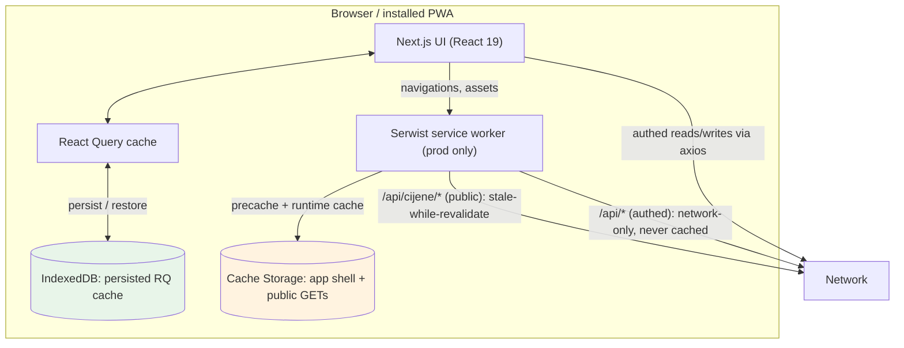
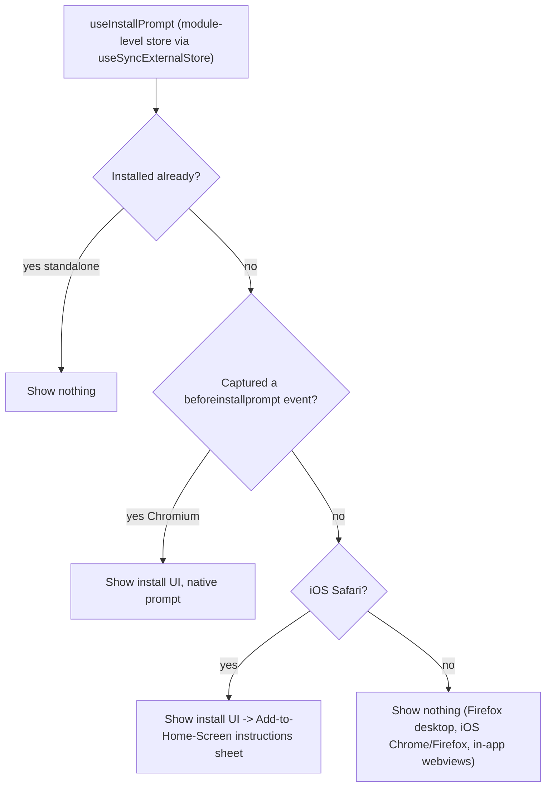
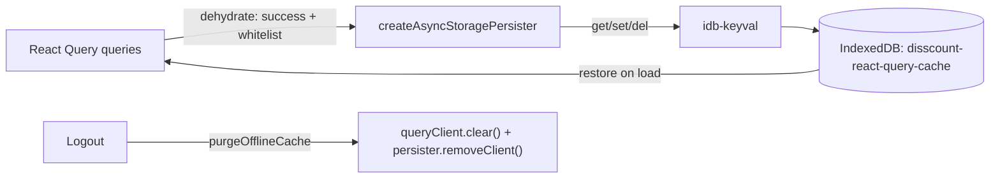
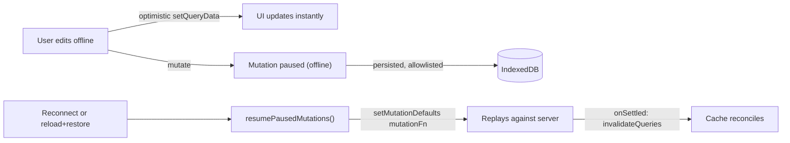

# Disscount: Progressive Web App (PWA) Guide

A complete reference for how Disscount behaves as an installable, offline-capable Progressive Web App: how it installs, how it caches reads, how it queues writes made offline, and the native polish (status bar, splash screens, icons) that makes it feel like a real app. Written to be understandable even if you are new to PWAs. Keep it up to date as the setup changes.

*Last verified on branch `feat/pwa`, 2026-07-04: installable on Android/iOS, offline reads + writes working, manifest and service worker served correctly.*

> **Mental model in one sentence:** Disscount is a normal Next.js site plus two cooperating layers, a **Serwist service worker** that caches the app shell and public data (production only), and a **persisted React Query cache in IndexedDB** that holds your dynamic and private data offline and replays writes you make while offline.

---

## Table of contents

1. [Quick reference](#1-quick-reference)
2. [The four layers of the PWA](#2-the-four-layers-of-the-pwa)
3. [Architecture](#3-architecture)
4. [Installability](#4-installability)
5. [Offline reads: caching and persistence](#5-offline-reads-caching-and-persistence)
6. [Offline writes: queue and replay](#6-offline-writes-queue-and-replay)
7. [Native polish: status bar, splash, icons, screenshots](#7-native-polish-status-bar-splash-icons-screenshots)
8. [Key files](#8-key-files)
9. [Config, build, and environment](#9-config-build-and-environment)
10. [Libraries and versions](#10-libraries-and-versions)
11. [What is automatic vs manual](#11-what-is-automatic-vs-manual)
12. [How to test and verify](#12-how-to-test-and-verify)
13. [Gotchas and lessons learned](#13-gotchas-and-lessons-learned)
14. [Future improvements and TODOs](#14-future-improvements-and-todos)

---

## 1. Quick reference

| Thing | Value |
|---|---|
| Service worker library | **Serwist** (`@serwist/next`), the maintained successor to `next-pwa` |
| Service worker source | `frontend/src/app/sw.ts` (compiled to `public/sw.js` at build) |
| Service worker active in | **production builds only** (disabled in dev, since it fights Turbopack/HMR) |
| Web app manifest | `frontend/src/app/manifest.ts` (served at `/manifest.webmanifest`) |
| Offline data store | IndexedDB via a persisted React Query cache (`idb-keyval` + `@tanstack/react-query-persist-client`) |
| Build command | `next build --webpack` (Serwist needs webpack; dev stays on Turbopack) |
| Status-bar / theme color | `#ffffff` (neutral white, set in both `manifest.ts` and the `viewport` export) |
| Install UX | floating dismissible banner + persistent sidebar banner + iOS/Android instructions sheet |
| Icons / splash / screenshots | `public/icons` (4), `public/splash` (18 iOS sizes), `public/screenshots` (2) |
| What is NOT built yet | push notifications, app badging, service-worker update prompt, wake lock (see [TODOs](#14-future-improvements-and-todos)) |

**The one rule that explains most decisions:** public data may be cached by the service worker; **private (authenticated) data is never written to the HTTP Cache Storage**, it lives only in the React Query IndexedDB cache and is wiped on logout.

---

## 2. The four layers of the PWA

Disscount's PWA was built in stages, and it helps to keep the four layers separate in your head because they use different mechanisms and fail in different ways.

| Layer | What it gives the user | Mechanism | Active in dev? |
|---|---|---|---|
| **Installability** | Add-to-home-screen, standalone window, app shortcuts | Web App Manifest + a registered service worker | manifest yes, SW no |
| **Offline reads** | Previously seen products, lists, and watchlist still load offline | Persisted React Query cache in IndexedDB, plus Serwist runtime caching for the app shell and public price API | React Query layer yes, service worker no |
| **Offline writes** | Edits made offline (check off items, rename, track/untrack) sync when the connection returns | React Query paused mutations, persisted and replayed via `setMutationDefaults` + `resumePausedMutations` | yes |
| **Native polish** | Neutral status bar, iOS splash screen instead of a white flash, durable storage | Manifest fields, `apple-touch-startup-image` links, `navigator.storage.persist()` | yes (except the SW-dependent parts) |

The most important consequence: the **data layer (React Query in IndexedDB) works in `pnpm dev`**, so you can test offline reads and writes locally, but the **service worker layer only exists in a production build**, so app-shell offline and the `/offline` fallback need `next build --webpack`.

---

## 3. Architecture

Two caches, on purpose:

- **Cache Storage (service worker):** the app shell (HTML/JS/CSS precache), static assets, and **public** `/api/cijene/*` GET responses. Never authenticated responses.
- **IndexedDB (React Query):** the dynamic and **private** data (shopping lists, watchlist, viewed products, recent searches, profile). This is what makes authed screens work offline, and it is purged on logout.

Everything is same-origin: the browser calls `/api/cijene/*` (Next.js route handlers to the external Cijene API) and `/api/*` (Next.js `rewrites()` proxy to the Spring backend), so the service worker can see and selectively cache them.

---

## 4. Installability

### What it does

Disscount ships a Web App Manifest and a registered service worker, which together let Android/desktop Chromium and iOS Safari install the app to the home screen as a standalone window, with app shortcuts, a themed splash, and the right icons.

### The manifest (`src/app/manifest.ts`)

A Next.js dynamic manifest (a function returning `MetadataRoute.Manifest`) served at `/manifest.webmanifest`. Key fields:

| Field | Value | Why |
|---|---|---|
| `display` | `standalone` | opens without browser chrome, like an app |
| `orientation` | `portrait` | shopping is a phone-in-hand, portrait activity (also means we only need portrait splash screens) |
| `background_color` | `#fafafa` | the splash background while the app boots |
| `theme_color` | `#ffffff` | neutral title bar (was brand green, changed to a default look) |
| `icons` | 192, 512, and a 512 **maskable** | maskable avoids the icon being clipped by the OS circle/squircle |
| `shortcuts` | derived from `userNavItems` filtered by `!comingSoon` | long-press the icon to jump to Shopping lists / Watchlist; the list grows automatically as features ship |
| `screenshots` | one `narrow` + one `wide` | Chrome's richer, app-store-like install dialog |
| `launch_handler` | `{ client_mode: "focus-existing" }` | reuse an open window instead of spawning a duplicate when launched from a shortcut or notification |

Icons are generated from `public/disscount-logo.png` by `scripts/generate-pwa-icons.mjs` (uses `sharp`), into `public/icons`.

### The install UX (`src/components/custom/pwa/`)

The tricky part of install UX is that support varies wildly by browser, so a shared hook centralizes the detection.

- `use-install-prompt.ts` keeps a **single shared** captured `beforeinstallprompt` event at module scope (read via `useSyncExternalStore`), so the floating banner and the sidebar banner never hold separate, stale copies. It also exposes a `ready` flag so nothing flashes before client-side detection runs.
- `install-banner.tsx`: a one-time **dismissible floating banner** (dismissal persisted in the existing `Disscount_app` localStorage object). Mounted in `layout.tsx`.
- `install-sidebar-banner.tsx`: a **persistent banner** in the sidebar footer, shown whenever the app is installable but not installed. Mounted in `app-sidebar.tsx`.
- `install-instructions-sheet.tsx`: platform-aware manual steps (iOS Safari "Share, then Add to Home Screen", or the browser-menu path elsewhere), for when there is no native prompt.

The service worker registration is handled automatically by `@serwist/next` (no hand-written registration component). In development the service worker is disabled, so there is no `/sw.js` and no install prompt locally; test installability against a production build.

---

## 5. Offline reads: caching and persistence

Two mechanisms cooperate, split by data sensitivity.

### 5a. Serwist service worker (`src/app/sw.ts`), production only

Runtime caching rules, evaluated top to bottom (first match wins):

| Request | Strategy | Notes |
|---|---|---|
| `GET /api/cijene/*` (public price data) | **StaleWhileRevalidate** | cache `cijene-api`, `CacheableResponsePlugin` (statuses 0 + 200), `ExpirationPlugin` (200 entries, 7 days) |
| any other `/api/*` (authed, proxied to Spring) | **NetworkOnly** | deliberately never cached; private data lives in IndexedDB instead |
| everything else (app shell, `_next`, fonts, images) | `defaultCache` from `@serwist/next/worker` | Next.js-tuned precache + runtime rules |

Plus: `precacheEntries: self.__SW_MANIFEST` (the build-injected app-shell precache), `skipWaiting`, `clientsClaim`, `navigationPreload`, and a `fallbacks` rule that serves the precached `/offline` page for document requests that fail offline.

### 5b. Persisted React Query cache (IndexedDB), works everywhere

This is what makes authed screens (shopping lists, watchlist) and previously viewed products load offline.

- `react-query-provider.tsx` uses `PersistQueryClientProvider`. The `QueryClient` sets a default `gcTime` equal to the persister `maxAge` (7 days), so entries are not garbage-collected out of memory before they can be restored from disk.
- `persister.ts` builds a `createAsyncStoragePersister` backed by `idb-keyval` (IndexedDB, larger and safer than localStorage). `maxAge` 7 days, `buster` `"1"` (bump to invalidate all persisted caches after a breaking data-shape change).
- `cached-query-keys.ts` is the **whitelist**: only queries whose top-level key is in `cijene`, `shoppingLists`, `shoppingListItems`, `watchlist`, `digitalCards`, `pinnedStores`, `pinnedPlaces`, or `users` are persisted, and only when successful. Everything else (for example admin data) is never written to disk. Coming-soon features carry `TODO(offline)` markers here to be added when they ship.
- `purge.ts` (`purgeOfflineCache`) clears both the in-memory and IndexedDB caches. It is called from `user-context.tsx` inside `handleLogout` so authed data never lingers on a shared device.

### 5c. Offline UX

- `use-online-status.ts`: reads connectivity from React Query's `onlineManager` via `useSyncExternalStore`, so the whole app shares one source of truth.
- `offline-indicator.tsx`: a thin top banner shown while offline, which also reports how many writes are queued to sync.
- `last-synced-label.tsx` + `utils/date.ts` (`formatRelativeTime`): a small "last synced" label (for example "Cijene osvježene prije 2 h"), placed on the product detail prices, the watchlist header, and the shopping-list detail, reading each query's `dataUpdatedAt`.

---

## 6. Offline writes: queue and replay

Edits made offline are queued and replayed automatically. This is the part that turns the app from read-only-offline into genuinely usable in a store with bad signal.

### How it works

React Query pauses a mutation when the device is offline (network mode `online`, the default) and resumes it when the connection returns. Because the whole cache (including paused mutations) is persisted to IndexedDB, a queued write can even survive a full reload, but only if React Query knows what function to run on resume, since the original inline callbacks are gone after a reload.

Three pieces make replay-after-reload correct:

- `offline-mutation-keys.ts`: the **allowlist** of mutation keys that may queue offline (shopping list create/update/delete, item add/update/delete, watchlist add/remove), plus `shouldPersistMutation` used by the persister so only paused, allowlisted mutations are written to disk.
- `offline-mutations.ts` (`registerOfflineMutationDefaults`): registers, per mutation key, the `mutationFn` to re-run and the `onSettled` cache invalidation. These run when a paused mutation is replayed after a reload. The matching hooks in `lib/api/shopping-lists` and `lib/api/watchlist` carry the same `mutationKey`.
- `react-query-provider.tsx`: registers those defaults when the client is created, and calls `resumePausedMutations()` once the persisted cache has been restored.

### Nuance: creating and renaming offline

`use-shopping-list-modal.ts` detects offline (via `onlineManager.isOnline()`) and, instead of leaving the submit button spinning on a paused mutation, closes the modal immediately and shows a "will sync when back online" toast. The write is still queued and replays on reconnect.

---

## 7. Native polish: status bar, splash, icons, screenshots

| Feature | What / where | Why |
|---|---|---|
| **Neutral status bar** | `theme_color: "#ffffff"` in `manifest.ts` and `themeColor` in the `viewport` export of `layout.tsx` | removed the brand-green top bar in favor of a default/white look; iOS uses `appleWebApp.statusBarStyle: "default"` |
| **iOS splash screens** | `constants/ios-splash-screens.json` (18 portrait device sizes) + `scripts/generate-ios-splash.mjs` (writes `public/splash/*`) + `apple-splash-screens.tsx` (emits `apple-touch-startup-image` links) | iOS ignores the manifest for launch screens, so without these the installed app opens to a white flash |
| **Persistent storage** | `request-persistent-storage.tsx` calls `navigator.storage.persist()` once on load | asks the browser not to evict the IndexedDB offline cache under storage pressure or after disuse (notably on iOS) |
| **Manifest screenshots** | `public/screenshots/screenshot-narrow.png` + `screenshot-wide.png` | Chrome's richer install dialog; currently branded placeholder cards to be swapped for real captures |
| **Icons** | `public/icons/*` from `scripts/generate-pwa-icons.mjs` | 192, 512, maskable 512, apple-touch 180 |

Splash and persistent-storage components are mounted inside `providers.tsx`. This matters for the splash links specifically: because Next.js server-renders the provider tree, React hoists the `apple-touch-startup-image` links into the initial HTML `<head>`, so iOS sees them at launch time (not only after hydration).

The screenshot generator script was removed after the images were generated, so the screenshots are now static assets: to change them, replace the PNGs in `public/screenshots` directly (ideally with real app captures).

---

## 8. Key files

| Path | Role |
|---|---|
| `frontend/src/app/manifest.ts` | Web App Manifest (name, display, theme, icons, shortcuts, screenshots, launch_handler) |
| `frontend/src/app/sw.ts` | Serwist service worker source: precache + runtime caching + `/offline` fallback |
| `frontend/next.config.ts` | wraps the config with `withSerwistInit` (composed around Sentry); disables the SW in dev |
| `frontend/src/app/offline/page.tsx` + `components/offline-retry-button.tsx` | the offline fallback page and its reload button |
| `frontend/src/components/custom/pwa/use-install-prompt.ts` | shared install-state store + platform/support detection |
| `frontend/src/components/custom/pwa/install-banner.tsx` | one-time dismissible floating install banner |
| `frontend/src/components/custom/pwa/install-sidebar-banner.tsx` | persistent sidebar install banner |
| `frontend/src/components/custom/pwa/install-instructions-sheet.tsx` | manual install steps (iOS / other) |
| `frontend/src/components/custom/pwa/apple-splash-screens.tsx` | emits `apple-touch-startup-image` links |
| `frontend/src/components/custom/pwa/request-persistent-storage.tsx` | requests durable storage |
| `frontend/src/app/providers/react-query-provider.tsx` | `PersistQueryClientProvider`, registers offline mutation defaults, resumes paused mutations |
| `frontend/src/lib/offline/persister.ts` | IndexedDB persister + persist options (maxAge, buster, dehydrate rules) |
| `frontend/src/lib/offline/cached-query-keys.ts` | whitelist of query keys that may be persisted |
| `frontend/src/lib/offline/offline-mutation-keys.ts` | allowlist of mutation keys that may queue offline |
| `frontend/src/lib/offline/offline-mutations.ts` | registers replay `mutationFn` + invalidation per key |
| `frontend/src/lib/offline/purge.ts` | clears in-memory + IndexedDB cache on logout |
| `frontend/src/hooks/use-online-status.ts` | online/offline state from `onlineManager` |
| `frontend/src/components/custom/offline/offline-indicator.tsx` | offline banner + queued-writes count |
| `frontend/src/components/custom/offline/last-synced-label.tsx` | "last synced" relative-time label |
| `frontend/src/utils/date.ts` | `formatRelativeTime` helper |
| `frontend/src/constants/ios-splash-screens.json` | iOS device list (single source for the generator and the links) |
| `frontend/scripts/generate-pwa-icons.mjs` / `generate-ios-splash.mjs` | asset generators (run with `node`) |
| `frontend/public/{icons,splash,screenshots}/` | generated PNG assets |

---

## 9. Config, build, and environment

**Build.** `package.json` sets `"build": "next build --webpack"`. Serwist compiles the service worker with webpack, and Next.js 16 defaults to Turbopack, so the build is pinned to webpack. Development stays on Turbopack (`"dev": "next dev"`).

**Service-worker toggle.** `next.config.ts` calls `withSerwistInit({ swSrc: "src/app/sw.ts", swDest: "public/sw.js", disable: process.env.NODE_ENV === "development", additionalPrecacheEntries: [{ url: "/offline", revision }], reloadOnOnline: true })`, then wraps the Sentry-wrapped config. `disable` in development means no service worker is generated or registered locally.

**TypeScript.** `tsconfig.json` adds `"webworker"` to `lib`, `"@serwist/next/typings"` to `types`, and excludes the generated `public/sw.js`.

**Git ignore.** `public/sw*` and `public/swe-worker*` are gitignored because Serwist generates them at build time.

**Environment variables.** The PWA adds **no new env vars**. `metadataBase` (used for absolute manifest/icon URLs) reads the existing `NEXT_PUBLIC_APP_URL`. When push notifications are built (see TODOs), they will add VAPID keys, which must then be documented and synced into `.env` and `example.env`.

---

## 10. Libraries and versions

Read from `frontend/package.json`.

| Library | Version | Role |
|---|---|---|
| `@serwist/next` | `^9.5.11` | Next.js integration for the Serwist service worker |
| `serwist` | `^9.5.11` (dev) | the service-worker toolkit (Workbox successor): strategies, plugins, precaching |
| `@tanstack/react-query` | `^5.90.12` | data fetching + cache (the offline read/write engine) |
| `@tanstack/react-query-persist-client` | `^5.101.1` (pinned) | persist/restore the query cache |
| `@tanstack/query-async-storage-persister` | `^5.101.1` (pinned) | async persister used with IndexedDB |
| `idb-keyval` | `^6.2.5` | tiny IndexedDB key-value wrapper backing the persister |
| `sharp` | `^0.35.2` (dev) | image generation for icons and splash screens |
| `next` | `16.2.9` | App Router, dynamic manifest, metadata hoisting |
| `react` | `19.2.4` | renders and hoists the `<link>`/metadata tags |
| `@yudiel/react-qr-scanner` | `^2.4.1` | barcode/QR scanning (used by digital cards; native Barcode Detection is a future option) |

> 🔑 **Version pin:** the two `@tanstack` persist packages are pinned to **exactly `5.101.1`** to match the resolved `@tanstack/react-query`. A mismatch pulls a second copy of `@tanstack/query-core`, whose `Query` type is nominally incompatible and breaks `tsc`. If `react-query` is upgraded, bump these in lockstep.

---

## 11. What is automatic vs manual

| Task | Automatic? | Notes |
|---|---|---|
| Service-worker registration + precache | ✅ auto | `@serwist/next`, **production builds only** |
| Offline read cache (dynamic + private data) | ✅ auto | persisted React Query cache in IndexedDB |
| Offline write queue + replay | ✅ auto | on reconnect, and after reload once the cache restores |
| Capturing the install prompt | ✅ auto | `beforeinstallprompt` captured into a shared store |
| Purging offline data on logout | ✅ auto | `purgeOfflineCache` in `handleLogout` |
| iOS splash links in `<head>` | ✅ auto | server-rendered via provider tree, React hoists them |
| **Service worker in development** | ❌ no | disabled on purpose; use a production build to test the SW |
| **Regenerating icons / splash** | ❌ manual | run `node scripts/generate-pwa-icons.mjs` / `generate-ios-splash.mjs` |
| **Updating manifest screenshots** | ❌ manual | the generator was removed; replace the PNGs in `public/screenshots` |
| **Bumping the cache `buster`** | ❌ manual | change it in `persister.ts` after a breaking data-shape change |
| **Adding a new offline-cached feature** | ❌ manual | add its query key to `cached-query-keys.ts` (and mutation key to `offline-mutation-keys.ts` + a default) |

---

## 12. How to test and verify

**Data layer (works in `pnpm dev`):**
- Load a shopping list / product while online, then toggle **Offline** in DevTools (Network) and navigate back: the data should still render from IndexedDB, with a "last synced" label and the offline banner.
- Check off an item offline: the UI updates optimistically and the banner shows a queued-writes count. Go back online: it syncs (a network request fires).
- Log out: DevTools, Application, IndexedDB, the `disscount-react-query-cache` store should be cleared.

**Service-worker layer (needs a production build, which you run):**
- `next build --webpack` then start, open DevTools, Application, Service Workers: Serwist should be active.
- Reload offline: the app shell loads; an unknown route offline serves `/offline`; `/api/cijene` GETs are served from the `cijene-api` cache.

**Install + native:**
- Android/desktop Chrome: the install banner/sidebar entry appears and the prompt works; installed app opens standalone with the white status bar.
- iOS Safari: the instructions sheet opens; after Add to Home Screen, the app launches with a branded splash (not a white flash).
- DevTools, Application, Manifest: no errors, icons and screenshots load, "Installability" passes.

**Endpoints (against a running server):** `curl -s http://localhost:3000/manifest.webmanifest` (fields present), `curl -s http://localhost:3000/ | grep apple-touch-startup-image` (18 links in `<head>`), `curl -s http://localhost:3000/ | grep 'theme-color'` (`#ffffff`).

---

## 13. Gotchas and lessons learned

| Gotcha | What happened / fix |
|---|---|
| **Serwist needs webpack** | Next.js 16 defaults to Turbopack, so `build` is `next build --webpack`. The SW only exists in production builds. |
| **No service worker in dev** | `disable: NODE_ENV === "development"`, so `/sw.js` does not exist locally. This is intentional (SW + HMR do not mix). |
| **Stale SW 404s `/sw.js` in dev** | A service worker registered during earlier production testing keeps re-checking `/sw.js`, which 404s in dev. Harmless; unregister it in DevTools, Application, Service Workers. |
| **Persisted paused mutations need defaults** | Persisting a paused mutation without a matching `setMutationDefaults` means it cannot be replayed after a reload. That is why `offline-mutations.ts` + `resumePausedMutations()` exist, and why the persister only dehydrates allowlisted mutations. |
| **`gcTime` must be >= `maxAge`** | Otherwise React Query evicts an entry from memory before it can be restored from disk. Both are 7 days. |
| **Authed data must not hit Cache Storage** | The service worker uses `NetworkOnly` for `/api/*` (non-cijene). Private data lives only in IndexedDB, which is purged on logout. |
| **iOS splash must be server-rendered** | The `apple-touch-startup-image` links must be in the initial HTML `<head>` (iOS reads them at launch). They are rendered through the provider tree so React hoists them during SSR, not injected client-side. |
| **`@tanstack` persist version pin** | Pinned to `5.101.1` to match `react-query`; a mismatch causes duplicate `query-core` and `tsc` errors. |
| **Watchlist add/remove is not optimistic offline** | The write queues correctly but the UI does not reflect it until it syncs. A future optimistic-toggle improvement. |
| **Offline create has no temp entity** | A list created offline appears only after reconnect (the modal closes with a toast). True optimistic create needs temp IDs + reconciliation. |
| **iOS can evict storage** | Hence `navigator.storage.persist()`; treat the offline cache as best-effort, never as the source of truth. |

---

## 14. Future improvements and TODOs

**The big one (unblocks the core value loop)**
- [ ] **Push notifications**: VAPID keys + a `web-push` sender + a push-subscription store, wired to the watchlist price-drop alerts. Can live entirely in the Next.js app (no Spring change required for sending); the open question is what evaluates thresholds and triggers a send. This is the highest-leverage PWA gap.

**PWA polish**
- [ ] **App Badging API** (`navigator.setAppBadge`) for unread notifications on the installed icon.
- [ ] **Service-worker "update available" prompt** (a toast when a new worker is waiting), which also fixes the "hard-refresh after deploy" gotcha in `DEPLOYMENT.md`.
- [ ] **Screen Wake Lock + max brightness** while showing a loyalty-card barcode (for the digital-cards rewrite).
- [ ] **Web Share** (outgoing) and **Share Target** (incoming) for products and lists.
- [ ] **Native Barcode Detection** as a fast path on Android, keeping `@yudiel/react-qr-scanner` as the universal fallback.
- [ ] **Real manifest screenshots** to replace the branded placeholder cards.
- [ ] **Periodic Background Sync** to refresh watchlist/deal prices in the background (Chromium-only and unreliable; a complement to, not a replacement for, a server-side price-check job).

**Offline depth**
- [ ] Optimistic watchlist add/remove offline.
- [ ] Optimistic offline list creation with temp IDs + reconciliation.
- [ ] Wire `TODO(offline)` coming-soon features (digital cards, potrošnja, novosti, karta) into the persistence whitelist when they ship.

**Distribution**
- [ ] Package the PWA for the **Google Play Store** via a Trusted Web Activity (Bubblewrap / PWABuilder), and optionally the iOS App Store. The generated icons and splash/screenshot assets are the same ones a store listing needs.

**Later**
- [ ] Speech-to-search and File System export are noted in the knowledge base as later enhancements.
