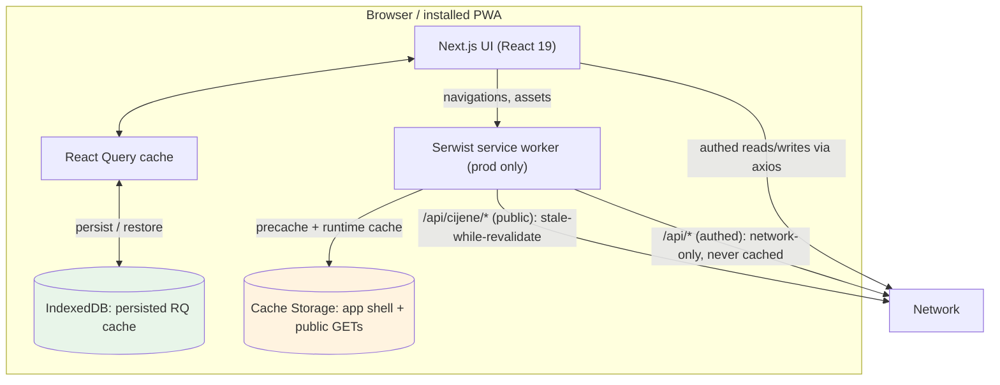
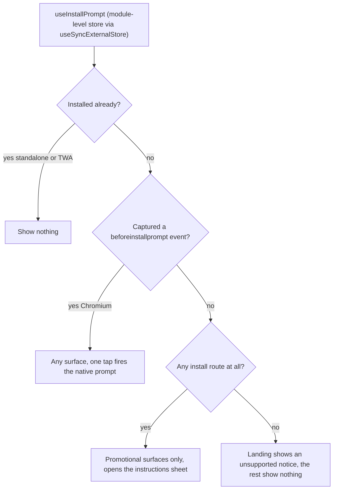
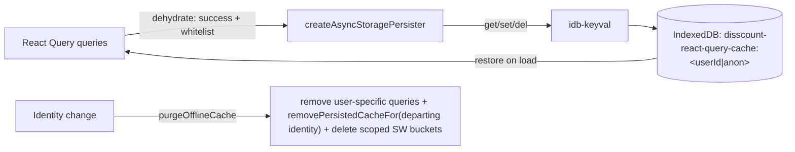
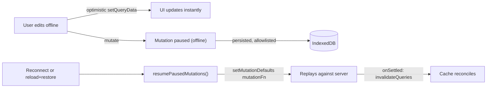

# Disscount: Progressive Web App (PWA) Guide

A complete reference for how Disscount behaves as an installable, offline-capable Progressive Web App: how it installs, how it caches reads, how it queues writes made offline, and the native polish (status bar, splash screens, icons) that makes it feel like a real app. Written to be understandable even if you are new to PWAs. Keep it up to date as the setup changes.

_Last verified on branch `feat/pwa`, 2026-07-04: installable on Android/iOS, offline reads + writes working, manifest and service worker served correctly._

> **Mental model in one sentence:** Disscount is a normal Next.js site plus two cooperating layers, a **Serwist service worker** that caches the app shell and public data (production only), and a **persisted React Query cache in IndexedDB** that holds your dynamic and private data offline and replays writes you make while offline.

---

## Table of contents

1. [Quick reference](#1-quick-reference)
2. [The four layers of the PWA](#2-the-four-layers-of-the-pwa)
3. [Architecture](#3-architecture)
4. [Installability](#4-installability)
5. [Offline reads: caching and persistence](#5-offline-reads-caching-and-persistence)
6. [Offline writes: queue and replay](#6-offline-writes-queue-and-replay)
7. [Native polish: status bar, splash, icons, screenshots](#7-native-polish-status-bar-splash-icons-screenshots)
8. [Key files](#8-key-files)
9. [Config, build, and environment](#9-config-build-and-environment)
10. [Libraries and versions](#10-libraries-and-versions)
11. [What is automatic vs manual](#11-what-is-automatic-vs-manual)
12. [How to test and verify](#12-how-to-test-and-verify)
13. [Gotchas and lessons learned](#13-gotchas-and-lessons-learned)
14. [Future improvements and TODOs](#14-future-improvements-and-todos)

---

## 1. Quick reference

| Thing                        | Value                                                                                                                     |
| ---------------------------- | ------------------------------------------------------------------------------------------------------------------------- |
| Service worker library       | **Serwist** (`@serwist/next`), the maintained successor to `next-pwa`                                                     |
| Service worker source        | `frontend/src/app/sw.ts` (compiled to `public/sw.js` at build)                                                            |
| Service worker active in     | **production builds only** (disabled in dev, since it fights Turbopack/HMR)                                               |
| Web app manifest             | `frontend/src/app/manifest.ts` (served at `/manifest.webmanifest`)                                                        |
| Offline data store           | IndexedDB via a persisted React Query cache (`idb-keyval` + `@tanstack/react-query-persist-client`)                       |
| Build command                | `next build --webpack` (Serwist needs webpack; dev stays on Turbopack)                                                    |
| Status-bar / theme color     | `#ffffff` (neutral white, set in both `manifest.ts` and the `viewport` export)                                            |
| Install UX                   | floating dismissible banner + sidebar and landing cards + a four-platform instructions sheet                              |
| Icons / splash / screenshots | `public/brand/icons`, `public/splash` (18 iOS sizes), `public/screenshots` (2); see `docs/BRAND.md`                       |
| What is NOT built yet        | push notifications, app badging, service-worker update prompt, wake lock (see [TODOs](#14-future-improvements-and-todos)) |

**The one rule that explains most decisions:** public data may be cached by the service worker; **private (authenticated) data is never written to the HTTP Cache Storage**, it lives only in the React Query IndexedDB cache and is wiped on logout.

---

## 2. The four layers of the PWA

Disscount's PWA was built in stages, and it helps to keep the four layers separate in your head because they use different mechanisms and fail in different ways.

| Layer              | What it gives the user                                                                       | Mechanism                                                                                                     | Active in dev?                           |
| ------------------ | -------------------------------------------------------------------------------------------- | ------------------------------------------------------------------------------------------------------------- | ---------------------------------------- |
| **Installability** | Add-to-home-screen, standalone window, app shortcuts                                         | Web App Manifest + a registered service worker                                                                | manifest yes, SW no                      |
| **Offline reads**  | Previously seen products, lists, and watchlist still load offline                            | Persisted React Query cache in IndexedDB, plus Serwist runtime caching for the app shell and public price API | React Query layer yes, service worker no |
| **Offline writes** | Edits made offline (check off items, rename, track/untrack) sync when the connection returns | React Query paused mutations, persisted and replayed via `setMutationDefaults` + `resumePausedMutations`      | yes                                      |
| **Native polish**  | Neutral status bar, iOS splash screen instead of a white flash, durable storage              | Manifest fields, `apple-touch-startup-image` links, `navigator.storage.persist()`                             | yes (except the SW-dependent parts)      |

The most important consequence: the **data layer (React Query in IndexedDB) works in `pnpm dev`**, so you can test offline reads and writes locally, but the **service worker layer only exists in a production build**, so app-shell offline and the `/offline` fallback need `next build --webpack`.

---

## 3. Architecture

```mermaid
flowchart TB
    subgraph Browser["Browser / installed PWA"]
        UI["Next.js UI (React 19)"]
        RQ["React Query cache"]
        SW["Serwist service worker (prod only)"]
        IDB[("IndexedDB: persisted RQ cache")]
        CS[("Cache Storage: app shell + public GETs")]
    end

    UI <--> RQ
    RQ <-->|persist / restore| IDB
    UI -->|navigations, assets| SW
    SW -->|precache + runtime cache| CS
    SW -->|"/api/cijene/* (public): stale-while-revalidate"| Net["Network"]
    SW -->|"/api/* (authed): network-only, never cached"| Net
    UI -->|"authed reads/writes via axios"| Net

    style IDB fill:#e8f5e9
    style CS fill:#fff3e0
```

Two caches, on purpose:

- **Cache Storage (service worker):** the app shell (HTML/JS/CSS precache), static assets, and **public** `/api/cijene/*` GET responses. Never authenticated responses.
- **IndexedDB (React Query):** the dynamic and **private** data (shopping lists, watchlist, viewed products, recent searches, profile). This is what makes authed screens work offline, and it is purged whenever the session ends (logout, expiry, revoked cookie, or sign-out in another tab).

Everything is same-origin: the browser calls `/api/cijene/*` (Next.js route handlers to the external Cijene API) and `/api/*` (Next.js `rewrites()` proxy to the Spring backend), so the service worker can see and selectively cache them.

---

## 4. Installability

### What it does

Disscount ships a Web App Manifest and a registered service worker, which together let Android/desktop Chromium and iOS Safari install the app to the home screen as a standalone window, with app shortcuts, a themed splash, and the right icons.

### The manifest (`src/app/manifest.ts`)

A Next.js dynamic manifest (a function returning `MetadataRoute.Manifest`) served at `/manifest.webmanifest`. Key fields:

| Field              | Value                                                   | Why                                                                                                                |
| ------------------ | ------------------------------------------------------- | ------------------------------------------------------------------------------------------------------------------ |
| `display`          | `standalone`                                            | opens without browser chrome, like an app                                                                          |
| `orientation`      | `portrait`                                              | shopping is a phone-in-hand, portrait activity (also means we only need portrait splash screens)                   |
| `background_color` | `#ffffff`                                               | the splash background while the app boots (white, to match the iOS launch screens)                                 |
| `theme_color`      | `#ffffff`                                               | neutral title bar (the light/dark pair is set in `layout.tsx` `viewport.themeColor`)                               |
| `icons`            | 192 + 512 `any`, and 192 + 512 **maskable**             | maskable avoids the icon being shrunk onto Android's own white plate; see [Icon sizing](#icon-sizing)              |
| `shortcuts`        | Skeniraj, then `userNavItems` filtered by `!comingSoon` | long-press the icon to scan a barcode or jump to Shopping lists / Watchlist; see [App shortcuts](#app-shortcuts)   |
| `screenshots`      | one `narrow` + one `wide` (each `label`ed)              | Chrome's richer, app-store-like install dialog                                                                     |
| `share_target`     | GET to `/share-target`                                  | registers Disscount in the system share sheet; the route handler funnels shared text/title/url into `/products?q=` |
| `launch_handler`   | `{ client_mode: "navigate-existing" }`                  | reuse an open window instead of spawning a duplicate, **and** navigate it to the shortcut's url                    |

Icons are generated from the happy-cart source (`public/brand/logo/cart/cart-rgb.svg`) by `scripts/generate-pwa-icons.mjs` (uses `sharp`), into `public/brand/icons` (plus the legacy `src/app/favicon.ico`). See `docs/BRAND.md` for the full asset map.

### Polarity

The two icon families run opposite ways on purpose:

| Family                          | Polarity                                  |
| ------------------------------- | ----------------------------------------- |
| App icons, apple-touch, favicon | green cart on **white**                   |
| Shortcut tiles                  | white glyph on **full-bleed brand green** |

**The app icon is a deliberate brand call, taken against the general guidance.** The advice for Android's adaptive background layer is to fill it with your primary colour, and the argument for it is real: a home screen is dense with saturated tiles, so a white plate reads as empty space with something small floating in it, and it fades against a light wallpaper. Disscount keeps the white plate anyway, because the happy cart is the brand and it reads as itself in green. Both were built and compared side by side before choosing. Do not "fix" this back to a green fill without asking.

The shortcut tiles do take the fill, because a shortcut has to read as its own destination rather than as the app, and because they are only ever seen against the dark long-press sheet.

Worth knowing when tempted to make a mark bigger: **size and polarity are not independent levers.** Enlarging on a plate is capped by the mask and the cap arrives early, at roughly 0.74 for the scan glyph before its corner brackets clip. Filling the tile has no cap, because the mark becomes the whole circle. Flipping the app icon to a green fill and back proved this, and proved the reverse too, that the two versions are pixel-identical in ink box and padding: a light mark on a dark ground simply _looks_ larger than the same mark dark-on-light.

**The cart sits left of centre and that is intended.** Its `viewBox` is `-1 6 68 50.5` while the art inside is `translate(2.5 0) rotate(-7)`, so about 11.5% of the box on the right is dead space and the ink midpoint lands roughly 5.75% left of the tile centre. Do not re-centre it.

The splash screens are a green cart on white too, matching `background_color` so the launch does not flash.

### Icon sizing

Every crop ratio in the generators is fixed by one rule: **Android masks a `maskable` icon, but shrinks an `any` icon onto a white plate of its own.** The second behaviour is what makes a mark look small on a phone, because the artwork gets scaled down twice.

The safe zone for a masked icon is a circle centred on the tile with a **radius of 40% of the width**, so a diameter of 80%. Aggressive OEM masks can go tighter, down to the 72dp visible area of Android's 108dp adaptive-icon layer (**66.7%**). Anything whose bounding-box corners carry ink has to fit its _diagonal_ inside that circle, not its width.

| Asset                        | Ratio  | Bound                                                                       |
| ---------------------------- | ------ | --------------------------------------------------------------------------- |
| `icon-192` / `icon-512`      | `0.86` | never masked, so this is just the roomiest crop that keeps a visible margin |
| `icon-maskable-192` / `-512` | `0.70` | the widest crop whose ink still sits on the 80% safe-zone boundary          |
| `apple-touch-icon-180`       | `0.86` | iOS applies a squircle, whose corners the cart does not reach into          |
| favicon frames               | `0.92` | line art needs the tightest crop to survive 16px                            |
| shortcut glyphs              | `0.66` | lucide insets its art by about 2 of 24 units, landing the ink near 0.55     |

Both maskable sizes ship so Chrome never falls back to an `any` icon merely because it wanted 192.

**iOS ignores all of this for shortcuts.** Safari has no app-shortcut support at all, so the `shortcuts` array is an Android and desktop feature. `apple-touch-icon-180` is the only piece of this that iOS reads.

To re-check a ratio, mask the generated PNG against circles at 80% and 66.7% and look at it. That is faster and more honest than the trigonometry.

### App shortcuts

Long-pressing the installed icon opens a shortcut menu. Ours is built in `manifest.ts` from one hand-written entry (Skeniraj) plus `userNavItems` filtered by `!comingSoon`, so the list grows on its own as features ship.

**There are fewer slots than it looks.** Chrome for Android shows **3** shortcuts. It allowed 4 until Chrome 92 started injecting its own "Site settings" entry, which takes a slot. Desktop Chrome and Edge show up to 10. Shortcuts render in manifest order, so the array order in `manifest.ts` is what decides which three a phone actually surfaces. We sit at exactly 3 today:

| Order | Shortcut | Url               | Icon          |
| ----- | -------- | ----------------- | ------------- |
| 1     | Skeniraj | `/?scan=1`        | `ScanBarcode` |
| 2     | Popisi   | `/shopping-lists` | `ListChecks`  |
| 3     | Praćenje | `/watchlist`      | `Eye`         |

That "Site settings" entry and its black gear come from Chrome, not from us. No manifest key can recolour, reorder or remove it.

**Icons.** Chrome accepts **PNG only** here and asks for 192x192. `scripts/generate-shortcut-icons.mjs` renders the same `lucide-react` component the nav uses through `renderToStaticMarkup`, then rasterizes it with `sharp` into `public/brand/shortcuts/`: a white glyph on a brand-green tile, glyph at 66% (see [Icon sizing](#icon-sizing)). Rendering the component rather than a copied path is what keeps a shortcut icon from drifting away from its nav icon. `constants/pwa-shortcuts.ts` derives each `src` from the nav item's `id` and emits a shortcut only for a released item that carries a `shortcutDescription`, so a missing description drops the shortcut rather than shipping one with no accessible name. Releasing an item therefore takes two manual steps: give it a `shortcutDescription` in `constants/navigation.ts` if it has none, and add its glyph to `generate-shortcut-icons.mjs` and re-run it. Dropping the `comingSoon` flag does the rest.

**Each shortcut ships two tiles**, because one image cannot do both jobs:

| File           | `purpose`  | Shape                                 | Who draws it                  |
| -------------- | ---------- | ------------------------------------- | ----------------------------- |
| `<id>.png`     | `maskable` | full bleed, square                    | Android, which applies a mask |
| `<id>-any.png` | `any`      | brand corner radius (96/512 = 18.75%) | desktop jump lists, unmasked  |

The masked one has to stay full bleed. Chrome hands a maskable icon to Android as an adaptive-icon layer, and transparent corners there are filled in by the launcher rather than left alone, which is how the first version ended up shrunk onto a second white plate with its corners poking past the mask. The unmasked one is drawn exactly as given, where a hard square reads as a blank block, so it keeps the radius. Splitting them is also what the maskable guidance recommends: an icon designed for a mask looks wrong without one.

**Skeniraj has no route of its own.** The scanner is imperative (`context/scanner-context.tsx`), so the shortcut points at `/?scan=1` and `components/custom/pwa/scan-shortcut.tsx` picks the flag up, strips it from the URL with `replaceState` before opening the camera (so a refresh or a back navigation does not reopen it), and routes the scanned code through `useProductNavigation`.

Adding Karta and Digitalne kartice once they ship is tracked in [#127](https://github.com/OffCrazyFreak/Disscount/issues/127), which is really a "pick the final three" decision rather than an append.

### The install UX (`src/components/custom/pwa/`)

The tricky part of install UX is that support varies wildly by browser, so a shared hook centralizes the detection.

```mermaid
flowchart TD
    A["useInstallPrompt (module-level store via useSyncExternalStore)"] --> B{Installed already?}
    B -->|yes standalone or TWA| Z[Show nothing]
    B -->|no| C{Captured a beforeinstallprompt event?}
    C -->|yes Chromium| D["Any surface, one tap fires the native prompt"]
    C -->|no| E{Any install route at all?}
    E -->|yes| F["Promotional surfaces only, opens the instructions sheet"]
    E -->|no| Z2["Landing shows an unsupported notice, the rest show nothing"]
```

The store exposes three gates rather than one, because "can install" is not a single question.

| Gate                    | Means                                                 | Used by                                        |
| ----------------------- | ----------------------------------------------------- | ---------------------------------------------- |
| `canShowInstallUI`      | an install is one tap away: a captured prompt, or iOS | unprompted surfaces (floating banner, sidebar) |
| `canPromoteInstall`     | an install is possible at all, prompt or browser menu | promotional surfaces (the landing page)        |
| `showUnsupportedNotice` | genuinely no route, so name another browser           | the landing page only                          |

The split exists because `beforeinstallprompt` is Chromium-only. Gating everything on it wrote off macOS Safari (File, then Add to Dock), Firefox on Android, and Opera on Android, all of which install fine from their own menus and would otherwise be told to go and fetch Chrome for no reason. Opera Android is the common case: it is Chromium and is listed as supporting the event, but does not fire it in practice, so it lands in the middle tier.

- `use-install-prompt.ts` keeps a **single shared** captured `beforeinstallprompt` event at module scope (read via `useSyncExternalStore`), so no two surfaces hold separate, stale copies. It also exposes a `ready` flag so nothing flashes before client-side detection runs, and a `platform` value (`ios`, `macSafari`, `android`, `desktop`) that picks the instruction wording.
- The event is captured **twice over**. A `beforeInteractive` script in `layout.tsx` stashes it on `window.__installPrompt`, and the store adopts that stash on init. Without it, an event that fires before hydration is lost for the whole page, and since Chrome never re-fires it the button silently degrades to manual instructions when a one-tap install was available. The store keeps its own listener for events that arrive after hydration.
- `promptInstall` dedupes concurrent clicks with a flag and clears the event only once the choice resolves. `prompt()` may only be called once per event, so a dismissal spends it exactly as an accept does; clearing up front instead would flip every mounted surface to the instructions branch while the native sheet is still open.
- `install-banner.tsx`: a one-time **dismissible floating banner** (dismissal persisted in the existing `Disscount_app` localStorage object, 7-day snooze). Mounted in `layout.tsx`.
- `install-card.tsx`: the shared card, in the sidebar footer and, with `permanent`, on the landing page. `permanent` is what switches it from `canShowInstallUI` to `canPromoteInstall` and gives it the unsupported notice.
- `install-perk.tsx`: the landing page's "Instaliraj kao aplikaciju" perk row, clickable wherever an install is possible.
- `install-copy.ts`: the button label and pitch, shared so the banner, the card and the sheet cannot contradict each other.
- `install-instructions-sheet.tsx`: manual steps for when there is no native prompt, with four separate step lists. A share sheet, a menu bar, a phone menu and an address-bar icon are four different things to press, and naming the wrong one is worse than saying nothing.

The service worker registration is handled automatically by `@serwist/next` (no hand-written registration component). In development the service worker is disabled, so there is no `/sw.js` and no install prompt locally; test installability against a production build.

---

## 5. Offline reads: caching and persistence

Two mechanisms cooperate, split by data sensitivity.

### 5a. Serwist service worker (`src/app/sw.ts`), production only

Runtime caching rules, evaluated top to bottom (first match wins):

| Request                                             | Strategy                                   | Notes                                                                                                                  |
| --------------------------------------------------- | ------------------------------------------ | ---------------------------------------------------------------------------------------------------------------------- |
| `GET /api/cijene/*` (public price data)             | **StaleWhileRevalidate**                   | cache `cijene-api`, `CacheableResponsePlugin` (statuses 0 + 200), `ExpirationPlugin` (200 entries, 7 days)             |
| any other `/api/*` (authed, proxied to Spring)      | **NetworkOnly**                            | deliberately never cached; private data lives in IndexedDB instead                                                     |
| `/shopping-lists/*` (list pages)                    | **NetworkFirst**                           | cache `shopping-list-pages`, 5s network timeout, 20 entries, 1 day. Must stay above `defaultCache`. See the note below |
| everything else (app shell, `_next`, fonts, images) | `defaultCache` from `@serwist/next/worker` | Next.js-tuned precache + runtime rules                                                                                 |

The `/shopping-lists/*` rule is a privacy decision as much as a caching one. A list is
shared at its own URL, so one of those documents can carry someone else's list title, and
`defaultCache` would keep it for 24 days keyed by URL alone with no notion of who asked. It was
`NetworkOnly` at first, which kept them off disk entirely but sent every offline reload
to the `/offline` fallback, making the queued-write story unreachable in exactly the
bad-signal case it exists for. NetworkFirst with a one-day expiry is the trade, and it
is only safe because `purgeOfflineCache` now deletes this bucket (and `cijene-api`) when
the signed-in identity changes. Nothing else in the app has ever called `caches.delete()`.

Plus: `precacheEntries: self.__SW_MANIFEST` (the build-injected app-shell precache), `skipWaiting`, `clientsClaim`, `navigationPreload`, and a `fallbacks` rule that serves the precached `/offline` page for document requests that fail offline.

### 5b. Persisted React Query cache (IndexedDB), works everywhere

This is what makes authed screens (shopping lists, watchlist) and previously viewed products load offline.

```mermaid
flowchart LR
    Q["React Query queries"] -->|"dehydrate: success + whitelist"| P["createAsyncStoragePersister"]
    P -->|get/set/del| K["idb-keyval"]
    K --> IDB[("IndexedDB: disscount-react-query-cache:&lt;userId|anon&gt;")]
    IDB -->|restore on load| Q
    Logout["Identity change"] -->|purgeOfflineCache| Clear["remove user-specific queries + removePersistedCacheFor(departing identity) + delete scoped SW buckets"]
```

- `react-query-provider.tsx` uses `PersistQueryClientProvider`. The `QueryClient` sets a default `gcTime` equal to the persister `maxAge` (7 days), so entries are not garbage-collected out of memory before they can be restored from disk.
- `persister.ts` builds a `createAsyncStoragePersister` backed by `idb-keyval` (IndexedDB, larger and safer than localStorage). `maxAge` 7 days, `buster` `"3"`. The history: `"2"` was the `ShoppingListDto` reshape for sharing, where a restored pre-change list had no `myAccess` and every capability check would have read that as no access; `"3"` was the move to a per-identity key, which orphaned the old shared blob. **Bumping it is heavier than it looks:** a mismatch makes `persistQueryClient` call `removeClient()`, which discards the whole persisted client, queued offline writes included, under every key rather than only the changed one. The token-to-id sharing move deliberately did not bump it and retired its two mutation keys with tombstone defaults instead.
- `cache-identity.ts` scopes the IndexedDB entry to the signed-in account (`disscount-react-query-cache:<userId>`, or `:anon`). Before this there was one browser-wide blob shared by every account on a device, with a destructive purge as the only defence, which is why a shared list could not be persisted at all. The identity is mirrored in localStorage because the persister has to pick a key synchronously at boot, before the session resolves.
- `cached-query-keys.ts` is the **whitelist**: only successful queries whose top-level key is in `cijene`, `shoppingLists`, `shoppingListItems`, `watchlist`, `digitalCards`, `pinnedStores`, `pinnedPlaces`, or `users` are persisted. Keys under `cijene/prices` have a narrower allowlist: only `cijene/prices/product` is persisted, while every other `cijene/prices/*` key is excluded. Bulk product-list results under `cijene/prices/search`, for example, stay in the in-memory React Query cache and the bounded service-worker cache instead of accumulating in IndexedDB as searches and facets change. Canonical single-product price keys remain persisted for product-detail offline reads. Everything else (for example admin data) is never written to disk. Coming-soon features carry `TODO(offline)` markers here to be added when they ship.
- `purge.ts` (`purgeOfflineCache`) removes user-specific queries from the in-memory cache, wipes the persisted snapshot, and deletes the `shopping-list-pages`, `cijene-api` and `others` service worker buckets, matched by exact name rather than by substring so a bucket like `pages-rsc` is never caught by accident, guarded so a failed clear never blocks logout. Public `cijene` queries remain in memory and are persisted again on the next successful save, while in-flight cancellation is scoped to user-specific queries so logging out cannot abort a public price fetch. `user-context.tsx` calls it on **any change of identity**, which covers explicit logout, session expiry, a revoked cookie, sign-out in another tab, and one account replacing another. It deliberately does **not** fire merely because there is no session: that condition is true on every page load for a visitor who never logs in, and firing there wiped their queued offline writes on the next boot with no error and nothing left to replay.

### 5c. Offline UX

- `use-online-status.ts`: reads connectivity from React Query's `onlineManager` via `useSyncExternalStore`, so the whole app shares one source of truth.
- `offline-indicator.tsx`: a thin top banner shown while offline, which also reports how many writes are queued to sync.
- `last-synced-label.tsx` + `utils/date.ts` (`formatRelativeTime`): a small "last synced" label (for example "Cijene osvježene prije 2 h"), placed on the product detail prices, the watchlist header, and the shopping-list detail, reading each query's `dataUpdatedAt`.

---

## 6. Offline writes: queue and replay

Edits made offline are queued and replayed automatically. This is the part that turns the app from read-only-offline into genuinely usable in a store with bad signal.

### How it works

React Query pauses a mutation when the device is offline (network mode `online`, the default) and resumes it when the connection returns. Because the whole cache (including paused mutations) is persisted to IndexedDB, a queued write can even survive a full reload, but only if React Query knows what function to run on resume, since the original inline callbacks are gone after a reload.

```mermaid
flowchart LR
    A["User edits offline"] -->|optimistic setQueryData| B["UI updates instantly"]
    A -->|mutate| C["Mutation paused (offline)"]
    C -->|persisted, allowlisted| IDB[("IndexedDB")]
    D["Reconnect or reload+restore"] --> E["resumePausedMutations()"]
    E -->|"setMutationDefaults mutationFn"| F["Replays against server"]
    F -->|"onSettled: invalidateQueries"| G["Cache reconciles"]
```

Three pieces make replay-after-reload correct:

- `offline-mutation-keys.ts`: the **allowlist** of mutation keys that may queue offline (shopping list create/update/delete, item add/update/delete, shared-list item update/delete, watchlist add/remove), plus `shouldPersistMutation` used by the persister so only paused, allowlisted mutations are written to disk.
- `offline-mutations.ts` (`registerOfflineMutationDefaults`): registers, per mutation key, the `mutationFn` to re-run and the `onSettled` cache invalidation. These run when a paused mutation is replayed after a reload. The matching hooks in `lib/api/shopping-lists` and `lib/api/watchlist` carry the same `mutationKey`. The two shared-list defaults additionally pass an `onError` toast, which no other mutation does: a reload loses the `onError` given at `mutate()` time, so a failed replay would otherwise revert silently. Only mutations whose call sites do **not** handle errors themselves may take it, or the user sees the same toast twice, and it claims lost access only for 403 and 404 because it also runs for live online failures.
- `react-query-provider.tsx`: registers those defaults when the client is created, and calls `resumePausedMutations()` once the persisted cache has been restored.

### Nuance: creating and renaming offline

`use-shopping-list-modal.ts` detects offline (via `onlineManager.isOnline()`) and, instead of leaving the submit button spinning on a paused mutation, closes the modal immediately and shows a "will sync when back online" toast. The write is still queued and replays on reconnect.

---

## 7. Native polish: status bar, splash, icons, screenshots

| Feature                  | What / where                                                                                                                                                                                         | Why                                                                                                                |
| ------------------------ | ---------------------------------------------------------------------------------------------------------------------------------------------------------------------------------------------------- | ------------------------------------------------------------------------------------------------------------------ |
| **Neutral status bar**   | `theme_color: "#ffffff"` in `manifest.ts` and `themeColor` in the `viewport` export of `layout.tsx`                                                                                                  | removed the brand-green top bar in favor of a default/white look; iOS uses `appleWebApp.statusBarStyle: "default"` |
| **iOS splash screens**   | `constants/ios-splash-screens.json` (18 portrait device sizes) + `scripts/generate-ios-splash.mjs` (writes `public/splash/*`) + `apple-splash-screens.tsx` (emits `apple-touch-startup-image` links) | iOS ignores the manifest for launch screens, so without these the installed app opens to a white flash             |
| **Persistent storage**   | `request-persistent-storage.tsx` calls `navigator.storage.persist()` once on load                                                                                                                    | asks the browser not to evict the IndexedDB offline cache under storage pressure or after disuse (notably on iOS)  |
| **Manifest screenshots** | `public/screenshots/screenshot-narrow.png` + `screenshot-wide.png`                                                                                                                                   | Chrome's richer install dialog; currently branded placeholder cards to be swapped for real captures                |
| **Icons**                | `public/brand/icons/*` from `scripts/generate-pwa-icons.mjs` (plus hand-authored `icon.svg` + `mask-icon.svg`)                                                                                       | 192 + 512 `any`, 192 + 512 maskable, apple-touch 180, favicon SVG, Safari mask-icon                                |
| **Shortcut icons**       | `public/brand/shortcuts/*` from `scripts/generate-shortcut-icons.mjs`                                                                                                                                | two 192 PNGs per app shortcut, a full-bleed `maskable` and a rounded `any`; Chrome takes PNG only                  |
| **Web Share (outgoing)** | `utils/browser/share.ts` (`shareOrCopy`), used by product sharing and both shopping-list share paths                                                                                                 | opens the OS share sheet where there is one and copies to the clipboard where there is not; see the note below     |

`shareOrCopy` returns an outcome (`shared`, `dismissed`, `copied`, `failed`) rather than toasting, so each caller keeps its own wording. Two things about it are deliberate and easy to undo by accident. It treats `AbortError` and `InvalidStateError` as dismissals rather than failures, because falling through to the clipboard there would copy behind the user's back while their sheet is still open. And it carries no pending state: `navigator.share` does not reliably settle when the sheet is dismissed on mobile, so a spinner cleared on completion strands the control until a reload. Do not add one.

Splash and persistent-storage components are mounted inside `providers.tsx`. This matters for the splash links specifically: because Next.js server-renders the provider tree, React hoists the `apple-touch-startup-image` links into the initial HTML `<head>`, so iOS sees them at launch time (not only after hydration).

The screenshot generator script was removed after the images were generated, so the screenshots are now static assets: to change them, replace the PNGs in `public/screenshots` directly (ideally with real app captures).

---

## 8. Key files

| Path                                                                                | Role                                                                                        |
| ----------------------------------------------------------------------------------- | ------------------------------------------------------------------------------------------- |
| `frontend/src/app/manifest.ts`                                                      | Web App Manifest (name, display, theme, icons, shortcuts, screenshots, launch_handler)      |
| `frontend/src/app/sw.ts`                                                            | Serwist service worker source: precache + runtime caching + `/offline` fallback             |
| `frontend/next.config.ts`                                                           | wraps the config with `withSerwistInit` (composed around Sentry); disables the SW in dev    |
| `frontend/src/app/offline/page.tsx` + `offline/components/offline-retry-button.tsx` | the offline fallback page and its reload button                                             |
| `frontend/src/lib/sentry/ignore-service-worker-noise.ts`                            | drops the registration failures Serwist reports from crawlers and restricted browsers       |
| `frontend/src/components/custom/pwa/use-install-prompt.ts`                          | shared install-state store + platform/support detection                                     |
| `frontend/src/app/layout.tsx`                                                       | `beforeInteractive` script that captures `beforeinstallprompt` before hydration             |
| `frontend/src/components/custom/pwa/install-banner.tsx`                             | one-time dismissible floating install banner                                                |
| `frontend/src/components/custom/pwa/install-card.tsx`                               | install card, in the sidebar and (with `permanent`) on the landing page                     |
| `frontend/src/components/custom/pwa/install-perk.tsx`                               | the landing page's clickable install perk row                                               |
| `frontend/src/components/custom/pwa/install-copy.ts`                                | shared button label and pitch copy, keyed by platform                                       |
| `frontend/src/components/custom/pwa/install-instructions-sheet.tsx`                 | manual install steps (iOS / macOS Safari / Android / desktop)                               |
| `frontend/src/components/custom/pwa/apple-splash-screens.tsx`                       | emits `apple-touch-startup-image` links                                                     |
| `frontend/src/components/custom/pwa/request-persistent-storage.tsx`                 | requests durable storage                                                                    |
| `frontend/src/components/custom/pwa/scan-shortcut.tsx`                              | serves the Skeniraj app shortcut: consumes `?scan=1` and opens the camera                   |
| `frontend/src/app/providers/react-query-provider.tsx`                               | `PersistQueryClientProvider`, registers offline mutation defaults, resumes paused mutations |
| `frontend/src/lib/offline/persister.ts`                                             | IndexedDB persister + persist options (maxAge, buster, dehydrate rules)                     |
| `frontend/src/lib/offline/cached-query-keys.ts`                                     | whitelist of query keys that may be persisted                                               |
| `frontend/src/lib/offline/offline-mutation-keys.ts`                                 | allowlist of mutation keys that may queue offline                                           |
| `frontend/src/lib/offline/offline-mutations.ts`                                     | registers replay `mutationFn` + invalidation per key                                        |
| `frontend/src/lib/offline/purge.ts`                                                 | clears in-memory + IndexedDB cache on logout                                                |
| `frontend/src/hooks/use-online-status.ts`                                           | online/offline state from `onlineManager`                                                   |
| `frontend/src/components/custom/offline/offline-indicator.tsx`                      | offline banner + queued-writes count                                                        |
| `frontend/src/components/custom/offline/last-synced-label.tsx`                      | "last synced" relative-time label                                                           |
| `frontend/src/utils/date.ts`                                                        | `formatRelativeTime` helper                                                                 |
| `frontend/src/utils/browser/share.ts`                                               | `shareOrCopy`: OS share sheet with a clipboard fallback                                     |
| `frontend/src/app/share-target/route.ts`                                            | receives a system share and redirects it into `/products?q=`                                |
| `frontend/src/constants/ios-splash-screens.json`                                    | iOS device list (single source for the generator and the links)                             |
| `frontend/scripts/generate-pwa-icons.mjs` / `generate-ios-splash.mjs`               | asset generators (run with `node`)                                                          |
| `frontend/scripts/generate-shortcut-icons.mjs`                                      | app-shortcut icon generator (white lucide glyph on green; one masked tile + one rounded)    |
| `frontend/public/brand/{icons,shortcuts}/`                                          | generated icon and app-shortcut PNGs                                                        |
| `frontend/public/{splash,screenshots}/`                                             | generated splash screens and install-dialog screenshots                                     |

---

## 9. Config, build, and environment

**Build.** `package.json` sets `"build": "next build --webpack"`. Serwist compiles the service worker with webpack, and Next.js 16 defaults `next build` to Turbopack, so the build is pinned to webpack. Development stays on Turbopack (`"dev": "next dev"`). Reverting to plain `next build` would silently stop generating the service worker. The frontend Dockerfile runs `pnpm build`, so this flag flows into the production image; see [`DEPLOYMENT.md`](DEPLOYMENT.md) for how it fits the deploy.

**Service-worker toggle.** `next.config.ts` calls `withSerwistInit({ swSrc: "src/app/sw.ts", swDest: "public/sw.js", disable: process.env.NODE_ENV === "development", additionalPrecacheEntries: [{ url: "/offline", revision }], reloadOnOnline: true })`, then wraps the Sentry-wrapped config. `disable` in development means no service worker is generated or registered locally.

**TypeScript.** `tsconfig.json` adds `"webworker"` to `lib`, `"@serwist/next/typings"` to `types`, and excludes the generated `public/sw.js`.

**Git ignore.** `public/sw*` and `public/swe-worker*` are gitignored because Serwist generates them at build time.

**Environment variables.** The PWA adds **no new env vars**. `metadataBase` (used for absolute manifest/icon URLs) reads the existing `NEXT_PUBLIC_APP_URL`. When push notifications are built (see TODOs), they will add VAPID keys, which must then be documented and added with placeholders to `.env.example` and `frontend/.env.local.example`.

---

## 10. Libraries and versions

Read from `frontend/package.json`.

| Library                                   | Version             | Role                                                                                     |
| ----------------------------------------- | ------------------- | ---------------------------------------------------------------------------------------- |
| `@serwist/next`                           | `^9.5.11`           | Next.js integration for the Serwist service worker                                       |
| `serwist`                                 | `^9.5.11` (dev)     | the service-worker toolkit (Workbox successor): strategies, plugins, precaching          |
| `@tanstack/react-query`                   | `^5.90.12`          | data fetching + cache (the offline read/write engine)                                    |
| `@tanstack/react-query-persist-client`    | `^5.101.1` (pinned) | persist/restore the query cache                                                          |
| `@tanstack/query-async-storage-persister` | `^5.101.1` (pinned) | async persister used with IndexedDB                                                      |
| `idb-keyval`                              | `^6.2.5`            | tiny IndexedDB key-value wrapper backing the persister                                   |
| `sharp`                                   | `^0.35.3` (dev)     | image generation for icons and splash screens                                            |
| `next`                                    | `16.2.11`           | App Router, dynamic manifest, metadata hoisting                                          |
| `react`                                   | `19.2.8`            | renders and hoists the `<link>`/metadata tags                                            |
| `@yudiel/react-qr-scanner`                | `^2.6.0`            | barcode/QR scanning (used by digital cards; native Barcode Detection is a future option) |

> 🔑 **Version pin:** the two `@tanstack` persist packages are pinned to **exactly `5.101.1`** to match the resolved `@tanstack/react-query`. A mismatch pulls a second copy of `@tanstack/query-core`, whose `Query` type is nominally incompatible and breaks `tsc`. If `react-query` is upgraded, bump these in lockstep.

---

## 11. What is automatic vs manual

| Task                                        | Automatic? | Notes                                                                                                    |
| ------------------------------------------- | ---------- | -------------------------------------------------------------------------------------------------------- |
| Service-worker registration + precache      | ✅ auto    | `@serwist/next`, **production builds only**                                                              |
| Offline read cache (dynamic + private data) | ✅ auto    | persisted React Query cache in IndexedDB                                                                 |
| Offline write queue + replay                | ✅ auto    | on reconnect, and after reload once the cache restores                                                   |
| Capturing the install prompt                | ✅ auto    | `beforeinstallprompt` captured pre-hydration by a `beforeInteractive` script, into a shared store        |
| Purging offline data on identity change     | ✅ auto    | `purgeOfflineCache`, from `user-context.tsx` on any identity change, not only `handleLogout` (see §5b)   |
| iOS splash links in `<head>`                | ✅ auto    | server-rendered via provider tree, React hoists them                                                     |
| **Service worker in development**           | ❌ no      | disabled on purpose; use a production build to test the SW                                               |
| **Regenerating icons / splash**             | ❌ manual  | run `node scripts/generate-pwa-icons.mjs` / `generate-ios-splash.mjs`                                    |
| **Updating manifest screenshots**           | ❌ manual  | the generator was removed; replace the PNGs in `public/screenshots`                                      |
| **Bumping the cache `buster`**              | ❌ manual  | change it in `persister.ts` after a breaking data-shape change                                           |
| **Adding a new offline-cached feature**     | ❌ manual  | add its query key to `cached-query-keys.ts` (and mutation key to `offline-mutation-keys.ts` + a default) |

---

## 12. How to test and verify

**Data layer (works in `pnpm dev`):**

- Load a shopping list / product while online, then toggle **Offline** in DevTools (Network) and navigate back: the data should still render from IndexedDB, with a "last synced" label and the offline banner.
- Check off an item offline: the UI updates optimistically and the banner shows a queued-writes count. Go back online: it syncs (a network request fires).
- Log out: DevTools, Application, IndexedDB, the `disscount-react-query-cache` store should be cleared.

**Service-worker layer (needs a production build, which you run):**

- `next build --webpack` then start, open DevTools, Application, Service Workers: Serwist should be active.
- Reload offline: the app shell loads; an unknown route offline serves `/offline`; `/api/cijene` GETs are served from the `cijene-api` cache.

**Install + native:**

- Android/desktop Chrome: the install banner/sidebar entry appears and the prompt works; installed app opens standalone with the white status bar.
- iOS Safari: the instructions sheet opens; after Add to Home Screen, the app launches with a branded splash (not a white flash).
- DevTools, Application, Manifest: no errors, icons and screenshots load, "Installability" passes.
- App shortcuts: DevTools lists all three under Manifest with their icons resolving. On a phone, reinstall first (Android caches the WebAPK), then long-press the icon; Skeniraj should open the camera modal and land on the product page after a scan.

**Endpoints (against a running server):** `curl -s http://localhost:3000/manifest.webmanifest` (fields present), `curl -s http://localhost:3000/ | grep apple-touch-startup-image` (18 links in `<head>`), `curl -s http://localhost:3000/ | grep 'theme-color'` (`#ffffff`).

---

## 13. Gotchas and lessons learned

| Gotcha                                                            | What happened / fix                                                                                                                                                                                                                                                                                                                                                                                                                                                                                                                                                                                                                                                                                                                                                                                                                                                                                                                                                                                                                                                                      |
| ----------------------------------------------------------------- | ---------------------------------------------------------------------------------------------------------------------------------------------------------------------------------------------------------------------------------------------------------------------------------------------------------------------------------------------------------------------------------------------------------------------------------------------------------------------------------------------------------------------------------------------------------------------------------------------------------------------------------------------------------------------------------------------------------------------------------------------------------------------------------------------------------------------------------------------------------------------------------------------------------------------------------------------------------------------------------------------------------------------------------------------------------------------------------------- |
| **Serwist needs webpack**                                         | Next.js 16 defaults to Turbopack, so `build` is `next build --webpack`. The SW only exists in production builds.                                                                                                                                                                                                                                                                                                                                                                                                                                                                                                                                                                                                                                                                                                                                                                                                                                                                                                                                                                         |
| **No service worker in dev**                                      | `disable: NODE_ENV === "development"`, so `/sw.js` does not exist locally. This is intentional (SW + HMR do not mix).                                                                                                                                                                                                                                                                                                                                                                                                                                                                                                                                                                                                                                                                                                                                                                                                                                                                                                                                                                    |
| **Stale SW 404s `/sw.js` in dev**                                 | A service worker registered during earlier production testing keeps re-checking `/sw.js`, which 404s in dev. Harmless; unregister it in DevTools, Application, Service Workers.                                                                                                                                                                                                                                                                                                                                                                                                                                                                                                                                                                                                                                                                                                                                                                                                                                                                                                          |
| **Registration failures are unavoidable, and reach Sentry**       | `@serwist/next` injects the entry point itself (`window.serwist = new Serwist(...)` followed by `window.serwist.register()`, which reaches `navigator.serviceWorker.register()` inside Serwist), so there is no call site of ours to catch its rejection on. Google's renderer stubs `register`, and storage-restricted browsers fail too. Serwist's `register()` does `this._registration = await this._registerScript()` and then reads `this._registration.waiting`, so **how** the environment stubs `register` decides which of two errors you get, and one call never produces both: a stub that _rejects_ surfaces as an unhandled `Rejected`, while one that _resolves `undefined`_ throws a TypeError on the `.waiting` read. That is why the two arrive as separate Sentry issues with very different event counts. The app is fine either way, it just runs without offline caching. Filtered in `beforeSend` by `lib/sentry/ignore-service-worker-noise.ts`, which matches the message **and** a registration frame, because either message alone would swallow real errors. |
| **Persisted paused mutations need defaults**                      | Persisting a paused mutation without a matching `setMutationDefaults` means it cannot be replayed after a reload. That is why `offline-mutations.ts` + `resumePausedMutations()` exist, and why the persister only dehydrates allowlisted mutations.                                                                                                                                                                                                                                                                                                                                                                                                                                                                                                                                                                                                                                                                                                                                                                                                                                     |
| **`gcTime` must be >= `maxAge`**                                  | Otherwise React Query evicts an entry from memory before it can be restored from disk. Both are 7 days.                                                                                                                                                                                                                                                                                                                                                                                                                                                                                                                                                                                                                                                                                                                                                                                                                                                                                                                                                                                  |
| **Authed data must not hit Cache Storage**                        | The service worker uses `NetworkOnly` for `/api/*` (non-cijene). Private data lives only in IndexedDB, which is purged on any transition to unauthenticated (logout, expiry, revoked cookie, other-tab sign-out), not just explicit logout.                                                                                                                                                                                                                                                                                                                                                                                                                                                                                                                                                                                                                                                                                                                                                                                                                                              |
| **Auth-loss purge clears the stored snapshot, not public memory** | `purgeOfflineCache` removes user-specific queries from memory, then wipes the whole persisted snapshot so no private data survives. Public `cijene` queries remain in memory and can populate a clean snapshot on the next persister save. In production the Serwist service worker also serves cached `/api/cijene` GETs from Cache Storage.                                                                                                                                                                                                                                                                                                                                                                                                                                                                                                                                                                                                                                                                                                                                            |
| **iOS splash must be server-rendered**                            | The `apple-touch-startup-image` links must be in the initial HTML `<head>` (iOS reads them at launch). They are rendered through the provider tree so React hoists them during SSR, not injected client-side.                                                                                                                                                                                                                                                                                                                                                                                                                                                                                                                                                                                                                                                                                                                                                                                                                                                                            |
| **`@tanstack` persist version pin**                               | Pinned to `5.101.1` to match `react-query`; a mismatch causes duplicate `query-core` and `tsc` errors.                                                                                                                                                                                                                                                                                                                                                                                                                                                                                                                                                                                                                                                                                                                                                                                                                                                                                                                                                                                   |
| **Watchlist add/remove is not optimistic offline**                | The write queues correctly but the UI does not reflect it until it syncs. A future optimistic-toggle improvement.                                                                                                                                                                                                                                                                                                                                                                                                                                                                                                                                                                                                                                                                                                                                                                                                                                                                                                                                                                        |
| **Offline create has no temp entity**                             | A list created offline appears only after reconnect (the modal closes with a toast). True optimistic create needs temp IDs + reconciliation.                                                                                                                                                                                                                                                                                                                                                                                                                                                                                                                                                                                                                                                                                                                                                                                                                                                                                                                                             |
| **iOS can evict storage**                                         | Hence `navigator.storage.persist()`; treat the offline cache as best-effort, never as the source of truth.                                                                                                                                                                                                                                                                                                                                                                                                                                                                                                                                                                                                                                                                                                                                                                                                                                                                                                                                                                               |
| **`focus-existing` silently drops the url**                       | `launch_handler` was `focus-existing`, which focuses an already-open window **without navigating** and hands the target url to `window.launchQueue`. Nothing here consumes `launchQueue`, so every shortcut did nothing whenever the app was already open. Now `navigate-existing`.                                                                                                                                                                                                                                                                                                                                                                                                                                                                                                                                                                                                                                                                                                                                                                                                      |
| **Android caches the WebAPK**                                     | Manifest changes (new shortcuts, new icons) do not appear on a refresh. Uninstall and reinstall the PWA to see them, or expect a delay of up to a day or two while Chrome re-fetches.                                                                                                                                                                                                                                                                                                                                                                                                                                                                                                                                                                                                                                                                                                                                                                                                                                                                                                    |
| **A rounded tile gets plated twice**                              | The first shortcut icons were rounded white tiles with a 52% glyph. Android reads a non-maskable icon as legacy artwork, shrinks it and drops it on a white plate of its own, so the glyph came out unreadably small and the tile's corners poked past the launcher's mask. A full-bleed `maskable` tile is the fix, with the rounded variant split off under `any`, and the same reasoning is why the app icon ships maskable at both 192 and 512.                                                                                                                                                                                                                                                                                                                                                                                                                                                                                                                                                                                                                                      |

---

## 14. Future improvements and TODOs

**The big one (unblocks the core value loop)**

- [ ] **Push notifications**: VAPID keys + a `web-push` sender + a push-subscription store, wired to the watchlist price-drop alerts. Can live entirely in the Next.js app (no Spring change required for sending); the open question is what evaluates thresholds and triggers a send. This is the highest-leverage PWA gap.

**PWA polish**

- [ ] **App Badging API** (`navigator.setAppBadge`) for unread notifications on the installed icon.
- [ ] **Service-worker "update available" prompt** (a toast when a new worker is waiting), which also fixes the "hard-refresh after deploy" gotcha in [`DEPLOYMENT.md`](DEPLOYMENT.md).
- [ ] **Screen Wake Lock + max brightness** while showing a loyalty-card barcode (for the digital-cards rewrite).
- [ ] **Native Barcode Detection** as a fast path on Android, keeping `@yudiel/react-qr-scanner` as the universal fallback.
- [ ] **Real manifest screenshots** to replace the branded placeholder cards.
- [ ] **Periodic Background Sync** to refresh watchlist/deal prices in the background (Chromium-only and unreliable; a complement to, not a replacement for, a server-side price-check job).

**Offline depth**

- [ ] Optimistic watchlist add/remove offline.
- [ ] Optimistic offline list creation with temp IDs + reconciliation.
- [ ] Wire `TODO(offline)` coming-soon features (digital cards, potrošnja, novosti, karta) into the persistence whitelist when they ship.

**Distribution**

- [ ] Package the PWA for the **Google Play Store** via a Trusted Web Activity (Bubblewrap / PWABuilder), and optionally the iOS App Store. The generated icons and splash/screenshot assets are the same ones a store listing needs.

**Later**

- [ ] Speech-to-search and File System export are noted in the knowledge base as later enhancements.
