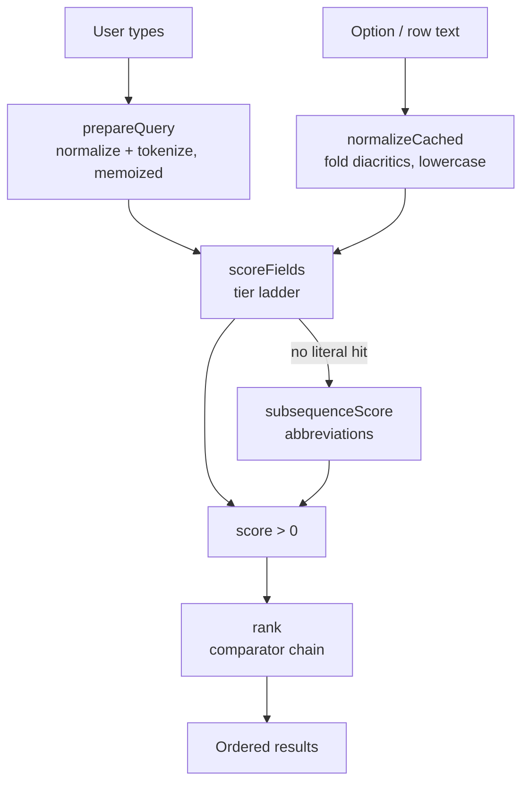

# Disscount: Search, Matching & Sorting

How every "type something and see it filter" surface in the app works, why they all now go through one matcher, and what is deliberately not built yet.

This is a frontend document. There is no backend search at the time of writing, see [§9](#9-the-backend-has-no-search).

## Table of contents

1. [Quick reference](#1-quick-reference)
2. [The problem this replaced](#2-the-problem-this-replaced)
3. [Architecture](#3-architecture)
4. [How a query is matched](#4-how-a-query-is-matched)
5. [How results are ranked](#5-how-results-are-ranked)
6. [Collation: sorting Croatian](#6-collation-sorting-croatian)
7. [Every surface that consumes it](#7-every-surface-that-consumes-it)
8. [Key files](#8-key-files)
9. [The backend has no search](#9-the-backend-has-no-search)
10. [Gotchas & lessons learned](#10-gotchas--lessons-learned)
11. [Future improvements & TODOs](#11-future-improvements--todos)

## 1. Quick reference

| Question                         | Answer                                                     |
| -------------------------------- | ---------------------------------------------------------- |
| Is search diacritic-insensitive? | Yes. `baska` finds `Baška`, `dakovo` finds `Đakovo`.       |
| Is it case-insensitive?          | Yes, folding lowercases as a side effect.                  |
| Does it do abbreviations?        | Yes. `vgorica` finds `Velika Gorica`.                      |
| Does it rank, or only filter?    | Ranks. Higher score first, everywhere.                     |
| Is there a search library?       | No. Deliberately, see [§10](#10-gotchas--lessons-learned). |
| Where is the matcher?            | `frontend/src/utils/search/`                               |
| How big are the lists?           | Tens to hundreds. Largest is ~1000 Croatian city names.    |
| Server-side search?              | Only products, and only via the external price API.        |

## 2. The problem this replaced

The app used to have **three matchers giving three different answers to the same gesture**.

| Engine                                       | Semantics                          | Callers |
| -------------------------------------------- | ---------------------------------- | ------- |
| `scoreOption`                                | tokenized, ranked, diacritic-blind | 1       |
| `filterByFields`                             | whole-string substring, unranked   | 7       |
| an inline filter in the shopping-list picker | substring, unranked, keywords only | 1       |

Typing `kruh crni` ranked correctly in a products dropdown, found nothing in the watchlist, and nothing in the shopping-list picker. The most capable matcher had one caller and the least capable had seven.

The third one had forked for a real reason: its item values are UUIDs, and because cmdk scores an item's `value` as well as its keywords, a short hex query matched unrelated lists. That is the same class of bug as a chain-code list where typing `trgovina` surfaces a row labelled **Jadranka**, because the invisible value is `jadranka_trgovina`.

## 3. Architecture

Four layers. Each is usable on its own, and nothing above knows about React.



The important idea, and the one that took two wrong attempts to get right: **folding diacritics is a layer underneath matching, not an alternative to it.** Elasticsearch, Algolia and VS Code all fold first and then match on the folded text. An earlier version of this code replaced fuzzy matching _with_ folding and silently lost the ability to find `Velika Gorica` by typing `vgorica`.

## 4. How a query is matched

`scoreFields(fields, preparedQuery)` returns `0` for no match, higher is better.

1. **Fold both sides.** `normalizeForSearch` lowercases, strips combining marks, and maps the letters that are not decompositions (`đ` to `d`, `ß` to `ss`, the German umlauts).
2. **Require every token.** Each whitespace-separated word of the query must appear in at least one field, so `bas put` still finds `Baška Krivi Put`.
3. **Score by where the whole query sits.** The tier ladder, best first: exact, prefix, word-prefix, contains.
4. **Fall back to sub-sequence matching** when nothing literal hit, so the letters of `vgorica` can be found in order across `Velika Gorica`.

The score bands are kept disjoint on purpose, so a weaker kind of match can never outrank a stronger one:

| Kind                               | Band               |
| ---------------------------------- | ------------------ |
| Whole-query tier hit               | `0.301` to `1.0`   |
| Every token matched, but scattered | `0.25`             |
| Sub-sequence only                  | above `0` to `0.2` |

Inside a tier, an earlier match position wins, but never by enough to reach the tier above.

**Pass only fields a human can see.** `scoreFields` takes an explicit list for exactly this reason. Where an option's `value` is a code or an id, pass the label through cmdk's `keywords` and the adapter will use those instead.

## 5. How results are ranked

Ranking is a **priority list, not one arithmetic score**. `chainComparators` runs comparators in order and takes the first non-zero verdict.

Product search is the worked example (`app/products/utils/product-relevance.ts`):

```ts
chainComparators(
  byDesc((r) => r.matchedTokens),
  byAsc((r) => r.tier),
  byAsc((r) => r.position),
  byDesc((r) => r.chainCount),
  byAsc((r) => r.nameLength),
);
```

Text relevance first, then how widely stocked the product is, then the shorter name, which is usually the plain product rather than a bundle. This is the same shape Typesense uses: text match score, then user-defined numeric fields.

## 6. Collation: sorting Croatian

Matching folds `č`, `ć`, `š` and `ž`. **Sorting must not.** In Croatian these are their own letters with their own places in the alphabet.

`compareHr` in `utils/strings.ts` is the single comparator: `localeCompare(b, "hr", { sensitivity: "base" })`. Use it for every user-facing sort.

Calling `localeCompare` with no locale collates them as plain `c`, `s`, `z`, which is wrong and was doing so in shared shopping-list text until recently. Locale-less compares are still correct for UUIDs and ISO date strings, which is why a few remain.

## 7. Every surface that consumes it

| Surface                                                | Where                                                            | Fields searched                     |
| ------------------------------------------------------ | ---------------------------------------------------------------- | ----------------------------------- |
| Products facets: Trgovine, Lokacije, Kategorije, Marka | `app/products/components/facet-multi-select.tsx`                 | option label via `keywords`         |
| Pinned places (settings)                               | `components/custom/settings/components/pinned-places-select.tsx` | place name                          |
| Store-chain picker (price history)                     | `components/custom/store-chain/store-chain-multi-select.tsx`     | chain label via `keywords`          |
| Add to shopping list                                   | `app/products/components/forms/shopping-list-selector.tsx`       | list title via `keywords`           |
| Updates / blog                                         | `app/updates/page.tsx`                                           | title, excerpt, content             |
| Suggestions                                            | `app/suggestions/components/suggestions-client.tsx`              | suggestion fields                   |
| Digital cards                                          | `app/(user)/digital-cards/components/digital-cards-client.tsx`   | cardName, storeName, note           |
| Shopping lists index                                   | `app/(user)/shopping-lists/components/shopping-lists-client.tsx` | title                               |
| Watchlist                                              | `app/(user)/watchlist/hooks/use-watchlist-data.ts`               | product name, brand                 |
| Watchlist suggestions                                  | `app/(user)/watchlist/hooks/use-watchlist-suggestions.ts`        | product name, brand                 |
| Admin contact inbox                                    | `app/dashboard/components/admin-contact-table.tsx`               | name, email, subject, message       |
| Products text search                                   | `app/products/hooks/use-infinite-products.ts`                    | server-side, then re-ranked locally |

The seven `filterByFields` callers gained tokenized, ranked, abbreviation-tolerant search **without any call-site change**, because its signature did not move.

## 8. Key files

| Path                                      | Role                                                                  |
| ----------------------------------------- | --------------------------------------------------------------------- |
| `utils/search/normalize.ts`               | `normalizeCached` (memoized fold) and `prepareQuery` (one-entry memo) |
| `utils/search/fuzzy.ts`                   | `subsequenceScore`, the abbreviation matcher                          |
| `utils/search/match.ts`                   | `MATCH_TIER`, `findWholeQuery`, `scoreFields`                         |
| `utils/search/rank.ts`                    | `chainComparators`, `byAsc`, `byDesc`                                 |
| `utils/search/command-filter.ts`          | `commandFilter`, the cmdk adapter                                     |
| `utils/strings.ts`                        | `normalizeForSearch` (the fold) and `compareHr` (the sort)            |
| `utils/generic.ts`                        | `filterByFields`, now a thin wrapper over `scoreFields`               |
| `utils/pinned-stores.ts`                  | `chainMatchesPinnedStore`, `isPinnedChain`                            |
| `app/products/utils/product-relevance.ts` | product ranking, composed from `rank.ts`                              |
| `app/products/utils/product-filters.ts`   | `normalizeChainCode`, the code-only normalizer                        |

**Libraries: none.** Matching is entirely in-repo. cmdk `^1.1.1` supplies the combobox, but its own `command-score` filter is replaced by `commandFilter`.

## 9. The backend has no search

Worth stating plainly, because it is easy to assume otherwise.

Across all ten Spring controllers the only query parameters are `includeDeleted` on the admin contact list and a `Pageable` on notifications. There is **no** `LIKE`, no `ILIKE`, no `tsvector`, no `pg_trgm`, no derived `Containing` method, and no pagination anywhere else.

So every "search" outside products is the browser filtering an array it already downloaded. That is fine at the current sizes and would not be at ten thousand rows.

When server-side search is built, two things are already known:

- **JPQL `LOWER(x) LIKE LOWER(:q)` is portable to H2**, so it needs no profile guard. `ILIKE` and `tsvector` are Postgres-only and would need one, plus an H2 fallback, per the testing constraint in `AGENTS.md`.
- **Diacritic folding does not come for free on the server.** `LOWER(...) LIKE` on Postgres is accent-sensitive and `unaccent` is an extension. Preserving what the client does today means a normalized shadow column, which is portable.

Also note **email is not on the JPA `User` entity**; it lives in better-auth's own table and is read through a native query. Searching users by email crosses that boundary.

## 10. Gotchas & lessons learned

**Folding is not a substitute for fuzzy matching.** This is the mistake that created the system. cmdk's default filter scores `Baška` against `baska` at exactly **zero**, so diacritics genuinely were broken. But replacing that filter with a fold-and-substring matcher scored `Velika Gorica` against `vgorica` at zero, losing a capability nobody asked to lose. Fold first, then match; the two are layers, not alternatives.

**cmdk scores the item's `value`, not just what you see.** Where the value is a code or a UUID, that produces hits with nothing visible to explain them. Pass the label as `keywords` and `commandFilter` will search those instead of the value.

**Normalize both sides of every comparison, or neither.** `resolveAllowedChains` filtered raw selections against a set built with `normalizeChainCode`, so a chain whose casing came from a hand-edited URL silently vanished from the filter with no sign anything had been dropped.

**Chain codes are normalized differently from prose, on purpose.** `normalizeChainCode` trims and lowercases but does **not** fold diacritics, because codes are identifiers and folding could collide two distinct ones. `normalizeForSearch` folds. Do not "unify" them.

**`normalizeForSearch` is an identity key, not only a search helper.** Twelve files use its output to key maps for facet counting and dedupe. Changing what it returns would silently change facet counts, which is why the memoized wrapper returns exactly the same string.

**Do not put a React library in the shared matcher.** `filterByFields` is imported by `app/updates/page.tsx`, which is a server component. That is why `subsequenceScore` is hand-written instead of borrowing cmdk's `command-score`.

**Ranking gets discarded in two places.** `use-watchlist-suggestions.ts` re-sorts by occurrence and discount after filtering, so relevance order is thrown away there. That is intentional, but worth knowing before debugging why an obvious match is not first.

**Client ranking cannot fix a truncated server response.** Products come back capped at 100 rows chosen by the upstream API's own opaque ranking, so `sortProductsByRelevance` only reorders what already arrived. A better match beyond the cap cannot surface.

## 11. Future improvements & TODOs

- **Sorting rework** (in sprint on the roadmap). The comparator layer in `rank.ts` exists for this. The item asks for sort-by controls on products, the watchlist and shopping lists, with the default product order being match ranking, then popularity, then chain count, then location count. The first three terms are already expressible; **popularity does not exist yet** and needs a backend counter over watchlists and shopping lists, deduplicated per user so one person cannot inflate it.
- **Server-side search and pagination.** Nothing exists. See [§9](#9-the-backend-has-no-search) for the portability notes. This becomes urgent the moment the admin panel grows past its two current tabs.
- **`GET /api/admin/users` is unbounded** and WAU/MAU is counted client-side over every user row, which structurally prevents ever paginating that endpoint. Recorded here rather than fixed.
- **The admin contact inbox silently truncates at 500.** Rows past it are unreachable and unsearchable, with no indication in the UI.
- **`components/ui/chart.tsx` sorts labels with a locale-less `localeCompare`**, so Croatian diacritics collate wrongly in chart tooltips. Not fixed because it is shadcn output, which `AGENTS.md` forbids hand-editing.
- **Two surfaces have a search box that matches nothing.** The map page renders one as a stub, and `sidebar-filter-menu.tsx` lists several hundred options with no filter box at all. Both are obvious consumers for this system.
- **Consider a library only if a surface really holds 10k+ rows client-side.** None does today. If one ever does, `MiniSearch` (7kB, zero dependencies, a `processTerm` hook that takes `normalizeForSearch` directly) is the closest fit; `uFuzzy` is faster and smaller but has a much smaller user base.
