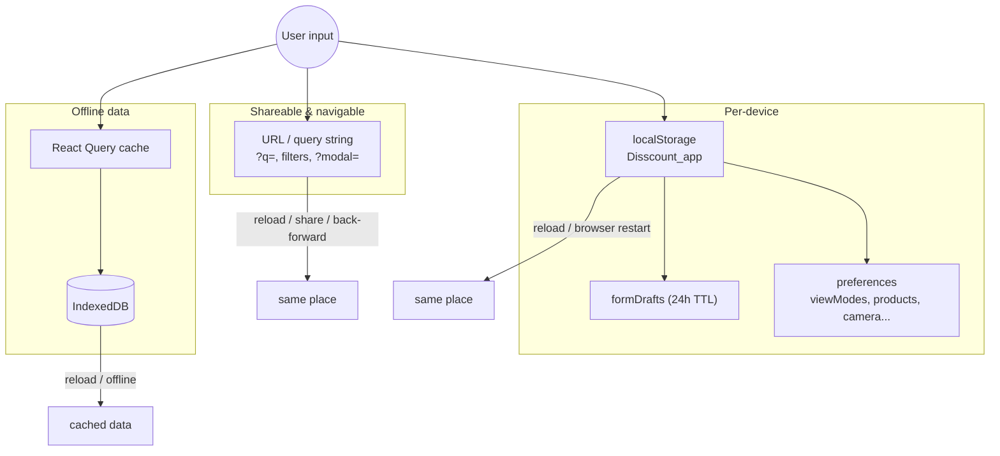
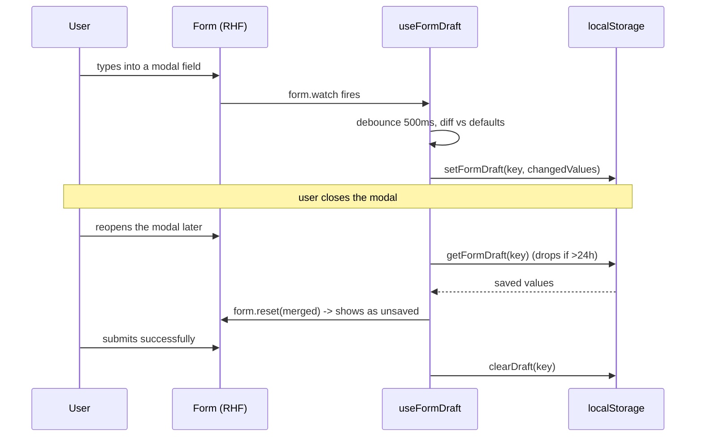

# Disscount: Client State Persistence Guide

A complete reference for how the app remembers what the user was doing, so a reload, a shared link, or a closed modal never loses their place. Written to be understandable even if you're new to this. Keep it up to date as inputs and forms change.

_Last audited end-to-end on 2026-07-22: every user-facing input and form accounted for; the contact modal was the last gap and is now drafted._

> **Mental model in one sentence:** anything the user is in the middle of is saved by **intent**, across three layers: the **URL** holds state that should be shareable or navigable (search, filters, which modal is open), a single **localStorage** object holds per-device preferences and unsaved modal-form drafts, and **IndexedDB** holds the offline data cache.

---

## Table of contents

1. [Quick reference](#1-quick-reference)
2. [Architecture](#2-architecture)
3. [Layer 1: URL state](#3-layer-1-url-state)
4. [Layer 2: localStorage (`Disscount_app`)](#4-layer-2-localstorage-disscount_app)
5. [Layer 3: IndexedDB offline cache](#5-layer-3-indexeddb-offline-cache)
6. [Deliberately ephemeral state](#6-deliberately-ephemeral-state)
7. [Coverage matrix (every input and form)](#7-coverage-matrix-every-input-and-form)
8. [What's automatic vs manual](#8-whats-automatic-vs-manual)
9. [Key files](#9-key-files)
10. [Config, flags, and libraries](#10-config-flags-and-libraries)
11. [Gotchas & lessons learned](#11-gotchas--lessons-learned)
12. [Future improvements & TODOs](#12-future-improvements--todos)

---

## 1. Quick reference

| Thing              | Value                                                                                        |
| ------------------ | -------------------------------------------------------------------------------------------- |
| URL state          | search query `?q=`, product filters (repeated params), open modal `?modal=`                  |
| localStorage key   | a single JSON object under `Disscount_app`                                                   |
| localStorage holds | modal-form drafts (24h TTL) + device preferences (view mode, chart periods, camera, banners) |
| Draft engine       | `useFormDraft` (auto-save changed values on a 500ms debounce, restore on reopen)             |
| Offline data store | persisted React Query cache in IndexedDB (see [PWA.md](PWA.md))                              |
| Never persisted    | passwords, the avatar base64 image, admin dashboard filters                                  |

**The one rule that explains most decisions:** state is placed by intent. Shareable or navigable state goes in the URL, personal per-device state goes in localStorage, and cached server data goes in IndexedDB.

---

## 2. Architecture

Three independent layers, each with a different lifetime and scope. A given screen usually uses more than one at once (for example the products page keeps its filters in the URL, its grid/list toggle in localStorage, and its results in the React Query cache).

| Layer            | Backed by                       | Holds                                                    | Survives                              | Scope       |
| ---------------- | ------------------------------- | -------------------------------------------------------- | ------------------------------------- | ----------- |
| **URL**          | query string + route            | search query, active filters, which modal is open        | reload, share, back/forward, bookmark | the link    |
| **localStorage** | one `Disscount_app` JSON object | per-device preferences + unsaved modal-form drafts (24h) | reload, browser restart               | the device  |
| **IndexedDB**    | persisted React Query cache     | offline data cache (lists, watchlist, viewed products)   | reload, offline; wiped on logout      | the session |

---

## 3. Layer 1: URL state

Shareable and back/forward-safe. Everything here can be pasted into a new tab and lands the user in the same place. This is the right home for anything a user might bookmark or send to a friend.

- **Search query (`?q=`).** The global `SearchBar` writes `q` through `useSearchNavigation`. Every search-backed page (`/products`, `/watchlist`, `/shopping-lists`, `/digital-cards`) reads `q` on the server (`readSearchParam`) and hydrates the input from it, so a reload or a shared link keeps the query. Searching from the route itself preserves other params (active filters); searching from elsewhere starts clean.

- **Product filters.** Chain, location, category, and brand are stored as repeated query params by `useFilterParams` / `useProductFilters`. They are written with `router.replace` (so they do not spam browser history) and read back on load. All four apply client-side because the upstream Cijene search endpoint only accepts `q`.

- **Open modal (`?modal=`).** Which modal is open is itself a URL param (`use-modal-url` + `modal-registry`), so modals are deep-linkable and survive a reload. The full modal-URL flow is documented in [AUTH.md](AUTH.md).

- **One-shot tokens.** The reset-password token and OAuth error arrive as URL params and are consumed by the page that handles them. They are transient by nature, not something to persist.

---

## 4. Layer 2: localStorage (`Disscount_app`)

All localStorage lives under a **single key**, `Disscount_app`, a JSON object that the core wrapper merges field-by-field so an unrelated write never wipes other settings (`utils/browser/storage/core.ts`). Two kinds of thing live here: form drafts and device preferences.

### 4a. Form drafts (`useFormDraft`, 24h TTL)

Modal forms auto-save their **changed** values to `formDrafts[key]` on a 500ms debounce and restore them the next time the modal opens, so a user can close a modal and come back later. "Changed" is computed by diffing the current values against the form's default values (not React Hook Form's `dirtyFields`, whose proxy can read empty inside a callback). Submitting clears the draft, and drafts older than 24h are dropped on read. Passwords and base64 images are never written (the `exclude` option).

Forms wired to drafts:

| Form                      | File                       | Notes                                         |
| ------------------------- | -------------------------- | --------------------------------------------- |
| Watchlist item modal      | `watchlist-item-modal.tsx` | restore handled by the hook                   |
| Add to shopping list      | `use-add-to-list-form.ts`  | restore handled by the hook                   |
| Shopping list create/edit | `shopping-list-modal.tsx`  | prefill-then-merge (`restore: false`)         |
| Digital card create/edit  | `digital-card-modal.tsx`   | prefill-then-merge; also feeds scan-to-fill   |
| Settings (profile, etc.)  | `settings-modal-host.tsx`  | one draft across the tabbed form              |
| Contact                   | `contact-modal.tsx`        | prefill from profile, then merge draft on top |

### 4b. Device preferences

Written by the small domain helpers in `utils/browser/storage/*`, each of which reads, merges its own field, and writes back through the core wrapper.

| Field                      | Meaning                                                     | Helper              |
| -------------------------- | ----------------------------------------------------------- | ------------------- |
| `viewModes`                | grid/list toggle, per list key                              | `view-mode.ts`      |
| `productsPreferences`      | price-history period + chains + open state, per product EAN | `products.ts`       |
| `shoppingListsPreferences` | section open states + price-history prefs, per list         | `shopping-lists.ts` |
| `storeOptimizeMode`        | preferred store-list sort, shared across all lists          | `shopping-lists.ts` |
| `preferredCameraId`        | manually chosen scanner camera (absent means auto-pick)     | `scanner.ts`        |
| `installBannerDismissedAt` | "install app" banner snooze (7 days)                        | `pwa.ts`            |
| `lastLoginMethod`          | drives the "last used" sign-in badge                        | `auth.ts`           |

The shape of the whole object is declared in `typings/local-storage.ts` (`AppData`).

---

## 5. Layer 3: IndexedDB offline cache

The persisted React Query cache (shopping lists, watchlist, viewed products, profile, and public price data) lives in IndexedDB and is what makes authed screens work offline. It is a **data cache**, not "resume where you left off" form state, and it is purged on logout. It is fully documented in [PWA.md](PWA.md#5-offline-reads-caching-and-persistence); this guide only cross-references it so the full persistence picture is in one place.

---

## 6. Deliberately ephemeral state

Not everything should be remembered. These are intentionally **not** persisted, and that is the correct behaviour:

- **Auth forms** (login, signup, forgot-password, reset-password) and the **security / credentials** form. They carry passwords, so nothing is written to disk.
- **The avatar image** in Settings. It is a base64 data URI, deliberately excluded from drafts so it can never blow the localStorage quota (`avatar-field.tsx`).
- **Admin dashboard table filters** (contact inbox search/view/show-deleted, users table). Session-only `useState`. This is admin tooling with live-refetched data, so a reset on reload is fine.

---

## 7. Coverage matrix (every input and form)

| Input / form                        | Persisted?    | Where                    |
| ----------------------------------- | ------------- | ------------------------ |
| Global search                       | Yes           | URL `?q=`                |
| Product filters                     | Yes           | URL repeated params      |
| Open modal                          | Yes           | URL `?modal=`            |
| Watchlist item modal                | Yes           | localStorage draft       |
| Add-to-list form                    | Yes           | localStorage draft       |
| Shopping list modal                 | Yes           | localStorage draft       |
| Digital card modal                  | Yes           | localStorage draft       |
| Settings modal                      | Yes           | localStorage draft       |
| Contact modal                       | Yes           | localStorage draft       |
| View mode / sort / camera / periods | Yes           | localStorage preferences |
| Auth + security forms               | No, by design | passwords, never stored  |
| Avatar upload                       | No, by design | base64, quota-excluded   |
| Admin dashboard filters             | No, by design | session `useState`       |

---

## 8. What's automatic vs manual

| Thing                                          | Auto / manual | Notes                                                                      |
| ---------------------------------------------- | ------------- | -------------------------------------------------------------------------- |
| Saving a modal draft while typing              | Auto          | `useFormDraft` watches the form and debounces writes                       |
| Restoring a draft on reopen                    | Auto          | hook restores, or the modal merges it (`restore: false`)                   |
| Expiring stale drafts (24h)                    | Auto          | dropped on read                                                            |
| Clearing a draft after a successful submit     | Auto          | submit handlers call `clearDraft()` / the mutation clears it               |
| Keeping search + filters in the URL            | Auto          | the search and filter hooks own it                                         |
| Persisting a preference (view mode, camera...) | Auto          | the relevant `storage/*` helper writes on change                           |
| Adding a NEW modal form to the draft system    | Manual        | call `useFormDraft` with a unique `draftKey`; pick `restore` and `exclude` |
| Adding a NEW preference                        | Manual        | add the field to `AppData` and a helper in `utils/browser/storage/`        |
| Excluding a sensitive field from a draft       | Manual        | pass it in `exclude` (do this for passwords and base64 images)             |

---

## 9. Key files

| File                                                     | Role                                                             |
| -------------------------------------------------------- | ---------------------------------------------------------------- |
| `frontend/src/hooks/use-form-draft.ts`                   | modal-form draft save/restore engine (24h TTL, diff-vs-defaults) |
| `frontend/src/utils/browser/storage/core.ts`             | single-key `Disscount_app` localStorage read/merge/write         |
| `frontend/src/utils/browser/storage/drafts.ts`           | draft read/write/expiry helpers                                  |
| `frontend/src/utils/browser/local-storage.ts`            | barrel re-exporting the storage helpers                          |
| `frontend/src/typings/local-storage.ts`                  | `AppData` shape (drafts + all preferences)                       |
| `frontend/src/utils/browser/storage/products.ts`         | per-EAN price-history preferences                                |
| `frontend/src/utils/browser/storage/shopping-lists.ts`   | per-list section + sort preferences                              |
| `frontend/src/utils/browser/storage/view-mode.ts`        | grid/list toggle preference                                      |
| `frontend/src/utils/browser/storage/scanner.ts`          | preferred scanner camera                                         |
| `frontend/src/utils/browser/storage/pwa.ts`              | install-banner snooze                                            |
| `frontend/src/utils/browser/storage/auth.ts`             | last-used sign-in method                                         |
| `frontend/src/hooks/use-search-navigation.ts`            | reads/writes the `?q=` search param                              |
| `frontend/src/app/products/hooks/use-filter-params.ts`   | writes product filters to the query string                       |
| `frontend/src/app/products/hooks/use-product-filters.ts` | reads filters back and resolves them                             |
| `frontend/src/lib/modal/use-modal-url.ts`                | reads the `?modal=` target                                       |

---

## 10. Config, flags, and libraries

There are no environment variables or feature flags specific to this subsystem. The one tunable constant worth knowing is the draft lifetime:

- `DRAFT_TTL_MS` in `utils/browser/storage/drafts.ts` (currently 24 hours). Drafts older than this are dropped on read.
- The localStorage key name `Disscount_app` in `utils/browser/storage/core.ts`.

Libraries (versions read from `frontend/package.json`):

| Library                 | Version    | Role here                                                          |
| ----------------------- | ---------- | ------------------------------------------------------------------ |
| `react-hook-form`       | `^7.68.0`  | owns every form's values, dirty state, and the `watch` drafts hook |
| `@hookform/resolvers`   | `^5.2.2`   | bridges Zod schemas into the forms                                 |
| `zod`                   | `^4.1.13`  | validates form values                                              |
| `next`                  | `16.2.9`   | `useSearchParams` / `useRouter` power all URL state                |
| `@tanstack/react-query` | `^5.90.12` | the offline data cache (layer 3, see PWA.md)                       |
| `idb-keyval`            | `^6.2.5`   | IndexedDB backing store for the persisted cache (layer 3)          |

The URL and localStorage layers use only browser-native APIs; there is no extra dependency for them.

---

## 11. Gotchas & lessons learned

- **Always go through the storage helpers, never `localStorage.setItem` directly.** Everything shares the one `Disscount_app` object, and `setAppStorage` merges your partial into the rest. A raw `setItem` would overwrite the whole object and wipe unrelated preferences and drafts.

- **Drafts diff against `defaultValues`, not RHF `dirtyFields`.** The React Hook Form dirty proxy can read empty inside a stable callback, which made persistence unreliable. `useFormDraft` compares current values to the form defaults instead, so what gets saved is genuinely what changed.

- **Gate restore until server defaults are loaded (`enabled`).** For edit modals, if the draft is restored before the loaded record populates the form, the draft diffs against empty defaults and marks every field dirty. Pass `enabled` so restoring waits for the data.

- **New-entity modals auto-restore; edit modals merge the draft themselves.** The shopping-list and digital-card modals pass `restore: !isEdit`: a brand-new list or card is rehydrated by the hook (its own effect re-runs when the draft key changes), while an edit modal loads its base record first and merges the draft on top with `restore: false` (draft wins). The contact modal is prefill-then-merge (`restore: false`). Letting the hook auto-restore an edit modal would double-reset and fight the prefill.

- **Never draft passwords, base64 images, or card codes.** Pass them in `exclude`. Passwords must not touch disk, a base64 avatar would blow the localStorage quota, and the digital-card code (`value`) is excluded so a card number never persists. The avatar field lives outside forms and drafts entirely for this reason.

- **Old drafts are type-guarded on restore.** If a field's type changed since a draft was written (for example a number where the field is now a string), the restore skips it so a stale draft cannot poison validation.

- **Closing mid-debounce still saves, but a submit never re-persists.** The watch effect's cleanup flushes the last keystrokes on unmount unless the form is submitting or submitted. The `isSubmitting` guard matters for the optimistic-close pattern: the modal unmounts before the mutation resolves and `clearDraft` runs, so without it a late flush could rewrite a draft that was just cleared and a reopen would show stale data.

- **Filters use repeated params, not a comma-joined string.** A category or brand can itself contain a comma, so joining would read back as two filters. Chain and location still accept a legacy comma-joined value so links shared before this change keep working.

- **Filter writes use `router.replace`, not `push`.** Otherwise every filter tweak would pile up a browser-history entry and make the back button useless.

- **`useSearchParams` needs a Suspense boundary.** Any component reading URL state through it must sit under `<Suspense>` (the root layout's modal router already provides one). Components that only open a modal should import `openModalUrl` directly instead of subscribing.

- **localStorage preferences are per-device and are NOT purged on logout.** Only the IndexedDB data cache is wiped when the session ends. Preferences like view mode or the install-banner snooze are intentionally device-level and survive a logout.

---

## 12. Future improvements & TODOs

- **Draft indicator UX.** When a draft is restored, the modal shows it as unsaved and offers a "Resetiraj" button, but there is no explicit "restored a draft" banner. A small notice could make it clearer why fields are prefilled.

- **Cross-device drafts.** Drafts are per-device by design. If users ever expect an unsaved message or list to follow them across devices, that would mean moving drafts server-side, which is a much bigger change and probably not worth it for short-lived modal input.

- **Quota awareness.** The single `Disscount_app` object is small today (preferences plus short-lived text drafts), but if future drafts grow, add a guard around `setAppStorage` that catches a `QuotaExceededError` and prunes the oldest drafts rather than failing the write.

- **Persist admin dashboard filters in the URL.** Currently session-only. Making the contact inbox view and search shareable via the URL would be a nice-to-have for the admin tools, not a user-facing gap.
