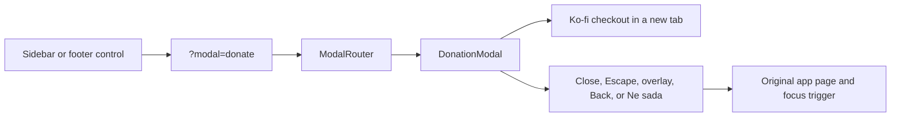

# Support and recognition

Disscount is free to use. The support flow gives people a voluntary way to help cover hosting and continued development without creating an account, collecting payment data, or making any feature conditional on payment.

Ko-fi is the only live payment destination today. GitHub Sponsors and public recognition are intentionally future work, because there is not yet an approved Sponsors profile or anyone to list.

## Table of contents

1. [Quick reference](#1-quick-reference)
2. [How the support flow works](#2-how-the-support-flow-works)
3. [Entry points](#3-entry-points)
4. [Automatic and manual work](#4-automatic-and-manual-work)
5. [Key files](#5-key-files)
6. [Payment platform and fees](#6-payment-platform-and-fees)
7. [GitHub repository funding](#7-github-repository-funding)
8. [Accessibility and external-link safety](#8-accessibility-and-external-link-safety)
9. [Verification checklist](#9-verification-checklist)
10. [Gotchas](#10-gotchas)
11. [Future improvements and TODOs](#11-future-improvements-and-todos)

## 1. Quick reference

| Thing                 | Current value                                      |
| --------------------- | -------------------------------------------------- |
| Live payment platform | [Ko-fi](https://ko-fi.com/disscount)               |
| Modal URL             | `?modal=donate`                                    |
| Public access         | Everyone, including signed-out visitors            |
| Sidebar location      | `Pomoć i podrška`, after `Kontakt`                 |
| Footer location       | Icon-only support control with an accessible label |
| Data collection       | None in Disscount                                  |
| Backend work          | None                                               |
| Environment variables | None                                               |

## 2. How the support flow works

The sidebar and footer do not open a local piece of state. They link to `?modal=donate`, matching the rest of Disscount's URL-driven modal system. `ModalRouter` reads the URL, resolves `donate` as a public target, and mounts one `DonationModal` at the root of the app.

The modal explains what a voluntary contribution supports, then opens Ko-fi in a separate tab. Disscount never handles a payment, stores payment information, or calls its backend during this flow.

The modal is public by design. `PUBLIC_MODAL_NAMES` prevents the authentication gate from replacing it with a login prompt for a visitor who is not signed in.

## 3. Entry points

### Sidebar

`supportNavItems` drives the `Pomoć i podrška` group in the app sidebar. The `donate` item comes after `Kontakt`, so it is discoverable without competing with shopping and account navigation. It deliberately has no PWA shortcut metadata because voluntary support is not a core app task.

### Footer

`FooterSupportIcons` maps the same `supportNavItems` data. When it sees a live item, it renders an icon-only button link with the item's label as its accessible name. That makes `Podrži Disscount` compact visually while remaining understandable to screen-reader and keyboard users.

### Deep links

`?modal=donate` can be opened on any route. The existing modal URL helper preserves unrelated query parameters and the hash when it adds or removes the modal parameter. A person can also dismiss the modal with their browser's Back button.

## 4. Automatic and manual work

| Task                                                | Automatic                         | Manual                                                               |
| --------------------------------------------------- | --------------------------------- | -------------------------------------------------------------------- |
| Open the support modal from sidebar or footer       | Yes                               | No                                                                   |
| Keep the modal public                               | Yes, through `PUBLIC_MODAL_NAMES` | No                                                                   |
| Open the payment destination                        | Yes, in a separate tab            | No                                                                   |
| Receive and process a payment                       | No                                | Ko-fi, then its connected Stripe or PayPal account                   |
| Keep Ko-fi one-time-tip fees at 0%                  | No                                | Turn off Ko-fi Contributor mode and accept processor fees            |
| Show a GitHub repository Sponsor button             | Partly, through `FUNDING.yml`     | Confirm the repository setting in GitHub after release               |
| Enable GitHub Sponsors                              | No                                | Set up and approve the profile before uncommenting its funding entry |
| List supporters or contributors on the landing page | No                                | Obtain consent and curate the names or logos first                   |

## 5. Key files

| File                                                             | Role                                                                            |
| ---------------------------------------------------------------- | ------------------------------------------------------------------------------- |
| `frontend/src/constants/donation.ts`                             | Holds the live Ko-fi URL and the GitHub Sponsors follow-up TODO.                |
| `frontend/src/constants/navigation.ts`                           | Declares the `donate` support-navigation item and the landing recognition TODO. |
| `frontend/src/lib/modal/modal-registry.ts`                       | Defines, parses, and publicly exposes the `donate` modal target.                |
| `frontend/src/components/custom/donation/donation-modal.tsx`     | Renders the support copy, Ko-fi link, dismiss action, and focus restoration.    |
| `frontend/src/components/custom/modal-router/modal-router.tsx`   | Mounts the modal once for the whole app.                                        |
| `frontend/src/components/custom/sidebar/sidebar-support-nav.tsx` | Renders the sidebar support group from shared navigation data.                  |
| `frontend/src/components/custom/common/footer-support-icons.tsx` | Renders compact footer controls from the same navigation data.                  |
| `.github/FUNDING.yml`                                            | Configures the repository funding destination shown by GitHub.                  |
| `README.md`                                                      | Gives repository visitors the public Ko-fi support link.                        |

## 6. Payment platform and fees

Ko-fi is the only linked payment option. The platform can charge 0% service fees on one-time tips when its optional Contributor mode is disabled. Ko-fi starts new creators with Contributor mode enabled, which applies a 5% fee to one-time tips, so check that setting before describing the support flow as zero-fee. Stripe or PayPal processing fees still apply in either mode. [Ko-fi fee details](https://help.ko-fi.com/hc/en-us/articles/360002506494-Does-Ko-fi-take-a-fee)

Buy Me a Coffee is not linked because it charges a 5% platform fee per transaction, in addition to payment processing. Maintaining one live payment choice is also clearer for the people using Disscount. [Buy Me a Coffee fees](https://help.buymeacoffee.com/en/articles/8105744-how-to-calculate-charges-on-your-payment)

## 7. GitHub repository funding

The repository already has `.github/FUNDING.yml` with `ko_fi: disscount`. GitHub reads that file from the default branch to provide a Sponsor button and funding destination on the repository.

The commented `github: OffCrazyFreak` line stays disabled until the GitHub Sponsors profile is approved and public. Before enabling it, confirm that the project meets GitHub's current eligibility requirements, complete the profile and payout setup, then verify the repository setting under Settings, General, Features, Sponsorships. GitHub lists Croatia as a supported payout region. Personal-account sponsorships have no GitHub fee, while organization sponsorships can incur a fee. [GitHub Sponsors overview](https://docs.github.com/en/sponsors/getting-started-with-github-sponsors/about-github-sponsors), [Sponsor button setup](https://docs.github.com/en/repositories/managing-your-repositorys-settings-and-features/customizing-your-repository/displaying-a-sponsor-button-in-your-repository)

## 8. Accessibility and external-link safety

The dialog uses the shared Radix-based `ModalShell`, which traps focus while it is open and offers an Escape key and close control. `DonationModal` captures the focused sidebar or footer trigger before opening and restores it after normal dismissal when that trigger is still in the document. A direct deep link has no prior trigger, so it closes without attempting to focus a stale element.

The Ko-fi action is a real anchor with `target="_blank"` and `rel="noopener noreferrer"`. The first opens Ko-fi without replacing the current Disscount page. The second protects the original page from the new tab.

The modal's support icon is decorative and hidden from the accessibility tree. The footer action is visually icon-only but receives the clear accessible label `Podrži Disscount` from the shared navigation data.

## 9. Verification checklist

- [ ] Open `?modal=donate` while signed out and confirm no login prompt appears.
- [ ] Open the sidebar and footer controls and confirm they show the same modal.
- [ ] Close the modal with `Ne sada`, the close control, Escape, the overlay, and browser Back.
- [ ] Confirm closing keeps unrelated query parameters and the URL hash.
- [ ] Use the keyboard to open and close the modal, then confirm focus returns to the original sidebar or footer control.
- [ ] Confirm the Ko-fi control opens `https://ko-fi.com/disscount` in a separate tab.
- [ ] Confirm the footer icon announces itself as `Podrži Disscount`.
- [ ] In GitHub, confirm the repository's Sponsor control leads to Ko-fi after the default branch is updated.

## 10. Gotchas

### The support item must remain public

Do not remove `donate` from `PUBLIC_MODAL_NAMES`. A donation option that first asks a visitor to create an account defeats the purpose of a voluntary, low-friction contribution.

### Do not make the footer control a raw external link

The footer should open the same modal as the sidebar. It gives people a short explanation before sending them to a third-party payment service, while keeping all support copy in one place.

### Do not report a universal 0% fee

Ko-fi's service fee depends on Contributor mode and payment processors charge their own fees. The repository funding-file comments deliberately state these conditions rather than promising a universal 0% rate.

### Do not list people without consent

GitHub sponsorships can be private and Ko-fi supporter data is not a substitute for permission to publish a name or logo. Recognition should use an explicit opt-in and a curated list, never automatic scraping.

## 11. Future improvements and TODOs

- Set up GitHub Sponsors, verify eligibility and payout details, then uncomment the `github: OffCrazyFreak` funding entry and add its live destination to the app.
- Add the `Zajedno gradimo Disscount` landing section only after there are people to recognise.
- Keep that future section in two columns: `Doprinos razvoju` for code contributions and `Podrška projektu` for opted-in financial support.
- Decide on a consent and curation workflow before storing or displaying supporter names, logos, or contribution levels.
- Consider adding voluntary support analytics only after defining a privacy-preserving measurement goal. This first version deliberately sends no tracking event.
